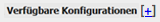
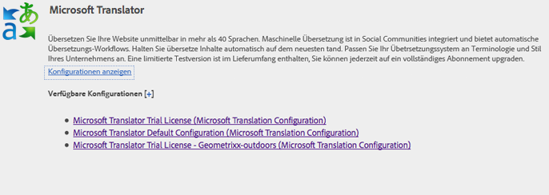
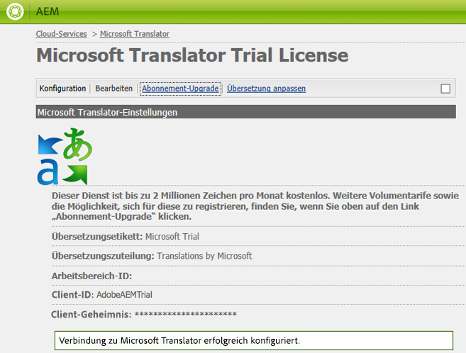

# Herstellen einer Verbindung mit Microsoft Translator{#connecting-to-microsoft-translator}

>[!CAUTION]
>
>AEM 6.4 hat das Ende der erweiterten Unterstützung erreicht und diese Dokumentation wird nicht mehr aktualisiert. Weitere Informationen finden Sie in unserer [technische Unterstützung](https://helpx.adobe.com/de/support/programs/eol-matrix.html). Unterstützte Versionen suchen [here](https://experienceleague.adobe.com/docs/?lang=de).

Erstellen Sie eine Konfiguration für den Microsoft Translator-Cloud-Service, um Ihr Microsoft-Übersetzungskonto zur Übersetzung AEM Seiteninhalts, Community-Inhalten oder Assets zu verwenden.

| Eigenschaft | Beschreibung |
|---|---|
| Übersetzungsetikett | Der Anzeigename für den Übersetzungs-Service. |
| Übersetzungszuteilung | (Optional) Für nutzergenerierte Inhalte wird die Zuteilung neben übersetzten Texten angezeigt, beispielsweise `Translations by Microsoft`.. |
| Workspace-ID | (Optional) Die ID Ihrer angepassten Microsoft Translator-Engine, die verwendet werden soll. |
| Mitgliedschaftsschlüssel | Ihr Mitgliedschaftsschlüssel für Microsoft Translator. |

Nachdem Sie die Konfiguration erstellt haben, müssen Sie sie [aktivieren](/help/sites-administering/tc-msconf.md#activating-the-translator-service-configurations).

Beim folgenden Verfahren wird die Touch-optimierte Benutzeroberfläche verwendet, um eine Microsoft Translator-Konfiguration zu erstellen.

1. Klicken oder tippen Sie in der Leiste auf Tools > Cloud Services .
1. Klicken oder tippen Sie im Bereich &quot;Microsoft Translator&quot;auf Konfigurationen anzeigen .
1. Klicken Sie auf den Link + neben Verfügbare Konfigurationen.

   

1. Geben Sie einen Titel für Ihre Konfiguration ein. Mit dem Titel wird die Konfiguration auf der Cloud Services-Konsole und in Dropdown-Listen mit den Seiteneigenschaften identifiziert. Der Standardname basiert auf dem Titel. Geben Sie optional einen Namen für den Repository-Knoten ein, auf dem die Konfiguration gespeichert wird. Sie sollten den Standardwert für die Eigenschaft &quot;Parent Configuration&quot;verwenden, die dem Pfad des Repository-Knotens entspricht.
1. Klicken Sie auf „Erstellen“.
1. Geben Sie im angezeigten Dialogfeld Werte für die Eigenschaften ein und klicken Sie auf &quot;OK&quot;.

## Beispiele für Microsoft Translator Cloud Service-Konfigurationen {#sample-microsoft-translator-cloud-service-configurations}

Die folgenden Microsoft Translator-Cloud-Dienstkonfigurationen werden mit den Geometrixx-Beispielen installiert. Für einige Beispielkonfigurationen wird ein Microsoft Translation-Testkonto verwendet, mit dem pro Monat kostenlos maximal 2.000.000 Zeichen übersetzt werden können.

### Microsoft Translator-Testlizenz {#microsoft-translator-trial-license}

Die Konfiguration „Microsoft Translator-Testlizenz“ ist eine Beispielkonfiguration, die mit dem Geometrixx Outdoors-Beispielpaket installiert wird. Bei dieser Konfiguration wird ein Microsoft Translator-Konto mit einem kostenlosen Abonnement verwendet, mit dem pro Monat 2.000.000 Zeichen übersetzt werden können.

### Microsoft Translator-Testlizenz - Geometrixx outdoors {#microsoft-translator-trial-license-geometrixx-outdoors}

Die Konfiguration „Microsoft Translator-Testlizenz – Geometrixx-Outdoors“ ist eine Beispielkonfiguration, die mit Geometrixx Outdoors installiert wird. Diese Konfiguration verwendet dasselbe kostenlose Microsoft Translator-Konto wie die Testlizenzkonfiguration für Microsoft Translator. Das Konto verfügt über ein kostenloses Abonnement, mit dem pro Monat 2.000.000 Zeichen übersetzt werden können.

Diese Microsoft Translator-Konfiguration ist für die Verwendung mit dem Inhaltstyp der Geometrixx Outdoors-Beispiel-Site optimiert.

### Durchführen eines Upgrades für die Konfiguration „Microsoft Translator-Testlizenz“ {#upgrading-the-microsoft-translator-trial-license-configuration}

Die Seiten der Microsoft Translation-Konfiguration enthalten einen direkten Link zur Microsoft-Website, über den Sie ein für Produktionssysteme geeignetes Kontoabonnement erhalten können.

1. Klicken oder tippen Sie in der Leiste auf Tools > Vorgänge > Cloud > Cloud Services .
1. Klicken oder tippen Sie im Bereich &quot;Microsoft Translator&quot;auf Konfigurationen anzeigen und dann auf Microsoft Translator-Testlizenz (Microsoft Translation Configuration).

   

1. Klicken Sie auf der Konfigurationsseite auf Abonnement aktualisieren . Verwenden Sie die Microsoft-Webseite, die geöffnet wird, um Ihr Konto zu konfigurieren.

   

### Anpassen der Microsoft Translator-Engine {#customizing-your-microsoft-translator-engine}

Die Seiten der Microsoft Translation-Konfiguration enthalten einen direkten Link zur Microsoft-Website, auf der die Microsoft Translator-Engine angepasst werden kann. ([https://hub.microsofttranslator.com](https://hub.microsofttranslator.com/))

1. Klicken oder tippen Sie in der Leiste auf Tools > Vorgänge > Cloud > Cloud Services .
1. Klicken oder tippen Sie im Bereich &quot;Microsoft Translator&quot;auf Konfigurationen anzeigen und dann auf die Konfiguration, die Sie anpassen möchten.
1. Klicken Sie auf der Konfigurationsseite auf Übersetzer anpassen . Verwenden Sie die Microsoft-Webseite, die geöffnet wird, um Ihren Service anzupassen.

## Aktivieren der Übersetzungs-Service-Konfigurationen {#activating-the-translator-service-configurations}

Sie müssen Ihre Cloud Service-Konfigurationen aktivieren, um übersetzte Inhalte zu unterstützen, die auf der Veröffentlichungsinstanz repliziert werden. Verwenden Sie Methode zum [Aktivieren eines gesamten Abschnitts (Baumstruktur)](/help/sites-authoring/publishing-pages.md#publishing-and-unpublishing-a-tree), um die Repository-Knoten zu aktivieren, auf denen die Microsoft Translator-Konfiguration oder die Cloud Service-Konfigurationen von Drittanbietern gespeichert werden. Die Knoten befinden sich unter den folgenden übergeordneten Knoten:

* Microsoft Translation Service: /libs/settings/cloudconfigs/translation/msft-translation
* Drittanbieterübersetzungen: /etc/cloudservices/machine-translation
