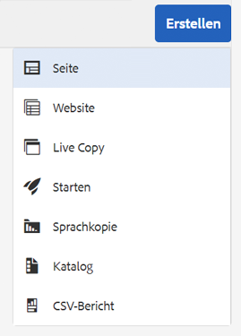
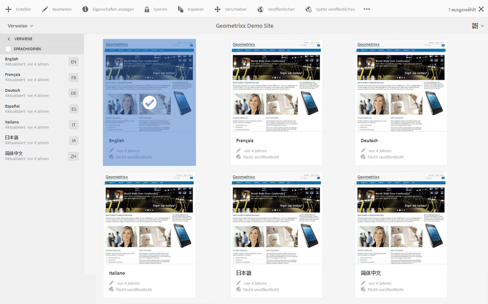

# Vorbereiten von Inhalten für die Übersetzung{#preparing-content-for-translation}

Bei mehrsprachigen Websites wird in der Regel ein Teil der Inhalte in mehreren Sprachen bereitgestellt. Die Website wird in einer Sprache verfasst und anschließend in weitere Sprachen übersetzt. Im Allgemeinen bestehen mehrsprachige Websites aus Zweigen von Seiten, wobei jeder Zweig die Seiten der Website in einer anderen Sprache enthält.

Die Beispiel-Geometrixx-Website umfasst mehrere Sprachzweige und weist die folgende Struktur auf:

```xml
/content
    |- geometrixx
             |- en
             |- fr
             |- de
             |- es
             |- it
             |- ja
             |- zh
```

Jeder Sprachzweig einer Website wird als Sprachkopie bezeichnet. Die Stammseite einer Sprachkopie, auch als Sprachstamm bezeichnet, identifiziert die Sprache des Inhalts in der Sprachkopie. Zum Beispiel ist `/content/geometrixx/fr` der Sprachstamm für die französische Sprachkopie. Sprachkopien müssen einen [korrekt konfigurierten Sprachstamm](/help/sites-administering/tc-prep.md#creating-a-language-root) verwenden, damit die korrekte Sprache angesprochen wird, wenn Übersetzungen von einer Quell-Website durchgeführt werden.

Die Sprachkopie, für die Sie ursprünglich Inhalte verfassen, ist der Sprach-Master. Die Sprach-Master-Vorlage ist die Quelle, die in andere Sprachen übersetzt wird.

Führen Sie die folgenden Schritte aus, um Ihre Website für die Übersetzung vorzubereiten:

1. Erstellen Sie den Sprachstamm für Ihren Sprach-Master. Der Sprachstamm der englischen Beispiel-Geometrixx-Website ist z. B. /content/geometrixx/en. Stellen Sie sicher, dass der Sprachstamm gemäß den Informationen unter [Erstellen eines Sprachstamms](/help/sites-administering/tc-prep.md#creating-a-language-root) richtig konfiguriert ist.
1. Verfassen Sie den Inhalt des Sprach-Masters.
1. Erstellen Sie den Sprachstamm jeder Sprachkopie für die Website. Der Sprachstamm der französischen Beispiel-Geometrixx-Website ist z. B. /content/geometrixx/fr.

Wenn Sie die Inhalte für die Übersetzung vorbereitet haben, können Sie automatisch fehlende Seiten in den Sprachkopien und zugehörigen Übersetzungsprojekten erstellen. (Siehe [Erstellen eines Übersetzungsprojekts](/help/sites-administering/tc-manage.md).) Eine Übersicht über den Übersetzungsprozess für Inhalte in AEM finden Sie unter [Übersetzung von Inhalten für mehrsprachige Websites](/help/sites-administering/translation.md).

## Erstellen eines Sprachstamms {#creating-a-language-root}

Erstellen Sie einen Sprachstamm als Stammseite einer Sprachkopie, die die Sprache der Inhalte identifiziert. Nachdem Sie den Sprachstamm erstellt haben, können Sie Übersetzungsprojekte erstellen, die die Sprachkopie umfassen.

Um den Sprachstamm zu erstellen, erstellen Sie eine Seite und verwenden Sie einen ISO-Sprachcode als Wert für die Eigenschaft „Name“. Der Sprachcode muss eines der folgenden Formate aufweisen:

* `<language-code>`Der unterstützte Sprachcode ist ein Code mit zwei Buchstaben gemäß ISO-639-1, zum Beispiel `en`.

* `<language-code>_<country-code>` oder  `<language-code>-<country-code>`der unterstützte Ländercode ist ein aus zwei Buchstaben bestehender Code in Kleinbuchstaben oder Großbuchstaben, wie er in ISO 3166 definiert ist, z. B.  `en_US`,  `en_us`,  `en_GB`,  `en-gb`.

Sie können jedes dieser Formate verwenden, passend zur Struktur Ihrer globalen Website.  Beispielsweise verfügt die Stammseite der französischen Sprachkopie der Geometrixx-Website über die „Name“-Eigenschaft `fr`. Beachten Sie, dass die Eigenschaft „Name“ als Name des Seitenknotens im Repository verwendet wird und daher den Pfad der Seite bestimmt. (http://localhost:4502/content/geometrixx/fr.html)

Im folgenden Verfahren wird die Touch-optimierte Benutzeroberfläche genutzt, um eine Sprachkopie einer Website zu erstellen. Die entsprechenden Anleitungen für die klassische Benutzeroberfläche finden Sie unter [Erstellen eines Sprachstamms über die klassische Benutzeroberfläche](/help/sites-administering/tc-lroot-classic.md).

1. Navigieren Sie zu „Sites“.
1. Klicken oder tippen Sie auf die Website, für die Sie eine Sprachkopie erstellen möchten.

   Wenn Sie z. B. eine Sprachkopie der Geometrixx Outdoors-Website erstellen möchten, klicken oder tippen Sie auf „Geometrixx Outdoors-Website“.

1. Klicken oder tippen Sie auf „Erstellen“ und anschließend auf „Seite erstellen“.

   

1. Wählen Sie die Seitenvorlage aus und klicken oder tippen Sie auf „Weiter“.
1. Geben Sie im Feld Name den Ländercode im Format `<language-code>` oder `<language-code>_<country-code>` ein, z. B. `en`, `en_US`, `en_us`, `en_GB`, `en_gb`. Geben Sie einen Titel für die Seite ein.

   

1. Klicken oder tippen Sie auf Erstellen. Klicken oder tippen Sie im Bestätigungsdialogfeld auf **Fertig**, um zur Sites-Konsole zurückzukehren, oder auf **Öffnen**, um die Sprachkopie zu öffnen.

## Anzeigen des Status der Sprachstämme {#seeing-the-status-of-language-roots}

Die Touch-optimierte Benutzeroberfläche bietet den Bereich „Verweise“, der eine Liste der erstellten Sprachstämme anzeigt.



Das folgende Verfahren verwendet die Touch-optimierte Benutzeroberfläche, um den Bereich „Verweise“ für eine Seite anzuzeigen.

1. Wählen Sie in der Sites-Konsole eine Seite der Website aus und klicken oder tippen Sie auf **Verweise**.

   

1. Klicken oder tippen Sie im Bereich „Verweise“ auf **Sprachkopien**. Im Bereich „Sprachkopien“ werden die Sprachkopien der Website angezeigt.

