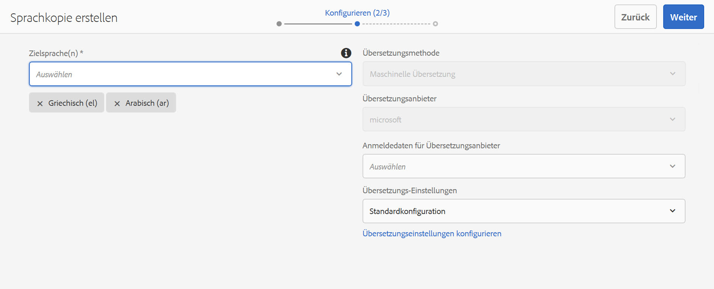

# Assistent „Sprachkopie erstellen“{#language-copy-wizard}

Der Assistent „Sprachkopie erstellen“ führt Sie durch die Erstellung und Verwendung einer mehrsprachigen Inhaltsstruktur. Es ist jetzt wesentlich einfacher und schneller, eine Sprachkopie zu erstellen.

>[!NOTE]
>
>Der Benutzer muss Mitglied der Gruppe der Projektadministratoren sein, um die Sprachkopie einer Site zu erstellen.

Sie können wie folgt auf diesen Assistenten zugreifen:

1. Wählen Sie in Sites eine Seite aus und tippen/klicken Sie auf „Erstellen“.

   

1. Wählen Sie eine Sprachkopie aus und der Assistent wird geöffnet.

   

1. Der Schritt **Quelle auswählen** innerhalb des Assistenten ermöglicht Ihnen das Hinzufügen/Entfernen von Seiten. Sie haben außerdem die Option, die Unterseiten ein- oder auszuschließen.

   

1. Mit der Schaltfläche **Weiter** gelangen Sie zum Schritt **Konfigurieren** des Assistenten. Hier können Sie Sprachen hinzufügen/entfernen und die Übersetzungsmethode auswählen.

   

   >[!NOTE]
   >
   >Standardmäßig gibt es nur eine Übersetzungs-Einstellung. Um die Auswahl anderer Einstellungen zu ermöglichen, müssen Sie zuerst die Cloud-Einstellungen konfigurieren. Siehe [Konfigurieren des Übersetzungsintegrations-Frameworks](/help/sites-administering/tc-tic.md).

1. Mit der Schaltfläche **Weiter** gelangen Sie zum Schritt **Übersetzen** des Assistenten. Hier können Sie auswählen, ob nur die Struktur oder ein neues Übersetzungsprojekt erstellt werden soll oder ob einem vorhandenen Übersetzungsprojekt etwas hinzugefügt werden soll.

   >[!NOTE]
   >
   >Wenn Sie im vorherigen Schritt mehrere Sprachen ausgewählt haben, werden mehrere Übersetzungsprojekte erstellt.

   

1. Mit der Schaltfläche **Erstellen** wird der Assistent beendet.

   

