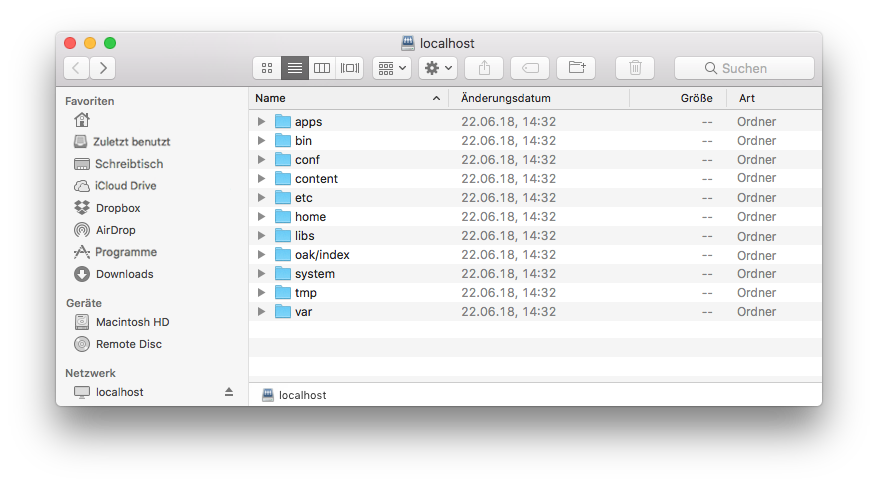
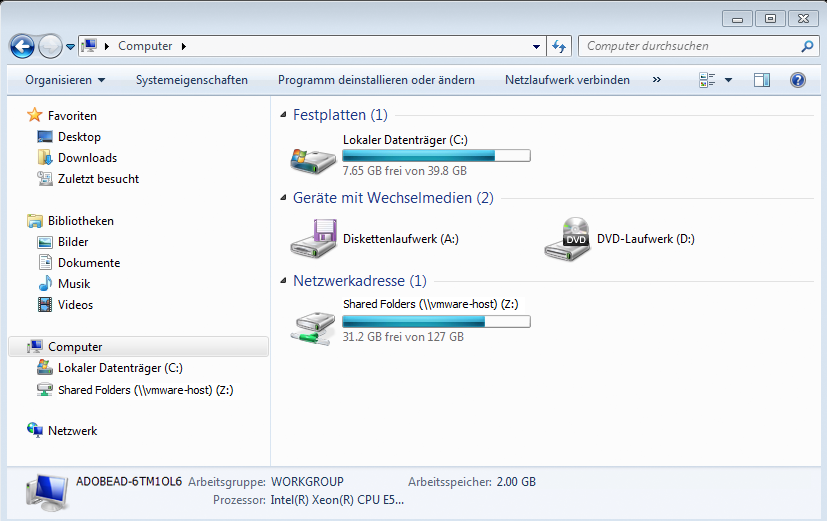
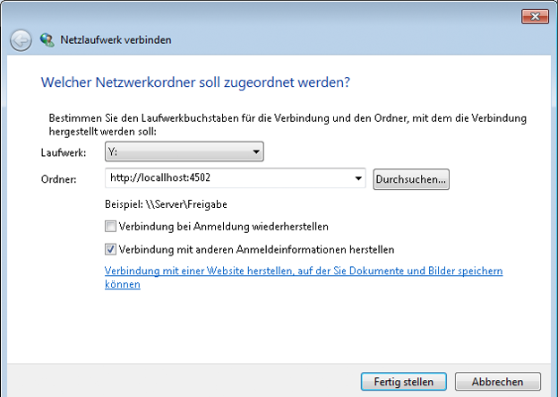
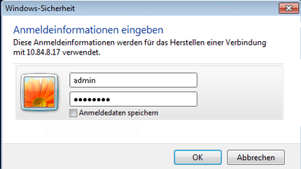
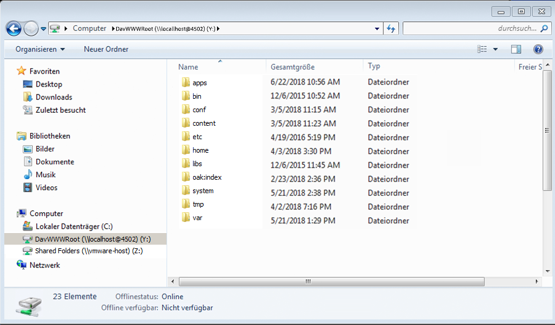

# WebDAV-Zugriff{#webdav-access}

>[!CAUTION]
>
>AEM 6.4 hat das Ende der erweiterten Unterstützung erreicht und diese Dokumentation wird nicht mehr aktualisiert. Weitere Informationen finden Sie in unserer [technische Unterstützung](https://helpx.adobe.com/de/support/programs/eol-matrix.html). Unterstützte Versionen suchen [here](https://experienceleague.adobe.com/docs/?lang=de).

So stellen Sie über WebDAV mit KDE eine Verbindung zu AEM her:

AEM bietet WebDAV-Unterstützung, mit der Sie Repository-Inhalte anzeigen und bearbeiten können. Durch die Verbindung über WebDAV erhalten Sie über Ihren Desktop direkten Zugriff auf das Inhalts-Repository. Text- und PDF-Dateien, die über die WebDAV-Verbindung zum Repository hinzugefügt werden, werden automatisch im Volltext indiziert und können mit den Standardsuchschnittstellen und über die Standard-Java-APIs durchsucht werden.

## Allgemein {#general}

[Detaillierte Anweisungen nach Betriebssystem](/help/sites-administering/webdav-access.md#connecting-via-webdav) in diesem Dokument enthalten sind. Um jedoch mithilfe des WebDAV-Protokolls eine Verbindung zu Ihrem Repository herzustellen, verweisen Sie Ihren WebDAV-Client auf den folgenden Speicherort:

```xml
http://localhost:4502
```



Bei der Verbindung auf Betriebssystemebene bietet diese URL WebDAV-Zugriff auf den Standard-Workspace ( `crx.default`). Diese Methode ist zwar einfacher für den Benutzer, bietet aber nicht die zusätzliche Möglichkeit, Namen für Workspaces festzulegen, was durch die Verwendung zusätzlicher [WebDAV-URLs](/help/sites-administering/webdav-access.md#webdav-urls) möglich ist.

AEM zeigt Repository-Inhalte wie folgt an:

* Ein Knoten des Typs `nt:folder` wird als Ordner angezeigt. Knoten unterhalb des Knotens `nt:folder` werden als Ordnerinhalte angezeigt.

* Ein Knoten des Typs `nt:file` wird als Datei angezeigt. Knoten unterhalb des Knotens `nt:file` werden nicht angezeigt, sondern bilden den Inhalt der Datei.

Wenn Sie mit WebDAV Ordner und Dateien erstellen und bearbeiten, erstellt und bearbeitet AEM die erforderlichen `nt:folder`- und `nt:file`-Knoten. Wenn Sie mit WebDAV Inhalte importieren und exportieren möchten, versuchen Sie, so häufig wie möglich mit den Knotentypen `nt:file` und `nt:folder` zu arbeiten.

>[!NOTE]
>
>Bevor Sie WebDAV einrichten, überprüfen Sie die [Technische Anforderungen](/help/sites-deploying/technical-requirements.md#webdav-clients).

## WebDAV-URLs {#webdav-urls}

Die URL für den WebDAV-Server weist die folgende Struktur auf:

<table> 
 <colgroup>
  <col width="100" />
  <col width="100" />
  <col width="100" />
  <col width="100" />
  <col width="100" />
 </colgroup>
 <tbody>
  <tr>
   <td>
    <code>
     <strong>URL Component</strong>
    </code></td> 
   <td><code>https://&lt;host&gt;:&lt;port&gt;</code></td> 
   <td><code>/&lt;crx-webapp-path&gt;</code></td> 
   <td><code>/repository</code></td> 
   <td><code>/&lt;workspace&gt;</code></td> 
  </tr>
  <tr>
   <td>
    <code>
     <strong>Example</strong>
    </code></td> 
   <td><code>http://localhost:4502</code></td> 
   <td><code>/crx</code></td> 
   <td><code>/repository</code></td> 
   <td><code>/crx.default</code></td> 
  </tr>
  <tr>
   <td><strong>Beschreibung</strong></td> 
   <td>Host und Port, auf dem AEM ausgeführt wird</td> 
   <td>Pfad für die AEM Repository-Webanwendung</td> 
   <td>Pfad, dem das WebDAV-Servlet zugeordnet ist</td> 
   <td>Names des Workspace</td> 
  </tr>
 </tbody>
</table>

Um Workspaces abweichend vom Standard (`crx.default`) zuzuordnen, ändern Sie die Workspace-Elemente im Pfad. Für die Zuordnung eines Workspace namens `staging` verwenden Sie z. B. die folgende URL:

```xml
http://localhost:4502/crx/repository/staging
```

## Verbinden über WebDAV {#connecting-via-webdav}

[Wie bereits erwähnt](/help/sites-administering/webdav-access.md#general), lassen Sie den WebDAV-Client auf den Repository-Ort verweisen, um Ihr Repository über das WebDAV-Protokoll zu verbinden. Je nach Betriebssystem sind jedoch unterschiedliche Schritte für die Verbindung Ihres Clients erforderlich, und es kann eine Konfiguration des erforderlichen Betriebssystems geben.

Anweisungen zum Verbinden der folgenden Betriebssysteme finden Sie unter:

* [Windows](/help/sites-administering/webdav-access.md#windows)
* [macOS](/help/sites-administering/webdav-access.md#macos)
* [Linux](/help/sites-administering/webdav-access.md#linux)

### Windows {#windows}

Um ein Microsoft Windows 7-System (und höher) erfolgreich mit einer AEM Instanz zu verbinden, die nicht mit SSL gesichert ist, muss die Option zur Einrichtung der Basisauthentifizierung über ein ungesichertes Netzwerk in Windows explizit aktiviert sein. Dies erfordert eine Änderung in der Windows-Registrierung des WebClient.

Nachdem die Registrierung aktualisiert wurde, kann die AEM Instanz als Laufwerk zugeordnet werden.

#### Konfiguration von Windows 7 und höher {#windows-and-greater-configuration}

So aktualisieren Sie die Registrierung, um eine grundlegende Authentifizierung über ein ungesichertes Netzwerk zuzulassen:

1. Suchen Sie den folgenden Registrierungsunterschlüssel:

   ```xml
   HKEY_LOCAL_MACHINE\SYSTEM\CurrentControlSet\Services\WebClient\Parameters
   ```

1. Legen Sie den Registrierungs-Unterschlüssel `BasicAuthLevel` auf einen Wert von `2` oder höher fest.

   Wenn er nicht vorhanden ist, fügen Sie den Unterschlüssel hinzu.

1. Sie müssen das System neu starten, damit die Registrierungsänderung wirksam wird.

Weitere Informationen zu dieser Registrierungs-Änderung finden Sie unter [Microsoft-Support KB 841215](https://support.microsoft.com/default.aspx/kb/841215).

Unter [Microsoft-Support KB 2445570](https://support.microsoft.com/kb/2445570) erfahren Sie, wie Sie die Reaktionsfähigkeit des WebDAV-Clients unter Windows verbessern.

>[!NOTE]
>
>Adobe empfiehlt, einen Windows-Benutzer mit denselben Anmeldeinformationen wie der Repository-Benutzer zu erstellen, da andernfalls Berechtigungskonflikte auftreten können.

#### Windows 8-Konfiguration {#windows-configuration}

Auch bei Windows 8 müssen Sie den Registrierungs-Eintrag ändern, [wie für Windows 7 und höher beschrieben](/help/sites-administering/webdav-access.md#windows-and-greater-configuration). Bevor Sie dies jedoch tun können, muss das Desktop-Erlebnis aktiviert sein, damit der Registrierungseintrag angezeigt werden kann.

Öffnen Sie dazu **Server-Manager** > **Funktionen** > **Funktionen hinzufügen** > **Desktop Experience**.

Nach dem Neustart ist der für Windows 7 und höher beschriebene Registrierungs-Eintrag verfügbar. Ändern Sie sie wie für Windows 7 und höher beschrieben.

#### Herstellen einer Verbindung unter Windows {#connecting-in-windows}

So stellen Sie in einer Windows-Umgebung eine Verbindung zu AEM über WebDAV her:

1. Öffnen Sie den **Windows-Explorer** oder den **Datei-Explorer** und klicken Sie auf **Computer** oder **Dieser PC**.

   

1. Klicken **Netzlaufwerk zuordnen** um den Assistenten zu starten.
1. Geben Sie die Zuordnungsdetails ein:

   * **Laufwerk**: Beliebigen Brief auswählen
   * **Ordner**: `http://localhost:4502`
   * Überprüfen **Verbindung mit anderen Anmeldeinformationen herstellen**

   Klicken Sie auf Beenden

   

   >[!NOTE]
   >
   >Wenn sich AEM an einem anderen Port befindet, nutzen Sie diese Portnummer statt der 4502. Wenn Sie das Inhalts-Repository nicht auf dem lokalen Rechner ausführen, ersetzen Sie `localhost` durch den entsprechen Servernamen bzw. die IP-Adresse.

1. Geben Sie den Benutzernamen `admin` und das Passwort `admin` ein. Adobe empfiehlt, das vorkonfigurierte Admin-Konto zum Testen zu nutzen.

   

1. Der Assistent wird geschlossen und das neu eingebundene Laufwerk wird in einem Windows-Explorer- oder Datei-Explorer-Fenster geöffnet.

   

Windows hat jetzt AEM als Laufwerk über WebDAV zugeordnet und kann wie jedes andere Laufwerk verwendet werden.

### macOS {#macos}

Für die Verbindung über WebDAV in macOS sind keine Konfigurationsschritte erforderlich. Sie müssen lediglich eine Verbindung zum WebDAV-Server herstellen.

1. Navigieren Sie zu einem beliebigen **Finder**-Fenster und klicken Sie auf **Gehe zu** und **Mit Server verbinden** oder drücken Sie **Befehlstaste+K**.
1. Geben Sie im Fenster **Mit Server verbinden** den AEM-Ort ein:

   * `http://localhost:4502`
   >[!NOTE]
   >
   >Wenn sich AEM an einem anderen Port befindet, nutzen Sie diese Portnummer statt der 4502. Wenn Sie das Inhalts-Repository nicht auf dem lokalen Rechner ausführen, ersetzen Sie `localhost` durch den entsprechen Servernamen bzw. die IP-Adresse.

1. Wenn Sie zur Authentifizierung aufgefordert werden, geben Sie den Benutzernamen `admin` und das Kennwort `admin` ein. Adobe empfiehlt, zum Testen das vorkonfigurierte Admin-Konto zu nutzen.

macOS hat jetzt über WebDAV eine Verbindung zu AEM und Sie können sie wie jeden anderen Ordner in Ihrer Mac verwenden.

### Linux {#linux}

Die Verbindung über WebDAV unter Linux erfordert keine Konfiguration, erfordert jedoch einige Schritte, um die Verbindung herzustellen, die je nach Desktop-Umgebung variieren.

#### GNOME {#gnome}

So stellen Sie über WebDAV mit GNOME eine Verbindung zu AEM her:

1. Wählen Sie in Nautilus (Datei-Explorer) die Option **Orte** und wählen Sie **Verbindung zum Server herstellen**.
1. Wählen Sie im Fenster **Mit Server verbinden** unter „Dienste-Typ“ die Option „WebDAV (HTTP)“ aus.

1. Geben Sie bei **Server** `http://localhost:4502/crx/repository/crx.default` ein.

   >[!NOTE]
   >
   >Wenn sich AEM an einem anderen Port befindet, nutzen Sie diese Portnummer statt der 4502. Wenn Sie das Inhalts-Repository nicht auf dem lokalen Rechner ausführen, ersetzen Sie `localhost` durch den entsprechen Servernamen bzw. die IP-Adresse.

1. Unter **Ordner** geben Sie `/dav` ein.
1. Geben Sie den Benutzernamen `admin` ein. Adobe empfiehlt, das vorkonfigurierte Admin-Konto zum Testen zu nutzen.
1. Lassen Sie den Port leer und geben Sie einen Beliebigen Namen für die Verbindung ein.
1. Klicken Sie auf **Verknüpfen**. AEM fordert Sie auf, Ihr Kennwort einzugeben.
1. Geben Sie das Kennwort `admin` ein und klicken Sie auf **Verbinden**.

AEM wurde nun von GNOME als Volume eingebunden und kann wie jedes andere Volume genutzt werden.

#### KDE {#kde}

1. Öffnen Sie den Assistenten Netzwerkordner .
1. Wählen Sie **Webordner** aus und klicken Sie auf „Weiter“.
1. Geben Sie unter **Name** den Verbindungsnamen ein.
1. Geben Sie bei **Benutzer** `admin.` ein. Adobe empfiehlt die Verwendung des vorkonfigurierten Administratorkontos.
1. Geben Sie bei **Server** `http://localhost:4502/crx/repository/crx.default` ein.

   >[!NOTE]
   >
   >Wenn sich AEM an einem anderen Port befindet, nutzen Sie diese Portnummer statt der 4502. Wenn Sie das Inhalts-Repository nicht auf dem lokalen Rechner ausführen, ersetzen Sie `localhost` durch den entsprechen Servernamen bzw. die IP-Adresse.

1. Unter **Ordner** geben Sie `dav` ein.

1. Klicken Sie auf **Speichern und Verbinden**.
1. Wenn Sie nach dem Kennwort gefragt werden, geben Sie das Kennwort `admin` ein und klicken Sie auf **Verbinden**

AEM wurde nun von KDE als Volume eingebunden und kann wie jedes andere Volume genutzt werden.
