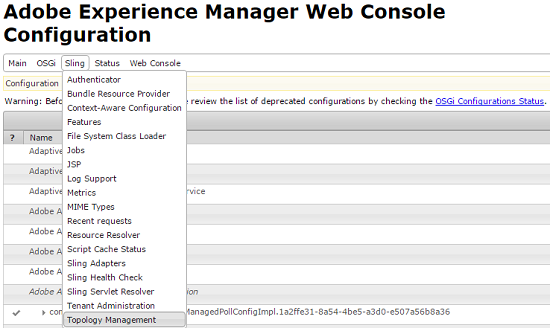
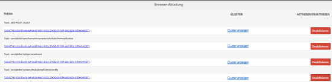
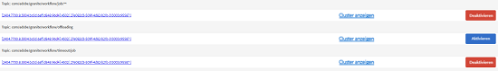
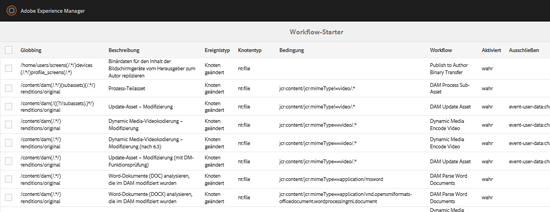
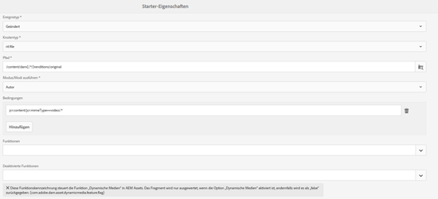
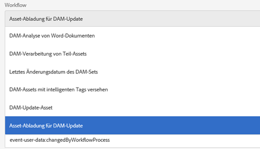
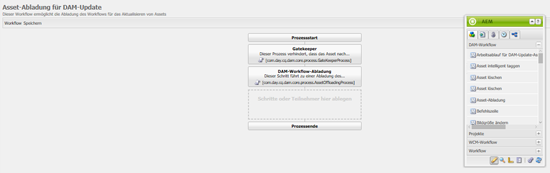
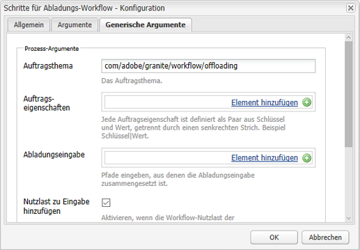
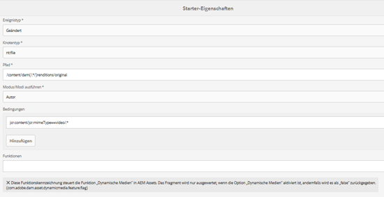

# Offloader für Assets-Workflows{#assets-workflow-offloader}

Mit dem Offloader für Assets-Workflows können Sie es ermöglichen, dass mehrere Instanzen von Adobe Experience Manager (AEM) Assets die Verarbeitungslast auf der primären (führenden) Instanz reduzieren. Die Verarbeitungslast wird unter der führenden Instanz und den verschiedenen Offloader-Instanzen (Arbeiterinstanzen), die Sie hinzufügen, aufgeteilt. Die Verteilung der Verarbeitungslast von Assets erhöht die Effizienz und Geschwindigkeit, mit der Assets in AEM Assets verarbeitet werden. Darüber hinaus unterstützt dieser Ansatz die Zuteilung von dedizierten Ressourcen, um Assets eines bestimmten MIME-Typs zu verarbeiten. Beispielsweise können Sie festlegen, dass ein bestimmter Knoten in Ihrer Topologie ausschließlich InDesign-Assets verarbeitet.

## Konfigurieren der Offloader-Topologie {#configure-offloader-topology}

Verwenden Sie Configuration Manager, um die URL für die führende Instanz und die Hostnamen der Offloader-Instanzen für Verbindungsanfragen in der führenden Instanz hinzuzufügen.

1. Tippen/klicken Sie auf das AEM-Logo und wählen Sie **Instrumente** > **Aktivitäten** > **Web-Konsole** , um Configuration Manager zu öffnen.
1. Wählen Sie in der Web-Konsole **Sling** >  **Topologieverwaltung**.

   

1. Tippen/klicken Sie auf der Seite &quot;Topologieverwaltung&quot;auf die **Konfigurieren des Discovery.Oak-Dienstes** Link.

   

1. Geben Sie auf der Seite &quot;Konfiguration des Discovery-Dienstes&quot;die Connector-URL für die führende Instanz im **Topologie-Connector-URLs** -Feld.

   

1. Im **Whitelist zum Topologie-Connector** -Feld IP-Adresse oder Hostnamen der Offloader-Instanzen angeben, die eine Verbindung mit der führenden Instanz herstellen dürfen. Tippen/Klicken Sie auf **Speichern**.

   

1. Um die Offloader-Instanzen anzuzeigen, die mit der führenden Instanz verbunden sind, gehen Sie zu **Tools** > **Bereitstellung** > **Topologie** und tippen oder klicken Sie auf die Cluster-Ansicht.

## Deaktivieren des Abladens {#disable-offloading}

1. Tippen/klicken Sie auf das AEM-Logo und wählen Sie **Instrumente** > **Implementierung** > **Abladung**. Die **Browser-Abladung** Seite zeigt Themen und die Serverinstanzen an, die die Themen nutzen können.

   

1. Deaktivieren Sie die *com/adobe/granite/workflow/offloading* Thema auf den führenden Instanzen, mit denen Benutzer interagieren, um AEM Assets hochzuladen oder zu ändern.

   

## Konfigurieren von Workflow-Startern auf der führenden Instanz {#configure-workflow-launchers-on-the-leader-instance}

Konfigurieren von Workflow-Startern für die Verwendung der **DAM-Update-Asset-Abladung** Workflow auf der führenden Instanz anstelle der **DAM-Update-Asset** Arbeitsablauf.

1. Tippen/klicken Sie auf das AEM-Logo und wählen Sie **Instrumente** > **Workflow** > **Starter** , um **Workflow-Starter** Konsole.

   

1. Suchen Sie die beiden Starter-Konfigurationen mit dem Ereignistyp . **Knoten erstellt** und **Knoten geändert** , die die **DAM-Update-Asset** Arbeitsablauf.
1. Aktivieren Sie für jede Konfiguration das Kontrollkästchen davor und tippen/klicken Sie auf die **Eigenschaften anzeigen** Symbol in der Symbolleiste, um die **Starter-Eigenschaften** angezeigt.

   

1. Aus dem **Workflow** Liste, wählen Sie **DAM-Update-Asset-Abladung** und tippen/klicken **Speichern**.

   

1. Tippen/klicken Sie auf das AEM-Logo und wählen Sie **Instrumente** > **Workflow** > **Modelle** , um **Workflow-Modelle** Seite.
1. Wählen Sie die **DAM-Update-Asset-Abladung** Workflow und tippen/klicken Sie **Bearbeiten** aus der Symbolleiste, um die Details anzuzeigen.

   

1. Anzeigen des Kontextmenüs für **DAM-Workflow-Abladung** und wählen Sie **Bearbeiten**. Überprüfen Sie den Eintrag im Feld **Auftragsthema** auf der Registerkarte **Generische Argumente** des Konfigurationsdialogfelds.

   

## Deaktivieren der Workflow-Starter auf den Offloader-Instanzen {#disable-the-workflow-launchers-on-the-offloader-instances}

Deaktivieren Sie die Workflow-Starter, die die **DAM-Update-Asset** Workflow in der Leader-Instanz.

1. Tippen/klicken Sie auf das AEM-Logo und wählen Sie **Instrumente** > **Workflow** > **Starter** , um **Workflow-Starter** Konsole.

   

1. Suchen Sie die beiden Starter-Konfigurationen mit dem Ereignistyp . **Knoten erstellt** und **Knoten geändert** , die die **DAM-Update-Asset** Arbeitsablauf.
1. Aktivieren Sie für jede Konfiguration das Kontrollkästchen davor und tippen/klicken Sie auf die **Eigenschaften anzeigen** Symbol in der Symbolleiste, um die **Starter-Eigenschaften** angezeigt.

   

1. Ziehen Sie im Bereich &quot;Aktivieren&quot;den Regler, um den Workflow-Starter zu deaktivieren, und tippen/klicken Sie auf . **Speichern** , um sie zu deaktivieren.

   

1. Laden Sie alle Assets vom Typ &quot;Bild&quot;in die führende Instanz hoch. Überprüfen Sie die Miniaturansichten, die von der abgeladenen Instanz für das Asset generiert und zurückportiert wurden.
