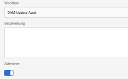

# Offloader für Assets-Workflows{#assets-workflow-offloader}

Mit dem Offloader für Assets-Workflows können Sie es ermöglichen, dass mehrere Instanzen von Adobe Experience Manager (AEM) Assets die Verarbeitungslast auf der primären (führenden) Instanz reduzieren. Die Verarbeitungslast wird unter der führenden Instanz und den verschiedenen Offloader-Instanzen (Arbeiterinstanzen), die Sie hinzufügen, aufgeteilt. Die Verteilung der Verarbeitungslast von Assets erhöht die Effizienz und Geschwindigkeit, mit der Assets in AEM Assets verarbeitet werden. Darüber hinaus unterstützt dieser Ansatz die Zuteilung von dedizierten Ressourcen, um Assets eines bestimmten MIME-Typs zu verarbeiten. Beispielsweise können Sie festlegen, dass ein bestimmter Knoten in Ihrer Topologie ausschließlich InDesign-Assets verarbeitet.

## Konfigurieren der Offloader-Topologie {#configure-offloader-topology}

Verwenden Sie Configuration Manager, um die URL für die Füllzeicheninstanz und die Hostnamen von offloader-Instanzen für Verbindungsanforderungen in der Füllzeicheninstanz hinzuzufügen.

1. Tippen/klicken Sie auf das AEM Logo und wählen Sie **Tools** > **Vorgänge** > **Webkonsole**, um Configuration Manager zu öffnen.
1. Wählen Sie in der Web-Konsole **Sling** > **Topologieverwaltung**.

   

1. Tippen Sie auf der Seite &quot;Topologieverwaltung&quot;auf den Link **Discovery.Oak-Dienst konfigurieren**.

   

1. Geben Sie auf der Seite &quot;Konfiguration des Discovery-Dienstes&quot;im Feld **Topology Connector-URLs** die Connector-URL für die Füllzeicheninstanz an.

   

1. Geben Sie im Feld **Topology Connector Whitelist** die IP-Adresse oder Hostnamen von offloader-Instanzen an, die eine Verbindung zur Füllzeicheninstanz herstellen dürfen. Tippen/Klicken Sie auf **Speichern**.

   

1. Um die Offloader-Instanzen anzuzeigen, die mit der führenden Instanz verbunden sind, gehen Sie zu **Tools** > **Bereitstellung** > **Topologie** und tippen oder klicken Sie auf die Cluster-Ansicht.

## Deaktivieren des Abladens  {#disable-offloading}

1. Tippen/klicken Sie auf das AEM Logo und wählen Sie **Tools** > **Bereitstellung** > **Verladen**. Auf der Seite **Offload-Browser** werden Themen und die Serverinstanzen angezeigt, die die Themen konsumieren können.

   

1. Deaktivieren Sie das Thema *com/adobe/granite/workflow/offloading* für die Füllzeicheninstanzen, mit denen Benutzer interagieren, um AEM Assets hochzuladen oder zu ändern.

   

## Konfigurieren von Workflow-Startern auf der führenden Instanz {#configure-workflow-launchers-on-the-leader-instance}

Konfigurieren Sie Workflow-Starter, um den Arbeitsablauf **DAM Update Asset Offloading** für die Füllzeicheninstanz anstelle des Arbeitsablaufs **DAM Update Asset** zu verwenden.

1. Tippen/klicken Sie auf das AEM Logo und wählen Sie **Tools** > **Workflow** > **Launchers**, um die Konsole **Workflow Launchers** zu öffnen.

   

1. Suchen Sie die beiden Starter-Konfigurationen mit Ereignistyp **Knoten erstellt** bzw. **Node Modified**, die den Arbeitsablauf **DAM Update Asset** ausführen.
1. Aktivieren Sie für jede Konfiguration das Kontrollkästchen vor der Konfiguration und tippen/klicken Sie auf das Symbol **Eigenschaften von Ansichten** in der Symbolleiste, um das Dialogfeld **Startereigenschaften** anzuzeigen.

   

1. Wählen Sie in der Liste **Workflow** **DAM-Update-Asset-Offloading** und tippen/klicken Sie auf **Speichern**.

   

1. Tippen/klicken Sie auf das AEM Logo und wählen Sie **Tools** > **Workflow** > **Modelle**, um die Seite **Workflow-Modelle** zu öffnen.
1. Wählen Sie den Arbeitsablauf **DAM-Aktualisierung Asset-Offloading** und tippen/klicken Sie auf **Bearbeiten** in der Symbolleiste, um die Details anzuzeigen.

   

1. Zeigen Sie das Kontextmenü für den Schritt **DAM Workflow Offloading** an und wählen Sie **Bearbeiten**. Überprüfen Sie den Eintrag im Feld **Auftragsthema** auf der Registerkarte **Generische Argumente** des Konfigurationsdialogfelds.

   

## Deaktivieren der Workflow-Starter auf den Offloader-Instanzen {#disable-the-workflow-launchers-on-the-offloader-instances}

Deaktivieren Sie die Workflow-Starter, die den Workflow **DAM Update Asset** auf der Leader-Instanz ausführen.

1. Tippen/klicken Sie auf das AEM Logo und wählen Sie **Tools** > **Workflow** > **Launchers**, um die Konsole **Workflow Launchers** zu öffnen.

   

1. Suchen Sie die beiden Starter-Konfigurationen mit Ereignistyp **Knoten erstellt** bzw. **Node Modified**, die den Arbeitsablauf **DAM Update Asset** ausführen.
1. Aktivieren Sie für jede Konfiguration das Kontrollkästchen vor der Konfiguration und tippen/klicken Sie auf das Symbol **Eigenschaften von Ansichten** in der Symbolleiste, um das Dialogfeld **Startereigenschaften** anzuzeigen.

   

1. Ziehen Sie im Abschnitt **Aktivieren **den Schieberegler, um den Workflow-Starter zu deaktivieren, und tippen/klicken Sie auf **Speichern**, um ihn zu deaktivieren.

   

1. Laden Sie alle Assets vom Typ image in die Füllzeicheninstanz hoch. Überprüfen Sie, welche Miniaturansichten für das Asset von der abgeladenen Instanz generiert und zurückportiert wurden.

