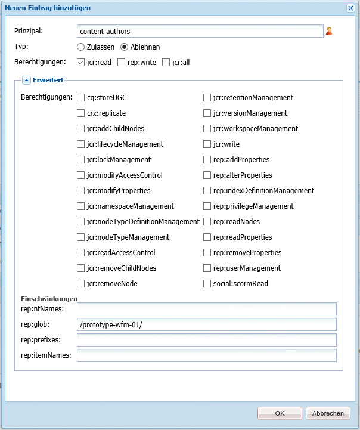
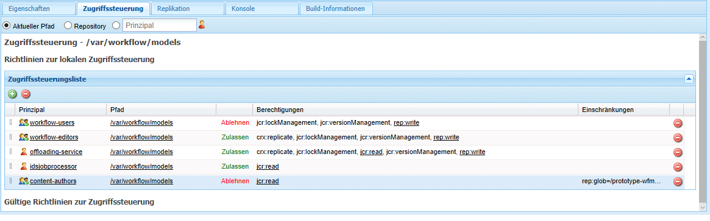
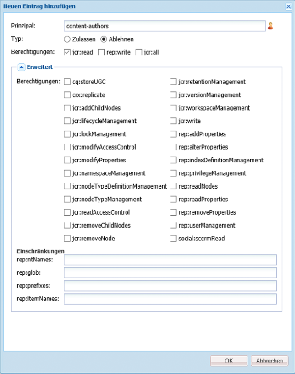
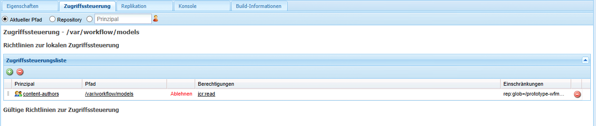

# Verwalten des Zugriffs auf Workflows{#managing-access-to-workflows}

>[!CAUTION]
>
>AEM 6.4 hat das Ende der erweiterten Unterstützung erreicht und diese Dokumentation wird nicht mehr aktualisiert. Weitere Informationen finden Sie in unserer [technische Unterstützung](https://helpx.adobe.com/de/support/programs/eol-matrix.html). Unterstützte Versionen suchen [here](https://experienceleague.adobe.com/docs/?lang=de).

Konfigurieren Sie ACLs entsprechend den Benutzerkonten, um den Start und die Teilnahme an Workflows zu ermöglichen (oder zu deaktivieren).

## Erforderliche Benutzerberechtigungen für Workflows {#required-user-permissions-for-workflows}

Maßnahmen in Bezug auf Workflows können durchgeführt werden, wenn:

* Sie mit dem `admin`-Konto arbeiten;
* das Konto der Standardgruppe `workflow-users` zugewiesen wurde:

   * Diese Gruppe verfügt über alle Berechtigungen, die Ihre Benutzer benötigen, um Workflow-Aktionen durchzuführen.
   * wenn sich das Konto in dieser Gruppe befindet, hat es nur Zugriff auf von ihm initiierte Workflows.

* das Konto der Standardgruppe `workflow-administrators` zugewiesen wurde:

   * Diese Gruppe verfügt über alle Berechtigungen, die erforderlich sind, damit Ihre berechtigten Benutzer Workflows überwachen und verwalten können.
   * wenn sich das Konto in dieser Gruppe befindet, hat es Zugriff auf alle Workflows.

>[!NOTE]
>
>Dies sind die Mindestanforderungen. Ihr Konto muss auch entweder der zugewiesene Teilnehmer oder ein Mitglied der zugewiesenen Gruppe sein, um bestimmte Schritte durchführen zu können.

## Zugriff auf Workflows konfigurieren {#configuring-access-to-workflows}

Workflow-Modelle übernehmen eine standardmäßige Zugriffssteuerungsliste (ACL), um zu steuern, wie Benutzer mit Workflows interagieren können. Um den Benutzerzugriff für einen Workflow anzupassen, ändern Sie die Zugriffssteuerungsliste (ACL) im Repository für den Ordner, der den Workflow-Modellknoten enthält:

* [Anwenden einer ACL für das spezifische Workflow-Modell unter /var/workflow/models](/help/sites-administering/workflows-managing.md#apply-an-acl-for-the-specific-workflow-model-to-var-workflow-models)
* [Erstellen eines Unterordners in /var/workflow/models und Anwenden der ACL auf diesen Ordner](/help/sites-administering/workflows-managing.md#create-a-subfolder-in-var-workflow-models-and-apply-the-acl-to-that)

>[!NOTE]
>
>Informationen zur Verwendung von CRXDE Lite zum Konfigurieren von ACLs finden Sie unter [Zugriffsberechtigungsverwaltung](/help/sites-administering/user-group-ac-admin.md#access-right-management).

### Anwenden einer ACL für das spezifische Workflow-Modell unter /var/workflow/models {#apply-an-acl-for-the-specific-workflow-model-to-var-workflow-models}

Falls das Workflow-Modell unter `/var/workflow/models` gespeichert ist, können Sie dem folgenden Ordner eine spezifische ACL zuweisen, die nur für diesen Workflow relevant ist:

1. Öffnen Sie die CRXDE Lite in Ihrem Webbrowser (z. B. [http://localhost:4502/crx/de](http://localhost:4502/crx/de)).
1. Wählen Sie in der Knotenstruktur den Knoten für den Ordner mit den Workflow-Modellen aus:

   `/var/workflow/models`

1. Klicken Sie auf die Registerkarte **Zugriffssteuerung**.
1. Klicken Sie in der Tabelle **Richtlinien zur lokalen Zugriffssteuerung** (**Zugriffssteuerungsliste**) auf das Plussymbol, um einen **Eintrag hinzuzufügen**.
1. Im **Neuen Eintrag hinzufügen** ein neues ACE mit den folgenden Eigenschaften hinzufügen:

   * **Prinzipal**: `content-authors`
   * **Typ**: `Deny`
   * **Berechtigungen**: `jcr:read`
   * **rep:glob**: Verweis auf den spezifischen Workflow

   

   Die Tabelle **Zugriffssteuerungsliste** beinhaltet nun die Beschränkung für `content-authors` im Workflow-Modell `prototype-wfm-01`.

   

1. Klicken Sie auf **Alle speichern**.

   Der Workflow `prototype-wfm-01` ist nicht länger für Mitglieder der Gruppe `content-authors` verfügbar.

### Erstellen eines Unterordners in /var/workflow/models und Anwenden der ACL auf diesen Ordner {#create-a-subfolder-in-var-workflow-models-and-apply-the-acl-to-that}

Ihre [Das Entwicklungsteam kann die Workflows in einem Unterordner erstellen](/help/sites-developing/workflows-models.md#creating-a-new-workflow) von

`/var/workflow/models`

Vergleichbar mit den DAM-Workflows, die im folgenden Ordner gespeichert sind:

`/var/workflow/models/dam/`

Sie können dann dem Ordner selbst eine ACL hinzufügen.

1. Öffnen Sie die CRXDE Lite in Ihrem Webbrowser (z. B. [http://localhost:4502/crx/de](http://localhost:4502/crx/de)).
1. Wählen Sie in der Knotenstruktur den Knoten für den einzelnen Ordner im Ordner mit Workflow-Modellen aus. Beispiel:

   `/var/workflow/models/prototypes`

1. Klicken Sie auf die Registerkarte **Zugriffssteuerung**.
1. Klicken Sie in der Tabelle **Gültige Richtlinie für die Zugriffssteuerung** auf das Pluszeichen, um einen Eintrag **hinzuzufügen**.
1. Klicken Sie in der Tabelle **Richtlinien zur lokalen Zugriffssteuerung** (**Zugriffssteuerungsliste**) auf das Plussymbol, um einen **Eintrag hinzuzufügen**.
1. Im **Neuen Eintrag hinzufügen** ein neues ACE mit den folgenden Eigenschaften hinzufügen:

   * **Prinzipal**: `content-authors`
   * **Typ**: `Deny`
   * **Berechtigungen**: `jcr:read`

   >[!NOTE]
   >
   >Wie im Abschnitt [Anwenden einer ACL für das spezifische Workflow-Modell unter /var/workflow/models](/help/sites-administering/workflows-managing.md#apply-an-acl-for-the-specific-workflow-model-to-var-workflow-models) können Sie ein „rep:glob“ einfügen, um den Zugriff auf einen spezifischen Workflow zu beschränken.

   

   Die Tabelle **Zugriffssteuerungsliste** beinhaltet nun die Beschränkung für `content-authors` im Ordner `prototypes`.

   

1. Klicken Sie auf **Alle speichern**.

   Die Modelle im `prototypes`-Ordner sind nicht länger für Mitglieder der Gruppe `content-authors` verfügbar.
