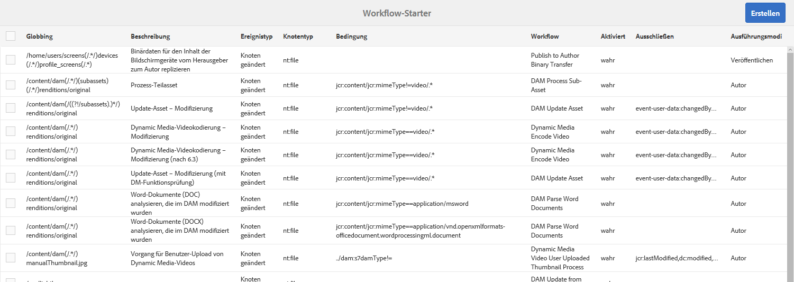
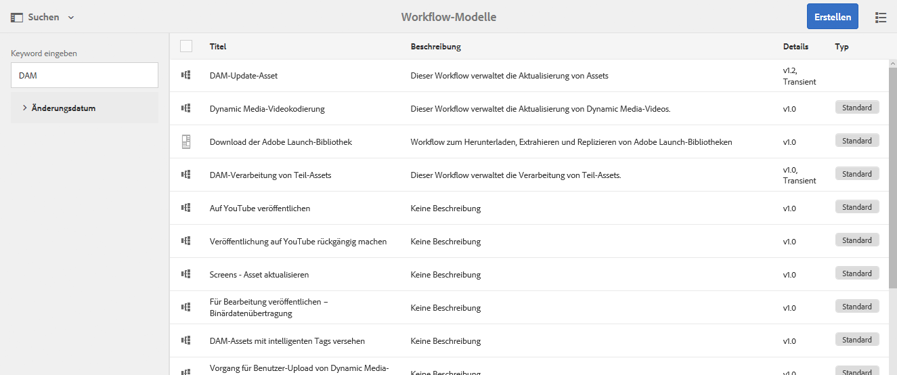
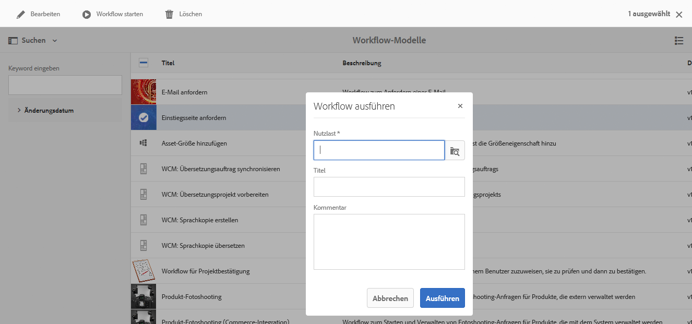
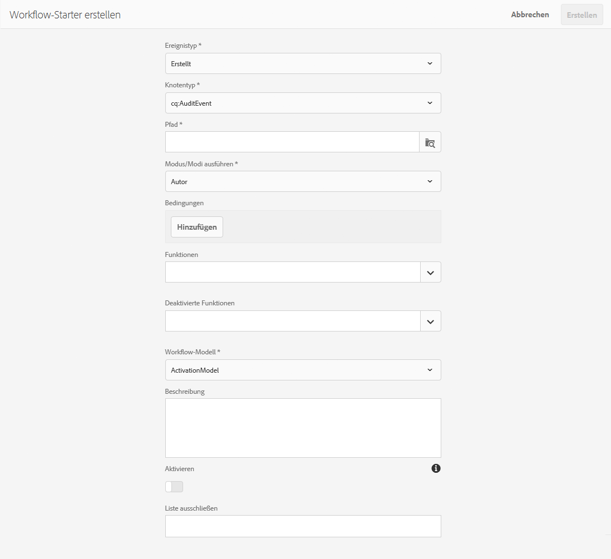

# Starten von Workflows{#starting-workflows}

>[!CAUTION]
>
>AEM 6.4 hat das Ende der erweiterten Unterstützung erreicht und diese Dokumentation wird nicht mehr aktualisiert. Weitere Informationen finden Sie in unserer [technische Unterstützung](https://helpx.adobe.com/de/support/programs/eol-matrix.html). Unterstützte Versionen suchen [here](https://experienceleague.adobe.com/docs/?lang=de).

Bei der Verwaltung von Workflows können Sie diese mit verschiedenen Methoden starten:

* Manuell:

   * Von einem [Workflow-Modell](#workflow-models).
   * Verwenden eines Workflow-Pakets für [Stapelverarbeitung](#workflow-packages-for-batch-processing).

* Automatisch:

   * Als Reaktion auf Knotenänderungen; [Verwenden eines Starters](#workflows-launchers).

>[!NOTE]
>
>Andere Methoden stehen Autoren ebenfalls zur Verfügung. Ausführliche Informationen finden Sie unter:
>
>* [Anwenden von Workflows auf Seiten](/help/sites-authoring/workflows-applying.md)
>* [Anwenden von Workflows auf DAM-Assets](/help/assets/assets-workflow.md)
>* [AEM Forms](https://helpx.adobe.com/de/aem-forms/6-2/aem-workflows-submit-process-form.html)
>* [Übersetzungsprojekte](/help/sites-administering/tc-manage.md)
>

## Workflow-Modelle {#workflow-models}

Sie können einen Workflow starten [basierend auf einem der Modelle](/help/sites-administering/workflows.md#workflow-models-and-instances) in der Konsole &quot;Workflow-Modelle&quot;aufgeführt. Die einzige erforderliche Angabe ist die Payload. Sie können aber auch einen Titel und/oder einen Kommentar hinzufügen.

## Workflows Launcher {#workflows-launchers}

Der Workflow-Starter überwacht Änderungen im Inhalts-Repository, um Workflows abhängig vom Speicherort und Ressourcentyp des geänderten Knotens zu starten.

Mit dem **Starter** können Sie:

* Siehe bereits für bestimmte Knoten gestartete Workflows.
* Wählen Sie einen Workflow aus, der gestartet werden soll, wenn ein bestimmter Knoten/Knotentyp erstellt/geändert/entfernt wurde.
* Entfernen Sie eine vorhandene Workflow-zu-Knoten-Beziehung.

Ein Starter kann für jeden Knoten erstellt werden. Änderungen an bestimmten Knoten starten jedoch keine Workflows. Änderungen an Knoten unter den folgenden Pfaden führen nicht dazu, dass Workflows gestartet werden:

* `/var/workflow/instances`
* alle Workflow-Posteingangsknoten in der Verzweigung `/home/users`
* `/tmp`
* `/var/audit`
* `/var/classes`
* `/var/eventing`
* `/var/linkchecker`
* `/var/mobile`
* `/var/statistics`

   * Ausnahme: Bei Änderungen an Knoten unter `/var/statistics/tracking` *werden* Workflows gestartet.

Die Standardinstallation umfasst verschiedene Definitionen. Diese werden für Digital Asset Management- und Social Collaboration-Aufgaben verwendet:

## Workflow-Pakete für die Stapelverarbeitung {#workflow-packages-for-batch-processing}

Workflow-Pakete sind Pakete, die als Payload zur Verarbeitung an einen Workflow übergeben werden können. Auf diese Weise können mehrere Ressourcen verarbeitet werden.

Ein Workflow-Paket:

* enthält Links zu einer Reihe von Ressourcen (z. B. Seiten, Assets).
* enthält Paketinformationen wie das Erstellungsdatum, den Benutzer, der das Paket erstellt hat, und eine kurze Beschreibung.
* wird anhand einer speziellen Seitenvorlage definiert; mit solchen Seiten kann der Benutzer die Ressourcen im Paket angeben
* kann mehrmals verwendet werden.
* kann vom Benutzer geändert werden (Ressourcen hinzufügen oder entfernen), während die Workflow-Instanz tatsächlich ausgeführt wird.

## Starten eines Workflows über die Modellkonsole {#starting-a-workflow-from-the-models-console}

1. Gehen Sie zur **Modelle-Konsole** (**Tools** > **Workflow** > **Modelle**).
1. Wählen Sie den Workflow aus (entsprechend der Konsolenansicht). Bei Bedarf können Sie auch die Suche (links oben) verwenden:

   

   >[!NOTE]
   >
   >Die Anzeige **[Übergang](/help/sites-developing/workflows.md#transient-workflows)** zeigt Workflows an, deren Workflow-Verlauf nicht aufbewahrt wird.

1. Wählen Sie in der Symbolleiste **Workflow starten** aus.
1. Das Dialogfeld „Workflow ausführen“ wird geöffnet. Darin können Sie Folgendes festlegen:

   * **Payload**

      Hierbei kann es sich um eine Seite, einen Knoten, ein Asset, ein Paket un andere handeln.

   * **Titel**

      Ein optionaler Titel, der die Identifizierung dieser Instanz unterstützt.

   * **Kommentar**

      Ein optionaler Kommentar, der Details zu dieser Instanz angibt.
   

## Erstellen einer Starter-Konfiguration {#creating-a-launcher-configuration}

1. Gehen Sie zur Konsole **Workflow-Starter** (**Tools** > **Workflow** > **Starter**).
1. Wählen Sie **Erstellen** und anschließend **Starter hinzufügen**, um das Dialogfeld zu öffnen:

   

   * **Ereignistyp**

      Der Ereignistyp, der den Workflow startet:

      * Erstellt
      * Geändert
      * Entfernt
   * **Notetyp**

      Der Knotentyp, für den der Workflow-Starter angewendet wird.

   * **Pfad**

      Der Pfad, auf den der Workflow-Starter angewendet wird.

   * **Ausführungs-Modus/Modi**

      Die Art von Server, auf den der Workflow-Starter angewendet wird. Wählen Sie **Autor**, **Veröffentlichen** oder **Autor und Veröffentlichen** aus.

   * **Bedingungen**

      Eine Liste der Bedingungen für Knotenwerte, die bewertet werden und so bestimmen, ob der Workflow gestartet wird. Beispielsweise führt die folgende Bedingung zum Start des Workflows, wenn für den Knoten als name-Eigenschaft der Wert „User“ festgelegt wurde:

      name==User

   * **Funktionen**

      Eine Liste der Funktionen, die aktiviert werden können/sollen. Wählen Sie die benötigte(n) Funktion(en) über den Dropdown-Selektor aus.

   * **Deaktivierte Funktionen**

   Eine Liste der Funktionen, die deaktiviert werden können/sollen. Wählen Sie die benötigte(n) Funktion(en) über den Dropdown-Selektor aus.

   * **Workflow-Modell**

      Der Workflow, der gestartet werden soll, wenn der Ereignistyp bei dem Knotentyp und/oder unter dem Pfad entsprechend der definierten Bedingung auftritt.

   * **Beschreibung**

      Ihr eigener Text, der die Starter-Konfiguration beschreibt und identifiziert.

   * **Aktivieren**

      Kontrolliert, ob der Workflow-Starter aktiviert wird:

      * Auswählen **Aktivieren** , um Workflows zu starten, wenn die Konfigurationseigenschaften erfüllt sind.
      * Auswählen **Deaktivieren** wenn der Workflow nicht ausgeführt werden soll (auch nicht, wenn die Konfigurationseigenschaften erfüllt sind).
   * **Liste ausschließen**

      Hier können Sie JCR-Ereignisse festlegen, die ausgeschlossen (d. h. ignoriert) werden sollen, wenn bestimmt wird, ob ein Workflow ausgelöst wird oder nicht.

      Bei dieser Startereigenschaft handelt es sich um eine Reihe von kommagetrennten Elementen: ``

      * `property-name` ignoriert alle `jcr`-Ereignisse, die beim festgelegten Eigenschaftsnamen ausgelöst werden. ``
      * `event-user-data:<*someValue*>` ignoriert jedes Ereignis, das die über die `*<someValue*` -API festgelegten `user-data`> [`ObservationManager` enthält](https://www.adobe.io/experience-manager/reference-materials/spec/jsr170/javadocs/jcr-2.0/javax/jcr/observation/ObservationManager.html#setUserData(java.lang.String.

      Beispiel:

      `jcr:lastModified,dc:modified,dc:format,jcr:lastModifiedBy,imageMap,event-user-data:changedByWorkflowProcess`

      Diese Funktion kann verwendet werden, um alle Änderungen zu ignorieren, die von einem anderen Workflow-Prozess ausgelöst werden, indem das Ausschlusselement hinzugefügt wird:

      `event-user-data:changedByWorkflowProcess`

1. Wählen Sie **Erstellen** aus, um den Starter zu erstellen, und kehren Sie zur Konsole zurück.

   Sobald das entsprechende Ereignis auftritt, wird der Starter ausgelöst und der Workflow gestartet.

## Verwalten einer Starter-Konfiguration {#managing-a-launcher-configuration}

Nach der Erstellung der Starter-Konfiguration können Sie über dieselbe Konsole die Instanz auswählen und anschließend **Eigenschaften anzeigen**. Sie können diese dann „Bearbeiten“ oder **Löschen** auswählen.
