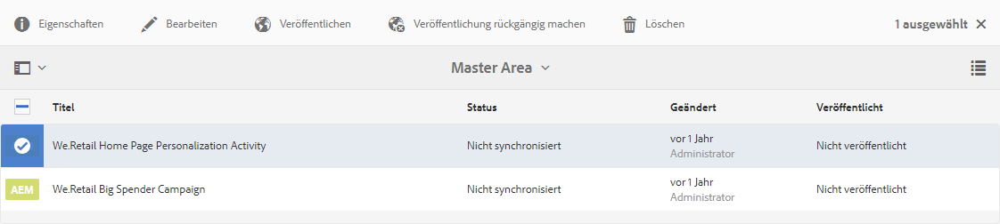
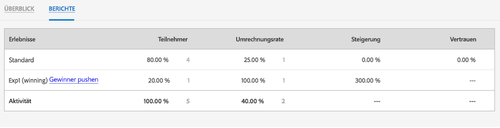

# Verwalten von Aktivitäten{#managing-activities}

>[!CAUTION]
>
>AEM 6.4 hat das Ende der erweiterten Unterstützung erreicht und diese Dokumentation wird nicht mehr aktualisiert. Weitere Informationen finden Sie in unserer [technische Unterstützung](https://helpx.adobe.com/de/support/programs/eol-matrix.html). Unterstützte Versionen suchen [here](https://experienceleague.adobe.com/docs/?lang=de).

Mithilfe der Aktivitätskonsole können Sie die Marketing-[Aktivitäten](/help/sites-authoring/personalization.md#activities) Ihrer Marken erstellen, organisieren und verwalten:

* Fügen Sie Marken hinzu..
* Fügen Sie für jede Marke Aktivitäten hinzu und konfigurieren Sie diese.
* Verwalten Sie Aktivitäten.

>[!NOTE]
>
>Wenn Sie Adobe Target als Targeting-Engine verwenden, können Sie auch [Leistungsdaten Ihrer Aktivitäten anzeigen](#viewing-performance-and-converting-winning-experiences-a-b-test). Wenn Sie A/B-Tests verwenden, können Sie [Gewinner konvertieren](#viewing-performance-and-converting-winning-experiences-a-b-test).

In der Aktivitätskonsole sind die Aktivitäten nach Marken organisiert. Sie können Marken und Ordner verwenden, um die Organisation Ihrer Aktivitäten zu strukturieren. Sie navigieren zur Aktivitätskonsole, indem Sie auf **Personalisierung** und tippen/klicken **Tätigkeiten**.

Aktivitäten stehen im Targeting-Modus für das [Verfassen zielgerichteter Inhalte](/help/sites-authoring/content-targeting-touch.md) zur Verfügung, wobei Sie in diesem Modus auch Aktivitäten erstellen können. Aktivitäten, die Sie im Targeting-Modus erstellen, werden in der Aktivitätskonsole angezeigt.

Aktivitäten werden mit einem Titel angezeigt, der beschreibt, welche Art von Aktivität definiert ist:

* XT - Adobe Target-Erlebnis-Targeting
* A/B - Adobe Target-A/B-Tests
* AEM - Adobe Experience Manager-Targeting (kontexthub- oder clientcontext-gesteuert)

>[!NOTE]
>
>Welche Aktivitätstypen zur Verfügung stehen, hängt von folgenden Faktoren ab:
>
>* Wenn die Variable **xt_only** ist für den Adobe Target-Mandanten (Clientcode) aktiviert, der auf der AEM für die Verbindung mit Adobe Target verwendet wird. Anschließend können Sie **only** XT-Aktivitäten in AEM.
>
>* Wenn die Variable **xt_only** Optionen ist **not** im Adobe Target-Mandanten aktiviert ist (Clientcode), können Sie **both** XT- und A/B-Aktivitäten in AEM.
>
>**Zusätzliche Anmerkung:** **xt_only** options ist eine Einstellung, die auf einen bestimmten Target-Mandanten (Clientcode) angewendet wird und nur direkt in Adobe Target geändert werden kann. Die Option kann in AEM nicht aktiviert oder deaktiviert werden.

>[!CAUTION]
>
>Sie müssen den Aktivitätseinstellungsknoten sichern **cq:ActivitySettings** auf der Veröffentlichungsinstanz, sodass sie für normale Benutzer nicht zugänglich ist. Der Aktivitätseinstellungsknoten sollte ausschließlich für den Service zur Verfügung stehen, mit dem die Aktivitätssynchronisierung mit Adobe Target durchgeführt wird.
>
>Siehe [Voraussetzungen für die Integration in Adobe Target](/help/sites-administering/target-requirements.md) für detaillierte Informationen.

## Erstellen von Marken mithilfe der Aktivitätskonsole {#creating-a-brand-using-the-activities-console}

Erstellen Sie eine Marke, deren Marketing-Aktivitäten Sie verwalten möchten.

Wenn Sie mithilfe der Aktivitätskonsole eine Marke erstellen, erscheint diese ebenfalls in der [Angebotskonsole](/help/sites-authoring/offerlib.md), in der Sie Angebote für die Erlebnisse Ihrer Aktivitäten erstellen können.

1. Klicken oder tippen Sie in der Navigationskonsole auf **Personalisierung**. Klicken oder tippen Sie auf **Tätigkeiten**.

   

1. Klicken oder tippen Sie in der Aktivitätskonsole auf **Erstellen** then **Marke erstellen**.
1. Wählen Sie die Markenvorlage aus und klicken oder tippen Sie auf **Nächste**.
1. Geben Sie einen Titel für die Marke ein, wie er in den Konsolen &quot;Aktivitäten&quot;und &quot;Angebote&quot;angezeigt werden soll. Optional können Sie einen oder mehrere Tags eingeben oder auswählen, die mit der Marke verknüpft werden sollen.
1. Klicken oder tippen Sie auf **Erstellen**. Ihre Marke wird in der Aktivitätskonsole angezeigt.

## Hinzufügen/Bearbeiten von Aktivitäten mithilfe der Aktivitätskonsole {#adding-editing-an-activity-using-the-activities-console}

Fügen Sie eine Aktivität hinzu oder bearbeiten Sie eine vorhandene Aktivität, um Ihre Marketing-Maßnahmen auf bestimmte Zielgruppen zu konzentrieren. Beim Erstellen/Bearbeiten einer Aktivität geben Sie die folgenden Informationen an:

* **Name:** Der Name der Aktivität.
* **Targeting-Engine:** Entweder [AEM](/help/sites-authoring/personalization.md#aem) oder [Adobe Target](/help/sites-authoring/personalization.md#adobe-target) als Engine für zielgerichtete Inhalte.

* **Auswählen einer Target-Konfiguration:** (Nur Adobe Target) Die Cloud-Konfiguration, mit der diese Aktivität eine Verbindung zu Adobe Target herstellen soll. Diese Option wird nur angezeigt, wenn Adobe Target für die Targeting-Engine ausgewählt wurde.
* **Aktivitätstyp:** Der Aktivitätstyp - A/B-Test oder Erlebnis-Targeting
* **Ziele:** (Optional) Eine Beschreibung der Aktivität.
* **Erlebnisse:** Zuordnungen zwischen Zielgruppennamen und den Marketingsegmenten, die Sie als Ziel auswählen.
* **Traffic-Anteile**: wurde A/B-Test ausgewählt, können Sie festlegen, welcher Anteil des Traffics (in Prozent) an die verschiedenen Erlebnisse weitergeleitet wird.
* **Dauer:** Der Zeitraum, in dem die Aktivität angewendet wird.
* **Priorität:** Die relative Priorität der Aktivität. Wenn Aktivitäten Inhalte für dieselben Benutzersegmente bereitstellen, hat die Aktivität mit höherer Priorität Vorrang.
* **Zielmetrik**: wurde Adobe Target als Targeting-Engine ausgewählt, können Sie der Aktivität Erfolgsmetriken hinzufügen. Eine Erfolgsmetrik ist erforderlich.

>[!NOTE]
>
>Neue Adobe Target-Aktivitäten müssen im Editor für zielgerichtete Inhalte **erstellt** werden, nicht in der Konsole **Aktivitäten**, da die Synchronisierung mit Adobe Target fehlschlägt.
>
>Sie können jedoch vorhandene Adobe Target-Aktivitäten in der Konsole bearbeiten.

So fügen Sie eine Aktivität hinzu:

1. Klicken oder tippen Sie auf die Marke, für die Sie eine Aktivität erstellen möchten, klicken oder tippen Sie auf **Erstellen** und dann auf **Aktivität erstellen**. Wenn Sie die Aktivität bearbeiten möchten, wählen Sie sie aus und klicken oder tippen Sie auf **Bearbeiten**.
1. Geben Sie die folgenden Informationen ein und klicken oder tippen Sie dann auf **Nächste**:

   * Ein Name für die Aktivität.
   * Die zu verwendende Targeting-Engine. ContextHub (AEM) ist standardmäßig ausgewählt. Wenn Sie Adobe Target verwenden müssen, erstellen Sie die Aktivität im Editor für zielgerichtete Inhalte.
   * Wenn Sie Adobe Target als Targeting-Engine ausgewählt haben, wählen/bearbeiten Sie die Cloud-Konfiguration, die für die Verbindung mit Adobe Target verwendet werden soll. (Achten Sie darauf, dass Sie kein Framework auswählen, das Sie für Ihre Cloud-Konfiguration erstellt haben.)
   * (Optional) Das Ziel oder eine Beschreibung der Aktivität.
   * Wählen Sie den Aktivitätstyp aus.

1. Fügen Sie der Aktivität mindestens ein Erlebnis hinzu. Tippen/Klicken Sie auf **Erlebnis hinzufügen**.
1. Wenn Sie AEM Targeting oder Adobe Target-Erlebnis-Targeting verwenden:

   1. Klicken oder tippen Sie auf **Zielgruppe wählen** und wählen Sie das Segment aus, auf das Ihr Erlebnis abgestimmt ist.
   1. Klicken oder tippen Sie auf **Erlebnis hinzufügen**, geben Sie einen Namen ein und klicken oder tippen Sie auf **OK**.
   1. Klicken oder tippen Sie auf **Weiter**.

   Wenn Sie Adobe Target A/B-Tests verwenden:

   1. Klicken oder tippen Sie auf das Stiftsymbol im Feld &quot;Zielgruppen&quot;, um eine Zielgruppe auszuwählen.
   1. Klicken oder tippen Sie auf **Erlebnis hinzufügen**, geben Sie einen Namen ein und klicken oder tippen Sie auf **OK**.
   1. Geben Sie den Prozentsatz des Traffics ein, der jedes Erlebnis anzeigt.
   1. Klicken oder tippen Sie auf **Weiter**.

1. Verwenden Sie zum Festlegen des Starts der Aktivität die **Starten** aus dem Dropdown-Menü einen der folgenden Werte auswählen:

   * **Bei Aktivierung:** Die Aktivität beginnt mit der Aktivierung der Seite, die den zielgerichteten Inhalt enthält.
   * **Angegebene Uhrzeit (Datum und Uhrzeit):** Eine bestimmte Zeit. Wenn Sie diese Option auswählen, tippen/klicken Sie auf das Kalendersymbol, wählen Sie ein Datum aus und geben Sie die Zeit an, zu der die Aktivität gestartet werden soll.

1. Um festzulegen, wann die Aktivität endet, wählen Sie im Dropdown-Menü Ende einen der folgenden Werte aus:

   * **Bei Deaktivierung**: Die Aktivität endet, wenn die Seite, die den zielgerichteten Inhalt enthält, deaktiviert wird.
   * **Angegebene Datum und Uhrzeit**: Eine bestimmte Zeit. Wenn Sie diese Option auswählen, klicken oder tippen Sie auf das Kalendersymbol, wählen Sie ein Datum aus und geben Sie die Zeit an, zu der die Aktivität beendet werden soll.

1. Mit dem Schieberegler können Sie eine der folgenden Optionen auswählen: **Niedrig**, **Normal** oder **Hoch**.
1. Wenn Sie Adobe Target als Targeting-Engine verwenden, wählen Sie aus, was mit dieser Aktivität gemessen werden soll. Weitere Informationen zu verfügbaren Erfolgsmetriken finden Sie unter [Konfigurieren der Aktivität und Festlegen von Zielen](/help/sites-authoring/content-targeting-touch.md). Sie müssen mindestens ein Ziel auswählen.
1. Klicken oder tippen Sie auf **Speichern**.

   >[!NOTE]
   >
   >Nach der Erstellung einer Aktivität müssen Sie sie veröffentlichen, damit sie verfügbar ist.

## Veröffentlichen von Aktivitäten und Aufheben der Veröffentlichung von Aktivitäten {#publishing-and-unpublishing-activities}

Sie müssen Aktivitäten veröffentlichen, um sie verfügbar zu machen. Auf der anderen Seite möchten Sie die Verfügbarkeit von Aktivitäten möglicherweise verhindern, was durch das Aufheben einer Veröffentlichung erzielt wird.

>[!NOTE]
>
>Wenn Sie das Veröffentlichen einer Aktivität aufheben, ändert sich der Status der Aktivität nicht, es sei denn, Sie aktualisieren die Seite.

So veröffentlichen Sie Aktivitäten oder heben deren Veröffentlichung auf:

1. Klicken oder tippen Sie auf die Marke und anschließend auf das Gebiet, das die Aktivität enthält, die veröffentlicht bzw. deren Veröffentlichung aufgehoben werden soll.
1. Klicken oder tippen Sie auf das Symbol neben der Aktivität oder den Aktivitäten, die Sie veröffentlichen bzw. deren Veröffentlichung Sie aufheben möchten.

   

1. Um zu veröffentlichen, tippen oder klicken Sie auf **Veröffentlichen**. Soll die Veröffentlichung der Aktivität aufgehoben werden, klicken oder tippen Sie auf **Veröffentlichung** aufheben. Ihre Aktivitäten werden veröffentlicht oder ihre Veröffentlichung wird rückgängig gemacht und ihr Status ändert sich in der Aktivitätskonsole (möglicherweise ist eine Aktualisierung erforderlich).

## Aktivitäten in der Autoren- und Veröffentlichungsinstanz {#activities-on-author-and-publish-instances}

Wenn eine Aktivität aktiviert wird, die die Targeting-Engine von Adobe Target verwendet, wird eine zweite Aktivität in der Veröffentlichungsinstanz erstellt:

* Die Aktivität in der Autoreninstanz verfolgt die Aktivität in der Autoreninstanz und ist für die Simulation des Besuchererlebnisses nützlich. Die für diese Aktivität aufgezeichneten Analysen spiegeln nur die Ereignisse in der Autoreninstanz wider.
* Die Aktivität auf der Veröffentlichungsinstanz spiegelt die Aktivität auf dem Veröffentlichungsserver wider und reagiert auf diese. Dies ist die Aktivität, die auf der öffentlichen Website ausgeführt wird. Nur die Veröffentlichungsaktivität ist für das Tracking und die Analyse der Nutzung der tatsächlichen öffentlichen Site relevant.

## Anzeigen der Performance und Konvertieren von Gewinnererlebnissen (A/B-Tests) {#viewing-performance-and-converting-winning-experiences-a-b-test}

Sie können die Leistung jeder Adobe Target-Aktivität (XT oder A/B) sehen. Wenn Sie A/B-Tests verwenden, können Sie auch das erfolgreichste Erlebnis konvertieren, das dann zum Standarderlebnis wird.

So prüfen Sie die Leistung und konvertieren Gewinnererlebnisse:

1. Klicken Sie unter **Personalisierung** auf **Aktivitäten**, um zur **Aktivitätskonsole** zu navigieren.
1. Klicken oder tippen Sie auf die Marke, deren Aktivitäten Sie anzeigen möchten.
1. Wählen Sie die Aktivität aus, klicken oder tippen Sie auf &quot;Eigenschaften anzeigen&quot;und klicken Sie auf **Berichte** und wählen Sie die Aktivität aus, für die Sie die Leistung anzeigen/die erfolgreichsten Erlebnisse konvertieren möchten. Die Leistungsdaten werden nun angezeigt.

   

1. Klicken oder tippen Sie auf den Link **** Gewinner pushen, um das Erlebnis als Standarderlebnis festzulegen.

   Durch die Konvertierung des Gewinners geschieht Folgendes:

   * Die aktuelle Aktivität wird deaktiviert.
   * Es werden alle Seiten modifiziert und zielgerichtete Inhalte durch die Inhalte des Gewinnererlebnisses ersetzt. Der Inhalt des Gewinnererlebnisses wird Teil der normalen Seite **ohne** Targeting.

   

   Ein erfolgreichstes Erlebnis ist das Erlebnis, das in den Berichten eine höhere Steigerung generiert, die auf der Konversionsrate basiert.

1. Klicken oder tippen Sie auf **Ja** um zu bestätigen, dass Sie den Gewinner konvertieren möchten, das aktuelle Erlebnis deaktivieren und durch den Inhalt des Gewinnererlebnisses ersetzen möchten.

## Synchronisieren von Aktivitäten mit Adobe Target {#synchronizing-activities-with-adobe-target}

Aktivitäten, die die Adobe Target-Targeting-Engine verwenden, werden mit Adobe Target-Kampagnen synchronisiert. Eine Aktivität wird automatisch mit Adobe Target synchronisiert, wenn die folgenden Bedingungen erfüllt sind:

* Die Aktivität enthält mindestens ein Erlebnis.
* Mindestens ein Erlebnis enthält ein zugeordnetes Segment und ein Angebot.
* Jedes Erlebnis in der Aktivität muss über dieselbe Anzahl von Angeboten verfügen.

Diese Bedingungen gelten für Aktivitäten in Autoren- und Veröffentlichungsinstanzen.

Wenn eine Aktivität synchronisiert wird, wird eine entsprechende Kampagne in Adobe Target erstellt:

* Aktivitäten in der Veröffentlichungsinstanz haben denselben Namen wie die entsprechende Adobe Target-Kampagne.
* Aktivitäten in der Autoreninstanz entsprechen Target-Kampagnen mit dem gleichen Namen sowie dem Nachsatz `_author`.

Die _author -Aktivitäten werden sofort synchronisiert, wenn die Aktivität geändert wird. Die sofortige Synchronisierung ermöglicht die Simulation von Aktivitäten mit ClientContext oder ContextHub.

Veröffentlichte Aktivitäten werden zum Zeitpunkt ihrer Veröffentlichung mit der AEM-Veröffentlichungsinstanz synchronisiert.

## Fehlerbehebung bei der Aktivitätssynchronisierung {#troubleshooting-activity-synchronization}

Bei der Synchronisierung von Aktivitäten mit Adobe Target durch AEM fügt AEM eine Eigenschaft mit der Bezeichnung `thirdPartyId` hinzu. Der Wert dieser Eigenschaft basiert auf dem Aktivitätenpfad im AEM-Verzeichnis. In Adobe Target dürfen unterschiedliche Kampagnen für `thirdPartyId` keinesfalls denselben Wert aufweisen. Somit schlägt die Synchronisierung von Aktivitäten fehl, wenn eine bestehende Kampagne (mit einem anderen Aktivitätstyp A/B, XT) in Adobe Target über denselben Wert für `thirdPartyId` verfügt.

Diese Situation kann unter folgenden Umständen eintreten:

1. Eine Aktivität wird erstellt und mit Adobe Target synchronisiert.
1. Auf einer anderen AEM wird eine Aktivität unter derselben Marke und unter Verwendung desselben Namens erstellt. Die Synchronisierung dieser Aktivität schlägt bei Versuch fehl.

Diese Situation kann auch unter folgenden Umständen eintreten:

1. Eine Aktivität wird erstellt und mit Adobe Target synchronisiert. Die Aktivität wird dann am AEM gelöscht.
1. Eine Aktivität wird unter derselben Marke und unter Verwendung des gleichen Namens wie die gelöschte Aktivität erstellt. Die Synchronisierung dieser Aktivität schlägt bei Versuch fehl.

Verwenden Sie immer eindeutige Namen für Aktivitäten, um Synchronisierungsprobleme zu vermeiden. Wenn sich eine Aktivität nicht synchronisieren lässt, können Sie die Kampagne in Adobe Target löschen, die denselben Namen aufweist, sofern diese Kampagne nicht verwendet wird.

>[!NOTE]
>
>Wenn Sie eine Kampagne in Adobe Target erstellen, wird jeder Kampagne eine Eigenschaft mit dem Namen `thirdPartyId t` hinzugefügt. Wenn Sie die Kampagne in Adobe Target löschen, wird `thirdPartyId` nicht gelöscht. Die `thirdPartyId` kann nicht für Kampagnen unterschiedlicher Typen (A/B, XT) wiederverwendet werden und lässt sich nicht manuell löschen. Möchten Sie dieses Problem umgehen, geben Sie jeder Kampagne einen eindeutigen Namen. Kampagnennamen lassen sich somit nicht für verschiedene Kampagnentypen wiederverwenden.
>
>Wenn Sie denselben Namen im selben Kampagnentyp verwenden, wird die vorhandene Kampagne überschrieben.
>
>Sollte Ihnen beim Synchronisieren die Fehlermeldung „Anforderung fehlgeschlagen. `thirdPartyId` ist bereits vorhanden“ angezeigt werden, ändern Sie den Kampagnennamen und synchronisieren Sie erneut.
