# Grundlegende Handhabung {#basic-handling}

>[!NOTE]
>
>* Diese Seite soll einen Überblick über die grundlegende Handhabung der AEM-Autorenumgebung geben. Als Grundlage wird die **Sites-Konsole** verwendet.
>
>* Einige Funktionen stehen nicht in allen Konsolen zur Verfügung und in einigen Konsolen können zusätzliche Funktionen zur Verfügung stehen. Detaillierte Informationen zu den einzelnen Konsolen und ihren jeweiligen Funktionen finden Sie auf den anderen Seiten.
>* In AEM stehen verschiedene Tastaturbefehle zur Verfügung, insbesondere bei [der Verwendung von Konsolen](/help/sites-authoring/keyboard-shortcuts.md) und [der Bearbeitung von Seiten](/help/sites-authoring/page-authoring-keyboard-shortcuts.md).
>

## Erste Schritte {#getting-started}

### Touch-optimierte Benutzeroberfläche {#a-touch-enabled-ui}

Die Benutzeroberfläche für AEM wurde für Touchscreens optimiert. Eine Touch-optimierte Benutzeroberfläche ermöglicht es Ihnen, mithilfe von Berührungen – Tippen, Berühren und Halten sowie Wischen – mit der Software zu interagieren. Im Gegensatz dazu werden auf herkömmlichen Desktop-Benutzeroberflächen Mausaktionen verwendet, wie z. B. Klicken, Doppelklicken, mit der rechten Maustaste klicken und Bewegen der Maus über ein Objekt. Da nur Gesten erforderlich sind, ist die Touch-optimierte Benutzeroberfläche auf mobilen Tablets voll funktionsfähig und weist auch auf Desktops volle Funktionalität auf. 

### Erste Schritte {#first-steps}

Unmittelbar nach der Anmeldung gelangen Sie zum [Navigationsfenster](/help/sites-authoring/basic-handling.md#global-navigation). Dies wird ausführlicher in einem der folgenden Abschnitte beschrieben.

Durch Klicken auf eine der Optionen wird die entsprechende Konsole geöffnet. Damit Sie ein gutes Verständnis der grundlegenden Funktionen in AEM erhalten, wurde für dieses Dokument die **Sites-Konsole** herangezogen.

Klicken bzw. tippen Sie auf **Sites**, um zu beginnen.

### Produktnavigation {#product-navigation}

Wenn ein Benutzer zum ersten Mal auf eine Konsole zugreift, wird ein Tutorial zur Produktnavigation gestartet. Nehmen Sie sich einen Moment Zeit, um sich das Programm anzusehen und einen guten Überblick über den grundlegenden Umgang mit AEM zu erhalten.

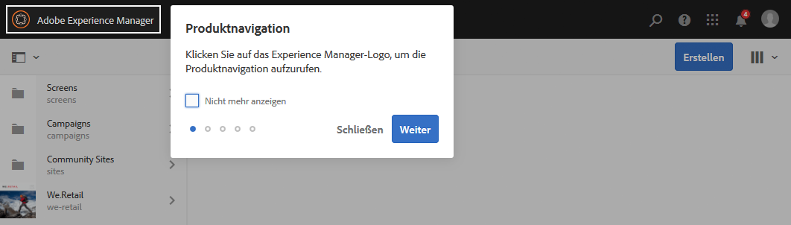

Klicken oder tippen Sie auf **Gut!**, um zur nächsten Seite der Übersicht zu gelangen. Klicken oder tippen Sie auf **Schließen** oder klicken oder tippen Sie außerhalb des Übersichtsdialogfelds, um das Dialogfeld zu schließen.

Die Übersicht wird bei Ihrem nächsten Zugriff auf eine Konsole wieder gestartet, sofern Sie nicht die Option **Nicht mehr zeigen** aktivieren.

## Globale Navigation {#global-navigation}

Sie können mithilfe des globalen Navigationsfensters zwischen den Konsolen navigieren. Dieses Navigationsfenster wird als Vollbild-Dropdown angezeigt, wenn Sie auf den AEM-Link in der oberen linken Bildschirmecke klicken oder tippen.

Sie können das globale Navigationsfenster schließen, indem Sie auf **Schließen** klicken oder tippen. Sie kehren dann zu Ihrer vorherigen Position zurück.

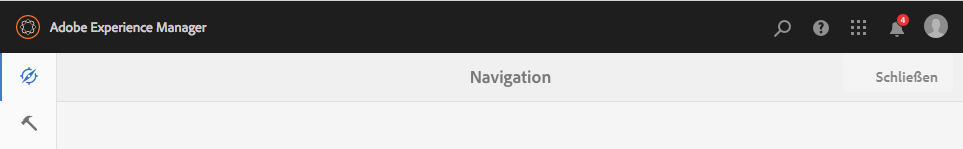

>[!NOTE]
>
>Bei Ihrer ersten Anmeldung wird das **Navigationsfenster** geöffnet.

Die globale Navigation verfügt über zwei Fenster, die am linken Bildschirmrand durch Symbole dargestellt werden:

* **Navigation** – dargestellt durch einen Kompass 
* **Tools** – dargestellt durch einen Hammer

Die in diesen Fenstern verfügbaren Optionen werden im Folgenden beschrieben.

1. Das Navigationsfenster:

   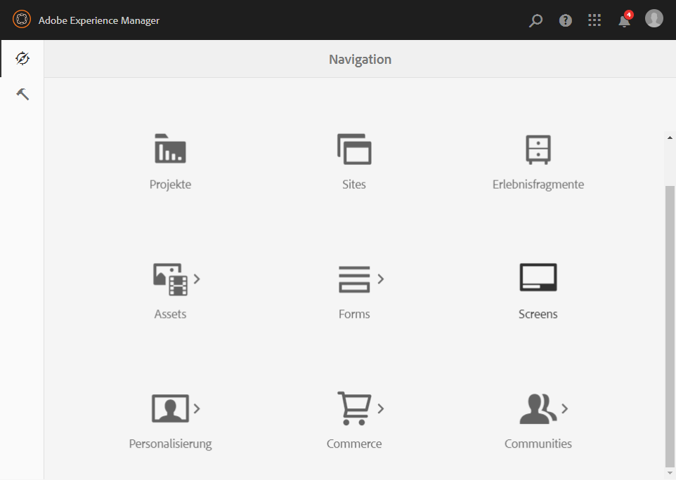

   Im Navigationsfenster stehen folgende Konsolen zur Verfügung:

<table> 
 <tbody>
  <tr>
   <td><strong>Konsole</strong></td> 
   <td><strong>Zweck</strong></td> 
  </tr>
  <tr>
   <td>Assets  </td> 
   <td>In diesen Konsolen können Sie digitale Assets, wie Bilder, Videos, Dokumente und Audiodateien, importieren und <a href="/help/assets/assets.md">verwalten</a>. Diese Assets können dann von jeder Website verwendet werden, die auf derselben AEM-Instanz ausgeführt wird. </td> 
  </tr>
  <tr>
   <td>Communities</td> 
   <td>In dieser Konsole können Sie <a href="/help/communities/sites-console.md">Community-Sites</a> für die <a href="/help/communities/overview.md#engagement-community">Interaktion</a> und <a href="/help/communities/overview.md#enablement-community">Aktivierung</a> erstellen und verwalten.</td> 
  </tr>
  <tr>
   <td>Commerce</td> 
   <td>Damit können Sie Produkte, Produktkataloge und Bestellungen verwalten, die im Zusammenhang mit Ihren <a href="/help/sites-administering/ecommerce.md">Commerce</a>-Websites stehen.</td> 
  </tr>
  <tr>
   <td>Experience Fragments</td> 
   <td>Bei einem <a href="/help/sites-authoring/experience-fragments.md">Experience Fragment</a> handelt es sich um ein einzelnes Erlebnis, das kanalübergreifend wiederverwendet werden kann und Variationen aufweist. So erübrigt sich das wiederholte Kopieren und Einfügen von Erlebnissen oder Teilen von Erlebnissen.</td> 
  </tr>
  <tr>
   <td>Formulare</td> 
   <td>In dieser Konsole können Sie Ihre <a href="/help/forms/using/introduction-aem-forms.md">Formulare und Dokumente</a>&gt;.</td> 
  </tr>
  <tr>
   <td>Personalisierung</td> 
   <td>Diese Konsole bietet ein <a href="/help/sites-authoring/personalization.md">Framework aus Tools für die Bearbeitung von Inhalt für eine bestimmte Zielgruppe und die Darstellung personalisierter Erlebnisse</a>.</td> 
  </tr>
  <tr>
   <td>Projekte</td> 
   <td>Über die <a href="/help/sites-authoring/touch-ui-managing-projects.md">Konsole „Projekte“ können Sie direkt auf Ihre Projekte zugreifen</a>. Projekte sind virtuelle Dashboards. Sie können sie verwenden, um ein Team zusammenzustellen, diesem Team Zugriff auf Ressourcen, Workflows und Aufgaben zu erteilen und Personen so die Möglichkeit zu geben, gemeinsam an einem Ziel zu arbeiten.   </td> 
  </tr>
  <tr>
   <td>Sites</td> 
   <td>Mit der Konsole „Sites“ können Sie <a href="/help/sites-authoring/author-environment-tools.md">Websites erstellen, anzeigen und verwalten</a>, die auf Ihrer AEM-Instanz ausgeführt werden. Mithilfe dieser Konsolen können Sie Seiten auf der Website erstellen, bearbeiten, kopieren, verschieben, löschen und veröffentlichen.  </td> 
  </tr>
 </tbody>
</table>

1. Im Werkzeugfenster besitzt jede Option im Seitenbereich mehrere Untermenüs. Die hier verfügbaren [Tools-Konsolen](/help/sites-administering/tools-consoles.md) bieten Zugriff auf mehrere spezielle Tools und Konsolen, die Ihnen bei der Verwaltung Ihrer Websites, Ihrer digitalen Assets und anderer Aspekten Ihres Inhalts-Repositorys helfen.

   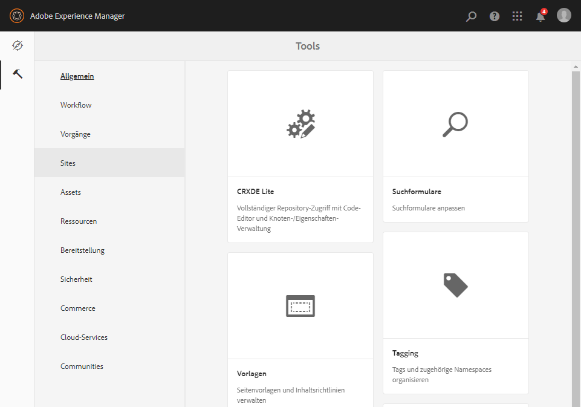

## Die Kopfzeile {#the-header}

Die Kopfzeile befindet sich immer am oberen Rand der Bildschirmseite. Die meisten Optionen in der Kopfzeile bleiben unabhängig von Ihrer Position im System gleich, manche sind aber kontextspezifisch.

* [Globale Navigation](#global-navigation)

   Wählen Sie den Link **Adobe Experience Manager** aus, um zwischen Konsolen zu navigieren.

   

* [Suchen](/help/sites-authoring/search.md)

   

   Sie können auch den [Tastaturbefehl](/help/sites-authoring/keyboard-shortcuts.md) `/` (Schrägstrich) verwenden, um von jeder beliebigen Konsole aus die Suche zu starten.

* [Hilfe](#accessing-help)

   

* [Marketing Cloud-Lösungen](https://www.adobe.com/marketing-cloud.html)

   

* [Benachrichtigungen](/help/sites-authoring/inbox.md)

   

   Dieses Symbol wird mit der Anzahl der aktuell zugewiesenen unvollständigen Benachrichtigungen gekennzeichnet.

   >[!NOTE]
   >
   >AEM enthält vorab installierte Verwaltungsaufgaben, die für die Benutzergruppe der Administratoren bestimmt sind. Weitere Informationen finden Sie unter [Ihr Posteingang – Standardmäßige Verwaltungsaufgaben](/help/sites-authoring/inbox.md#out-of-the-box-administrative-tasks).

* [Benutzereigenschaften](/help/sites-authoring/user-properties.md)

   

* [Schienenauswahl](/help/sites-authoring/basic-handling.md#rail-selector)

   

   Die angezeigten Optionen hängen von der jeweiligen Konsole ab. So können Sie z. B. in **Sites** nur Inhalt (Standard), die Zeitleiste, Verweise oder das seitliche Bedienfeld „Filter“ auswählen.

   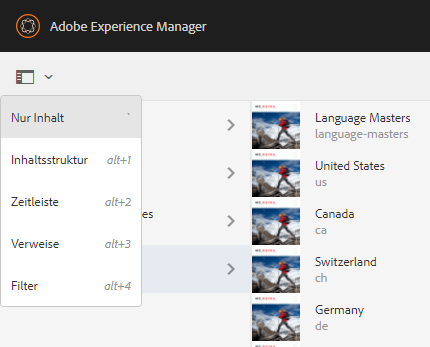

* Breadcrumbs

   

   Breadcrumbs befinden sich immer in der Mitte der Leiste und zeigen die Beschreibung des aktuell ausgewählten Elements an. Sie ermöglichen Ihnen damit die Navigation innerhalb einer bestimmten Konsole. In der Sites-Konsole können Sie damit durch die Ebenen Ihrer Website navigieren.

   Klicken Sie einfach auf den Breadcrumb-Text, um eine Dropdown-Liste mit den Hierarchieebenen des aktuell ausgewählten Elements anzuzeigen. Klicken Sie auf einen Eintrag, um zu dieser Position zu gelangen.

   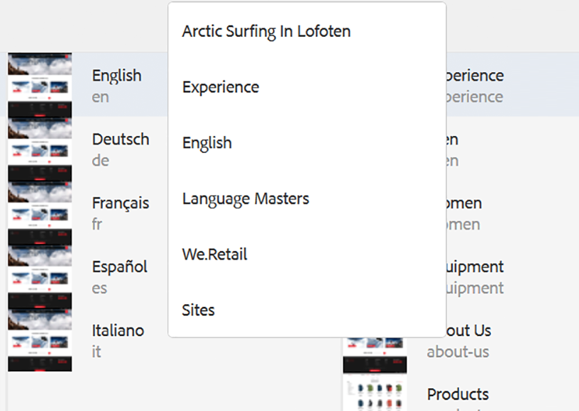

* Auswahl des Analysezeitraums

   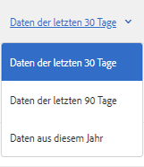

   Diese Option ist nur in der Listenansicht verfügbar. Weitere Informationen dazu finden Sie unter [Listenansicht](#list-view).

* Schaltfläche **Erstellen**

   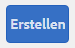

   Wird hierauf geklickt, entsprechen die angezeigten Optionen der Konsole/dem Kontext.

* [Ansichten](/help/sites-authoring/basic-handling.md#viewing-and-selecting-resources)

   

   Sie können zwischen Spaltenansicht, Kartenansicht, Listenansicht und den Ansichtseinstellungen wechseln.

   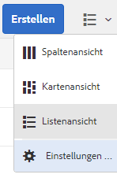

## Aufrufen der Hilfe {#accessing-help}

Ihnen stehen verschiedene Hilferessourcen zur Verfügung:

* **Konsolensymbolleiste**

   Durch Auswahl des Symbols **Hilfe** werden abhängig von Ihrer Position die geeigneten Ressourcen geöffnet:

   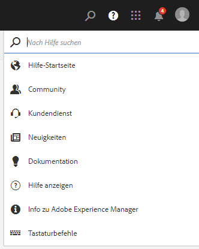

* **Navigation**

   Beim erstmaligen Navigieren im System [wird die AEM-Navigation über eine Reihe von Folien vorgestellt](/help/sites-authoring/basic-handling.md#product-navigation).

* **Seiten-Editor**

   Wenn Sie zum ersten Mal eine Seite bearbeiten, wird der Seiten-Editor durch eine Reihe von Folien vorgestellt.

   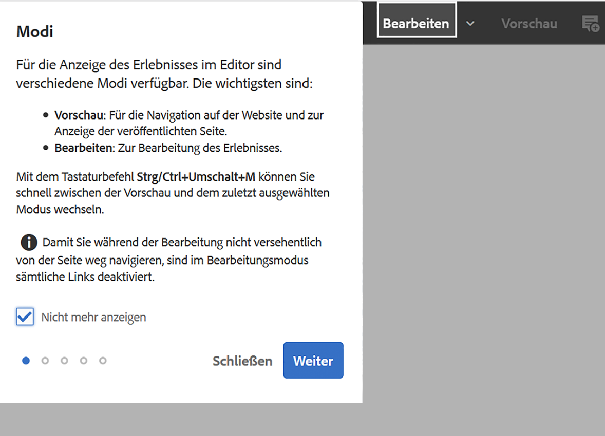

   Navigieren Sie in diesem Überblick wie im [Überblick zur Produktnavigation](/help/sites-authoring/basic-handling.md#product-navigation) beim erstmaligen Öffnen einer Konsole.

   Im Menü [**Seiteninformationen** können Sie die Option **Hilfe**](/help/sites-authoring/author-environment-tools.md#accessing-help) auswählen, um diese Folien jederzeit erneut anzuzeigen.

* **Tools-Konsole**

   Mit der **Tools-Konsole** können Sie auch die externen **Ressourcen** aufrufen:

   * **Dokumentation**
Dokumentation für Web Experience Management anzeigen

   * **Entwicklungsressourcen**
Entwicklungsressourcen und Downloads
   >[!NOTE]
   >
   >Sie können jederzeit über den Hotkey `?` (Fragezeichen) in einer Konsole auf eine Übersicht der verfügbaren Tastaturbefehle zugreifen.
   >
   >Eine Aufstellung aller Tastaturbefehle finden Sie in den folgenden Dokumenten:
   >
   >* [Tastaturbefehle für die Seitenbearbeitung](/help/sites-authoring/page-authoring-keyboard-shortcuts.md)
   >* [Tastaturbefehle für Konsolen](/help/sites-authoring/keyboard-shortcuts.md)

## Aktionssymbolleiste {#actions-toolbar}

Bei der Auswahl einer Ressource (z. B. einer Seite oder eines Assets) werden in der Symbolleiste verschiedene durch Symbole und Text gekennzeichnete Aktionen angezeigt. Diese Aktionen sind abhängig von:

* der aktuellen Konsole.
* dem aktuellen Kontext.
* ob Sie sich im [Auswahlmodus](#viewing-and-selecting-resources) befinden

In der Symbolleiste werden immer nur jene Aktionen angezeigt, die Sie bei den jeweiligen Elementen durchführen können.

Wie Sie [eine Ressource auswählen](/help/sites-authoring/basic-handling.md#viewing-and-selecting-resources), hängt von der Ansicht ab.

Aufgrund des eingeschränkten Anzeigebereichs in einigen Fenstern kann die Symbolleiste schnell länger als der verfügbare Platz werden. In diesem Fall werden weitere Optionen angezeigt. Durch Klicken oder Tippen auf die Auslassungspunkte (drei Punkte bzw. **…**) wird eine Dropdown-Auswahl geöffnet, die alle verbleibenden Aktionen enthält. Beispiel: Sie haben eine Seite in der **Sites-Konsole** ausgewählt:

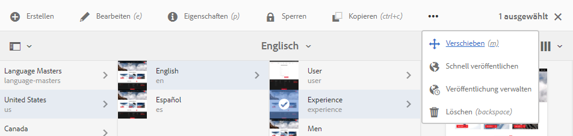

>[!NOTE]
>
>Die einzelnen verfügbaren Symbole werden gemäß der/des jeweils zutreffenden Konsole/Funktion/Szenarios dokumentiert.

## Schnellaktionen {#quick-actions}

In der [Kartenansicht](#quick-actions) sind bestimmte Aktionen sowohl als Schnellaktionssymbole als auch auf der Symbolleiste vorhanden. Schnellaktionssymbole sind für jeweils ein einzelnes Element verfügbar. Die Notwendigkeit der Vorauswahl entfällt dabei.

Die Schnellaktionen sind sichtbar, wenn Sie die Maus auf eine Ressourcenkarte bewegen (Desktopgerät). Die verfügbaren Schnellaktionen hängen von der Konsole und vom Kontext ab. Dies sind beispielsweise die Schnellaktionen für eine Seite in der **Sites-Konsole**:

## Anzeigen und Auswählen von Ressourcen {#viewing-and-selecting-resources}

Anzeige, Navigation und Auswahl sind grundsätzlich in allen Ansichten gleich. Je nach verwendeter Ansicht kommt es aber zu geringfügigen Abweichungen bei der Verwendung.

Sie können Ressourcen in jeder der verfügbaren Ansichten anzeigen, darin navigieren und sie auswählen (für weitere Aktionen). Die einzelnen Ansichten können Sie mit dem Symbol oben rechts auswählen:

* [Spaltenansicht](#column-view)
* [Kartenansicht](#card-view)

* [Listenansicht](#list-view)

>[!NOTE]
>
>Standardmäßig zeigt AEM Assets in keiner der Ansichten die ursprüngliche Ausgabedarstellung von Assets als Miniatur in der Benutzeroberfläche an. Administratoren können mithilfe von Überlagerungen AEM Assets so konfigurieren, dass ursprüngliche Ausgabedarstellungen als Miniaturen angezeigt werden.

### Auswählen von Ressourcen {#selecting-resources}

Die Auswahl einer bestimmten Ressource hängt von der Kombination der Ansicht und des Geräts ab:

<table> 
 <tbody>
  <tr>
   <td> </td> 
   <td>Auswählen</td> 
   <td>Auswahl aufheben</td> 
  </tr>
  <tr>
   <td>Spaltenansicht  </td> 
   <td>
    <ul> 
     <li>Desktop:   Klicken Sie auf die Miniatur</li> 
     <li>Mobilgerät:   Tippen Sie auf die Miniatur</li> 
    </ul> </td> 
   <td>
    <ul> 
     <li>Desktop:   Klicken Sie auf die Miniatur</li> 
     <li>Mobilgerät:   Tippen Sie auf die Miniatur</li> 
    </ul> </td> 
  </tr>
  <tr>
   <td>Kartenansicht  </td> 
   <td>
    <ul> 
     <li>Desktop:  Bewegen Sie den Mauszeiger und verwenden Sie dann die Häkchen-Schnellaktion</li> 
     <li>Mobilgerät:   Tippen und halten Sie die Karte</li> 
    </ul> </td> 
   <td>
    <ul> 
     <li>Desktop:  Klicken Sie auf die Karte</li> 
     <li>Mobilgerät:  Tippen Sie auf die Karte</li> 
    </ul> </td> 
  </tr>
  <tr>
   <td>Listenansicht</td> 
   <td>
    <ul> 
     <li>Desktop:   Klicken Sie auf die Miniatur</li> 
     <li>Mobilgerät:   Tippen Sie auf die Miniatur</li> 
    </ul> </td> 
   <td>
    <ul> 
     <li>Desktop:   Klicken Sie auf die Miniatur</li> 
     <li>Mobilgerät:   Tippen Sie auf die Miniatur</li> 
    </ul> </td> 
  </tr>
 </tbody>
</table>

#### Gesamte Auswahl aufheben {#deselecting-all}

In allen Fällen wird die Anzahl der ausgewählten Elemente in der rechten oberen Ecke der Symbolleiste angezeigt.

Sie können die Auswahl aller Elemente aufheben und den Auswahlmodus beenden, indem Sie auf das „X“ neben der Zahl klicken oder tippen.

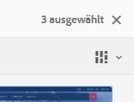

In allen Ansichten kann die Auswahl aller Elemente aufgehoben werden, indem Sie die Esc-Taste auf der Tastatur drücken, wenn Sie ein Desktop-Gerät verwenden.

#### Auswahlbeispiel {#selecting-example}

1. Beispiel für die Kartenansicht:

   

1. Nach Auswahl einer Ressource wird die obere Kopfzeile von der [Aktionssymbolleiste](#actions-toolbar) überdeckt, die Zugriff auf die Aktionen bietet, die für die ausgewählte Ressource verfügbar sind.

   Um den Auswahlmodus zu beenden, wählen Sie **X** oben rechts.

### Spaltenansicht {#column-view}

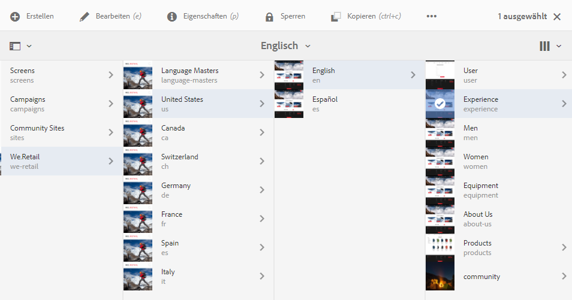

Die Spaltenansicht ermöglicht die Navigation durch einen Inhaltsbaum über mehrere untergeordnete Spalten. Mit dieser Ansicht können Sie die Baumstruktur Ihrer Website visualisieren und durchlaufen.

Durch die Auswahl einer Ressource in der Spalte ganz links werden die untergeordneten Ressourcen in einer Spalte rechts angezeigt. Wird eine Ressource in der rechten Spalte ausgewählt, werden die untergeordneten Ressourcen in einer weiteren Spalte rechts angezeigt usw.

* Sie können im Baum nach oben und unten navigieren, indem Sie auf einen Ressourcennamen oder den Pfeil rechts vom Ressourcennamen tippen oder klicken.

   * Beim Tippen bzw. Klicken werden Ressourcenname und Pfeil hervorgehoben.

   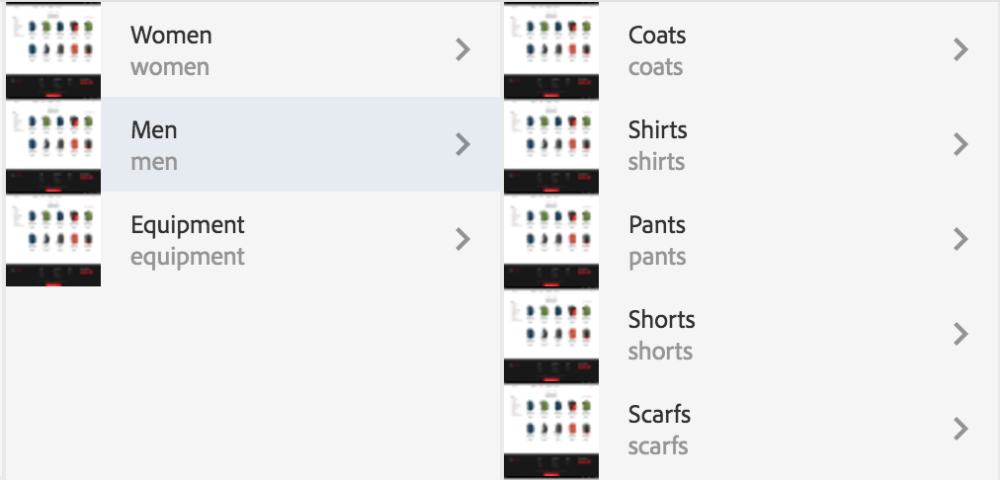

   * Die untergeordneten Elemente der ausgewählten Ressource werden in der Spalte rechts neben der Ressource angezeigt.
   * Wenn Sie auf einen Ressourcennamen tippen oder klicken, der keine untergeordneten Elemente besitzt, werden die Ressourcendetails in der letzten Spalte angezeigt.

* Durch Tippen oder Klicken auf die Miniatur wird die Ressource ausgewählt.

   * Dann erscheint ein Häkchen auf der Miniaturansicht und der Ressourcenname wird hervorgehoben dargestellt.
   * Die Details der ausgewählten Ressource werden in der letzten Spalte angezeigt.

   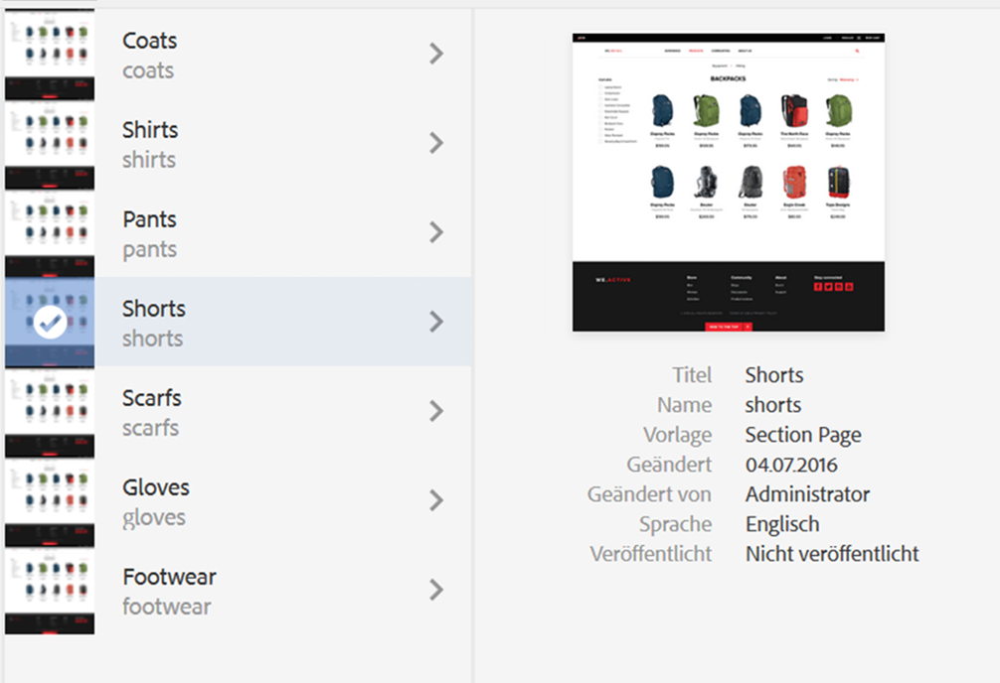

   Wenn eine Seite in der Spaltenansicht ausgewählt wird, wird sie zusammen mit den folgenden Details in der letzten Spalte angezeigt:

   * Seitentitel
   * Seitenname (Teil der URL der Seite)
   * Vorlage, auf der die Seite basiert
   * Datum der letzten Änderung
   * Letzter Benutzer, der die Seite geändert hat
   * Sprache der Seite
   * Veröffentlichungsstatus

### Kartenansicht {#card-view}

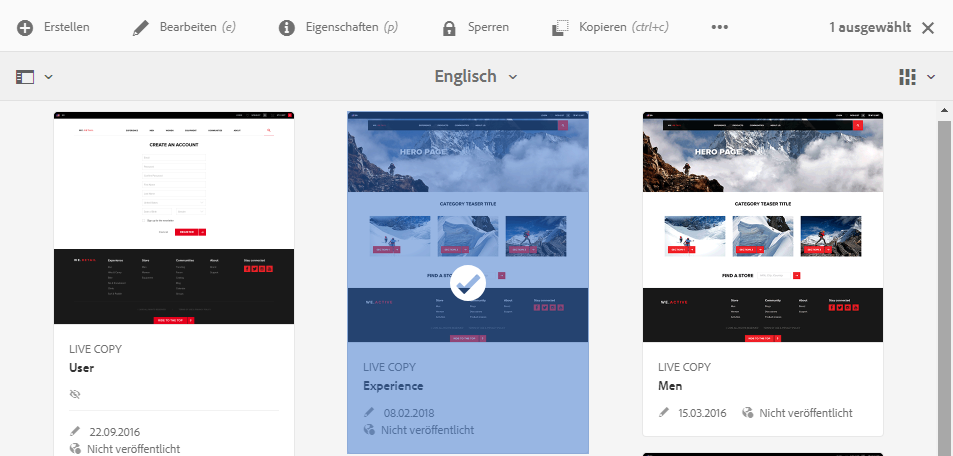

* In der Kartenansicht werden Informationskarten für jedes Element auf der aktuellen Ebene angezeigt. Diese bieten u. a. folgende Informationen:

   * eine visuelle Darstellung des Seiteninhalts
   * den Seitentitel
   * wichtige Daten (z. B. zuletzt bearbeitet, zuletzt veröffentlicht)
   * ob die Seite gesperrt, ausgeblendet oder Teil einer Live Copy ist
   * wann Sie im Zuge eines Workflows eine Aktion ausführen müssen (sofern zutreffend)

      * Markierungen, die auf erforderliche Aktionen hinweisen, können mit Einträgen in Ihrem [Posteingang](/help/sites-authoring/inbox.md) verknüpft werden.

* In dieser Ansicht sind auch [Schnellaktionen](#quick-actions) sowie die Auswahlfunktion und allgemeine Aktionen wie „Bearbeiten“ verfügbar.

   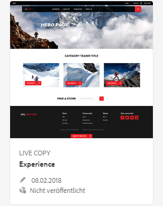

* Sie können in der Struktur nach unten navigieren, indem Sie auf die Karten tippen/klicken (vermeiden Sie dabei die Schnellaktionen), und über die [Breadcrumbs in der Kopfzeile](/help/sites-authoring/basic-handling.md#the-header) wieder nach oben navigieren.

### Listenansicht {#list-view}

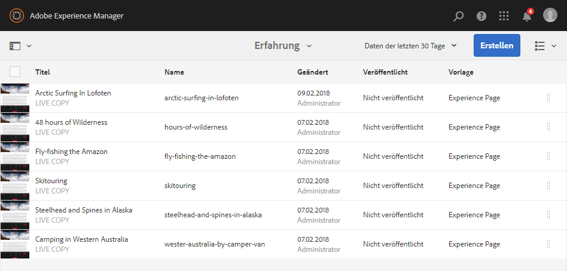

* In der Listenansicht werden Informationen für jede Ressource auf der aktuellen Ebene aufgelistet.
* Sie können in der Struktur nach unten navigieren, indem Sie auf den Ressourcennamen tippen/klicken, und über die [Breadcrumbs in der Kopfzeile](/help/sites-authoring/basic-handling.md#the-header) wieder nach oben navigieren.

* Um alle Elemente in der Liste auszuwählen, verwenden Sie das Kontrollkästchen links oben in der Liste.

   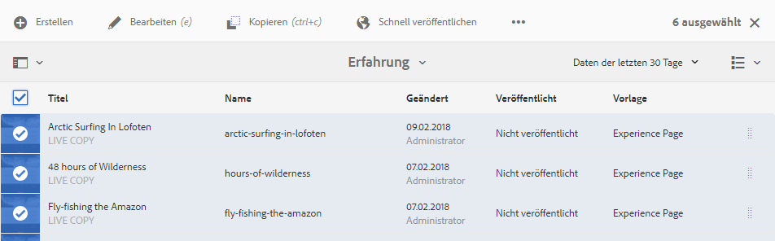

   * Wenn alle Elemente in der Liste ausgewählt wurden, ist dieses Kontrollkästchen aktiviert.

      * Klicken bzw. tippen Sie auf das Kontrollkästchen, um die Auswahl wieder aufzuheben.
   * Wurden nur einige Elemente ausgewählt, wird es mit einem Minuszeichen dargestellt.

      * Klicken bzw. tippen Sie auf das Kontrollkästchen, um alle auszuwählen.
      * Durch abermaliges Klicken oder Tippen auf das Kontrollkästchen heben Sie die Auswahl wieder auf.

* Wählen Sie die anzuzeigenden Spalten mit der Option &quot;Anzeigeeinstellungen&quot;unter der Schaltfläche &quot;Ansichten&quot;aus. Die folgenden Spalten können angezeigt werden:

   * **Name** – Seitenname, der in einer mehrsprachigen Autorenumgebung nützlich sein kann, da er Teil der Seiten-URL ist und unabhängig von der Sprache gleich bleibt
   * **Geändert** – Datum der letzten Änderung und der Benutzer, der die Änderung vorgenommen hat
   * **Veröffentlicht** – Veröffentlichungsstatus
   * **Vorlage** – Vorlage, auf der die Seite basiert
   * **Seitenanalyse**
   * **Individuelle Besucher**
   * **Zeit auf Seite**

   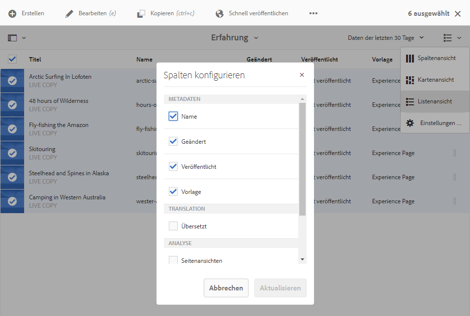

   Standardmäßig wird die Spalte **Name** angezeigt, die Teil der URL der Seite ist. Unter Umständen muss der Autor auf Seiten zugreifen, die in einer anderen Sprache verfasst sind. In diesem Fall ist die Anzeige des Seitennamens (der sich normalerweise nicht ändert) äußerst hilfreich, wenn der Autor die Sprache der Seite nicht kennt.

* Ändern Sie die Reihenfolge der Elemente mithilfe des vertikalen gepunkteten Balkens am rechten Rand jedes Elements.

>[!NOTE]
>
>Das Ändern der Reihenfolge funktioniert nur innerhalb eines sortierten Ordners, der den Wert `jcr:primaryType` als `sling:OrderedFolder` hat.

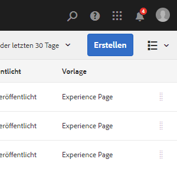

Klicken oder tippen Sie auf die vertikale Auswahlleiste und ziehen Sie das Element an die gewünschte Position in der Liste.

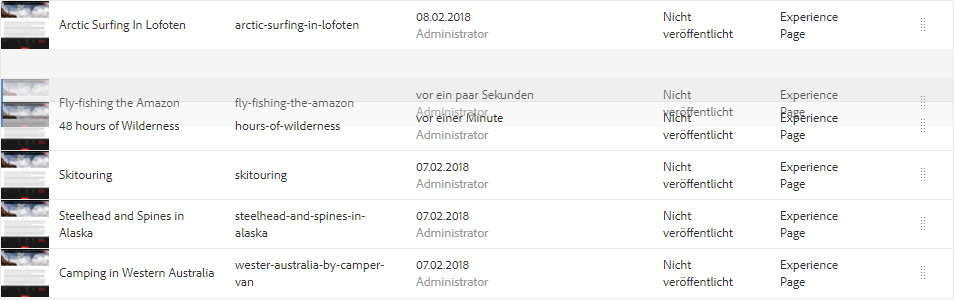

* Sie können Analysedaten anzeigen, indem Sie die entsprechenden Spalten mithilfe des Dialogfelds „Ansichtseinstellungen“ anzeigen.

   Zum Filtern der Analysedaten stehen Ihnen rechts neben der Kopfzeile Optionen für die letzten 30, 90 oder 365 Tage zur Verfügung.

   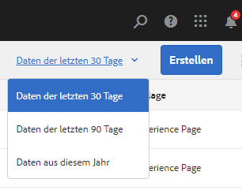

## Schienenauswahl {#rail-selector}

Die **Schienenauswahl** befindet sich im Fenster oben links. Je nach Konsole stehen unterschiedliche Optionen zur Verfügung.

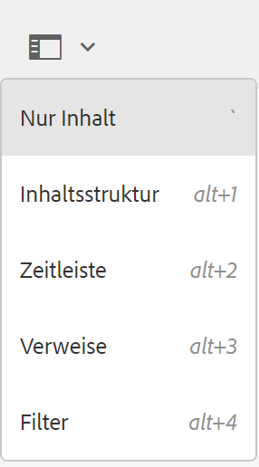

So können Sie z. B. in Sites nur Inhalt (Standard), die Inhaltsstruktur, die Zeitleiste, Verweise oder das seitliche Bedienfeld „Filter“ auswählen.

Wenn „Nur Inhalt“ ausgewählt ist, wird lediglich das Schienensymbol angezeigt. Bei Auswahl einer anderen Option wird der Optionsname neben dem Schienensymbol angezeigt.

>[!NOTE]
>
>[Tastaturbefehle](/help/sites-authoring/keyboard-shortcuts.md) sind verfügbar, um schnell zwischen Optionen zur Schienenanzeige wechseln zu können.

### Inhaltsstruktur {#content-tree}

Über die Inhaltsstruktur können Benutzer im seitlichen Bedienfeld schnell in der Website-Hierarchie navigieren und eine Vielzahl von Informationen zu den Seiten im aktuellen Ordner anzeigen.

Mit dem seitlichen Bedienfeld der Inhaltsstruktur und einer Listen- oder Kartenansicht können Benutzer die hierarchische Struktur von Projekten problemlos einsehen. Außerdem können sie mit dem seitlichen Bedienfeld der Inhaltsstruktur in der gesamten Inhaltsstruktur navigieren sowie ausführliche Seiteninformationen in der Listenansicht aufrufen.

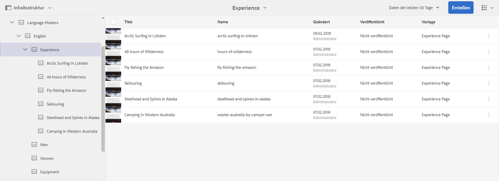

>[!NOTE]
>
>Sobald ein Eintrag in der Hierarchieansicht ausgewählt wurde, kann mit den Pfeiltasten schnell in der Hierarchie navigiert werden.
>
>Weitere Informationen finden Sie unter [Tastaturbefehle](/help/sites-authoring/keyboard-shortcuts.md).

### Zeitleiste {#timeline}

Die Zeitleiste kann zur Anzeige und/oder Einleitung von Ereignissen in Verbindung mit der ausgewählten Ressource verwendet werden. So öffnen Sie die Zeitleistenspalte mithilfe der Schienenauswahl:

Die Zeitleistenspalte bietet folgende Möglichkeiten:

* Anzeigen verschiedener Ereignisse im Zusammenhang mit einem ausgewählten Element

   * Sie können die Ereignistypen in der Dropdown-Liste auswählen:

      * [Kommentare](#TimelineAddingandViewingComments)
      * Anmerkungen
      * Aktivitäten
      * [Launches](/help/sites-authoring/launches.md)
      * [Versionen](/help/sites-authoring/working-with-page-versions.md)
      * [Workflows](/help/sites-authoring/workflows-applying.md)

         * mit Ausnahme von [Übergangs-Workflows](/help/sites-developing/workflows.md#transient-workflows), da keine Verlaufsinformationen für diese gespeichert werden
      * Alle anzeigen

* [Hinzufügen/Anzeigen von Kommentaren zum gewählten Element ](#TimelineAddingandViewingComments) Das Feld **Kommentare** wird unten in der Ereignisliste angezeigt. Wenn Sie einen Kommentar eingeben (und anschließend die Eingabetaste drücken), wird der Kommentar registriert. Er wird angezeigt, wenn **Kommentare** oder **Alle anzeigen** ausgewählt wird.

* Einige Konsolen weisen weitere Funktionalitäten auf. So können Sie z. B. in der Sites-Konsole

   * [eine Version speichern](/help/sites-authoring/working-with-page-versions.md).
   * [einen Workflow starten](/help/sites-authoring/workflows-applying.md).

Diese Optionen sind über den Pfeil neben dem **Kommentarfeld** aufrufbar.

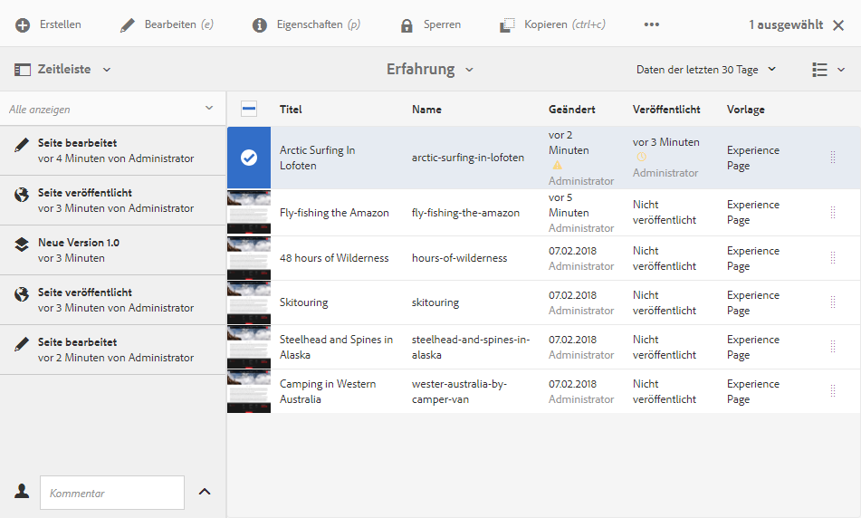

### Verweise {#references}

**Verweise** zeigen sämtliche Verbindungen zur ausgewählten Ressource. Beispiel: In der **Sites-Konsole** wird in den [Verweisen](/help/sites-authoring/author-environment-tools.md#references) für Seiten Folgendes angezeigt:

* [Starts](/help/sites-authoring/launches.md#launches-in-references-sites-console)
* [Live Copies](/help/sites-administering/msm-livecopy-overview.md)
* [Sprachkopien](/help/sites-administering/tc-prep.md#seeing-the-status-of-language-roots)
* Inhaltsverweise (z. B. von der Verweiskomponente geliehener bzw. verliehener Inhalt)

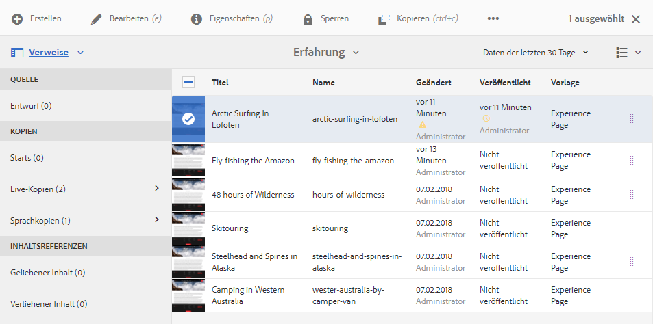

### Filter {#filter}

Hierdurch wird ein dem [Suchbereich](/help/sites-authoring/search.md) ähnliches Fenster mit bereits entsprechend eingestellten Ortsfiltern geöffnet. So können Sie den für die Anzeige gewünschten Inhalt weiter filtern.

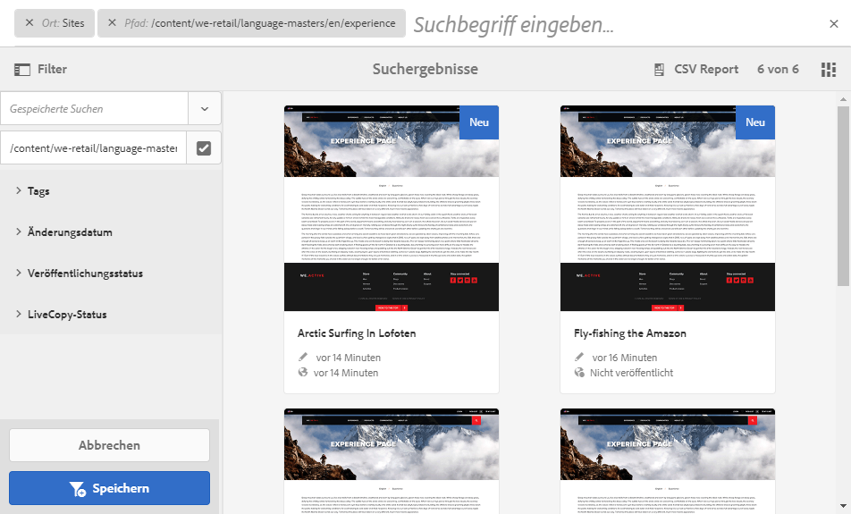
