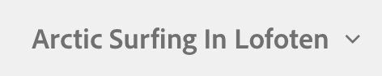

# Grundlegende Handhabung {#basic-handling}

>[!CAUTION]
>
>AEM 6.4 hat das Ende der erweiterten Unterstützung erreicht und diese Dokumentation wird nicht mehr aktualisiert. Weitere Informationen finden Sie in unserer [technische Unterstützung](https://helpx.adobe.com/de/support/programs/eol-matrix.html). Unterstützte Versionen suchen [here](https://experienceleague.adobe.com/docs/?lang=de).

>[!NOTE]
>
>* Auf dieser Seite erhalten Sie einen Überblick über die grundlegende Handhabung der AEM Autorenumgebung. Als Grundlage wird die **Sites-Konsole** verwendet.
>
>* Einige Funktionen stehen nicht in allen Konsolen zur Verfügung und in einigen Konsolen können zusätzliche Funktionen zur Verfügung stehen. Spezifische Informationen zu den einzelnen Konsolen und den zugehörigen Funktionen werden auf anderen Seiten ausführlicher behandelt.
>* In AEM stehen verschiedene Tastaturbefehle zur Verfügung, insbesondere bei [der Verwendung von Konsolen](/help/sites-authoring/keyboard-shortcuts.md) und [der Bearbeitung von Seiten](/help/sites-authoring/page-authoring-keyboard-shortcuts.md).
>

## Erste Schritte {#getting-started}

### Touch-optimierte Benutzeroberfläche {#a-touch-enabled-ui}

AEM Benutzeroberfläche wurde für Touch aktiviert. Eine Touch-optimierte Benutzeroberfläche ermöglicht es Ihnen, mithilfe von Berührungen – Tippen, Berühren und Halten sowie Wischen – mit der Software zu interagieren. Dies steht im Gegensatz dazu, wie eine herkömmliche Desktop-Oberfläche mit Mausaktionen wie Klick, Doppelklick, Rechtsklick und Mauszeiger funktioniert. Da nur Gesten erforderlich sind, ist die Touch-optimierte Benutzeroberfläche auf mobilen Tablet-Geräten voll funktionsfähig und verfügt auch auf dem Desktop über die volle Funktionalität.

### Erste Schritte {#first-steps}

Unmittelbar nach der Anmeldung gelangen Sie zum [Navigationsfenster](/help/sites-authoring/basic-handling.md#global-navigation). Dies wird im folgenden Abschnitt ausführlicher erläutert.

Wenn Sie auf eine der Optionen klicken, wird die entsprechende Konsole geöffnet. Damit Sie ein gutes Verständnis der grundlegenden Funktionen in AEM erhalten, wurde für dieses Dokument die **Sites-Konsole** herangezogen.

Klicken bzw. tippen Sie auf **Sites**, um zu beginnen.

### Produktnavigation {#product-navigation}

Wenn ein Benutzer zum ersten Mal auf eine Konsole zugreift, wird ein Tutorial zur Produktnavigation gestartet. Nehmen Sie sich eine Minute Zeit, um zu klicken oder zu tippen, um einen guten Überblick über die grundlegende Handhabung von AEM zu erhalten.

Klicken oder tippen Sie auf **Gut!** um zur nächsten Seite der Übersicht zu gelangen. Klicken oder tippen Sie auf **Schließen** oder klicken oder tippen Sie außerhalb des Übersichtsdialogfelds, um das Dialogfeld zu schließen.

Die Übersicht wird beim nächsten Zugriff auf eine Konsole neu gestartet, es sei denn, Sie aktivieren die Option **Erneut anzeigen**.

## Globale Navigation {#global-navigation}

Sie können mithilfe des globalen Navigationsfensters zwischen den Konsolen navigieren. Dies wird als Vollbild-Dropdown-Liste ausgelöst, wenn Sie auf den Link Adobe Experience Manager oben links im Bildschirm klicken oder tippen.

Sie können das globale Navigationsfenster schließen, indem Sie auf **Schließen** klicken oder tippen. Sie kehren dann zu Ihrer vorherigen Position zurück.

>[!NOTE]
>
>Bei der ersten Anmeldung haben Sie die **Navigation** Bereich.

Die globale Navigation verfügt über zwei Fenster, die am linken Bildschirmrand durch Symbole dargestellt werden:

* **Navigation** – dargestellt durch einen Kompass 
* **Instrumente** - dargestellt durch einen Hammer

Die in diesen Bedienfeldern verfügbaren Optionen werden unten beschrieben.

1. Das Navigationsfenster:

   

   Im Navigationsfenster stehen folgende Konsolen zur Verfügung:

<table> 
 <tbody>
  <tr>
   <td><strong>Konsole</strong></td> 
   <td><strong>Zweck</strong></td> 
  </tr>
  <tr>
   <td>Assets  </td> 
   <td>In diesen Konsolen können Sie digitale Assets, wie Bilder, Videos, Dokumente und Audiodateien, importieren und <a href="/help/assets/assets.md">verwalten</a>. Diese Assets können dann von jeder Website verwendet werden, die auf derselben AEM-Instanz ausgeführt wird. </td> 
  </tr>
  <tr>
   <td>Communities</td> 
   <td>In dieser Konsole können Sie <a href="/help/communities/sites-console.md">Community-Sites</a> für <a href="/help/communities/overview.md#engagement-community">Interaktion</a> und <a href="/help/communities/overview.md#enablement-community">Aktivierung</a>.</td> 
  </tr>
  <tr>
   <td>Commerce</td> 
   <td>Damit können Sie Produkte, Produktkataloge und Bestellungen verwalten, die mit Ihrer <a href="/help/sites-administering/ecommerce.md">Handel</a> Sites.</td> 
  </tr>
  <tr>
   <td>Experience Fragments</td> 
   <td>Ein <a href="/help/sites-authoring/experience-fragments.md">Experience Fragment</a> ist ein eigenständiges Erlebnis, das kanalübergreifend wiederverwendet werden kann und Varianten aufweist. So erübrigt sich das wiederholte Kopieren und Einfügen von Erlebnissen oder Teilen von Erlebnissen.</td> 
  </tr>
  <tr>
   <td>Formulare</td> 
   <td>In dieser Konsole können Sie Ihre <a href="/help/forms/using/introduction-aem-forms.md">Formulare und Dokumente</a>&gt;.</td> 
  </tr>
  <tr>
   <td>Personalisierung</td> 
   <td>Diese Konsole bietet eine <a href="/help/sites-authoring/personalization.md">Framework von Tools für die Erstellung von zielgerichteten Inhalten und die Präsentation personalisierter Erlebnisse</a>.</td> 
  </tr>
  <tr>
   <td>Projekte</td> 
   <td>Die <a href="/help/sites-authoring/touch-ui-managing-projects.md">Über die Projektekonsole erhalten Sie direkten Zugriff auf Ihre Projekte</a>. Projekte sind virtuelle Dashboards. Sie können sie verwenden, um ein Team zusammenzustellen, diesem Team Zugriff auf Ressourcen, Workflows und Aufgaben zu erteilen und Personen so die Möglichkeit zu geben, gemeinsam an einem Ziel zu arbeiten.   </td> 
  </tr>
  <tr>
   <td>Sites</td> 
   <td>Mit der Konsole Sites können Sie <a href="/help/sites-authoring/author-environment-tools.md">Websites erstellen, anzeigen und verwalten</a> auf Ihrer AEM Instanz ausgeführt werden. In diesen Konsolen können Sie Website-Seiten erstellen, bearbeiten, kopieren, verschieben und löschen, Workflows starten und Seiten veröffentlichen.  </td> 
  </tr>
 </tbody>
</table>

1. Im Bedienfeld &quot;Tools&quot;enthält jede Option im seitlichen Bedienfeld einen Bereich von Untermenüs. Die [Tools-Konsolen](/help/sites-administering/tools-consoles.md) können Sie hier auf eine Reihe spezialisierter Tools und Konsolen zugreifen, mit denen Sie Ihre Websites, digitalen Assets und andere Bereiche Ihres Inhalts-Repositorys verwalten können.

   

## Die Kopfzeile {#the-header}

Die Kopfzeile befindet sich immer oben im Bildschirm. Während die meisten Optionen in der Kopfzeile unabhängig davon, wo Sie sich im System befinden, gleich bleiben, sind einige kontextspezifisch.

* [Globale Navigation](#global-navigation)

   Wählen Sie den Link **Adobe Experience Manager** aus, um zwischen Konsolen zu navigieren.

   

* [Suchen](/help/sites-authoring/search.md)

   

   Sie können auch den [Tastaturbefehl](/help/sites-authoring/keyboard-shortcuts.md) `/` (Schrägstrich) verwenden, um von jeder beliebigen Konsole aus die Suche zu starten.

* [Hilfe](#accessing-help)

   

* [Marketing Cloud Solutions](https://www.adobe.com/marketing-cloud.html)

   

* [Benachrichtigungen](/help/sites-authoring/inbox.md)

   

   Dieses Symbol wird mit der Anzahl der aktuell zugewiesenen unvollständigen Benachrichtigungen gekennzeichnet.

   >[!NOTE]
   >
   >Vordefinierte AEM enthalten vordefinierte Aufgaben, die der Administrator-Benutzergruppe zugewiesen sind. Siehe [Ihr Posteingang - Vordefinierte Verwaltungsaufgaben](/help/sites-authoring/inbox.md#out-of-the-box-administrative-tasks) für Details.

* [Benutzereigenschaften](/help/sites-authoring/user-properties.md)

   

* [Schienenauswahl](/help/sites-authoring/basic-handling.md#rail-selector)

   

   Die angezeigten Optionen hängen von der jeweiligen Konsole ab. So können Sie z. B. in **Sites** nur Inhalt (Standard), die Zeitleiste, Verweise oder das seitliche Bedienfeld „Filter“ auswählen.

   

* Breadcrumbs

   

   Breadcrumbs befinden sich immer in der Mitte der Leiste und zeigen die Beschreibung des aktuell ausgewählten Elements an. Sie ermöglichen Ihnen damit die Navigation innerhalb einer bestimmten Konsole. In der Sites-Konsole können Sie damit durch die Ebenen Ihrer Website navigieren.

   Klicken Sie einfach auf den Breadcrumb-Text, um eine Dropdown-Liste mit den Hierarchieebenen des aktuell ausgewählten Elements anzuzeigen. Klicken Sie auf einen Eintrag, um zu diesem Ort zu springen.

   

* Auswahl des Analysezeitraums

   

   Diese Option ist nur in der Listenansicht verfügbar. Weitere Informationen dazu finden Sie unter [Listenansicht](#list-view).

* Schaltfläche **Erstellen**

   

   Wird hierauf geklickt, entsprechen die angezeigten Optionen der Konsole/dem Kontext.

* [Ansichten](/help/sites-authoring/basic-handling.md#viewing-and-selecting-resources)

   

   Sie können zwischen Spaltenansicht, Kartenansicht, Listenansicht und den Ansichtseinstellungen wechseln.

   

## Aufrufen der Hilfe {#accessing-help}

Ihnen stehen verschiedene Hilferessourcen zur Verfügung:

* **Konsolensymbolleiste**

   Je nach Standort **Hilfe** -Symbol öffnet die entsprechenden Ressourcen:

   

* **Navigation**

   Beim erstmaligen Navigieren im System [wird die AEM-Navigation über eine Reihe von Folien vorgestellt](/help/sites-authoring/basic-handling.md#product-navigation).

* **Seiten-Editor**

   Wenn Sie zum ersten Mal eine Seite bearbeiten, wird der Seiten-Editor durch eine Reihe von Folien vorgestellt.

   

   Navigieren Sie in diesem Überblick wie im [Überblick zur Produktnavigation](/help/sites-authoring/basic-handling.md#product-navigation) beim erstmaligen Öffnen einer Konsole.

   Im Menü [**Seiteninformationen** können Sie die Option **Hilfe**](/help/sites-authoring/author-environment-tools.md#accessing-help) auswählen, um diese Folien jederzeit erneut anzuzeigen.

* **Tools-Konsole**

   Aus dem **Instrumente** -Konsole können Sie auch auf die externe **Ressourcen**:

   * **Dokumentation**
Dokumentation für Web Experience Management anzeigen

   * **Entwicklungsressourcen**
Entwicklungsressourcen und Downloads
   >[!NOTE]
   >
   >Sie können jederzeit über den Hotkey `?` (Fragezeichen) in einer Konsole auf eine Übersicht der verfügbaren Tastaturbefehle zugreifen.
   >
   >Eine Aufstellung aller Tastaturbefehle finden Sie in den folgenden Dokumenten:
   >
   >* [Tastaturbefehle für die Seitenbearbeitung](/help/sites-authoring/page-authoring-keyboard-shortcuts.md)
   >* [Tastaturbefehle für Konsolen](/help/sites-authoring/keyboard-shortcuts.md)

## Aktionssymbolleiste {#actions-toolbar}

Bei der Auswahl einer Ressource (z. B. einer Seite oder eines Assets) werden in der Symbolleiste verschiedene durch Symbole und Text gekennzeichnete Aktionen angezeigt. Diese Aktionen sind abhängig von:

* der aktuellen Konsole.
* dem aktuellen Kontext.
* Ob Sie [Auswahlmodus](#viewing-and-selecting-resources).

In der Symbolleiste werden immer nur jene Aktionen angezeigt, die Sie bei den jeweiligen Elementen durchführen können.

Wie Sie [eine Ressource auswählen](/help/sites-authoring/basic-handling.md#viewing-and-selecting-resources), hängt von der Ansicht ab.

Aufgrund des eingeschränkten Anzeigebereichs in einigen Fenstern kann die Symbolleiste schnell länger als der verfügbare Platz werden. In diesem Fall werden weitere Optionen angezeigt. Durch Klicken oder Tippen auf die Auslassungspunkte (drei Punkte bzw. **…**) wird eine Dropdown-Auswahl geöffnet, die alle verbleibenden Aktionen enthält. Beispiel: Sie haben eine Seite in der **Sites-Konsole** ausgewählt:

>[!NOTE]
>
>Die einzelnen verfügbaren Symbole werden gemäß der/des jeweils zutreffenden Konsole/Funktion/Szenarios dokumentiert.

## Schnellaktionen {#quick-actions}

In der [Kartenansicht](#quick-actions) sind bestimmte Aktionen sowohl als Schnellaktionssymbole als auch auf der Symbolleiste vorhanden. Schnellaktionssymbole sind jeweils nur für ein Element verfügbar, sodass Sie keine Vorauswahl treffen müssen.

Die Schnellaktionen sind sichtbar, wenn Sie den Mauszeiger über eine Ressourcenkarte (Desktop-Gerät) bewegen. Die verfügbaren Schnellaktionen können von der Konsole und dem Kontext abhängen. Hier finden Sie beispielsweise die Schnellaktionen für eine Seite im **Sites** console:

## Anzeigen und Auswählen von Ressourcen {#viewing-and-selecting-resources}

Anzeige, Navigation und Auswahl sind grundsätzlich in allen Ansichten gleich. Je nach verwendeter Ansicht kommt es aber zu geringfügigen Abweichungen bei der Verwendung.

Sie können Ressourcen in jeder der verfügbaren Ansichten anzeigen, darin navigieren und sie auswählen (für weitere Aktionen). Die einzelnen Ansichten können Sie mit dem Symbol oben rechts auswählen:

* [Spaltenansicht](#column-view)
* [Kartenansicht](#card-view)

* [Listenansicht](#list-view)

>[!NOTE]
>
>Standardmäßig zeigt AEM Assets in keiner der Ansichten die ursprüngliche Ausgabedarstellung von Assets als Miniatur in der Benutzeroberfläche an. Administratoren können mithilfe von Überlagerungen AEM Assets so konfigurieren, dass ursprüngliche Ausgabedarstellungen als Miniaturen angezeigt werden.

### Auswählen von Ressourcen {#selecting-resources}

Die Auswahl einer bestimmten Ressource hängt von der Kombination der Ansicht und des Geräts ab:

<table> 
 <tbody>
  <tr>
   <td> </td> 
   <td>Auswählen</td> 
   <td>Auswahl aufheben</td> 
  </tr>
  <tr>
   <td>Spaltenansicht  </td> 
   <td>
    <ul> 
     <li>Desktop:   Klicken Sie auf die Miniatur</li> 
     <li>Mobilgerät:   Tippen Sie auf die Miniatur</li> 
    </ul> </td> 
   <td>
    <ul> 
     <li>Desktop:   Klicken Sie auf die Miniatur</li> 
     <li>Mobilgerät:   Tippen Sie auf die Miniatur</li> 
    </ul> </td> 
  </tr>
  <tr>
   <td>Kartenansicht  </td> 
   <td>
    <ul> 
     <li>Desktop:  Bewegen Sie den Mauszeiger und verwenden Sie dann die Häkchen-Schnellaktion</li> 
     <li>Mobilgerät:   Tippen und halten Sie die Karte</li> 
    </ul> </td> 
   <td>
    <ul> 
     <li>Desktop:  Klicken Sie auf die Karte</li> 
     <li>Mobilgerät:  Tippen Sie auf die Karte</li> 
    </ul> </td> 
  </tr>
  <tr>
   <td>Listenansicht</td> 
   <td>
    <ul> 
     <li>Desktop:   Klicken Sie auf die Miniatur</li> 
     <li>Mobilgerät:   Tippen Sie auf die Miniatur</li> 
    </ul> </td> 
   <td>
    <ul> 
     <li>Desktop:   Klicken Sie auf die Miniatur</li> 
     <li>Mobilgerät:   Tippen Sie auf die Miniatur</li> 
    </ul> </td> 
  </tr>
 </tbody>
</table>

#### Gesamte Auswahl aufheben {#deselecting-all}

In allen Fällen wird die Anzahl der ausgewählten Elemente in der rechten oberen Ecke der Symbolleiste angezeigt.

Sie können die Auswahl aller Elemente aufheben und den Auswahlmodus beenden, indem Sie auf das X neben der Anzahl klicken oder tippen.

In allen Ansichten kann die Auswahl aller Elemente aufgehoben werden, indem Sie auf der Tastatur auf Esc tippen, wenn Sie ein Desktop-Gerät verwenden.

#### Auswahlbeispiel {#selecting-example}

1. Beispiel für die Kartenansicht:

   

1. Nach Auswahl einer Ressource wird die obere Kopfzeile von der [Aktionssymbolleiste](#actions-toolbar) überdeckt, die Zugriff auf die Aktionen bietet, die für die ausgewählte Ressource verfügbar sind.

   Um den Auswahlmodus zu beenden, wählen Sie **X** oben rechts.

### Spaltenansicht {#column-view}

Die Spaltenansicht ermöglicht eine visuelle Navigation eines Inhaltsbaums durch eine Reihe kaskadierender Spalten. Mit dieser Ansicht können Sie die Baumstruktur Ihrer Website visualisieren und durchlaufen.

Wenn Sie eine Ressource in der Spalte ganz links auswählen, werden die untergeordneten Ressourcen in einer Spalte rechts angezeigt. Wenn Sie eine Ressource in der rechten Spalte auswählen, werden die untergeordneten Ressourcen in einer anderen Spalte rechts angezeigt usw.

* Sie können im Baum nach oben und unten navigieren, indem Sie auf den Ressourcennamen oder den Pfeil rechts neben dem Ressourcennamen tippen/klicken.

   * Der Ressourcenname und der Pfeil werden beim Tippen oder Klicken hervorgehoben.

   

   * Die untergeordneten Elemente der angeklickten/getappten Ressource werden in der Spalte rechts neben der angeklickten/angetippten Ressource angezeigt.
   * Wenn Sie auf einen Ressourcennamen tippen oder klicken, der keine untergeordneten Elemente enthält, werden dessen Details in der letzten Spalte angezeigt.

* Durch Tippen oder Klicken auf die Miniatur wird die Ressource ausgewählt.

   * Wenn diese Option aktiviert ist, wird ein Häkchen auf der Miniaturansicht angezeigt und der Ressourcenname wird ebenfalls hervorgehoben.
   * Die Details der ausgewählten Ressource werden in der letzten Spalte angezeigt.

   

   Wenn eine Seite in der Spaltenansicht ausgewählt wird, wird die ausgewählte Seite in der finalen Spalte zusammen mit den folgenden Details angezeigt:

   * Seitentitel
   * Seitenname (Teil der URL der Seite)
   * Vorlage, auf der die Seite basiert
   * Datum der letzten Änderung
   * Letzter Benutzer zum Ändern der Seite
   * Seitensprache
   * Veröffentlichungsstatus

### Kartenansicht {#card-view}

* In der Kartenansicht werden Informationskarten für jedes Element auf der aktuellen Ebene angezeigt. Diese enthalten Informationen wie:

   * eine visuelle Darstellung des Seiteninhalts
   * den Seitentitel
   * wichtige Daten (z. B. zuletzt bearbeitet, zuletzt veröffentlicht)
   * ob die Seite gesperrt, ausgeblendet oder Teil einer Live Copy ist
   * Gegebenenfalls, wann Sie im Rahmen eines Workflows Maßnahmen ergreifen müssen.

      * Markierungen, die die erforderlichen Aktionen angeben, können mit Einträgen in Ihrer [Posteingang](/help/sites-authoring/inbox.md).

* [Schnellaktionen](#quick-actions) sind auch in dieser Ansicht verfügbar, z. B. Auswahl und allgemeine Aktionen wie Bearbeiten.

   

* Sie können in der Struktur nach unten navigieren, indem Sie auf die Karten tippen/klicken (vermeiden Sie dabei die Schnellaktionen), und über die [Breadcrumbs in der Kopfzeile](/help/sites-authoring/basic-handling.md#the-header) wieder nach oben navigieren.

### Listenansicht {#list-view}

* In der Listenansicht werden Informationen für jede Ressource auf der aktuellen Ebene aufgelistet.
* Sie können in der Struktur nach unten navigieren, indem Sie auf den Ressourcennamen tippen/klicken, und über die [Breadcrumbs in der Kopfzeile](/help/sites-authoring/basic-handling.md#the-header) wieder nach oben navigieren.

* Um alle Elemente in der Liste auszuwählen, verwenden Sie das Kontrollkästchen links oben in der Liste.

   

   * Wenn alle Elemente in der Liste ausgewählt sind, wird dieses Kontrollkästchen aktiviert.

      * Klicken oder tippen Sie auf das Kontrollkästchen, um die Auswahl für alle aufzuheben.
   * Wenn nur einige Elemente ausgewählt sind, wird sie mit einem Minuszeichen angezeigt.

      * Klicken oder tippen Sie auf das Kontrollkästchen, um alle auszuwählen.
      * Klicken oder tippen Sie erneut auf das Kontrollkästchen, um die Auswahl für alle aufzuheben.

* Wählen Sie die anzuzeigenden Spalten mit der Option &quot;Anzeigeeinstellungen&quot;unter der Schaltfläche &quot;Ansichten&quot;aus. Die folgenden Spalten stehen zur Anzeige zur Verfügung:

   * **Name** - Seitenname, der in einer mehrsprachigen Authoring-Umgebung nützlich sein kann, da er Teil der URL der Seite ist und sich unabhängig von der Sprache nicht ändert
   * **Geändert** - Datum der letzten Änderung und letzte Änderung durch den Benutzer
   * **Veröffentlicht** - Veröffentlichungsstatus
   * **Vorlage** – Vorlage, auf der die Seite basiert
   * **Seitenanalysen**
   * **Unique Visitors**
   * **Besuchszeit pro Seite**

   

   Standardmäßig wird die Spalte **Name** angezeigt, die Teil der URL der Seite ist. In einigen Fällen muss der Autor möglicherweise auf Seiten zugreifen, die in einer anderen Sprache verfasst sind. Wenn der Autor die Sprache der Seite nicht kennt, kann es hilfreich sein, den Namen der Seite zu sehen (was in der Regel unverändert ist).

* Ändern Sie die Reihenfolge der Elemente mithilfe des vertikalen gepunkteten Balkens am rechten Rand jedes Elements.

>[!NOTE]
>
>Das Ändern der Reihenfolge funktioniert nur innerhalb eines sortierten Ordners, der den Wert `jcr:primaryType` als `sling:OrderedFolder` hat.

Klicken oder tippen Sie auf die vertikale Auswahlleiste und ziehen Sie das Element an die gewünschte Position in der Liste.

* Sie können Analytics-Daten anzeigen, indem Sie die entsprechenden Spalten über das Dialogfeld Anzeigeeinstellungen anzeigen.

   Sie können Analytics-Daten für die letzten 30, 90 oder 365 Tage mit den Filteroptionen auf der rechten Seite der Kopfzeile filtern.

   

## Schienenauswahl {#rail-selector}

Die **Schienenauswahl** befindet sich im Fenster oben links. Je nach Konsole stehen unterschiedliche Optionen zur Verfügung.

So können Sie z. B. in Sites nur Inhalt (Standard), die Inhaltsstruktur, die Zeitleiste, Verweise oder das seitliche Bedienfeld „Filter“ auswählen.

Wenn „Nur Inhalt“ ausgewählt ist, wird lediglich das Schienensymbol angezeigt. Bei Auswahl einer anderen Option wird der Optionsname neben dem Schienensymbol angezeigt.

>[!NOTE]
>
>[Tastaturbefehle](/help/sites-authoring/keyboard-shortcuts.md) sind verfügbar, um schnell zwischen Optionen zur Schienenanzeige wechseln zu können.

### Inhaltsstruktur {#content-tree}

Die Inhaltsstruktur kann verwendet werden, um schnell in der Site-Hierarchie im Seitenbereich zu navigieren und viele Informationen über die Seiten im aktuellen Ordner anzuzeigen.

Mithilfe des Seitenbereichs der Inhaltsstruktur in Verbindung mit einer Listen- oder Kartenansicht können Benutzer die hierarchische Struktur des Projekts einfach erkennen, mit dem Seitenbereich der Inhaltsstruktur einfach durch die Inhaltsstruktur navigieren und detaillierte Seiteninformationen in der Listenansicht anzeigen.

>[!NOTE]
>
>Sobald ein Eintrag in der Hierarchieansicht ausgewählt ist, können Sie mithilfe der Pfeiltasten schnell in der Hierarchie navigieren.
>
>Siehe Abschnitt [Tastaturbefehle](/help/sites-authoring/keyboard-shortcuts.md) für weitere Informationen.

### Zeitleiste {#timeline}

Die Zeitleiste kann zur Anzeige und/oder Einleitung von Ereignissen in Verbindung mit der ausgewählten Ressource verwendet werden. So öffnen Sie die Zeitleistenspalte mithilfe der Schienenauswahl:

Die Zeitleistenspalte bietet folgende Möglichkeiten:

* Anzeigen verschiedener Ereignisse im Zusammenhang mit einem ausgewählten Element

   * Sie können die Ereignistypen in der Dropdown-Liste auswählen:

      * [Kommentare](#TimelineAddingandViewingComments)
      * Anmerkungen
      * Aktivitäten
      * [Launches](/help/sites-authoring/launches.md)
      * [Versionen](/help/sites-authoring/working-with-page-versions.md)
      * [Workflows](/help/sites-authoring/workflows-applying.md)

         * mit Ausnahme von [Übergangs-Workflows](/help/sites-developing/workflows.md#transient-workflows), da keine Verlaufsinformationen für diese gespeichert werden
      * Alle anzeigen

* [Hinzufügen/Anzeigen von Kommentaren zum gewählten Element ](#TimelineAddingandViewingComments) Das Feld **Kommentare** wird unten in der Ereignisliste angezeigt. Wenn Sie einen Kommentar eingeben (und anschließend die Eingabetaste drücken), wird der Kommentar registriert. Er wird angezeigt, wenn **Kommentare** oder **Alle anzeigen** ausgewählt wird.

* Einige Konsolen weisen weitere Funktionalitäten auf. So können Sie z. B. in der Sites-Konsole

   * [eine Version speichern](/help/sites-authoring/working-with-page-versions.md).
   * [einen Workflow starten](/help/sites-authoring/workflows-applying.md).

Diese Optionen sind über den Pfeil neben dem **Kommentarfeld** aufrufbar.

### Verweise {#references}

**Verweise** zeigt alle Verbindungen zur ausgewählten Ressource an. Beispiel: in der **Sites** console [Verweise](/help/sites-authoring/author-environment-tools.md#references) für Seiten zeigt an:

* [Launches](/help/sites-authoring/launches.md#launches-in-references-sites-console)
* [Live Copies](/help/sites-administering/msm-livecopy-overview.md)
* [Sprachkopien](/help/sites-administering/tc-prep.md#seeing-the-status-of-language-roots)
* Inhaltsreferenzen (z. B. Inhalte, die von der Referenzkomponente geliehen und/oder verliehen werden)

### Filter {#filter}

Hierdurch wird ein dem [Suchbereich](/help/sites-authoring/search.md) ähnliches Fenster mit bereits entsprechend eingestellten Ortsfiltern geöffnet. So können Sie den für die Anzeige gewünschten Inhalt weiter filtern.

