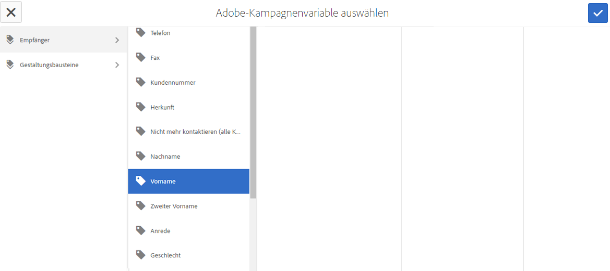
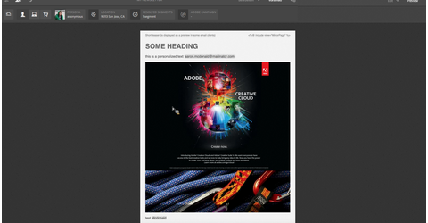
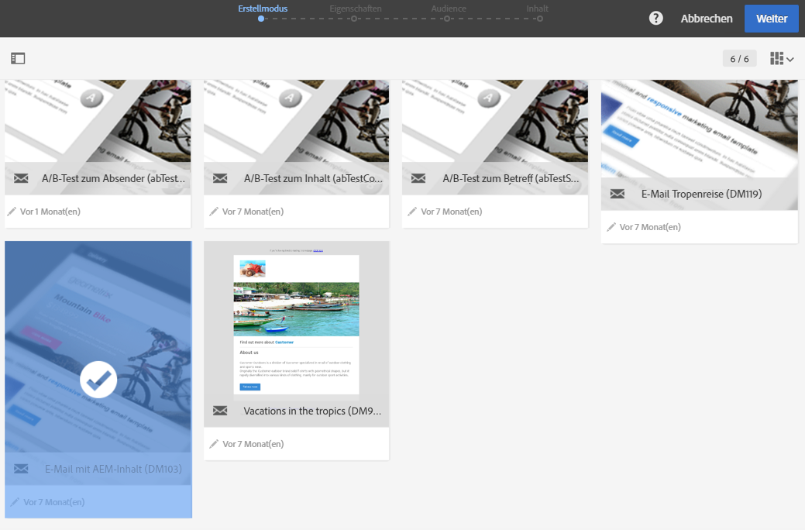

# Arbeiten mit Adobe Campaign Classic und Adobe Campaign Standard{#working-with-adobe-campaign-classic-and-adobe-campaign-standard}

Sie können E-Mail-Inhalte in AEM erstellen und diese in Adobe Campaign-E-Mails verarbeiten. Gehen Sie dazu wie folgt vor:

1. Erstellen Sie in AEM mithilfe einer für Adobe Campaign spezifischen Vorlage einen neuen Newsletter.
1. Wählen Sie [einen Adobe Campaign-Service](#selecting-the-adobe-campaign-cloud-service-and-template) aus, bevor Sie die Inhalte bearbeiten, um Zugriff auf alle Funktionen zu erhalten.
1. Bearbeiten Sie den Inhalt.
1. Überprüfen Sie den Inhalt. 

Der Inhalt kann anschließend mit einer Bereitstellung in Adobe Campaign synchronisiert werden. Eine ausführliche Anleitung finden Sie in diesem Dokument.

Weitere Informationen finden Sie unter [Erstellen von Adobe Campaign-Formularen in AEM](/help/sites-authoring/adobe-campaign-forms.md).

>[!NOTE]
>
>Bevor Sie diese Funktion verwenden können, müssen Sie AEM so konfigurieren, dass es sich entweder mit [Adobe Campaign](/help/sites-administering/campaignonpremise.md) oder [Adobe Campaign Standard](/help/sites-administering/campaignstandard.md) integrieren lässt.

## Versenden von E-Mail-Inhalten mit Adobe Campaign {#sending-email-content-via-adobe-campaign}

Nach der Konfiguration von AEM und Adobe Campaign können Sie E-Mail-Inhalte direkt in AEM erstellen und sie anschließend in Adobe Campaign verarbeiten.

Wenn Sie Adobe Campaign-Inhalte in AEM erstellen, müssen Sie eine Verknüpfung zu einem Adobe Campaign-Dienst erstellen, bevor Sie den Inhalt bearbeiten können, um auf alle Funktionen zugreifen zu können.

Es gibt zwei mögliche Fälle:

* Der Inhalt kann mit einer Bereitstellung in Adobe Campaign synchronisiert sein. So lassen sich AEM-Inhalte in einer Bereitstellung verwenden.
* (Nur Adobe Campaign Classic) Inhalte können direkt an Adobe Campaign gesendet werden, wodurch automatisch eine neue E-Mail-Bereitstellung generiert wird. Diese Methode hat jedoch Einschränkungen.

Eine ausführliche Anleitung finden Sie in diesem Dokument.

### Erstellen neuer E-Mail-Inhalte {#creating-new-email-content}

>[!NOTE]
>
>When adding email templates, be sure to add them under **/content/campaigns** to make them available.

#### Erstellen neuer E-Mail-Inhalte {#creating-new-email-content-1}

1. In AEM select **Sites** then **Campaigns**, then browse to where your email campaigns are managed. In the following example, the path is **Sites** > **Campaigns** > **Geometrixx Outdoors** > **Email Campaigns**.

   >[!NOTE]
   >
   >[E-Mail-Muster stehen nur in Geometrixx zur Verfügung](/help/sites-developing/we-retail.md). Laden Sie Geometrixx-Beispielinhalt von Package Share herunter.

   

1. Wählen Sie dann **Erstellen** und **Seite erstellen** aus.
1. Wählen Sie je nach der Adobe-Kampagne, mit der Sie sich verbinden möchten, eine der verfügbaren Vorlagen aus und klicken Sie auf **Weiter**. Standardmäßig sind drei Vorlagen verfügbar:

   * **Adobe Campaign Classic-E-Mail**: können Sie einer vordefinierten Vorlage (zwei Spalten) Inhalte hinzufügen, bevor Sie diese zur Bereitstellung an Adobe Campaign Classic senden.
   * **Adobe Campaign Standard-E-Mail**: können Sie einer vordefinierten Vorlage (zwei Spalten) Inhalte hinzufügen, bevor Sie diese zur Bereitstellung an Adobe Campaign Standard senden.

1. Fill in the **Title** and optionally the **Description** and click **Create**. Der Titel wird als Betreff des Newsletters/der E-Mail verwendet, falls er beim Bearbeiten der E-Mail nicht überschrieben wird.

### Auswählen von Adobe Campaign-Cloud-Service und Vorlagen {#selecting-the-adobe-campaign-cloud-service-and-template}

Möchten Sie eine Integration mit Adobe Campaign durchführen, müssen Sie der Seite einen Adobe Campaign-Service hinzufügen. Somit verfügen Sie über Zugriff auf Personalisierung und andere Daten aus Adobe Campaign.

Des Weiteren müssen Sie möglicherweise auch eine Adobe Campaign-Vorlage auswählen und den Betreff ändern und normalen Text für Benutzer einfügen, die die E-Mail nicht im HTML-Format anzeigen.

Sie können den Cloud-Service entweder über die Registerkarte **Sites** oder innerhalb des Newsletters/der E-Mail auswählen, nachdem Sie ihn/sie erstellt haben.

Die Auswahl des Cloud-Service über die Registerkarte **Sites** wird hierfür empfohlen. Die Auswahl des Cloud-Service über die E-Mail/den Newsletter ist ein deutlich komplizierteres Verfahren.

Auf der Seite **Sites**:

1. Wählen Sie in AEM die E-Mail-Seite aus und klicken Sie auf **Eigenschaften anzeigen**.

   

1. Select **Edit** and then the **Cloud services** tab and scroll down to the bottom and click the + sign to add a configuration and then select **Adobe Campaign**.

   

1. Wählen Sie aus einer Dropdown-Liste die Konfiguration aus, die Ihrer Adobe Campaign-Konfiguration entspricht, und bestätigen Sie Ihre Auswahl durch einen Klick auf **Speichern**.
1. Sie können die Vorlage anzeigen, die die E-Mail angewendet hat, indem Sie auf die Registerkarte* Adobe Campaign** klicken. Möchten Sie die Vorlage wechseln, können Sie diese während der Bearbeitung in der E-Mail selbst ändern.

   If you would like to apply a specific email delivery template (from Adobe Campaign), other than the default mail template, in **Properties**, select the **Adobe Campaign** tab. Geben Sie den internen Namen der E-Mail-Vorlage in die jeweilige Adobe Campaign-Instanz ein.

   Welche Vorlage Sie wählen bestimmt, welche Personalisierungsfelder in Adobe Campaign verfügbar sind.

   

Möglicherweise können Sie bei der Bearbeitung des Newsletters/der E-Mail aufgrund eines Layoutproblems den Adobe Campaign-Cloud-Service nicht direkt unter **Seiteneingenschaften** auswählen. Stattdessen können Sie dieses Problem wie folgt umgehen:

1. Wählen Sie in AEM die E-Mail-Seite aus und klicken Sie auf **Bearbeiten**. Klicken Sie auf **Eigenschaften öffnen**.

   

1. Select **Cloud services** and click **+** to add a configuration. Wählen Sie eine sichtbare Konfiguration aus (es spielt keine Rolle welche). Klicken oder tippen Sie auf das **+**, um eine weitere Konfiguration hinzuzufügen, und wählen Sie dann **Adobe Campaign** aus.

   >[!NOTE]
   >
   >Alternativ können Sie die Cloud-Services durch Auswahl der Option **Eigenschaften anzeigen** auf der Registerkarte **Sites** auswählen.

1. Wählen Sie in der Dropdownliste die Konfiguration aus, die mit Ihrer Adobe Campaign-Instanz übereinstimmt, löschen Sie die erste Konfiguration, die Sie erstellt haben und die nicht für Adobe Campaign gedacht war, und bestätigen Sie dann, indem Sie auf das Häkchen klicken.
1. Fahren Sie nun mit Schritt 4 des zuvor beschriebenen Verfahrens fort, um eine Vorlage auszuwählen und einfachen Text hinzuzufügen.

### Bearbeiten von E-Mail-Inhalten {#editing-email-content}

So bearbeiten Sie E-Mail-Inhalte:

1. Beim Öffnen der E-Mail wechseln Sie automatisch in den Bearbeitungsmodus.

   

1. If you would like to change the subject of the email or add plain text for those users who will not view the email in HTML, select **Email** and add a subject and text. Wählen Sie das Seitensymbol aus, um automatisch aus der HTML-Version eine Version mit einfachem Text zu generieren. Klicken Sie auf das Häkchen, wenn Sie fertig sind.

   Sie können den Newsletter mithilfe der Personalisierungsfelder von Adobe Campaign individueller gestalten. Möchten Sie ein Personalisierungsfeld hinzufügen, klicken Sie auf die Schaltfläche mit dem Adobe Campaign-Logo, um die Auswahl für Personalisierungsfelder zu öffnen. Sie können aus allen Feldern auswählen, die für diese Newsletter verfügbar sind.

   >[!NOTE]
   >
   >Sind die Personalisierungsfelder in Eigenschaften innerhalb des Editors ausgegraut, muss die Konfiguration überprüft werden.

   

1. Open the components panel on left side of screen and select **Adobe Campaign Newsletter** from the drop-down menu to find those components.

   

1. Die Komponenten direkt auf die Seite ziehen und entsprechend bearbeiten. Sie können beispielsweise eine Komponente des Typs **Text und Personalisierung (Kampagne)** auf die Seite ziehen und personalisierten Text einfügen.

   

   See [Adobe Campaign Components](/help/sites-authoring/adobe-campaign-components.md) for a detailed description of each component.

   

### Einfügen von Personalisierung {#inserting-personalization}

Beim Bearbeiten Ihres Inhalts können Sie Folgendes einfügen:

* Adobe Campaign-Kontextfelder. Hierbei handelt es sich um Felder, die Sie in Ihren Text einfügen können, und die entsprechend den Daten des Empfängers angepasst werden (z. B. Vorname, Nachname oder Daten der Zieldimension).
* Adobe Campaign-Personalisierungsblöcke. Dies sind Blöcke vordefinierter Inhalte, die nicht mit den Daten des Empfängers in Zusammenhang stehen, wie z. B. ein Markenlogo oder ein Link zu einer Spiegelseite.

Detaillierte Beschreibungen der Komponenten von Adobe Campaign finden Sie unter [Adobe Campaign-Komponenten](/help/sites-authoring/adobe-campaign-components.md).

>[!NOTE]
>
>* Es werden nur die Felder der Adobe Campaign-**Profile** der Targeting-Dimension berücksichtigt.
>* When viewing Properties from **Sites**, you do not have access to the Adobe Campaign context fields. Sie können bei deren Bearbeitung direkt aus E-Mails darauf zugreifen.
>

So fügen Sie Personalisierung ein:

1. Insert a new **Newsletter** > **Text &amp; Personalization (Campaign)** component by dragging it onto the page.

   

1. Öffnen Sie die Komponente, indem Sie auf das Stiftsymbol klicken. Der Editor für die Bearbeitung im Kontext wird geöffnet.

   

   >[!NOTE]
   >
   >**Adobe Campaign Standard:**
   >
   >* Die verfügbaren Kontextfelder entsprechen den **Profilen** der Targeting-Dimension in Adobe Campaign.
   >* See [Linking an AEM page to an Adobe Campaign email](#linking-an-aem-page-to-an-adobe-campaign-email-adobe-campaign-standard).
   >
   >**Adobe Campaign Standard:**
   >
   >* Available context fields are dynamically recovered from the Adobe Campaign **nms:seedMember** schema. Target-Erweiterungsdaten werden dynamisch aus dem Workflow abgerufen, der die mit dem Inhalt synchronisierte Bereitstellung enthält. (See the [Synchronizing content created in AEM with a delivery from Adobe Campaign](#synchronizing-content-created-in-aem-with-a-delivery-from-adobe-campaign-classic) section).
      >
      >
   * To add or hide personalization elements, see [Managing personalization fields and blocks](/help/sites-administering/campaignonpremise.md#managing-personalization-fields-and-blocks).
   >* **Wichtig**: Sämtliche Tabellenfelder müssen sich auch in der Empfängertabelle (oder der entsprechenden Kontakttabelle) befinden.

1. Geben Sie Text ein. Fügen Sie Kontextfelder oder Personalisierungsblöcke ein, indem Sie auf die Adobe Campaign-Komponenten klicken und diese auswählen. Wählen Sie nach Abschluss das Häkchen aus.

   

   Nach dem Einfügen der Kontextfelder und Personalisierungsblöcke können Sie eine Vorschau des Newsletters anzeigen und die Felder prüfen. See [Previewing a Newsletter](#previewing-a-newsletter).

### Newslettervorschau {#previewing-a-newsletter}

Sie können sich eine Vorschau des Newsletters und der Personalisierung anzeigen lassen.

1. Klicken Sie bei geöffnetem Newsletter oben rechts in AEM auf **Vorschau.** In AEM wird nun angezeigt, wie der Newsletter für Empfänger aussieht.

   

   >[!NOTE]
   >
   >Verwenden Sie Adobe Campaign Standard sowie die Beispielvorlage, führen zwei Personalisierungsblöcke mit anfänglichem Inhalt – **&quot;&lt;%@ include view=&quot;MirrorPage&quot; %>&quot;** und **&quot;&lt;%@ include view=&quot;UnsubscriptionLink&quot; %>&quot;** – zu Fehlermeldungen, wenn der Inhalt für die Bereitstellung importiert wird. Dies lässt sich anpassen, indem Sie bei der Auswahl der Personalisierungsblöcke die entsprechenden Blöcke auswählen.

1. Möchten Sie eine Vorschau der Personalisierung anzeigen, öffnen Sie durch Klicken oder Tippen auf das entsprechende Symbol in der Symbolleiste ContextHub. Die Tags der Personalisierungsfelder werden nun durch die Seed-Daten des ausgewählten Profils ersetzt. Wenn Sie ein anderes Profil auswählen, können Sie beobachten, wie die Variablen angepasst werden.

   

1. Die Seed-Daten von Adobe Campaign, die mit dem aktuell gewählten Profil verknüpft sind, können eingesehen werden. Klicken oder tippen Sie hierzu in der ContextHub-Leiste auf das Adobe Campaign-Modul. Es wird ein Dialogfeld eingeblendet, in dem alle Seed-Daten des aktuell gewählten Profils aufgeführt sind. Die Daten ändern sich entsprechend, wenn ein neues Profil gewählt wird.

   

### Genehmigen von Inhalten in AEM {#approving-content-in-aem}

Nach der Bearbeitung der Inhalte kann mit deren Genehmigung begonnen werden. Go to the **Workflow** tab of the toolbox and select the **Approve for Adobe Campaign** workflow.

Dieser Standardarbeitsablauf besteht aus zwei Schritten: Prüfung und Genehmigung oder Prüfung und Ablehnung. Der Arbeitsablauf kann jedoch auch ausgeweitet oder an komplexere Prozesse angepasst werden.

To approve content for Adobe Campaign, apply the workflow by selecting **Workflow** and selecting **Approve for Adobe Campaign** and click **Start Workflow**. Führen Sie die vorgegebenen Schritte aus und genehmigen Sie den Inhalt. Sie können Inhalte auch ablehnen, indem Sie im letzten Schritt des Arbeitsablaufs statt **Genehmigen** die Option **Ablehnen** wählen.

Nach der Genehmigung des Inhalts wird dieser in Adobe Campaign als genehmigt gekennzeichnet. Die E-Mail kann nun verschickt werden.

In Adobe Campaign Standard:

Adobe Campaign Classic:

>[!NOTE]
Nicht genehmigte Inhalte können in Adobe Campaign mit einer Bereitstellung synchronisiert werden, diese Bereitstellung lässt sich jedoch nicht durchführen. Mit Campaign-Bereitstellungen lassen sich nur genehmigte Inhalte versenden.

## Verknüpfen von AEM mit Adobe Campaign Standard und Adobe Campaign Classic {#linking-aem-with-adobe-campaign-standard-and-adobe-campaign-classic}

Wie Sie AEM mit Adobe Campaign verknüpfen oder synchronisieren hängt davon ab, ob Sie das Adobe Campaign Standard-Abonnement oder die On-Premise-Version von Adobe Campaign Classic verwenden.

Weitere Informationen basierend auf Ihrer Adobe Campaign-Version finden Sie in folgenden Abschnitten:

* [Verknüpfen von AEM-Seiten mit Adobe Campaign-E-Mails (Adobe Campaign Standard)](#linking-an-aem-page-to-an-adobe-campaign-email-adobe-campaign-standard)
* [Synchronisieren von in AEM erstelltem Inhalt mit einer Bereitstellung von Adobe Campaign Classic](#synchronizing-content-created-in-aem-with-a-delivery-from-adobe-campaign-classic)

### Verknüpfen von AEM-Seiten mit Adobe Campaign-E-Mails (Adobe Campaign Standard) {#linking-an-aem-page-to-an-adobe-campaign-email-adobe-campaign-standard}

In Adobe Campaign Standard können Sie in AEM erstellte Inhalte mithilfe der folgenden Optionen verknüpfen und wiederherstellen:

* E-Mail
* E-Mail-Vorlage

Diese Optionen ermöglichen die Bereitstellung von Inhalten. Aus dem auf der Seite angezeigten Code ist ersichtlich, ob ein Newsletter mit einer einzelnen Bereitstellung verknüpft ist.

>[!NOTE]
Wenn ein Newsletter mit mehreren Auslieferungen verknüpft ist, wird die Anzahl der verknüpften Auslieferungen (aber nicht jede ID) angezeigt.

So verknüpfen Sie in AEM erstellte Seiten mit Adobe Campaign-E-Mails:

1. Erstellen Sie eine neue E-Mail, die auf einer AEM-spezifischen E-Mail-Vorlage beruht. Refer to [Creating emails in Adobe Campaign Standard](https://helpx.adobe.com/campaign/standard/channels/using/creating-an-email.html) for more information.

   

1. Öffnen Sie den **Inhaltsblock** über das Bereitstellungs-Dashboard.

   

1. Select **Link with an Adobe Experience Manager content** in the toolbar to access the list of contents available in AEM.

   >[!NOTE]
   If the **Link with an Adobe Experience Manager** option does not appear in the action bar, check that the **Content editing mode** is correctly configured set to **Adobe Experience Manager** in the email properties.

   

1. Wählen Sie den Inhalt aus, den Sie in Ihrer E-Mail verwenden möchten.

   In dieser Liste wird Folgendes angegeben:

   * Die Beschriftung des Inhalts in AEM.
   * Der Genehmigungsstatus des Inhalts in AEM. Wurde der Inhalt nicht genehmigt, können Sie den Inhalt synchronisieren, der vor der Bereitstellung jedoch zuerst genehmigt werden muss. Sie können jedoch bestimmte Optionen verwenden, beispielsweise Versenden eines Nachweises oder die Vorschau.
   * Das Datum der letzten Änderung des Inhalts.
   * Inhalte, die bereits mit einer Bereitstellung verknüpft wurden.
   >[!NOTE]
   Standardmäßig werden Inhalte, die bereits mit einer Bereitstellung synchronisiert wurden, ausgeblendet. Sie können diese jedoch einblenden und verwenden. Beispielsweise dann, wenn Sie den Inhalt als Vorlage für mehrere Bereitstellungen nutzen möchten.

   Wurde die E-Mail mit AEM-Inhalten verknüpft, können ihre Inhalte nicht in Adobe Campaign bearbeitet werden.

1. Geben Sie andere E-Mail-Parameter (Zielgruppen, Ausführungsplan) im Dashboard an.
1. Stellen Sie die E-Mail zu. Während der Bereitstellungsanalyse werden die aktuellsten AEM-Inhalte abgerufen.

   >[!NOTE]
   Werden Inhalte in AEM bearbeitet, während sie mit einer E-Mail verknüpft sind, werden die Inhalte während der Analyse automatisch in Adobe Campaign aktualisiert. Die Synchronisierung kann auch manuell mithilfe der Option **Adobe Experience Manager-Inhalt aktualisieren** in der Inhaltsaktionsleiste durchgeführt werden.
   Sie können die Verknüpfung einer E-Mail mit AEM-Inhalten löschen, indem Sie **Verknüpfung mit Adobe Experience Manager-Inhalt löschen** aus der Inhaltsaktionsleiste auswählen. Diese Schaltfläche steht nur zur Verfügung, wenn der Inhalt bereits mit der Bereitstellung verknüpft ist. Soll anderer Inhalt mit einer Bereitstellung verknüpft werden, müssen Sie zunächst den aktuellen Inhaltslink löschen, bevor Sie eine neue Verknüpfung erstellen.
   Ist die Verknüpfung gelöscht, werden lokale Inhalte beibehalten und diese können in Adobe Campaign bearbeitet werden. Wird der Inhalt nach vorgenommenen Änderungen wieder verknüpft, gehen sämtliche Änderungen verloren.

### Synchronisieren von in AEM erstelltem Inhalt mit einer Bereitstellung von Adobe Campaign Classic {#synchronizing-content-created-in-aem-with-a-delivery-from-adobe-campaign-classic}

In Adobe Campaign können Sie in AEM erstellte Inhalte mithilfe der folgenden Optionen synchronisieren und wiederherstellen:

* eine Kampagnenbereitstellung
* eine Bereitstellungsaktivität in einem Kampagnenarbeitsablauf
* eine wiederholte Bereitstellung
* eine permanente Bereitstellung
* eine Bereitstellung über das Message Center
* eine Bereitstellungsvorlage

Ist ein Newsletter in AEM mit einer Bereitstellung verknüpft, wird der Bereitstellungscode auf der Seite angezeigt.

>[!NOTE]
Wenn der Newsletter mit mehreren Auslieferungen verknüpft ist, wird die Anzahl der verknüpften Auslieferungen (aber nicht jede ID) angezeigt.

>[!NOTE]
Der Arbeitsablaufschritt **In Adobe Campaign veröffentlichen** ist veraltet und ab AEM 6.1 nicht länger Teil des Arbeitsablaufs. In den Versionen AEM 6.0 und älter diente dieser Schritt der Integration mit Adobe Campaign, er wird in neueren Versionen nicht mehr benötigt.

So synchronisieren Sie in AEM erstellte Inhalte mit Bereitstellungen in Adobe Campaign:

1. Create a delivery or add a delivery activity to a campaign workflow by selecting the **Email delivery with AEM content (mailAEMContent)** delivery template.

   

1. Select **Synchronize** in the toolbar to access the list of contents available in AEM.

   >[!NOTE]
   If the **Synchronize** option does not appear in the delivery&#39;s toolbar, check that the **Content editing mode** field is correctly configured in **AEM** by selecting **Properties** > **Advanced**.

   

1. Wählen Sie den Inhalt aus, den Sie mit der Bereitstellung synchronisieren möchten.

   In dieser Liste wird Folgendes angegeben:

   * Die Beschriftung des Inhalts in AEM.
   * Der Genehmigungsstatus des Inhalts in AEM. Wurde der Inhalt nicht genehmigt, können Sie den Inhalt synchronisieren, der vor der Bereitstellung jedoch zuerst genehmigt werden muss. Sie können jedoch bestimmte Optionen verwenden, beispielsweise Versenden eines BAT oder die Vorschau.
   * Das Datum der letzten Änderung des Inhalts.
   * Inhalte, die bereits mit einer Bereitstellung verknüpft wurden.
   >[!NOTE]
   Standardmäßig werden Inhalte, die bereits mit einer Bereitstellung synchronisiert wurden, ausgeblendet. Sie können diese jedoch einblenden und verwenden. Beispielsweise dann, wenn Sie den Inhalt als Vorlage für mehrere Bereitstellungen nutzen möchten.

   

1. Geben Sie die übrigen Parameter Ihrer Bereitstellung (Ziel usw.) an.
1. Starten Sie, falls erforderlich, den Genehmigungsprozess für Bereitstellungen in Adobe Campaign. Zusätzlich zu in Adobe Campaign konfigurierten Genehmigungen (Budget, Ziel usw.) müssen Inhalte zunächst in AEM genehmigt werden. Eine Inhaltsgenehmigung in Adobe Campaign ist nur möglich, wenn die Inhalte bereits in AEM genehmigt wurden.
1. Stellen Sie die Inhalte bereit. Während der Bereitstellungsanalyse werden die aktuellsten AEM-Inhalte wiederhergestellt.

   >[!NOTE]
   * Nach der Synchronisierung von Bereitstellung und Inhalten können die Inhalte in Adobe Campaign nur noch gelesen werden. Betreff und Inhalt der E-Mail lassen sich nicht länger bearbeiten.
   * Wenn der Inhalt in AEM bearbeitet wird, während eine Verknüpfung mit einer Bereitstellung in Adobe Campaign besteht, wird dieser während der Analyse mit der Bereitstellung aktualisiert. The synchronization can also be executed manually using the **Refresh content now** button.
   * You can cancel synchronization between a delivery and AEM content using the **Desynchronize** button. Diese Schaltfläche steht nur zur Verfügung, wenn der Inhalt bereits mit der Bereitstellung synchronisiert wurde. Soll anderer Inhalt mit einer Bereitstellung synchronisiert werden, müssen Sie zunächst die aktuelle Synchronisierung abbrechen, bevor eine neue eingerichtet wird.
   * Wurde die Synchronisierung der Bereitstellung aufgehoben, werden die Inhalte lokal gespeichert und lassen sich in Adobe Campaign bearbeiten. Wird der Inhalt nach einer Bearbeitung wieder synchronisiert, gehen sämtliche Änderungen verloren.
   * Bei wiederholten oder permanenten Bereitstellungen wird die Synchronisierung mit AEM-Inhalten jeweils bei der Durchführung der Bereitstellung unterbrochen.

