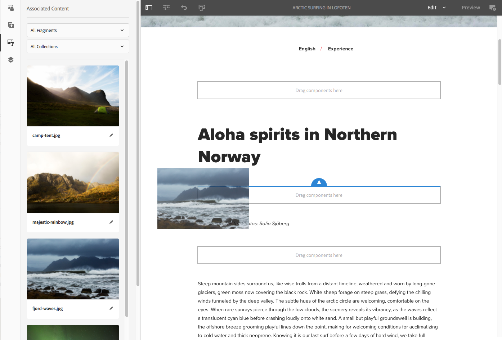

# Seitenbearbeitung mit Inhaltsfragmenten{#page-authoring-with-content-fragments}

>[!CAUTION]
>
>AEM 6.4 hat das Ende der erweiterten Unterstützung erreicht und diese Dokumentation wird nicht mehr aktualisiert. Weitere Informationen finden Sie in unserer [technische Unterstützung](https://helpx.adobe.com/de/support/programs/eol-matrix.html). Unterstützte Versionen suchen [here](https://experienceleague.adobe.com/docs/?lang=de).

>[!CAUTION]
>
>Einige Inhaltsfragmentfunktionen erfordern die Anwendung von [AEM 6.4 Service Pack 2 (6.4.2.0 oder höher)](/help/release-notes/sp-release-notes.md).

Inhaltsfragmente für Adobe Experience Manager (AEM) werden [als seitenunabhängige Assets erstellt und verwaltet](/help/assets/content-fragments.md).

Sie ermöglichen es Ihnen, kanalneutrale Inhalte zusammen mit (möglicherweise kanalspezifischen) Varianten zu erstellen. Sie können diese Fragmente und ihre Varianten bei der Erstellung Ihrer Inhaltsseiten verwenden.

In Verbindung mit dem aktualisierten JSON Exporter können strukturierte Inhaltsfragmente auch verwendet werden, um AEM-Inhalte über Content Services anderen Kanälen als AEM-Seiten bereitzustellen.

>[!NOTE]
>
>**Inhaltsfragmente** und **[Experience Fragments](/help/sites-authoring/experience-fragments.md)** sind unterschiedliche Funktionen in AEM:
>
>* **Inhaltsfragmente** sind redaktionelle Inhalte, in erster Linie Text und zugehörige Bilder. Sie sind reine Inhalte ohne Design und Layout.
>* **Experience Fragments** sind vollständig gestaltete Inhalte und stellen Teile von Web-Seiten dar.
>
>Experience Fragments können Inhalte in Form von Inhaltsfragmenten enthalten, aber nicht umgekehrt.

>[!CAUTION]
>
>Lesen Sie diese Seite gemeinsam mit [Arbeiten mit Inhaltsfragmenten](/help/assets/content-fragments.md) (und den zugehörigen Seiten), da dort grundlegende Termini und Konzepte sowie die Erstellung und Verwaltung von Fragmenten erklärt werden.

Die Inhaltsfragmente ermöglichen Folgendes:

* **Marketing- und Kampagnenstrategie**

   * Überprüfen Sie Inhalte über zentral verwaltete Inhaltsfragmente.

* **Creative Pro**

   * Tracking von kreativen Assets über Sammlungen, die mit Inhaltsfragmenten verknüpft sind.

* **Writer kopieren**

   * Schreiben Sie im Inhaltsfragment-Editor AEM.
   * Kann Inhaltsvarianten erstellen.
   * Kann relevante Inhalte mit dem Inhaltsfragment verknüpfen.
   * Kann Versionierung/Workflow verwenden.
   * Kann Inhaltsfragmente freigeben.
   * Kann Übersetzungen zentral verwalten.

* **Produzenten und Journey-Manager**

   * Wählen Sie aus vordefinierten Fragmenten und Varianten mit Authoring in AEM aus.
   * Kann sich darauf verlassen, dass Fragmente und verknüpfte Inhalte immer aktuell sind, da Autoren und Kreative ihre Aktualisierungen in zentral verwalteten Fragmenten und Assets vornehmen.
   * Kann sich darauf verlassen, dass verknüpfte Medieninhalte für Relevanz kuratiert werden.
   * Kann spontan Ad-hoc-Inhaltsvarianten erstellen und gleichzeitig sicherstellen, dass diese Varianten zentral im Fragment verwaltet werden.

## Hinzufügen eines Inhaltsfragments zu Ihrer Seite {#adding-a-content-fragment-to-your-page}

1. Öffnen Sie Ihre Seite zum Bearbeiten.

1. Fügen Sie die **[!UICONTROL Inhaltsfragmentkomponente]** hinzu; entweder aus dem **[!UICONTROL Komponenten-Browser]** oder mit **[!UICONTROL Neue Komponente einfügen]**.

1. Wählen Sie eine der folgenden Möglichkeiten:

   * Öffnen Sie den **[!UICONTROL Assets]**-Browser und filtern Sie nach der Option **[!UICONTROL Inhaltsfragmente]** (die Standardeinstellung ist „Bilder“). Ziehen Sie dann das gewünschte Fragment auf die Komponenteninstanz.
   * Wählen Sie die Inhaltsfragmentkomponente und dann **[!UICONTROL Konfigurieren]** aus der Symbolleiste. Im daraufhin angezeigten Dialogfeld können Sie das Auswahldialogfeld zum Durchsuchen und Auswählen des gewünschten **[!UICONTROL Inhaltsfragments]** öffnen.

   >[!NOTE]
   >
   >Eine alternative Methode besteht darin, ein bestimmtes Inhaltsfragment direkt auf die Seite zu ziehen. Dabei wird automatisch die zugehörige Komponente (Inhaltsfragment) erstellt.

1. Anfangs wird der Inhalt aus den Elementen **[!UICONTROL Allgemein]** und **[!UICONTROL Primär]** (Variante) angezeigt. Sie können nach Bedarf aber [auch andere Elemente und/oder Varianten auswählen](#selecting-the-element-or-variation).

   

   >[!NOTE]
   >
   >Weitere Informationen zur Bearbeitungsfunktion finden Sie unter:
   >
   >* [Responsives Layout](/help/sites-authoring/responsive-layout.md)
   >* [Bearbeiten des Seiteninhalts](/help/sites-authoring/editing-content.md)

## Auswählen des Elements oder der Variante {#selecting-the-element-or-variation}

Öffnen Sie das Dialogfeld **[!UICONTROL Konfiguration]** des Fragments, um das Fragment für die Verwendung auf der aktuellen Seite zu konfigurieren. Das Dialogfeld kann von der verwendeten Komponente abhängen.

Im entsprechenden Konfigurationsdialogfeld können Sie die verfügbaren Parameter auswählen, darunter:

* **[!UICONTROL Inhaltsfragment]**

   Geben Sie das zu verwendende Fragment an.

* **[!UICONTROL Anzeigemodus]**:

   * **[!UICONTROL Einzelnes Textelement]**
   * **[!UICONTROL Mehrfachelement]**

* **[!UICONTROL Element]**

   * Die Standardeinstellung **[!UICONTROL Main]** wird immer verfügbar sein.
   * Eine Auswahl ist verfügbar, wenn das Fragment mit einer entsprechenden Vorlage erstellt wurde.

   >[!NOTE]
   >
   >Die verfügbaren Elemente hängen von der verwendeten Vorlage ab.

* **[!UICONTROL Variante]**

   * Die Standardversion **[!UICONTROL Primär]** ist immer verfügbar.
   * Eine Auswahl ist verfügbar, wenn Varianten für das Fragment erstellt wurden.

* **[!UICONTROL Absätze]**: Geben Sie den Bereich der zu berücksichtigenden Absätze an:

   * **[!UICONTROL Alle]**
   * **[!UICONTROL Bereich]**: Zum Beispiel `1`, `3-5`, `9-*`

      * **[!UICONTROL Überschriften als separate Absätze behandeln]**

* **[!UICONTROL Überschriften als separate Absätze behandeln]**

## Schnelle Verbindung zum Fragmenteditor     {#quick-connection-to-fragment-editor}

Sie können die Fragmentquelle zur Bearbeitung (das Asset) mithilfe des Symbols **[!UICONTROL Bearbeiten]** in der Komponenten-Symbolleiste öffnen. Auf diese Weise können Sie [das Inhaltsfragment bearbeiten und verwalten](/help/assets/content-fragments.md).

>[!CAUTION]
>
>Wie immer hat die Bearbeitung der Fragmentquelle Auswirkungen auf alle Seiten, auf die diese Inhaltsfragmente verweisen.

## Hinzufügen von Zwischeninhalten {#adding-in-between-content}

Wenn ein bestimmtes Inhaltsfragment zur Seite hinzugefügt wird, gibt es eine **[!UICONTROL Komponenten hierher ziehen]** Platzhalter zwischen jedem HTML-Absatz (und am oberen/unteren Rand) des Fragments.

Auf diese Weise können Sie zusätzliche Inhalte hinzufügen [Zwischeninhalt (d. h. Zwischeninhalt)](/help/assets/content-fragments.md#in-between-content-when-page-authoring-with-content-fragments) den Fragmentinhalt (an einem der verfügbaren Punkte), ohne das Stammfragment ändern zu müssen.

Für Übergangsinhalte haben Sie folgende Möglichkeiten:

* Komponenten aus der [Komponenten-Browser](/help/sites-authoring/author-environment-tools.md#components-browser).
* Hinzufügen von Assets aus der [Asset-Browser](/help/sites-authoring/author-environment-tools.md#assets-browser).
* [Zugehörige Inhalte](#using-associated-content) als Quelle für Zwischeninhalte verwenden.

>[!CAUTION]
>
>Bei Zwischeninhalten handelt es sich um Seiteninhalte. Sie werden nicht im Inhaltsfragment gespeichert.

>[!NOTE]
>
>Sie können auch [Einfügen visueller Assets (Bilder) in das Fragment selbst](/help/assets/content-fragments-variations.md#inserting-assets-into-your-fragment).
>
>In das Fragment selbst eingefügte visuelle Assets werden an den vorangehenden Absatz im Fragment angehängt. Deshalb können Zwischeninhalte nicht zwischen einem visuellen Asset und dem vorangehenden Absatz platziert werden.

>[!CAUTION]
>
>Wenn Sie Zwischeninhalte zu einem Inhaltsfragment auf Ihrer Seite hinzugefügt haben, kann das Ändern der Struktur des zugrunde liegenden Inhaltsfragments (im Fragment-Editor) zu fehlerhaften/unerwarteten Ergebnissen führen.
>
>Wenn dies eintritt, wird der Zwischeninhalt unverändert beibehalten:
>
>* Übergangskomponenten haben eine absolute Position innerhalb der Komponentensequenz im Fragmentfluss. Diese Position ändert sich nicht, auch wenn sich der Inhalt der Absätze im Fragment ändert.\
   >  Dies kann den Eindruck erwecken, als hätte sich die relative Position geändert, da Zwischenabsätze keinen kontextuellen Bezug zu den Absätzen (des Fragments) haben, neben denen sie sich befinden.
>* Wenn zwischen zwei Absatzstrukturen ein Konflikt besteht, wird der Zwischeninhalt nicht angezeigt (obwohl er intern noch vorhanden ist).
>

## Verwenden von zugehörigen Inhalten {#using-associated-content}

Wenn Sie [verknüpften Inhalt](/help/assets/content-fragments-assoc-content.md) für das [Inhaltsfragment](/help/assets/content-fragments.md) haben, stehen diese Elemente im Seitenbedienfeld zur Verfügung (nachdem Sie das Fragment auf der Inhaltsseite platziert haben). Verknüpfte Inhalte sind im Grunde eine besondere Inhaltsquelle für [dazwischen liegende Inhalte](#adding-in-between-content).

>[!NOTE]
>
>Es gibt verschiedene Methoden, um [visuelle Assets (z. B. Bilder)](/help/assets/content-fragments.md#fragments-with-visual-assets) einem Fragment und/oder einer Seite hinzuzufügen.

>[!NOTE]
>
>Wenn sich auf einer Seite mehrere Inhaltsfragmente befinden, wird die **[!UICONTROL Zugehörige Inhalte]** -Registerkarte zeigt Assets an, die für alle Fragmente geeignet sind.

Nachdem Sie ein Fragment mit verknüpftem Inhalt zu Ihrer Seite hinzugefügt haben, wird eine neue Registerkarte (**[!UICONTROL Zugehörige Inhalte]**) im Seitenbereich geöffnet.

Von hier aus können Sie die Assets an die gewünschte Position ziehen (entweder zu einer vorhandenen Komponente oder an die gewünschte Position, an der die entsprechende Komponente erstellt wird):

## In das Fragment eingefügte Assets {#assets-inserted-into-the-fragment}

Wenn [Assets (z. B. Bilder) wurden in das Fragment eingefügt](/help/assets/content-fragments-variations.md#inserting-assets-into-your-fragment)festgelegt ist, sind die Optionen zum Bearbeiten dieser Assets im Seiteneditor eingeschränkt.

Beispielsweise haben Sie zur Bearbeitung eines Bildes folgende Möglichkeiten:

* Beschneiden, Drehen oder Spiegeln des Bildes.
* Fügen Sie einen Titel oder alternativen Text hinzu.
* Geben Sie eine Größe an.
* Sie können auch das Layout konfigurieren.

Andere Änderungen wie Verschieben, Kopieren und Löschen müssen im Fragment-Editor vorgenommen werden.

## Veröffentlichung {#publishing}

Fragmente müssen zuerst veröffentlicht werden, damit sie auf Ihren veröffentlichten Web-Seiten verwendet werden können:

* Ein Fragment kann veröffentlicht werden, nachdem [Erstellen des Fragments in der Konsole &quot;Assets&quot;](/help/assets/content-fragments-managing.md#publishing-and-referencing-a-fragment).
* Wenn ein *unveröffentlichtes Fragment* auf einer Seite verwendet wird, die veröffentlicht wird, kann das Fragment ebenfalls zu diesem Zeitpunkt veröffentlicht werden.
