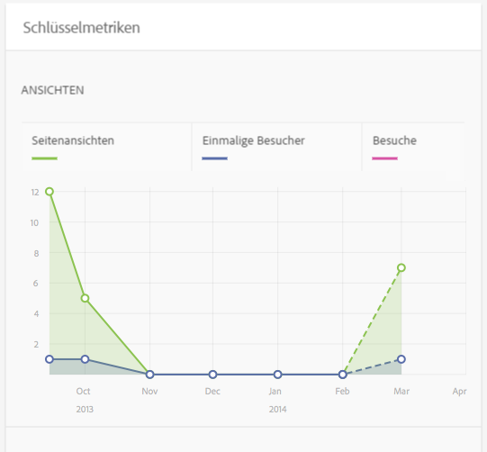

# Inhaltseinblick {#content-insight}

Inhaltseinblicke bieten Informationen über die Leistung der Seite mithilfe von Webanalyse und SEO-Empfehlungen. Verwenden Sie Inhaltseinblicke, um Entscheidungen darüber zu treffen, wie Sie Seiten ändern, oder um zu erfahren, wie frühere Entscheidungen die Leistung geändert haben. Für jede Seite, die Sie bearbeiten, können Sie Inhaltseinblicke öffnen, um die Seite zu analysieren.

Das Layout der Inhaltseinblick-Seite ändert sich je nach Bildschirmabmessungen und Ausrichtung des Geräts, das Sie verwenden.

## Berichtsdaten

Die Inhaltseinblick-Seite enthält Berichte, die Adobe SiteCatalyst-, Adobe Target-, Adobe Social- und BrightEdge-Daten verwenden:

* SiteCatalyst: Berichte für die folgenden Metriken sind verfügbar:

   * Seitenansichten
   * Durchschnittl. Besuchszeit pro Seite
   * Quellen

* Target: Berichte über Kampagnenaktivität, für die Ihre Seite Angebote enthält.
* BrightEdge: Berichte über die Seitenfunktionen, die die Sichtbarkeit der Seite für Suchmaschinen verbessern; empfiehlt Funktionen, die implementiert werden sollten.

Weitere Informationen finden Sie unter [Öffnen von Analytics und Empfehlungen für eine Seite](/help/sites-authoring/ci-analyze.md#opening-analytics-and-recommendations-for-a-page).

## Berichtszeitraum

Berichte zeigen Daten für einen Zeitraum, den Sie bestimmen. Wenn Sie den Berichtszeitraum anpassen, werden die Berichte automatisch mit Daten für diesen Zeitraum aktualisiert. Visuelle Hinweise geben die Zeit an, zu der Seitenversionen geändert wurden, damit Sie die Leistung jeder Version vergleichen können.

Sie können außerdem die Granularität der berichteten Daten angeben, z. B. können Sie tägliche, wöchentliche, monatliche oder jährliche Daten sehen.

Weitere Informationen finden Sie unter [Ändern des Berichtszeitraums](/help/sites-authoring/ci-analyze.md#changing-the-reporting-period).

>[!NOTE]
>
>Für Inhaltseinblick-Berichte muss Ihr Administrator AEM mit SiteCatalyst, Target und BrightEdge integriert haben. Siehe [Integration in SightCatalyst](/help/sites-administering/adobeanalytics.md), [Integration in Adobe Target](/help/sites-administering/target.md) und [Integration in BrightEdge](/help/sites-administering/brightedge.md).

## Der Ansichtsbericht {#the-views-report}

Der Ansichtsbericht umfasst die folgenden Funktionen für die Bewertung des Datenverkehrs auf der Seite:

* Die Gesamtzahl der Ansichten für eine Seite während des Berichtszeitraums.
* Ein Diagramm der Anzahl der Ansichten während des Berichtszeitraums:

   * Gesamtzahl der Ansichten.
   * Eindeutige Besucher.

## Der Bericht über die durchschnittliche Aufenthaltsdauer auf der Seite {#the-page-average-engaged-report}

Der Bericht über die durchschnittliche Aufenthaltsdauer auf der Seite umfasst die folgenden Funktionen für die Bewertung der Seiteneffektivität:

* Die durchschnittliche Besuchszeit, während der die Seite für den gesamten Berichtzeitraum geöffnet bleibt.
* Eine Grafik der durchschnittlichen Dauer einer Seitenansicht während des Berichtszeitraums.

## Der Quellenbericht {#the-sources-report}

Der Quellenbericht gibt an, wie Benutzer zur Seite kommen, zum Beispiel von Suchmaschinen-Ergebnissen oder mithilfe der bekannten URL.

## Der Absprungbericht {#the-bounces-report}

Der Absprungbericht umfasst eine Grafik, die die Anzahl der Absprünge anzeigt, die für eine Seite über den ausgewählten Berichtszeitraum aufgetreten sind.

## Der Kampagnenaktivitätsbericht {#the-campaign-activity-report}

Für jede Kampagne, für die die Seite aktiv ist, wird ein Bericht namens *Kampagnennamenaktivität* angezeigt. Der Bericht zeigt Seitenimpressionen und Konversionen für jedes Segment an, für das ein Angebot bereitgestellt wird.

## Der SEO-Empfehlungsbericht {#the-seo-recommendations-report}

Der SEO-Empfehlungsbericht enthält die Ergebnisse der BrightEdge-Analyse für die Seite. Der Bericht ist eine Checkliste der Seitenfunktionen, die angibt, welche Funktionen die Seite enthält bzw. nicht enthält, um die Auffindbarkeit mithilfe von Suchmaschinen zu maximieren.

Mit dem Bericht können Sie Aufgaben erstellen, die zu einer Verbesserung der Auffindbarkeit der Seite führen. Empfehlungen weisen darauf hin, dass Aufgaben zur Implementierung der Empfehlung erstellt wurden. Weitere Informationen finden Sie unter [Zuweisen von Aufgaben für SEO-Empfehlungen](/help/sites-authoring/ci-analyze.md#assigning-tasks-for-seo-recommendations).

