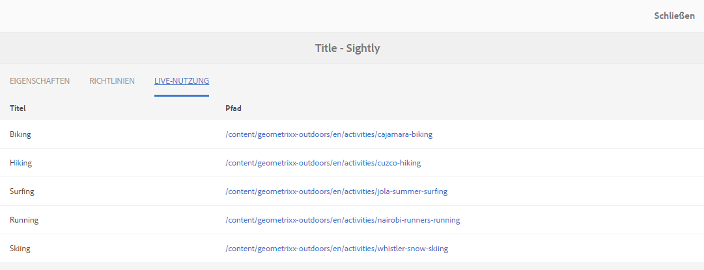

# Komponentenkonsole{#components-console}

Die Komponentenkonsole ermöglicht es Ihnen, alle Komponenten zu durchsuchen, die für Ihre Instanz definiert sind, und wichtige Informationen für jede Komponente anzuzeigen. 

Sie können von **Tools** -> **Allgemein** -> **Komponenten** aus aufgerufen werden. In der Konsole sind Karten- und Listenansicht verfügbar. Da es keine Baumstruktur für Komponenten gibt, ist die Spaltenansicht nicht verfügbar.

>[!NOTE]
>
>In der Komponentenkonsole werden alle im System vorhandenen Komponenten angezeigt. Im [Komponenten-Browser](/help/sites-authoring/author-environment-tools.md#components-browser) werden Komponenten angezeigt, die Autoren zur Verfügung stehen, und alle Komponentengruppen verborgen, die mit einem Punkt beginnen (`.`).

## Suche {#search-features}

Mit dem Symbol **Nur Inhalt** (oben links) können Sie den **Suchbereich** öffnen, um die Komponenten zu durchsuchen und/oder zu filtern: 

## Komponentendetails {#component-details}

Um weitere Einzelheiten zu einer bestimmten Komponente anzuzeigen, tippen/klicken Sie auf die gewünschte Ressource. Die drei Registerkarten bieten:

* **Eigenschaften**

   

   In der Registerkarte „Eigenschaften“ haben Sie folgende Möglichkeiten:

   * Ansehen der allgemeinen Eigenschaften der Komponente
   * Ansehen, wie das [Symbol oder die Abkürzung für die Komponente definiert wurde](/help/sites-developing/components-basics.md#component-icon-in-touch-ui)

      * Durch Klicken auf die Symbolquelle gelangen Sie zu dieser Komponente.
   * Ansehen des **Ressourcentyps** und des **Ressourcen-Supertyps** (sofern definiert) für die Komponente

      * Durch Klicken auf den Ressourcen-Supertyp gelangen Sie zu dieser Komponente.
   >[!NOTE]
   >
   >Da `/apps` zur Laufzeit nicht bearbeitet werden kann, ist die Komponentenkonsole schreibgeschützt.

* **Richtlinien**

   

* **Live-Nutzung**

   

   >[!CAUTION]
   >
   >Aufgrund der Art der Informationen, die für diese Ansicht erfasst werden, kann es eine Weile dauern, bis sie zusammengestellt/angezeigt wird. 

* **Dokumentation**

   Etwaige vom Entwickler [für eine Komponente bereitgestellte Dokumentation](/help/sites-developing/developing-components.md#documenting-your-component) wird auf der Registerkarte **Dokumentation** angezeigt. Ist keine Dokumentation verfügbar, wird die Registerkarte **Dokumentation** nicht angezeigt.

   

