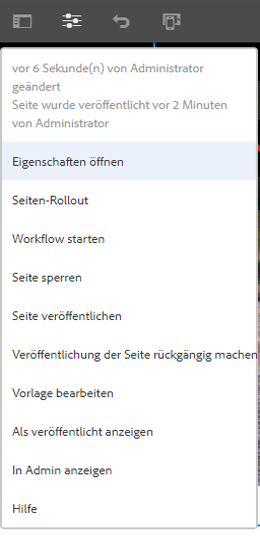
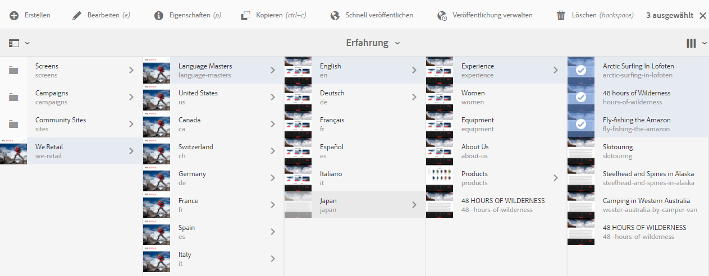
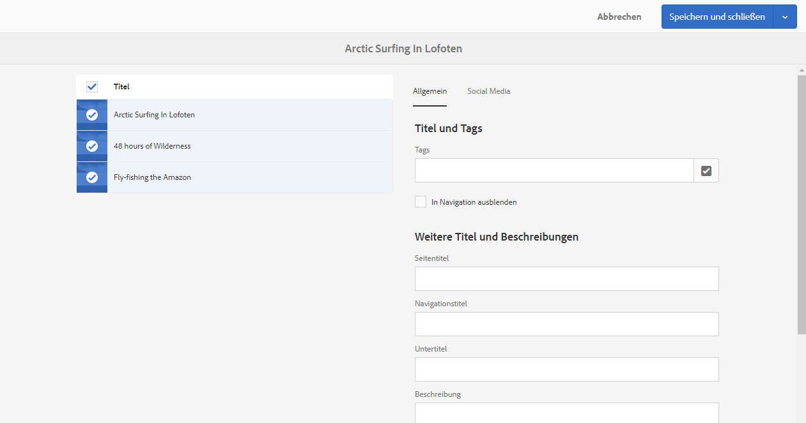

# Bearbeiten der Seiteneigenschaften{#editing-page-properties}

>[!CAUTION]
>
>AEM 6.4 hat das Ende der erweiterten Unterstützung erreicht und diese Dokumentation wird nicht mehr aktualisiert. Weitere Informationen finden Sie in unserer [technische Unterstützung](https://helpx.adobe.com/de/support/programs/eol-matrix.html). Unterstützte Versionen suchen [here](https://experienceleague.adobe.com/docs/?lang=de).

Sie können die erforderlichen Eigenschaften für eine Seite definieren. Diese können je nach Art der Seite variieren. Beispielsweise sind einige Seiten möglicherweise mit einer Live Copy verbunden, andere nicht und die Live Copy-Informationen sind entsprechend verfügbar.

## Seiteneigenschaften {#page-properties}

Die Eigenschaften sind auf verschiedene Registerkarten verteilt.

### Einfach {#basic}

* **Titel**

   Der Titel der Seite wird an verschiedenen Stellen angezeigt. Beispiel: die **Websites** und der **Sites** Karten-/Listenansichten.

   Dies ist ein Pflichtfeld.

* **Tags**

   Hier können Sie der Seite Tags hinzufügen (oder davon entfernen), indem Sie die Liste im Auswahlfeld aktualisieren:

   * Nachdem Sie ein Tag ausgewählt haben, wird es unter dem Auswahlfeld aufgeführt. Sie können ein Tag mit dem x aus dieser Liste entfernen.
   * Sie können ein völlig neues Tag eingeben, indem Sie den Namen in ein leeres Auswahlfeld eingeben.

      * Das neue Tag wird erstellt, wenn Sie die Eingabetaste drücken.
      * Das neue Tag wird dann mit einem kleinen Stern auf der rechten Seite angezeigt, der angibt, dass es sich um ein neues Tag handelt.
   * Mit der Dropdown-Funktion können Sie aus vorhandenen Tags auswählen.
   * Ein x wird angezeigt, wenn Sie den Mauszeiger über einen Tag-Eintrag im Auswahlfeld halten, der zum Entfernen dieses Tags für diese Seite verwendet werden kann.

   Weitere Informationen zu Tags finden Sie unter [Verwenden von Tags](/help/sites-authoring/tags.md).

* **In Navigation ausblenden**

   Gibt an, ob die Seite in der Seitennavigation der resultierenden Seite ein- oder ausgeblendet sein soll.

* **Branding**

   Wenden Sie eine konsistente Markenidentität auf allen Seiten an, indem Sie einen Marken-Slug an jeden Seitentitel anhängen. Diese Funktion erfordert die Verwendung der Seitenkomponente ab Version 2.14.0 der [Kernkomponenten.](https://experienceleague.adobe.com/docs/experience-manager-core-components/using/introduction.html?lang=de)

   * **Überschreiben** – Aktivieren Sie diese Option, um den Marken-Slug auf dieser Seite zu definieren.
      * Der Wert wird von allen untergeordneten Seiten geerbt, es sei denn, deren **Überschreiben**-Werte sind auch eingestellt.
   * **Überschreibungswert** – Der Text des Marken-Slugs, der an den Seitentitel angehängt werden soll.
      * Der Wert wird nach einem Pipe-Zeichen an den Seitentitel angehängt, z. B. „Cycling Tuscany | Always ready for the WKND“.

* **Seitentitel**

   Ein Titel, der auf der Seite verwendet werden soll. Wird normalerweise von Titelkomponenten verwendet. Wenn leer, wird **Titel** verwendet.

* **Navigationstitel**

   Sie können einen separaten Titel für die Verwendung in der Navigation angeben (z. B. wenn Sie eine kürzere Alternative wählen möchten). Wenn leer, wird die **Titel** verwendet.

* **Untertitel**

   Ein Untertitel zur Verwendung auf der Seite.

* **Beschreibung**

   Ihre Beschreibung der Seite, ihren Zweck oder andere Details, die Sie hinzufügen möchten.

* **Einschaltzeit**

   Datum und Uhrzeit der Aktivierung der veröffentlichten Seite. Nach der Veröffentlichung ruht diese Seite bis zum angegebenen Zeitpunkt.

   Lassen Sie diese Felder für Seiten, die Sie sofort veröffentlichen möchten (im normalen Szenario), leer.

* **Ausschaltzeit**

   Der Zeitpunkt, zu dem die veröffentlichte Seite deaktiviert wird.

   Lassen Sie diese Felder erneut für sofortiges Handeln leer.

* **Vanity-URL**

   Ermöglicht die Eingabe einer Vanity-URL für diese Seite, die es Ihnen ermöglicht, eine kürzere und/oder ausdrucksstärkere URL zu verwenden.

   Beispiel: Wenn die Vanity-URL w`elcome` für die Seite mit dem Pfad /`v1.0/startpage` auf der Website h`ttp://example.com,` verwendet wird, wäre h`ttp://example.com/welcome` die Vanity-URL von h`ttp://example.com/content/v1.0/startpage`.

   >[!CAUTION]
   >
   >Vanity-URLs:
   >
   >* Muss eindeutig sein. Daher sollten Sie darauf achten, dass der Wert nicht bereits von einer anderen Seite verwendet wird.
   >* Unterstützen Sie keine Regex-Muster.

* **Vanity-URL umleiten**

   Gibt an, ob für die Seite eine Vanity-URL verwendet werden soll.

### Erweitert {#advanced}

* **Sprache**

   Die Seitensprache.

* **Umleiten**

   Geben Sie die Seite an, zu der diese Seite automatisch umgeleitet werden soll.

* **Design**

   Geben Sie die [Design](/help/sites-developing/designer.md) für diese Seite verwendet werden.

* **Alias**

   Geben Sie einen Alias an, der für diese Seite verwendet werden soll.

   * Wenn Sie beispielsweise einen Alias von `private` für die Seite `/content/wknd/us/en/magazine/members-only`, kann diese Seite auch über `/content/wknd/us/en/magazine/private`.
   * Durch die Erstellung eines Alias wird die Eigenschaft `sling:alias`, die sich nur auf die Ressource und nicht auf den Repository-Pfad auswirkt, auf dem Seitenknoten festgelegt.
   * Seiten, auf die im Editor über Aliasnamen zugegriffen wird, können nicht veröffentlicht werden. [Veröffentlichungsoptionen](/help/sites-authoring/publishing-pages.md) im Editor sind nur für Seiten verfügbar, auf die über ihre tatsächlichen Pfade zugegriffen wird.
   * Weitere Informationen finden Sie unter [Lokalisierte Seitennamen unter Best Practices für SEO und URL-Verwaltung](/help/managing/seo-and-url-management.md#localized-page-names)

* **Zugelassene Vorlagen**

   [Definieren der Liste der verfügbaren Vorlagen](/help/sites-authoring/templates.md#enabling-and-allowing-a-template-template-author) innerhalb dieser Unterverzweigung.

* **Authentifizierungspflicht**

   Aktiviert (oder deaktiviert) die Verwendung der Authentifizierung für den Zugriff auf die Seite.

   Die Authentifizierungspflicht kann hier zusammen mit einer festgelegten Anmeldeseite festgelegt werden. Geschlossene Benutzergruppen (CUGs) für die Seite werden auf der Registerkarte **[Berechtigungen](/help/sites-authoring/editing-page-properties.md#permissions)** definiert.

   >[!CAUTION]
   >
   >Auf der Registerkarte **[Berechtigungen](/help/sites-authoring/editing-page-properties.md#permissions)** können Sie CUG-Konfigurationen abhängig vom Vorhandensein des Mixins `granite:AuthenticationRequired` konfigurieren. Wenn Seitenberechtigungen mit veralteten CUG-Konfigurationen konfiguriert werden, die auf dem Vorhandensein der Eigenschaft cq:cugEnabled basieren, wird eine Warnmeldung unter **Authentifizierungspflicht** und die Option nicht bearbeitbar ist, wird die [Berechtigungen](/help/sites-authoring/editing-page-properties.md#permissions) bearbeitbar sein.
   >
   >
   >In diesem Fall müssen die CUG-Berechtigungen in der [klassischen Benutzeroberfläche](/help/sites-classic-ui-authoring/classic-page-author-edit-page-properties.md) bearbeitet werden.

* **Anmeldeseite**

   Die für die Anmeldung zu verwendende Seite.

* **Konfiguration exportieren**

   Geben Sie eine Exportkonfiguration an.

### Miniaturansicht  {#thumbnail}

1. **Seitenminiatur**

   Zeigt das Miniaturbild der Seite an. Sie haben folgende Möglichkeiten:

   * **Vorschau generieren**

      Erstellen Sie eine Vorschau der Seite, die als Miniaturansicht verwendet werden soll.

   * **Bild hochladen**

      Laden Sie ein Bild hoch, das als Miniaturansicht verwendet werden soll.

### Social Media {#social-media}

* **Freigabe in Social Media**

   Definiert die auf der Seite verfügbaren Freigabeoptionen. Stellt die verfügbaren Optionen für die [Kernkomponente freigeben](https://helpx.adobe.com/de/experience-manager/core-components/using/sharing.html).

   * **Benutzerfreigabe für Facebook aktivieren**
   * **Benutzerfreigabe für Pinterest aktivieren**
   * **Bevorzugte XF-Variation** Definieren Sie die Experience-Fragment-Variante, die zum Generieren von Metadaten für die Seite verwendet werden soll.

### Cloud Services {#cloud-services}

* **Cloud Services**

   Definieren von Eigenschaften für [Cloud Services](/help/sites-developing/extending-cloud-config.md).

### Personalisierung  {#personalization}

* **Personalisierung**

   Wählen Sie eine [Marke, um einen Bereich für das Targeting anzugeben](/help/sites-authoring/personalization.md).

### Berechtigungen {#permissions}

* **Berechtigungen**

   Auf dieser Registerkarte haben Sie folgende Möglichkeiten:

   * [Berechtigungen hinzufügen](/help/sites-administering/user-group-ac-admin.md)
   * [Geschlossene Benutzergruppe bearbeiten](/help/sites-administering/cug.md#applying-your-closed-user-group-to-content-pages)
   * [Effektive Berechtigungen](/help/sites-administering/user-group-ac-admin.md) anzeigen 

   >[!CAUTION]
   >
   >Auf der Registerkarte **Berechtigungen** können Sie CUG-Konfigurationen abhängig vom Vorhandensein des Mixins `granite:AuthenticationRequired` konfigurieren. Wenn Seitenberechtigungen mit veralteten CUG-Konfigurationen konfiguriert werden, die auf dem Vorhandensein der Eigenschaft `cq:cugEnabled` basieren, wird eine Warnmeldung angezeigt und die CUG-Berechtigungen sind nicht bearbeitbar, ebenso wenig wie die Authentifizierungspflicht auf der Registerkarte [Erweitert](/help/sites-authoring/editing-page-properties.md#advanced).
   >
   >
   >In diesem Fall müssen die CUG-Berechtigungen in der [klassischen Benutzeroberfläche](/help/sites-classic-ui-authoring/classic-page-author-edit-page-properties.md) bearbeitet werden.

   >[!NOTE]
   >
   >Auf der Registerkarte Berechtigungen kann keine leere CUG-Gruppe erstellt werden. Dies kann als einfache Möglichkeit zum Verweigern des Zugriffs für jeden Benutzer nützlich sein. Dazu muss CRX Explorer verwendet werden. Weitere Informationen finden Sie im Dokument [Verwalten von Benutzer-, Gruppen- und Zugriffsrechten](/help/sites-administering/user-group-ac-admin.md).

### Blueprint {#blueprint}

* **Blueprint**

   Definieren Sie Eigenschaften für eine Blueprint-Seite in [Multi-Site-Management](/help/sites-administering/msm.md). Steuert die Umstände, unter denen Änderungen an die Live Copy propagiert werden.

### Live Copy  {#live-copy}

* **Live Copy**

   Legen Sie Eigenschaften für eine Live Copy-Seite fest in [Multi-Site-Management](/help/sites-administering/msm.md). Steuert die Umstände, unter denen Änderungen von der Blueprint-Seite propagiert werden.

### Site-Struktur  {#site-structure}

* Geben Sie Links zu Seiten an, die Site-übergreifende Funktionalität bieten, z. B. **Anmeldungsseite**, **Offline-Seite** und andere.

## Bearbeiten der Seiteneigenschaften {#editing-page-properties-2}

Sie können Seiteneigenschaften definieren:

* In der Konsole **Sites**:

   * [beim Erstellen einer neuen Seite](/help/sites-authoring/managing-pages.md#creating-a-new-page) (ein Teil der Eigenschaften)
   * durch Klicken oder Tippen auf **Eigenschaften**

      * Für eine einzelne Seite
      * Für mehrere Seiten (nur eine Teilmenge der Eigenschaften steht zur Massenbearbeitung zur Verfügung)

* Im Seiteneditor:

   * mithilfe der Option **Seiteninformationen** (anschließend **Eigenschaften öffnen**)

### In der Sites-Konsole (einzelne Seite) {#from-the-sites-console-single-page}

durch Klicken oder Tippen auf **Eigenschaften**, um die Seiteneigenschaften festzulegen:

1. Navigieren Sie in der **Sites-Konsole** zu der Seite, für die Sie Eigenschaften anzeigen und bearbeiten möchten.

1. Wählen Sie die Option **Eigenschaften** für die gewünschte Seite aus, indem Sie wahlweise Folgendes verwenden:

   * [Schnellaktionen](/help/sites-authoring/basic-handling.md#quick-actions)
   * [Auswahlmodus](/help/sites-authoring/basic-handling.md#viewing-and-selecting-resources)

   Die Seiteneigenschaften werden in den entsprechenden Registerkarten angezeigt.

1. Sie können die Eigenschaften nach Bedarf anzeigen oder bearbeiten.

1. Speichern Sie dann Ihre Aktualisierungen mit **Speichern** und klicken Sie danach auf **Schließen**, um zur Konsole zurückzukehren.

### Beim Bearbeiten einer Seite {#when-editing-a-page}

Beim Bearbeiten einer Seite können Sie mithilfe von **Seiteninformationen** die Seiteneigenschaften definieren:

1. Öffnen Sie die Seite, für die Sie Eigenschaften bearbeiten möchten.

1. Wählen Sie das Symbol **Seiteninformationen** aus, um das Auswahlmenü zu öffnen:

   

1. Wählen Sie **Eigenschaften öffnen** aus. Daraufhin wird ein Dialogfeld geöffnet, in dem Sie die Eigenschaften – geordnet nach der jeweiligen Registerkarte – bearbeiten können. Die folgenden Schaltflächen stehen rechts in der Symbolleiste zur Verfügung:

   * **Abbrechen**
   * **Speichern und schließen**

1. Mit der Schaltfläche **Speichern und schließen** können Sie Änderungen speichern.

### In der Sites-Konsole (mehrere Seiten) {#from-the-sites-console-multiple-pages}

In der **Sites** Console können Sie mehrere Seiten auswählen und dann die Seiteneigenschaften mithilfe der **Ansichtseigenschaften** anzeigen und/oder bearbeiten. Dies wird als Massenbearbeitung von Seiteneigenschaften bezeichnet.

>[!NOTE]
>
>Die Massenbearbeitung von Eigenschaften ist auch für Assets verfügbar. Sie ist sehr ähnlich, unterscheidet sich aber in einigen Punkten. Siehe [Bearbeiten von Eigenschaften mehrerer Assets](/help/assets/managing-multiple-assets.md) für Details.
>
>Es gibt auch die [Bulk Editor](/help/sites-administering/bulk-editor.md), mit dem Sie mithilfe von GQL (Google Query Language) aus mehreren Seiten nach Inhalten suchen und diese dann direkt im Bulk Editor bearbeiten können, bevor Sie Ihre Änderungen auf den ursprünglichen Seiten speichern.

Sie können mehrere Seiten für die Massenbearbeitung mit verschiedenen Methoden auswählen, darunter:

* Beim Durchsuchen der **Sites** console
* Nach Verwendung von **Suche** , um einen Seitensatz zu finden

Nach Auswahl der Seiten und anschließendes Klicken oder Tippen auf die **Eigenschaften** -Option werden die Masseneigenschaften angezeigt:

Sie können nur Massenbearbeitungen von Seiten durchführen, die:

* Identischen Ressourcentyp freigeben
* Sind nicht Teil einer Live Copy

   * Ist eine der Seiten Teil einer Live Copy, wird beim Öffnen der Eigenschaften eine Meldung angezeigt.

Nach dem Start der Massenbearbeitung können Sie folgende Aktionen ausführen:

* **Anzeigen**

   Wenn Sie Seiteneigenschaften für mehrere Seiten anzeigen, sehen Sie Folgendes:

   * Eine Liste der betroffenen Seiten

      * Bei Bedarf können Sie die Auswahl aufheben/aufheben
   * Registerkarten

      * Wie beim Anzeigen von Eigenschaften für eine einzelne Seite werden die Eigenschaften unter Registerkarten angeordnet.
   * Eine Untergruppe von Eigenschaften

      * Eigenschaften, die auf allen ausgewählten Seiten verfügbar sind und explizit als für die Massenbearbeitung verfügbar definiert wurden, sind sichtbar.
      * Wenn Sie die Seitenauswahl auf eine Seite reduzieren, sind alle Eigenschaften sichtbar.
   * Gemeinsame Eigenschaften mit einem gemeinsamen Wert

      * Nur Eigenschaften mit einem gemeinsamen Wert werden im Ansichtsmodus angezeigt.
      * Wenn das Feld mehrwertig ist (z. B. Tags), werden nur Werte angezeigt, die *alle* gleich sind. Wenn nur einige gleich sind, werden diese nur bei der Bearbeitung angezeigt.

   Wenn keine Eigenschaften mit einem gemeinsamen Wert vorhanden sind, wird eine Meldung angezeigt.

* **Bearbeiten**

   Beim Bearbeiten der Seiteneigenschaften für mehrere Seiten:

   * Sie können die Werte in den verfügbaren Feldern aktualisieren.

      * Die neuen Werte werden auf alle gewählten Seiten angewendet, wenn Sie **Fertig** wählen.
      * Wenn das Feld mehrwertig ist (z. B. Tags), können Sie entweder einen neuen Wert anhängen oder einen gemeinsamen Wert entfernen.
   * Gemeinsame Felder, die unterschiedliche Werte auf den verschiedenen Seiten aufweisen, werden durch einen speziellen Wert angegeben, beispielsweise `<Mixed Entries>`. Bei der Bearbeitung solcher Felder ist Vorsicht geboten, um Datenverlust zu vermeiden.

>[!NOTE]
>
>Die Seitenkomponente kann so konfiguriert werden, dass die für die Massenbearbeitung verfügbaren Felder angegeben werden. Siehe [Konfigurieren Ihrer Seite für die Massenbearbeitung von Seiteneigenschaften](/help/sites-developing/bulk-editing.md).
