# Experience Fragments {#experience-fragments}

>[!CAUTION]
>
>AEM 6.4 hat das Ende der erweiterten Unterstützung erreicht und diese Dokumentation wird nicht mehr aktualisiert. Weitere Informationen finden Sie in unserer [technische Unterstützung](https://helpx.adobe.com/de/support/programs/eol-matrix.html). Unterstützte Versionen suchen [here](https://experienceleague.adobe.com/docs/?lang=de).

Ein Experience Fragment ist eine Gruppe aus einer oder mehreren Komponenten (einschließlich Inhalt und Layout), die innerhalb von Seiten referenziert werden können. Sie können jede beliebige Komponente enthalten.

Ein Experience Fragment:

* Ist Teil eines Erlebnisses (Seite).
* Kann über mehrere Seiten hinweg verwendet werden.
* Basiert auf einer Vorlage (nur bearbeitbar), um Struktur und Komponenten zu definieren.
* besteht aus einer oder mehreren Komponenten mit Layout in einem Absatzsystem.
* Kann andere Experience Fragments enthalten.
* Kann mit anderen Komponenten (einschließlich anderen Experience Fragments) kombiniert werden, um eine vollständige Seite (Erlebnis) zu bilden.
* Kann unterschiedliche Varianten aufweisen, die Inhalte und/oder Komponenten gemeinsam nutzen können.
* kann in Bausteine untergliedert werden, die sich übergreifend für mehrere Varianten des Fragments verwenden lassen.

Experience Fragments können in folgenden Fällen verwendet werden:

* Wenn ein Autor Teile (ein Fragment eines Erlebnisses) einer Seite wiederverwenden möchte, muss er dieses Fragment kopieren und einfügen. Das Erstellen und Verwalten dieser zum Kopieren/Einfügen vorgesehenen Erlebnisse sind zeitaufwendige und fehleranfällige Verfahren. Mit Experience Fragments ersparen Sie sich das Kopieren/Einfügen.
* Zur Unterstützung des Nutzungsszenarios mit Headless-Content-Management-Systemen. Autoren sollten AEM nur zum Erstellen von Inhalten nutzen, jedoch nicht für deren Bereitstellung für Kunden. In diesem Fall würde das Erlebnis über ein System/einen Touchpoint eines Drittanbieters für den Endnutzer bzw. die Endnutzerin bereitgestellt.

>[!NOTE]
>
>Damit für Experience Fragments Schreibzugriff besteht, muss das betreffende Benutzerkonto in der folgenden Gruppe registriert sein:
>
>`experience-fragments-editors`
>
>Wenden Sie sich an Ihren Systemadministrator, falls Probleme auftreten.

## Wann ist die Verwendung von Experience Fragments sinnvoll? {#when-should-you-use-experience-fragments}

Experience Fragments sollten verwendet werden:

* Wann immer Sie Erlebnisse wiederverwenden möchten.

   * Erlebnisse, die mit demselben oder ähnlichen Inhalten wiederverwendet werden

* Wenn Sie AEM als Plattform zur Inhaltsbereitstellung für Dritte verwenden.

   * Jede Lösung, die AEM als Content-Bereitstellungsplattform verwenden möchte
   * Einbetten von Inhalten in Touchpoints von Dritten

* Wenn Sie über ein Erlebnis mit unterschiedlichen Varianten oder Ausgabedarstellungen verfügen.

   * Kanal- oder kontextspezifische Varianten
   * Erlebnisse, die eine Gruppierung sinnvoll sind (z. B. eine Kampagne mit unterschiedlichen Erlebnissen über verschiedene Kanäle hinweg)

* Wenn Sie Omni-Channel-Commerce betreiben.

   * Skaliertes Teilen von Commerce-bezogenem Inhalt auf Social-Media-Kanälen
   * Ermöglichen von Transaktionen an Touchpoints

## Organisieren von Experience Fragments {#organizing-your-experience-fragments}

Folgendes wird empfohlen:
* verwenden von Ordnern zum Organisieren der Experience Fragments,

* [Konfigurieren der zulässigen Vorlagen für diese Ordner](#configure-allowed-templates-folder).

Mit dem Erstellen von Ordnern können Sie:

* eine aussagekräftige Struktur für Ihre Experience Fragments erstellen; zum Beispiel nach Klassifizierung

   >[!NOTE]
   >
   >Es ist nicht erforderlich, die Struktur Ihrer Experience Fragments an der Seitenstruktur Ihrer Site auszurichten.

* [Zuweisen der zulässigen Vorlagen auf Ordnerebene](#configure-allowed-templates-folder)

   >[!NOTE]
   >
   >Verwenden Sie den [Vorlagen-Editor](/help/sites-authoring/templates.md), wenn Sie eine eigene Vorlage erstellen möchten.

Das folgende Beispiel zeigt Experience Fragments, die nach `Contributors`. Die verwendete Struktur zeigt auch, wie andere Funktionen, wie Multi-Site-Management (einschließlich Sprachkopien), verwendet werden können.

>[!CAUTION]
>
>Der folgende Screenshot wurde von der WKND-Site mit Adobe Experience Manager as a Cloud Service aufgenommen.

## Erstellen und Konfigurieren eines Ordners für Ihre Experience Fragments {#creating-and-configuring-a-folder-for-your-experience-fragments}

Um einen Ordner für Ihre Experience Fragments zu erstellen und zu konfigurieren, wird Folgendes empfohlen:

1. [Erstellen eines Ordners](/help/sites-authoring/managing-pages.md#creating-a-new-folder).

1. [Konfigurieren der zulässigen Experience Fragment-Vorlagen für diesen Ordner](#configure-allowed-templates-folder).

>[!NOTE]
>
>Es ist auch möglich, die [Zulässige Vorlagen für Ihre Instanz](#configure-allowed-templates-instance), aber diese Methode ist **not** empfohlen, da die Werte bei der Aktualisierung möglicherweise überschrieben werden.

### Konfigurieren zulässiger Vorlagen für Ihren Ordner {#configure-allowed-templates-folder}

>[!NOTE]
>
>Dies ist die empfohlene Methode zur Angabe der **[!UICONTROL zulässigen Vorlagen]**, da die Werte bei der Aktualisierung nicht überschrieben werden.

1. Navigieren Sie zum gewünschten Ordner mit **[!UICONTROL Experience Fragments]**.

1. Wählen Sie den Ordner und dann **[!UICONTROL Eigenschaften]** aus.

1. Geben Sie den regulären Ausdruck zum Abrufen der erforderlichen Vorlagen im Feld **[!UICONTROL Zulässige Vorlagen]** an.

   Beispiel:
   `/conf/(.*)/settings/wcm/templates/experience-fragment(.*)?`

   

1. Klicken Sie auf **[!UICONTROL Speichern und schließen]**.

### Konfigurieren zulässiger Vorlagen für Ihre Instanz {#configure-allowed-templates-instance}

>[!CAUTION]
>
>Es wird nicht empfohlen, die **[!UICONTROL Zulässige Vorlagen]** durch diese Methode, da die angegebenen Vorlagen bei der Aktualisierung überschrieben werden können.
>
>Verwenden Sie diesen Dialog nur zu Informationszwecken.

1. Navigieren Sie zur gewünschten Konsole **[!UICONTROL Experience Fragments]**.

1. Wählen Sie **[!UICONTROL Konfigurationsoptionen]** aus:

   

1. Geben Sie im Dialogfeld **[!UICONTROL Experience Fragments konfigurieren]** die erforderlichen Vorlagen an:

   

1. Klicken Sie auf **[!UICONTROL Speichern]**.

## Erstellen eines Experience Fragment {#creating-an-experience-fragment}

Gehen Sie zum Erstellen eines Experience Fragment folgendermaßen vor:

1. Wählen Sie in der globalen Navigation die Option **[!UICONTROL Experience Fragments]** aus.

   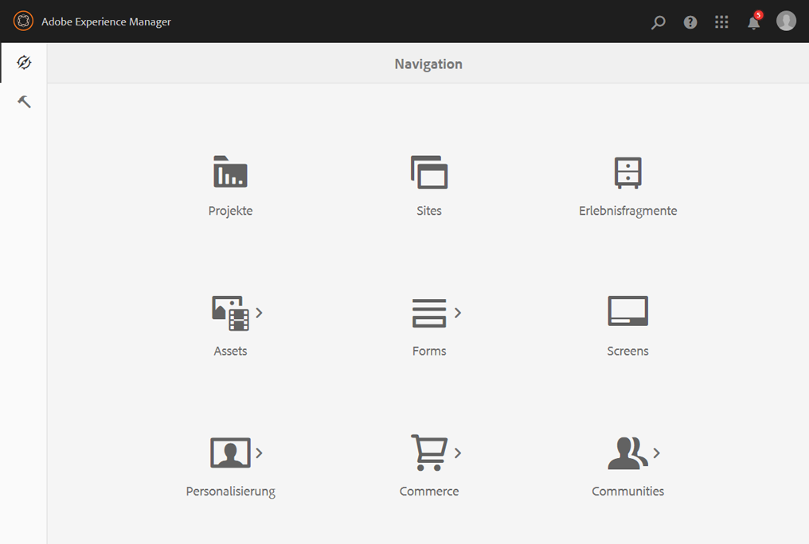

1. Gehen Sie zum gewünschten Ordner und klicken Sie auf **[!UICONTROL Erstellen]**.

1. Wählen Sie **[!UICONTROL Experience Fragment]** aus, um den Assistenten zum **[!UICONTROL Erstellen von Experience Fragments]** zu öffnen.

   Wählen Sie die gewünschte **[!UICONTROL Vorlage]** aus und klicken Sie auf **[!UICONTROL Weiter]**:

   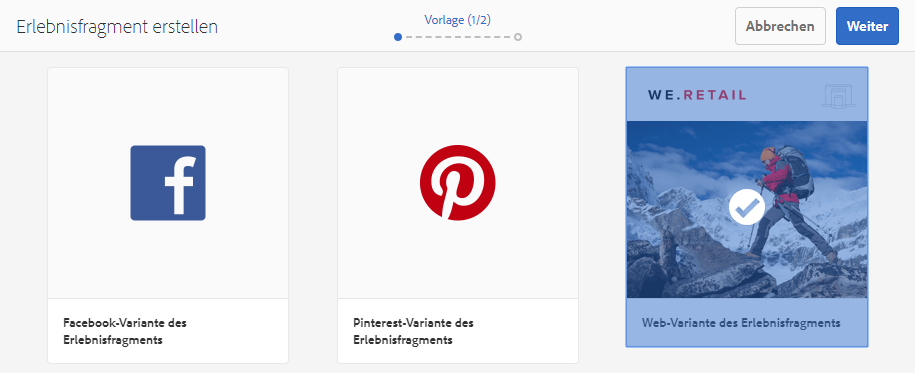

1. Geben Sie die **[!UICONTROL Eigenschaften]** für das Experience Fragment ein.

   A **[!UICONTROL Titel]** ist zwingend erforderlich. Wenn die Variable **[!UICONTROL Name]** leer gelassen wird, wird es aus dem **[!UICONTROL Titel]**.

   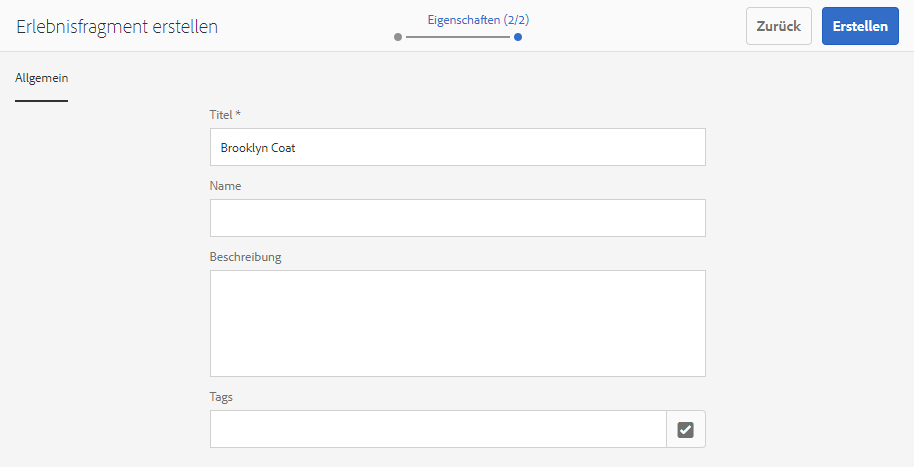

1. Klicken Sie auf **[!UICONTROL Erstellen]**.

   Daraufhin wird eine Nachricht angezeigt. Klicken Sie auf:

   * **[!UICONTROL Fertig]**, um zur Konsole zurückzukehren
   * **[!UICONTROL Öffnen]**, um den Editor für Fragmente zu öffnen

## Bearbeiten eines Experience Fragment {#editing-your-experience-fragment}

Der Experience Fragment Editor bietet Ihnen ähnliche Funktionen wie der normale Seiten-Editor. Siehe [Bearbeiten des Seiteninhalts](/help/sites-authoring/editing-content.md) für weitere Informationen zur Verwendung.

Das folgende Beispielverfahren zeigt, wie ein Teaser für ein Produkt erstellt wird:

1. Ziehen und Ablegen eines **[!UICONTROL Kategorie-Teaser]** von [Komponenten-Browser](/help/sites-authoring/author-environment-tools.md#components-browser).

   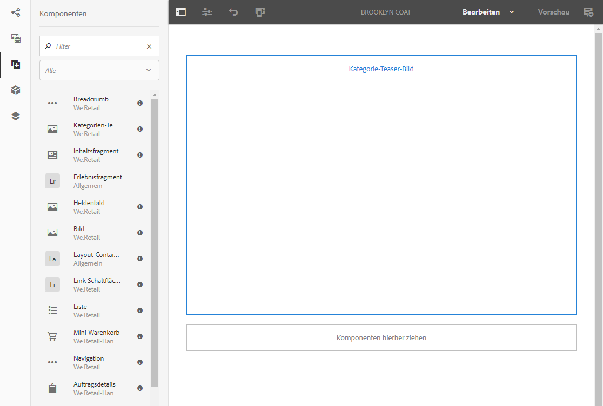

1. Auswählen **[[!UICONTROL Konfigurieren]](/help/sites-authoring/editing-content.md#edit-configure-copy-cut-delete-paste)** aus der Komponenten-Symbolleiste.
1. Fügen Sie das **[!UICONTROL Asset]** hinzu und definieren Sie die **[!UICONTROL Eigenschaften]** nach Bedarf.
1. Validieren Sie die Definitionen mit **[!UICONTROL Fertig]** (Häkchensymbol).
1. Fügen Sie bei Bedarf weitere Komponenten hinzu.

## Erstellen einer Experience Fragment-Variante {#creating-an-experience-fragment-variation}

Je nach Bedarf können Sie Varianten Ihres Experience Fragment erstellen:

1. Öffnen Sie das Fragment für [Bearbeiten](/help/sites-authoring/experience-fragments.md#editing-your-experience-fragment).
1. Öffnen Sie die Registerkarte **[!UICONTROL Varianten]**.

   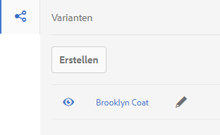

1. **Erstellen** ermöglicht Ihnen Folgendes zu erstellen:

   * **[!UICONTROL Variante]**
   * **[!UICONTROL Variante als Live Copy]**

1. Definieren Sie die erforderlichen Eigenschaften:

   * **[!UICONTROL Vorlage]**
   * **[!UICONTROL Titel]**
   * **[!UICONTROL Name]**; Wenn Sie das Feld leer lassen, wird es aus dem Titel abgeleitet
   * **[!UICONTROL Beschreibung]**
   * **[!UICONTROL Varianten-Tags]**

   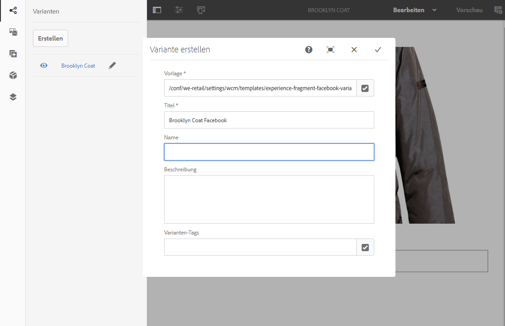

1. Bestätigen Sie Ihre Auswahl mit der Option **[!UICONTROL Fertig]** (Häkchen). Daraufhin wird die neue Variante im Bedienfeld angezeigt:

   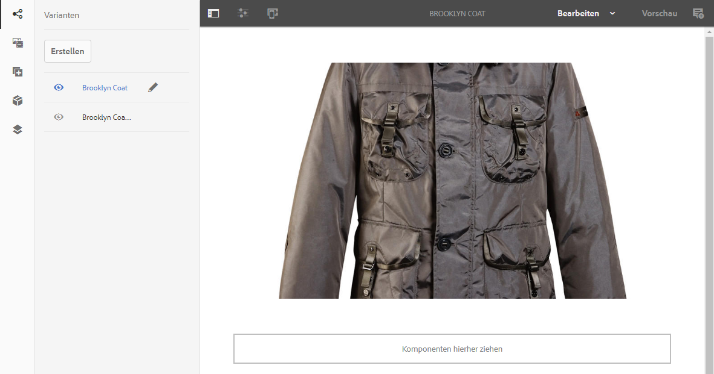

## Verwenden eines Experience Fragment {#using-your-experience-fragment}

Sie können Ihr Experience Fragment jetzt beim Erstellen Ihrer Seiten verwenden:

1. Öffnen Sie eine beliebige Seite zur Bearbeitung.

   Beispiel: [http://localhost:4502/editor.html/content/we-retail/language-masters/en/products/men.html](http://localhost:4502/editor.html/content/we-retail/language-masters/en/products/men.html)

1. Erstellen Sie eine Instanz der Experience-Fragment-Komponente, indem Sie die Komponente aus dem Komponenten-Browser auf das Seitenabsatzsystem ziehen:

   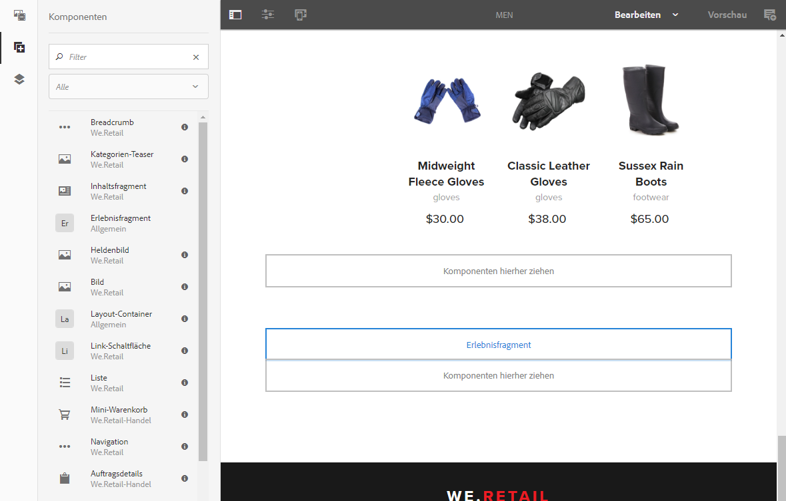

1. Fügen Sie das eigentliche Experience Fragment zur Komponenteninstanz hinzu, indem Sie einen der folgenden Schritte ausführen:

   * Ziehen Sie das gewünschte Fragment vom Asset-Browser auf die Komponente
   * Wählen Sie in der Komponenten-Symbolleiste die Option **[!UICONTROL Konfigurieren]** und geben Sie das zu verwendende Fragment an. Bestätigen Sie Ihre Auswahl mit der Option **Fertig** (Häkchen).

   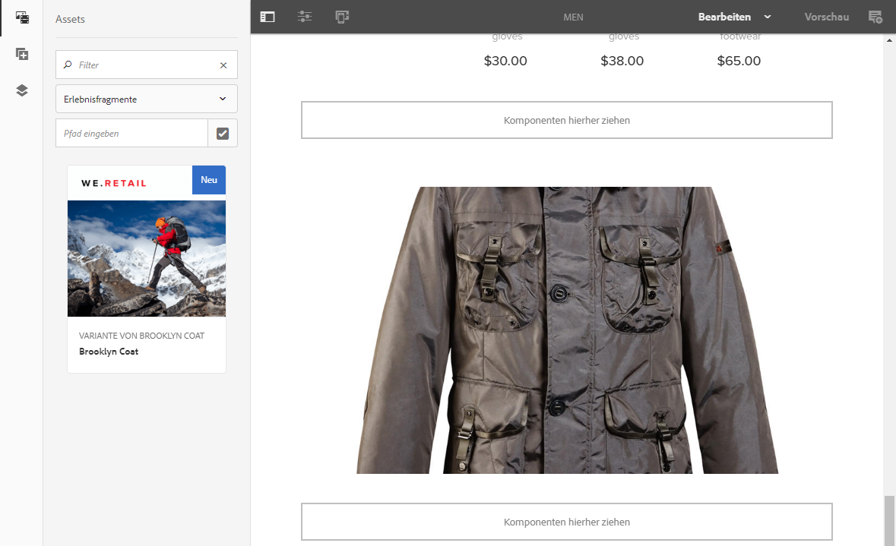

   >[!NOTE]
   >
   >In der Komponenten-Symbolleiste dient die Option „Bearbeiten“ als Kurzbefehl zum Öffnen eines Fragments im Editor für Fragmente.

## Bausteine {#building-blocks}

Sie können eine oder mehrere Komponenten auswählen, um einen Baustein zur Wiederverwendung in Ihrem Fragment zu erstellen:

### Erstellen eines Bausteins {#creating-a-building-block}

So erstellen Sie einen neuen Baustein:

1. Wählen Sie im Experience Fragment-Editor die Komponenten aus, die Sie wiederverwenden möchten:

   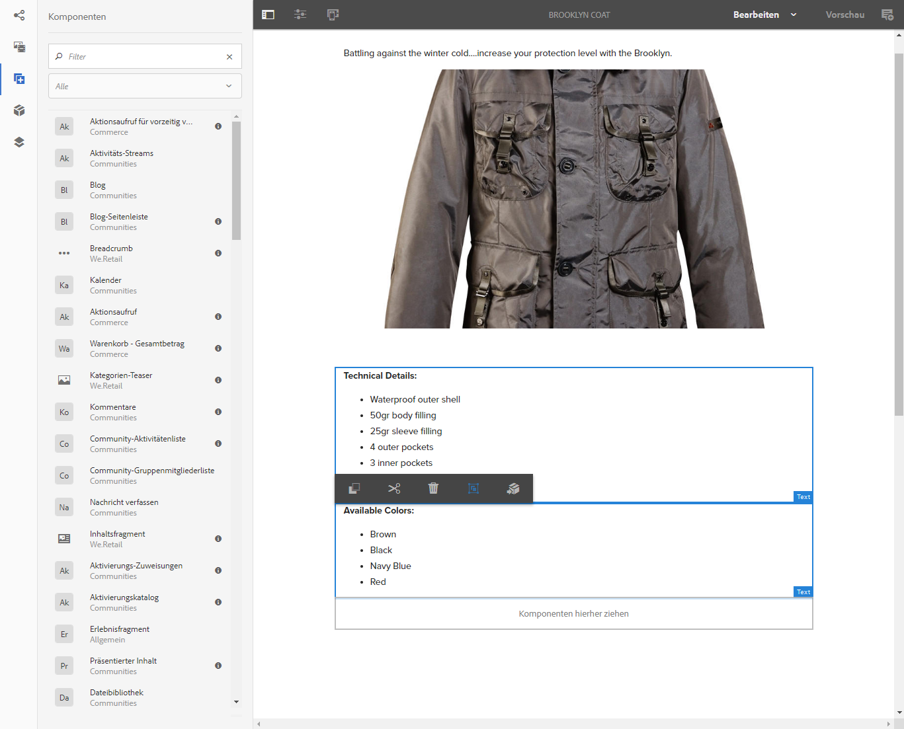

1. Wählen Sie in der Komponenten-Symbolleiste die Option **[!UICONTROL In Baustein umwandeln]** aus:

   

   Beispiel:

   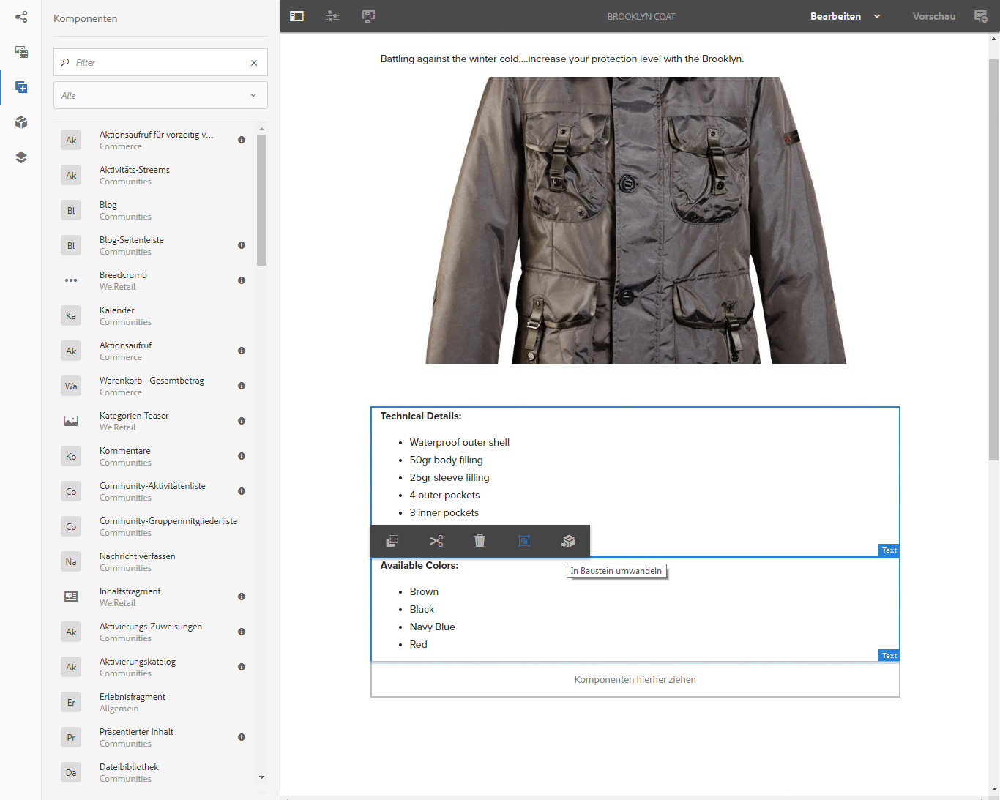

1. Geben Sie den **[!UICONTROL Namen des Bausteins]** ein und bestätigen Sie ihn mit der Option **[!UICONTROL Konvertieren]**:

   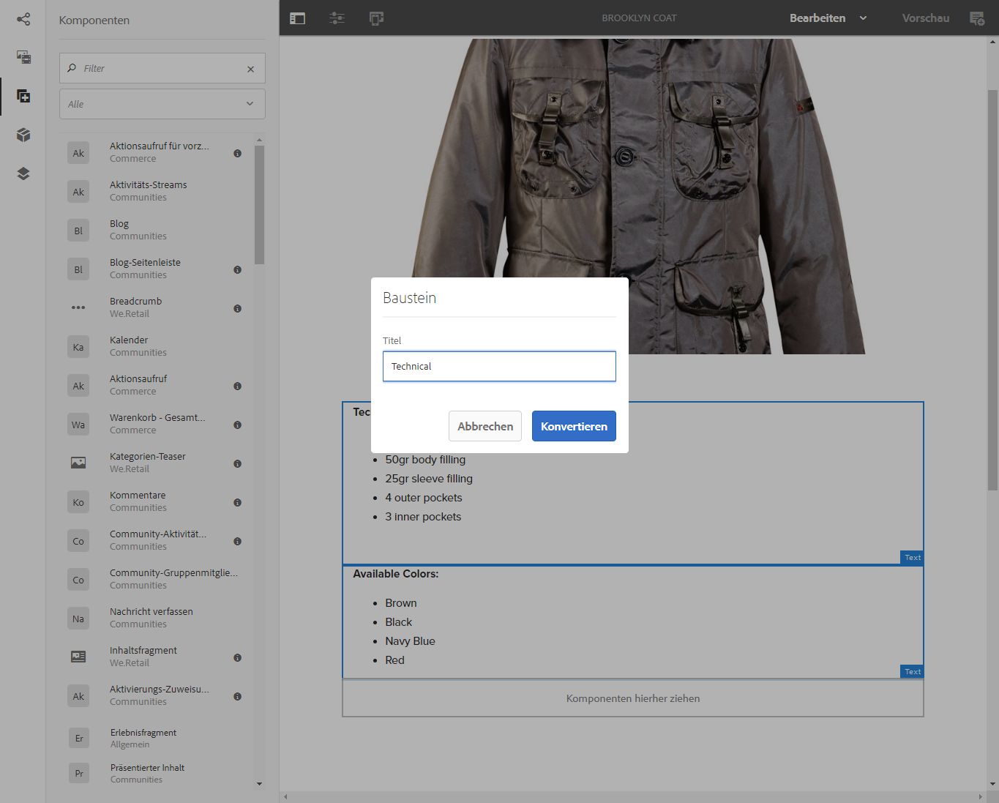

1. Der **Baustein** wird auf der Registerkarte angezeigt und kann im Absatzsystem ausgewählt werden:

   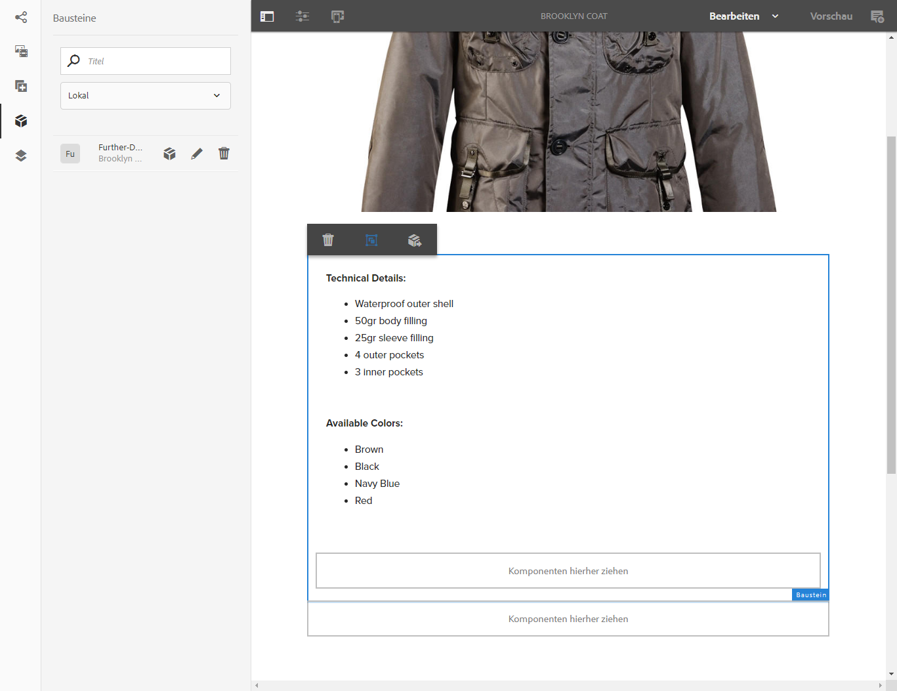

### Verwalten eines Bausteins {#managing-a-building-block}

Ihr Baustein wird im **[!UICONTROL Bausteine]** Registerkarte. Für jeden Block sind folgende Aktionen verfügbar:

* Zur Hauptvariante wechseln: zum Öffnen der Hauptvariante in einer neuen Registerkarte
* Umbenennen
* Löschen

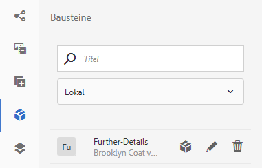

### Verwenden eines Bausteins {#using-a-building-block}

Sie können den Baustein wie bei jeder anderen Komponente auch in das Absatzsystem eines beliebigen Fragments ziehen.

## Einfache HTML-Ausgabedarstellung {#the-plain-html-rendition}

Mit dem `.plain.`-Selektor in der URL können Sie auf die einfache HTML-Ausgabe zugreifen.

Diese ist über den Browser verfügbar, aber ihr Hauptzweck ist es, anderen Applikationen (beispielsweise Web-Applikationen von Drittanbietern oder benutzerdefinierten mobilen Implementierungen) den direkten Zugriff auf den Inhalt des Experience Fragment zu ermöglichen, und zwar allein über die URL.

Die einfache HTML-Ausgabedarstellung fügt den Protokoll-, Host- und Kontextpfad zu Pfaden hinzu, die:

* den folgenden Typ aufweisen: `src`, `href` oder `action`

* oder folgendermaßen enden: `-src` oder `-href`

Beispiel:

`.../brooklyn-coat/master.plain.html`

>[!NOTE]
>
>Links verweisen immer auf die Veröffentlichungsinstanz. Sie sollen von Dritten genutzt werden, sodass der Link immer von der Veröffentlichungsinstanz und nicht vom Autor aufgerufen wird.

## Exportieren von Experience Fragments {#exporting-experience-fragments}

Standardmäßig werden Experience Fragments im HTML-Format bereitgestellt. Dies kann sowohl von AEM als auch von Drittanbieterkanälen verwendet werden.

Für den Export nach Adobe Target wird HTML verwendet. Vollständige Informationen finden Sie unter [Target-Integration mit Experience Fragments](/help/sites-administering/experience-fragments-target.md).
