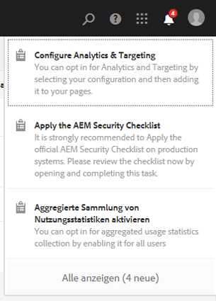
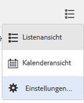
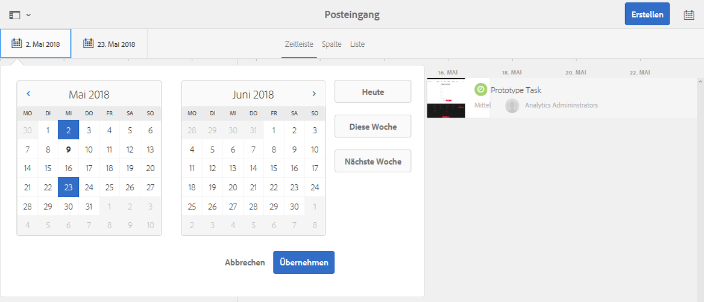
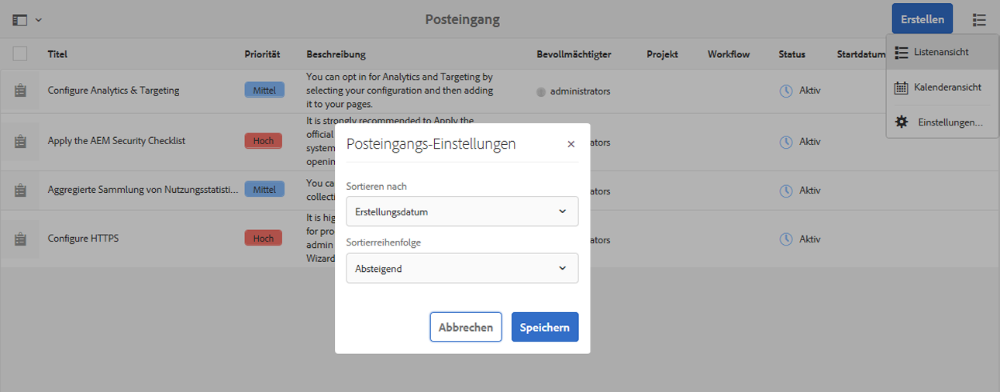
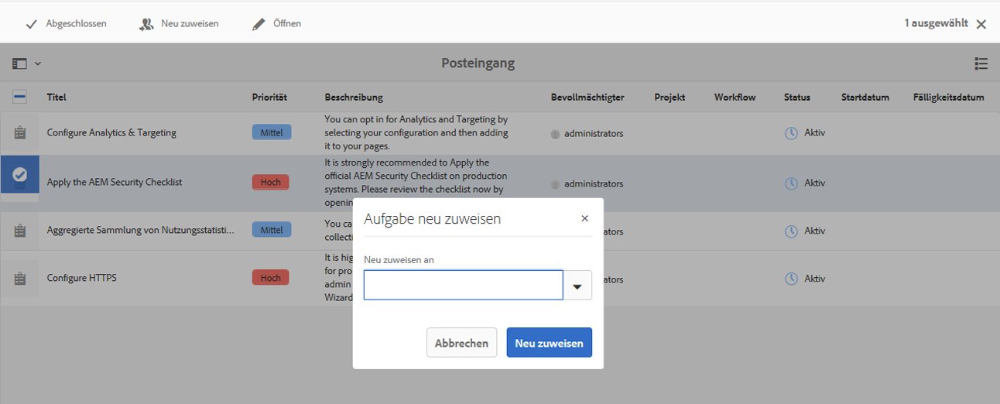
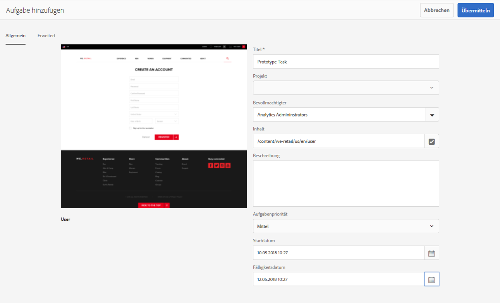
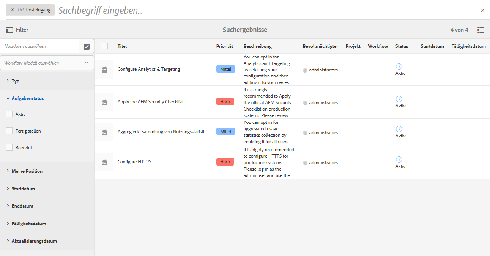

# Ihr Posteingang {#your-inbox}

Sie können Benachrichtigungen aus verschiedenen Bereichen von AEM erhalten (darunter auch aus Workflows und Projekten), z. B. Benachrichtigungen bezüglich:

* Aufgaben:

   * Diese können in diversen Bereichen der Benutzeroberfläche von AEM erstellt werden, z. B. unter **Projekte**.
   * Diese können das Ergebnis der Workflow-Schritte **Aufgabe erstellen** oder **Projektaufgabe erstellen** sein.

* Workflows:

   * Arbeitselemente, die für Aktionen stehen, die Sie auf den Seiteninhalt ausführen müssen.

      * Diese sind das Ergebnis des Workflow-Schritts **Teilnehmer**.
   * Fehlgeschlagene Elemente, die Administratoren darauf hinweisen, einen fehlgeschlagenen Schritt erneut auszuführen

Sie erhalten diese Benachrichtigung in Ihrem eigenen Posteingang, in dem Sie diese anzeigen und darauf reagieren können.

>[!NOTE]
>
>AEM enthält vorab installierte Verwaltungsaufgaben, die für die Benutzergruppe der Administratoren bestimmt sind. Weitere Informationen finden Sie unter [Standardmäßige Verwaltungsaufgaben](#out-of-the-box-administrative-tasks).

>[!NOTE]
>
>Weitere Informationen zu den Elementtypen finden Sie außerdem unter:
>
>* [Projekte](/help/sites-authoring/touch-ui-managing-projects.md)
>* [Projekte – Arbeiten mit Aufgaben](/help/sites-authoring/task-content.md)
>* [Workflows](/help/sites-authoring/workflows.md)
>* [Formulare](/help/forms/home.md)

>

## Posteingang in der Kopfzeile {#inbox-in-the-header}

In sämtlichen Konsolen wird in der Kopfzeile die Anzahl der aktuell in Ihrem Posteingang vorhandenen Elemente angezeigt. Sie können diese Anzeige auch öffnen, um schnell auf die Seiten zuzugreifen, auf denen Aktionen nötig sind, oder um den Posteingang aufzurufen.

>[!NOTE]
>
>Bestimmte Aktionen werden auch in der [Kartenansicht der jeweiligen Ressource](/help/sites-authoring/basic-handling.md#card-view) angezeigt.

## Standardmäßige Verwaltungsaufgaben  {#out-of-the-box-administrative-tasks}

AEM beinhaltet vier vorgefertigte Aufgaben, die standardmäßig der Administrator-Benutzergruppe zugewiesen sind.

* [Analysen und Targeting konfigurieren](/help/sites-administering/opt-in.md)
* [AEM-Sicherheitsprüfliste anwenden](/help/sites-administering/security-checklist.md)
* Aggregierte Sammlung von Nutzungsstatistiken aktivieren
* [HTTPS konfigurieren](/help/sites-administering/ssl-by-default.md)

## Öffnen des Posteingangs     {#opening-the-inbox}

So öffnen Sie den Benachrichtigungs-Posteingang in AEM:

1. Klicken/tippen Sie auf die Anzeige in der Symbolleiste.

1. Wählen Sie **Alle anzeigen** aus. Der **AEM-Posteingang** wird geöffnet. Im Posteingang werden Elemente aus den Bereichen Workflows, Projekte und Aufgaben angezeigt.
1. Die Standardansicht ist die [Listenansicht](#inbox-list-view), Sie können aber auch zur [Kalenderansicht ](#inbox-calendar-view)wechseln. Dies erfolgt mit der Ansichtsauswahl (Symbolleiste oben rechts).

   Für beide Ansichten können Sie die [Anzeigeeinstellungen](#inbox-view-settings) festlegen. Die verfügbaren Optionen hängen dabei von der aktuellen Ansicht ab.

   

>[!NOTE]
>
>Der Posteingang fungiert als Konsole. Verwenden Sie daher die [globale Navigation](/help/sites-authoring/basic-handling.md#global-navigation) oder die [Suche](/help/sites-authoring/search.md), um zu einer anderen Position zu navigieren, wenn Sie fertig sind.

### Posteingang – Listenansicht {#inbox-list-view}

In dieser Ansicht sind alle Elemente sowie die wichtigsten einem Element zugehörigen, relevanten Informationen aufgelistet.

### Posteingang – Kalenderansicht {#inbox-calendar-view}

In dieser Ansicht werden die Elemente nach Kalenderdatum und entsprechend der von Ihnen ausgewählten Kalenderansicht angezeigt.

Sie haben folgende Möglichkeiten:

* eine bestimmte Ansicht auswählen (**Timeline**,**Spalte** oder **Liste**)

* die Aufgaben festlegen, die gemäß **Plan** angezeigt werden sollen (**Alle**, **Geplant**, **In Bearbeitung**, **Bald fällig** oder **Überfällig**)

* detailliertere Informationen zu einem bestimmten Element anzeigen
* einen Datumsbereich auswählen, um die Anzeige einzugrenzen:

### Posteingang – Anzeigeeinstellungen {#inbox-view-settings}

Sie können für beide Ansichten (Liste und Kalender) Einstellungen festlegen:

* **Kalenderansicht**

   Für die **Kalenderansicht** können Sie Folgendes konfigurieren:

   * **Gruppieren nach**
   * **Zeitplan** oder **Ohne**
   * **Kartengröße**

   

* **Listenansicht**

   Für die **Listenansicht** können Sie die Art der Sortierung konfigurieren:

   * **Sortieren nach**
   * **Sortierreihenfolge**

   

## Anwenden von Aktionen auf ein Element {#taking-action-on-an-item}

1. Um eine Aktion auf ein Element anzuwenden, wählen Sie die Miniatur des gewünschten Elements aus. In der Symbolleiste werden Symbole für die Aktionen angezeigt, die auf das Element angewendet werden können.

   

   Die entsprechend dem ausgewählten Element verfügbaren Aktionen können Folgendes umfassen:

   * **Abschließen** einer Aktion; z. B. eine Aufgabe oder ein Workflow-Element.
   * **Neu zuweisen**/**Delegieren** eines Elements
   * **Öffnen** eines Elements; je nach Elementtyp bewirkt diese Aktion Folgendes:

      * Anzeigen der Eigenschaften des Elements
      * Öffnen des entsprechenden Dashboards oder Assistenten für weitere Aktionen
      * Aufrufen einer zugehörigen Dokumentation
   * **Schritt zurück** zu einem vorherigen Schritt.
   * Anzeigen der Payload eines Workflows.
   * Erstellen eines Projekts auf Basis des Elements.

   >[!NOTE]
   >
   >Weitere Informationen finden Sie unter:
   >
   >* Workflow-Elemente – [Teilnehmen an Workflows](/help/sites-authoring/workflows-participating.md)

1. Abhängig vom ausgewählten Element wird eine bestimmte Aktion gestartet, z. B.:

   * Ein Dialogfeld für die jeweilige Aktion wird geöffnet.
   * Ein Assistent für eine bestimmte Aktion wird gestartet.
   * Eine Dokumentationsseite wird geöffnet.

   Wird etwa die Aktion **Neu zuweisen** ausgeführt, öffnet sich ein Dialogfeld:

   

   Je nachdem, ob ein Dialogfeld, ein Assistent oder eine Dokumentationsseite geöffnet wurde, können Sie Folgendes durchführen:

   * Die entsprechende Aktion (z. B. „Neu zuweisen“) bestätigen.
   * Die Aktion abbrechen.
   * Pfeil nach links; wenn z. B. ein Assistent oder eine Dokumentationsseite geöffnet wurde, können Sie zum Posteingang zurückkehren.

## Erstellen einer Aufgabe {#creating-a-task}

Sie können vom Posteingang aus Aufgaben erstellen:

1. Klicken Sie auf **Erstellen** und anschließend auf **Aufgabe**.
1. Füllen Sie die Felder in den Registerkarten **Allgemein** und **Erweitert** aus. Obligatorisch ist hierbei nur der **Titel**, alle anderen sind optional:

   * **Allgemein**:

      * **Titel**
      * **Projekt**
      * **Bevollmächtigter**
      * **Inhalt**; dies dient, ähnlich wie bei der Nutzlast, als Verweis von der Aufgabe auf eine Position im Repository.
      * **Beschreibung**
      * **Aufgabenpriorität**
      * **Startdatum**
      * **Fälligkeitsdatum**

   

   * **Erweitert**

      * **Name**: Daraus wird die URL gebildet. Wird kein Name angegeben, basiert sie auf dem **Titel**.

   

1. Klicken Sie auf **Übermitteln**.

## Erstellen eines Projekts {#creating-a-project}

Bei einigen Aufgaben besteht die Möglichkeit, auf deren Basis ein [Projekt](/help/sites-authoring/projects.md) zu erstellen:

1. Wählen Sie die gewünschte Aufgabe aus, indem Sie auf die Miniatur tippen/klicken.

   >[!NOTE]
   >
   >Für die Erstellung eines Projekts können nur Aufgaben verwendet werden, die im **Posteingang** über die Option **Erstellen** erstellt wurden.
   >
   >Arbeitselemente (aus einem Workflow) können nicht für die Erstellung eines Projekts verwendet werden.

1. Wählen Sie **Projekt erstellen** aus der Symbolleiste aus, um den Assistenten zu öffnen.
1. Wählen Sie die gewünschte Vorlage und klicken Sie auf **Weiter**.
1. Geben Sie die gewünschten Eigenschaften an:

   * **Allgemein**

      * **Titel**
      * **Beschreibung**
      * **Startdatum**
      * **Fälligkeitsdatum**
      * **Benutzer** und Rolle
   * **Erweitert**

      * **Name**
   >[!NOTE]
   >
   >Ausführliche Informationen hierzu finden Sie unter [Erstellen eines Projekts](/help/sites-authoring/touch-ui-managing-projects.md#creating-a-project).

1. Klicken Sie auf **Erstellen**, um die Aktion zu bestätigen.

## Filtern von Elementen im AEM-Posteingang {#filtering-items-in-the-aem-inbox}

Sie können die aufgeführten Elemente filtern:

1. Öffnen Sie den **AEM-Posteingang**.

1. Öffnen Sie die Filterauswahl:

   

1. Sie können die Elemente nach verschiedenen Kriterien filtern, wobei viele davon weiter eingegrenzt werden können, z. B.:

   

   >[!NOTE]
   >
   >Bei Verwendung der [Listenansicht](#inbox-list-view) können Sie außerdem über die [Anzeigeeinstellungen](#inbox-view-settings) die Sortierreihenfolge festlegen.

