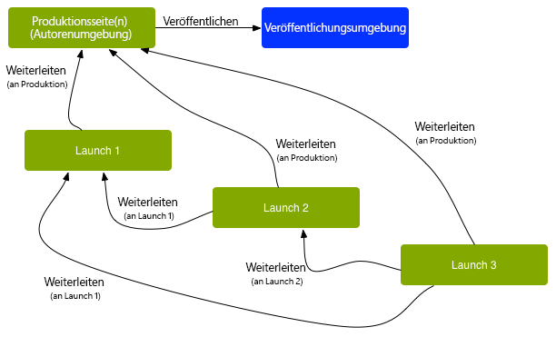

# Weiterleiten von Launches{#promoting-launches}

>[!CAUTION]
>
>AEM 6.4 hat das Ende der erweiterten Unterstützung erreicht und diese Dokumentation wird nicht mehr aktualisiert. Weitere Informationen finden Sie in unserer [technische Unterstützung](https://helpx.adobe.com/de/support/programs/eol-matrix.html). Unterstützte Versionen suchen [here](https://experienceleague.adobe.com/docs/?lang=de).

Sie müssen Launch-Seiten weiterleiten, damit der Inhalt vor der Veröffentlichung wieder in die Quelle (Produktion) verschoben wird. Beim Weiterleiten einer Launch-Seite wird die entsprechende Seite der Quellseiten mit dem Inhalt der weitergeleiteten Seite aktualisiert. Beim Anzeigen einer Launch-Seite stehen die folgenden Optionen zur Verfügung:

* Gibt an, ob nur die aktuelle Seite oder der gesamte Launch weitergeleitet werden soll.
* Gibt an, ob die untergeordneten Seiten der aktuellen Seite weitergeleitet werden sollen.
* Ob der vollständige Launch weitergeleitet werden soll oder nur Seiten, die geändert wurden.

>[!NOTE]
>
>Nach dem Weiterleiten der Launch-Seiten an das Ziel (**Produktion**), können Sie die **Produktion** Seiten als Entität (um den Prozess schneller zu gestalten). Fügen Sie die Seiten einem Workflow-Paket hinzu und verwenden Sie es als Payload für einen Workflow, der ein Paket mit Seiten aktiviert. Sie müssen das Workflow-Paket erstellen, bevor Sie den Launch weiterleiten. Siehe [Verarbeiten weitergeleiteter Seiten mit AEM Workflow](#processing-promoted-pages-using-aem-workflow).

>[!CAUTION]
>
>Ein einzelner Launch kann nicht gleichzeitig beworben werden. Dies bedeutet, dass zwei gleichzeitig ausgeführte Weiterleitungen für denselben Launch einen Fehler verursachen können: `Launch could not be promoted` (zusammen mit Konfliktfehlern im Protokoll).

>[!CAUTION]
>
>Beim Weiterleiten von Launches für *geänderte* Seiten werden Anpassungen sowohl im Quell- als auch im Launch-Zweig berücksichtigt.

## Weiterleiten von Launch-Seiten {#promoting-launch-pages}

>[!NOTE]
>
>Dies umfasst die manuelle Aktion zum Weiterleiten von Launch-Seiten, wenn nur eine Launch-Ebene vorhanden ist. Siehe:
>
>* [Weiterleiten eines verschachtelten Launches](#promoting-a-nested-launch) wenn sich in der Struktur mehrere Launches befinden.
>* [Launches - die Reihenfolge der Ereignisse](/help/sites-authoring/launches.md#launches-the-order-of-events) für weitere Informationen zur automatischen Promotion und Veröffentlichung.
>

Sie können Launches über die **Sites** oder **Starts** console:

1. Öffnen Sie:

   * die **Sites** console:

      1. Öffnen Sie die Leiste [Verweise](/help/sites-authoring/author-environment-tools.md#references) und wählen Sie die gewünschte Quellseite mithilfe des [Auswahlmodus](/help/sites-authoring/basic-handling.md) aus. (Oder wählen Sie die Seite aus und öffnen die Verweisleiste. Die Reihenfolge ist nicht wichtig.) Alle Verweise werden angezeigt.

      1. Auswählen **Starts** (z. B. Starts (1)), um eine Liste der spezifischen Launches anzuzeigen.
      1. Wählen Sie den jeweiligen Launch aus, um die verfügbaren Aktionen anzuzeigen.
      1. Wählen Sie **Launch bewerben** aus, um den Assistenten zu öffnen.
   * die **Launch**-Konsole:

      1. Wählen Sie Ihren Launch aus (tippen/klicken Sie auf die Miniaturansicht).
      1. Wählen Sie **Bewerben** aus.

1. Im ersten Schritt können Sie Folgendes angeben:

   * **Vollständigen Launch bewerben**
   * **Geänderte Seiten bewerben**
   * **Aktuelle Seite bewerben**
   * **Aktuelle Seite und Unterseiten bewerben**

   Wenn beispielsweise nur geänderte Seiten weitergeleitet werden sollen:

   

   >[!NOTE]
   >
   >Dies behandelt einen einzelnen Launch, wenn Sie verschachtelte Launches haben, siehe [Weiterleiten eines verschachtelten Launches](#promoting-a-nested-launch).

1. Auswählen **Nächste** um fortzufahren.
1. Sie können die weiterzuleitenden Seiten überprüfen. Diese Überprüfung hängt vom ausgewählten Seitenbereich ab:

   

1. Wählen Sie **Bewerben** aus.

## Weiterleiten von Launch-Seiten bei der Bearbeitung {#promoting-launch-pages-when-editing}

Wenn Sie eine Launch-Seite bearbeiten, steht die Aktion **Launch bewerben** auch im Bereich **Seiteninformationen** zur Verfügung. Dadurch wird der Assistent geöffnet, um die benötigten Informationen zusammenzustellen.

>[!NOTE]
>
>Diese Option steht für einzelne und [verschachtelte Launches](#promoting-a-nested-launch) zur Verfügung.

## Weiterleiten eines verschachtelten Launches {#promoting-a-nested-launch}

Wenn Sie einen verschachtelten Launch erstellt haben, können Sie ihn wieder an jede der Quellen weiterleiten, auch an die Stammquelle (Produktion).

1. Wie beim [Erstellen eines verschachtelten Starts](/help/sites-authoring/launches-creating.md#creating-a-nested-launch) navigieren Sie entweder über die Konsole **Launches** oder die Leiste **Verweise** zum gewünschten Launch und wählen diesen aus.
1. Wählen Sie **Launch bewerben** aus, um den Assistenten zu öffnen.

1. Geben Sie die erforderlichen Details ein:

   * **Ziel der Promotion**

      Sie können an eine beliebige Quelle weiterleiten.

   * **Bereich** Hier können Sie auswählen, ob der gesamte Launch weitergeleitet werden soll oder nur die Seiten, die bearbeitet wurden. Im zweiten Fall können Sie dann auswählen, welche Unterseiten einbezogen bzw. ausgeschlossen werden. Die Standardkonfiguration besteht darin, nur Seitenänderungen für die aktuelle Seite weiterzuleiten:

      * **Vollständigen Launch bewerben**
      * **Geänderte Seiten bewerben**
      * **Aktuelle Seite bewerben**
      * **Aktuelle Seite und Unterseiten bewerben**

   

1. Wählen Sie **Weiter** aus.
1. Überprüfen Sie die Details, bevor Sie **Bewerben** auswählen:

   

   >[!NOTE]
   >
   >Die aufgeführten Seiten hängen von der **Anwendungsbereich** definiert und möglicherweise die Seiten, die tatsächlich bearbeitet wurden.

1. Ihre Änderungen werden gefördert und in der **Starts** console:

   

## Bearbeiten weitergeleiteter Seiten mit einem AEM-Workflow {#processing-promoted-pages-using-aem-workflow}

Verwenden Sie Workflow-Modelle, um eine Massenverarbeitung von beworbenen Launches-Seiten durchzuführen:

1. Erstellen Sie ein Workflow-Paket.
1. Wenn Autoren Launch-Seiten weiterleiten, speichern sie sie im Workflow-Paket.
1. Starten Sie ein Workflow-Modell mit dem -Paket als Payload.

So starten Sie einen Workflow automatisch, wenn Seiten weitergeleitet werden: [Konfigurieren eines Workflow-Starters](/help/sites-administering/workflows-starting.md#workflows-launchers) für den Paketknoten.

Sie können z. B. automatisch Seitenaktivierungsanfragen generieren, wenn Autoren Launches-Seiten weiterleiten. Konfigurieren Sie einen Workflow-Starter, um den Workflow Anforderungsaktivierung zu starten, wenn der Paketknoten geändert wird.

