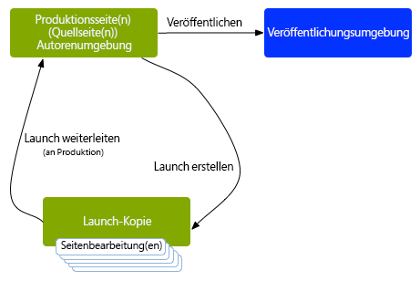
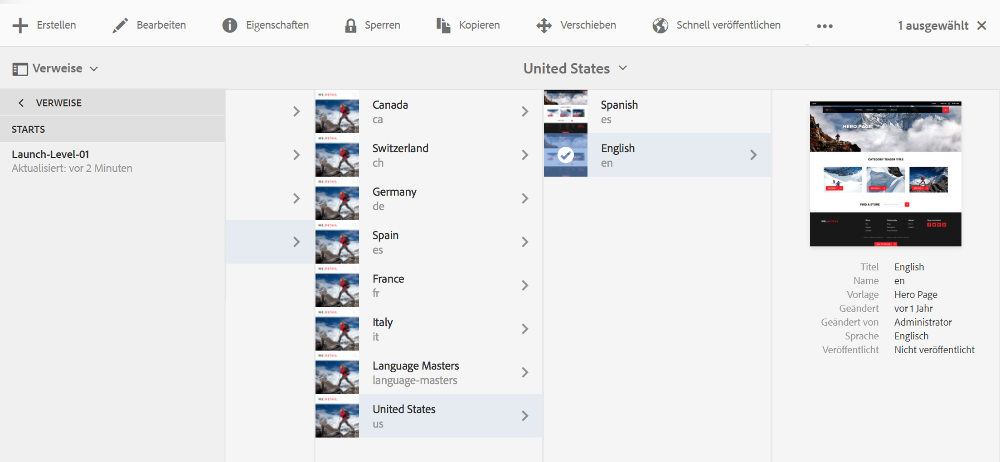
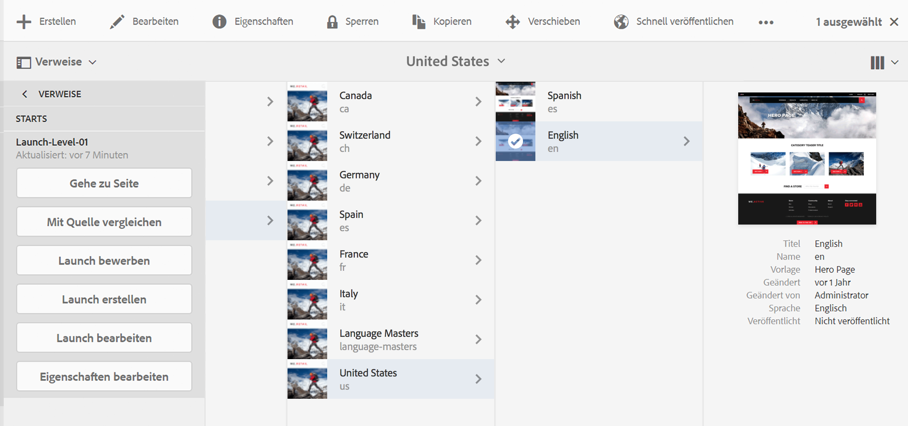

# Launches Übersicht{#launches}

Mithilfe von Launches können Sie effizient Inhalte für eine künftige Version entwickeln.

Ein Launch wird erstellt, damit Sie (unter Beibehaltung der aktuellen Seiten) Änderungen für eine spätere Veröffentlichung vornehmen können. Wenn Sie die Launch-Seiten bearbeitet und aktualisiert haben, leiten Sie diese wieder zurück in die Quelle und aktivieren dann die Quellseiten (auf der obersten Ebene). Durch das Weiterleiten (Bewerben) wird der Launch-Inhalt auf den Quellseiten dupliziert. Dieser Vorgang kann entweder manuell oder automatisch erfolgen. (Dies hängt davon ab, welche Felder beim Erstellen und Bearbeiten des Launches festgelegt werden.)

Beispiel: Die saisonalen Produktseiten in Ihrem Online-Shop werden einmal pro Quartal aktualisiert, damit die präsentierten Produkte der aktuellen Saison entsprechen. Zur Vorbereitung auf die nächste Quartals-Aktualisierung können Sie einen Launch der relevanten Web-Seiten erstellen. Während des Quartals werden die folgenden Änderungen in der Launch-Kopie gesammelt:

* Änderungen an den Quellseiten, die die Folge normaler Wartungsarbeiten sind. Diese Änderungen werden automatisch in den Launch-Seiten dupliziert.
* Bearbeitungen, die in Vorbereitung auf das nächste Quartal direkt an den Launch-Seiten vorgenommen werden.

Wenn ein neues Quartal beginnt, leiten Sie die Launch-Seiten weiter, damit Sie die Quellseiten veröffentlichen können, die den aktualisierten Inhalt enthalten. Sie können entweder alle Seiten weiterleiten oder nur die Seiten, die Sie geändert haben.

Launches können auch:

* für mehrere Stammverzweigungen erstellt werden. Zwar können Sie den Launch für die gesamte Site erstellen (und die Änderungen dort implementieren), allerdings kann dies sehr umständlich sein, da die ganze Site kopiert werden muss. Wenn Hunderte oder sogar Tausende von Seiten beteiligt sind, wirken sich das Kopieren und später auch die für das Bewerben erforderlichen Vergleiche nachteilig auf die Systemanforderungen und die Leistung aus.
* verschachtelt angelegt werden (Launch innerhalb eines Launches). So erhalten Sie die Möglichkeit, einen Launch von einem vorhandenen Launch aus zu erstellen, sodass Autoren bereits vorgenommene Änderungen nutzen können, anstatt dieselben Änderungen für jeden Launch erneut vorzunehmen.

In diesem Abschnitt wird beschrieben, wie Sie Launch-Seiten innerhalb der Sites-Konsole oder der [Launch-Konsole](#the-launches-console) erstellen, bearbeiten und weiterleiten (und bei Bedarf [löschen](/help/sites-authoring/launches-creating.md#deleting-a-launch)):

* [Erstellen von Launches](/help/sites-authoring/launches-creating.md)
* [Bearbeiten von Launches](/help/sites-authoring/launches-editing.md)
* [Weiterleiten von Launches](/help/sites-authoring/launches-promoting.md)

## Der Ablauf eines Launches {#launches-the-order-of-events}

Mit Launches können Sie effizient den Inhalt für eine zukünftige Veröffentlichung einer oder mehrerer aktivierter Web-Seiten entwickeln.

Launches ermöglichen Folgendes:

* Erstellen Sie eine Kopie Ihrer Quellseiten:

   * Die Kopie ist Ihr Launch.
   * Die Quellseiten der höchsten Stufe werden als **Produktion** bezeichnet.

      * Die Quellseiten können aus mehreren (verschiedenen) Verzweigungen stammen.
   >[!CAUTION]
   >
   >Mehrere Quellseiten für einen Launch sind in der klassischen Benutzeroberfläche nicht möglich.

   

* Bearbeiten Sie die Launch-Konfiguration:

   * Sie können Seiten bzw. Verzweigungen zum Launch hinzufügen oder daraus entfernen.
   * Sie können Launch-Eigenschaften bearbeiten, z. B. **Titel**, **Launch-Datum** und die Markierung **Produktionsbereit**.

* Manuelles oder automatisches Weiterleiten und Veröffentlichen des Inhalts:

   * Manuell:

      * Leiten Sie Ihren Launch-Inhalt wieder an das **Ziel** (Quellseiten) zurück, wenn er veröffentlichungsreif ist.
      * Veröffentlichen Sie den Inhalt von den Quellseiten (nachdem die Seiten weitergeleitet wurden).
      * Leiten Sie entweder alle Seiten oder nur die überarbeiteten Seiten weiter.
   * Automatisch (dies beinhaltet Folgendes):

      * Das Feld **Launch-Datum** (**Live**-**Datum)**: Dieses Feld kann beim Erstellen oder Bearbeiten eines Launches festgelegt werden.
      * Das Flag **Produktionsbereit**: Dies kann nur beim Bearbeiten eines Launches festgelegt werden.
      * Wenn das Flag **Produktionsbereit** gesetzt wurde, wird der Launch automatisch am angegebenen **Launch-Datum** (**Live**-**Datum**) an die Produktionsseiten weitergeleitet. Nach der Promotion werden die Produktionsseiten automatisch veröffentlicht.

         Wenn kein Datum ausgewählt wurde, hat die Markierung keine Auswirkungen.

* Paralleles Aktualisieren der Quell- und Launch-Seiten:

   * Änderungen an den Quellseiten werden automatisch in der Launch-Kopie implementiert (wenn sie mit Vererbung eingerichtet wurden, z. B. in Form einer Live Copy).
   * Änderungen an der Launch-Kopie können ohne Störung dieser automatischen Aktualisierungen oder der Quellseiten vorgenommen werden.

   

* [Erstellen eines verschachtelten Launches](/help/sites-authoring/launches-creating.md#creating-a-nested-launch) (Launch innerhalb eines Launches):

   * Die Quelle ist ein vorhandener Launch.
   * Sie können einen [verschachtelten Launch](/help/sites-authoring/launches-promoting.md#promoting-a-nested-launch) an jedes Ziel weiterleiten. Dabei kann es sich um einen übergeordneten Launch oder die Quellseiten der obersten Ebene (Produktion) handeln.

   

   >[!CAUTION]
   >
   >Durch Löschen eines Launches werden der Launch selbst sowie alle nachfolgenden verschachtelten Launches entfernt.

>[!NOTE]
>
>Für das Erstellen und Bearbeiten von Launches sind Zugriffsrechte auf `/content/launches` erforderlich (wie bei der Standardgruppe `content-authors`).
>
>Wenden Sie sich an Ihren Systemadministrator, falls Probleme auftreten.

### Die Konsole „Launches“  {#the-launches-console}

Die Konsole „Launches“ bietet eine Zusammenfassung Ihrer Launches und ermöglicht es Ihnen, die aufgeführten Aktionen auszuführen. Auf die Konsole kann wie folgt zugegriffen werden:

* über die Konsole **Tools**: **Tools** > **Sites** > **Launches**.

* oder direkt mit [http://localhost:4502/libs/launches/content/launches.html](http://localhost:4502/libs/launches/content/launches.html)

## Launches in „Verweise“ (Sites-Konsole) {#launches-in-references-sites-console}

1. Navigieren Sie in der Konsole **Sites** zur Quelle der Launches.
1. Öffnen Sie die Leiste **Verweise** und wählen Sie die Quellseite aus.
1. Wählen Sie **Launches** aus. Die vorhandenen Launches werden aufgeführt:

   

1. Tippen/klicken Sie auf den entsprechenden Launch. Die Liste der möglichen Aktionen wird angezeigt:

   
