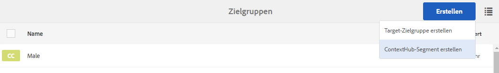
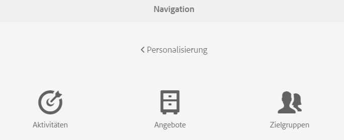

# Verwalten von Zielgruppen{#managing-audiences}

Mithilfe der Zielgruppenkonsole können Sie Zielgruppen für Ihr Adobe Target-Konto erstellen, organisieren und verwalten oder Segmente für ContextHub oder Client Context verwalten:

* Fügen Sie Zielgruppen hinzu – entweder Adobe Target-Zielgruppen oder ContextHub-Segmente.
* Verwalten Sie Zielgruppen.

An Audiences, called *segment* in ContextHub and Client Context, is a class of visitors defined by specific criteria, which then determines who sees a targeted activity. Beim Targeting von Aktivitäten können Zielgruppen entweder direkt während des Targeting-Verfahrens ausgewählt oder neue Zielgruppen in der Konsole „Zielgruppen“ erstellt werden.

In der Konsole „Zielgruppen“ werden Zielgruppen nach Marken geordnet.

Audiences are available in Targeting mode for [authoring targeted content](/help/sites-authoring/content-targeting-touch.md), where you can also create audiences (but you need to create Adobe Target audiences in the Audiences console). Im Targeting-Modus erstellte Zielgruppen werden in der Konsole „Zielgruppen“ aufgeführt.

Zielgruppen werden mit einer Beschriftung versehen, die beschreibt, um welche Zielgruppenart es sich handelt:

* CH – ContextHub-Segment
* CC – Client Context-Segment
* AT – Adobe Target-Zielgruppe

## Erstellen von ContextHub-Segmenten mit der Zielgruppenkonsole {#creating-a-contexthub-segment-in-the-audiences-console}

Sie können ContextHub-Segmente entweder in der Zielgruppenkonsole oder während des Targeting-Verfahrens erstellen.

So erstellen Sie ContextHub-Segmente in der Zielgruppenkonsole:

1. Klicken oder tippen Sie in der Navigationskonsole auf **Personalisierung**. Click or tap **Audiences**.
1. Klicken oder tippen Sie auf **ContextHub-Segment erstellen**.

   

1. Geben Sie im Dialogfeld **Neues ContextHub-Segment** einen Titel ein, passen Sie die Verstärkung an und klicken Sie auf **Erstellen**. Das neue ContextHub-Segment erscheint in der Zielgruppenliste.

   >[!NOTE]
   >
   >Sie können die geänderte Liste sortieren, indem Sie auf **Geändert** tippen/klicken, um eine neu erstellte Zielgruppe in absteigender Reihenfolge anzuzeigen.

Weitere Informationen zum Erstellen von Segmenten mit ContextHub finden Sie in der Dokumentation [Konfiguration der Segmentierung mit ContextHub](/help/sites-administering/segmentation.md).

## Erstellen von Adobe Target-Zielgruppen mit der Zielgruppenkonsole {#creating-an-adobe-target-audience-using-the-audience-console}

Sie können Adobe Target-Zielgruppen mithilfe der Zielgruppenkonsole direkt in AEM erstellen.

Zielgruppen werden durch Regeln definiert, die bestimmen, wer in eine Zielgruppenaktivität eingeschlossen wird. Eine Zielgruppendefinition kann mehrere Regeln enthalten, wobei die einzelnen Regeln wiederum mehrere Parameter aufweisen können.

Arbeiten Sie mit mehr als einer Regel, werden diese Regeln durch den booleschen Operator UND verknüpft. Das bedeutet, dass jedes potenzielle Mitglied der Zielgruppe alle festgelegten Bedingungen erfüllen muss, um in die Aktivität aufgenommen werden zu können. Wenn Sie zum Beispiel eine Betriebssystemregel und eine Browserregel definieren, werden nur die Besucher, die sowohl das definierte Betriebssystem als auch den definierten Browser verwenden, in die Aktivität aufgenommen.

>[!NOTE]
>
>Wenn Sie im Menü **Erstellen** keine Zielgruppe **erstellen** sehen, verfügen Sie nicht über die erforderlichen Berechtigungen zum Erstellen einer Zielgruppe. You need write permissions under **/etc/segmentation** to be able to create audiences. Die Inhaltsautoren der Gruppe haben standardmäßig Schreibberechtigungen.

So erstellen Sie eine Adobe Target-Zielgruppe:

1. Klicken oder tippen Sie in der Navigationskonsole auf **Personalisierung**. Click or tap **Audiences**.

   

1. Klicken oder tippen Sie in der Navigationskonsole auf **Erstellen** und anschließend auf **Target-Zielgruppe erstellen**.

   

1. Wählen Sie im Dialogfeld **Adobe Target-Konfiguration** die Zielkonfiguration aus und klicken oder tippen Sie auf **OK**.
1. Klicken oder tippen Sie im Bereich „Regel#1“ auf den Attributtyp und geben Sie Attributinformationen in die verfügbaren Felder ein. Nach getätigter Eingabe müssen Sie das Häkchen rechts des Attributs auswählen, um die Eingaben zu speichern. Weitere Informationen zu allen Attributen finden Sie unter [Attribute und zugehörige Optionen](#attributes-and-their-options).
1. Klicken Sie auf **Regel hinzufügen**, um eine weitere Regel hinzuzufügen. Geben Sie so viele Regeln wie erforderlich ein. Regeln werden mit dem booleschen Operator UND kombiniert. Das bedeutet, dass die Zielgruppe alle Anforderungen jeder Regel erfüllen muss, um für eine Aktivität zugelassen zu werden.
1. Tippen oder klicken Sie auf **Weiter**.
1. Geben Sie einen Namen für die Zielgruppe ein und tippen oder klicken Sie auf **Speichern**.
1. Tippen oder klicken Sie auf **Speichern**. Ihre Zielgruppe wird nun in der Zielgruppenliste angezeigt.

### Attribute und zugehörige Optionen {#attributes-and-their-options}

Sie können Targeting-Regeln für jedes der folgenden Attribute erstellen:

| **Attribut** | **Beschreibung** | **Für weitere Informationen** |
|---|---|---|
| **Mobil** | Target-Mobilgeräte auf Basis von Parametern wie Mobilgerät, Gerätetyp, Geräteanbieter, Bildschirmmaße (in Pixeln) usw. | Weitere Informationen finden Sie in der [Dokumentation](https://marketing.adobe.com/resources/help/en_US/target/target/c_mobile.html) von Adobe Target. |
| **Benutzerdefiniert** | Benutzerdefinierte Parameter sind mbox-Parameter. Wenn Sie Mbox-Parameter an Mboxes übergeben oder die Funktion „targetPageParams“ verwenden, werden diese Parameter hier angezeigt und können in Zielgruppen verwendet werden. | Weitere Informationen finden Sie in der [Dokumentation zu benutzerdefinierten Parametern](https://marketing.adobe.com/resources/help/en_US/target/target/c_custom_parameters.html) für Adobe Target. |
| **BS** | Sie können Benutzer, die ein bestimmtes Betriebssystem verwenden, als Ziel auswählen. | Richten Sie ihre Inhalte auf Benutzer aus, die Linux, Macintosh oder Windows verwenden. |
| **Seiten der Site** | Targeting von Besuchern, die sich auf einer bestimmten Seite befinden oder die einen bestimmten Mbox-Parameter aufweisen. | See [Site Pages documentation](https://marketing.adobe.com/resources/help/en_US/target/target/c_site_pages.html) at Adobe Target. |
| **Browser** | Sie können Benutzer, die einen speziellen Browser oder spezielle Browseroptionen beim Besuch Ihrer Seite verwenden, als Ziel auswählen. | See [Browser options documentation](https://marketing.adobe.com/resources/help/en_US/target/target/c_browser_options.html)at Adobe Target. |
| **Besucherprofil** | Target-Besucher, die bestimmte Profilparameter erfüllen. | See [Visitor Profile documentation](https://marketing.adobe.com/resources/help/en_US/target/target/c_visitor_profile.html) at Adobe Target. |
| **Traffic-Quellen** | Targeting von Besuchern auf Grundlage der Suchmaschine oder Einstiegsseite, von der sie auf Ihre Site geleitet werden | See [Traffic Sources documentation](https://marketing.adobe.com/resources/help/en_US/target/target/c_traffic_sources.html) at Adobe Target. |

## Bearbeiten von Zielgruppen mithilfe der Zielgruppenkonsole {#modifying-an-audience-in-the-audiences-console}

>[!NOTE]
>
>Sie können nur Adobe Target-Zielgruppen ändern, die in der AEM-Instanz erstellt wurden, in der Sie gerade arbeiten. Target-Zielgruppen, die in anderen AEM-Umgebungen erstellt wurden, lassen sich nicht bearbeiten.

ContextHub- oder Client Context-Zielgruppen lassen sich beliebig mit der Zielgruppenkonsole bearbeiten. Sie können zudem Adobe Target-Zielgruppen bearbeiten, jedoch nur diejenigen, die in AEM erstellt wurden:

1. Klicken oder tippen Sie in der Navigationskonsole auf **Personalisierung**. Click or tap **Audiences**.
1. Klicken oder tippen Sie auf das Symbol neben dem zu bearbeitenden ContextHub- oder Client Context-Segment und tippen oder klicken Sie auf **Bearbeiten**.
1. Bearbeiten Sie die gewünschten Einstellungen im Editor. Weitere Informationen finden Sie in der Dokumentation für [Client Context](/help/sites-administering/campaign-segmentation.md) oder [ContextHub](/help/sites-administering/contexthub-config.md).

