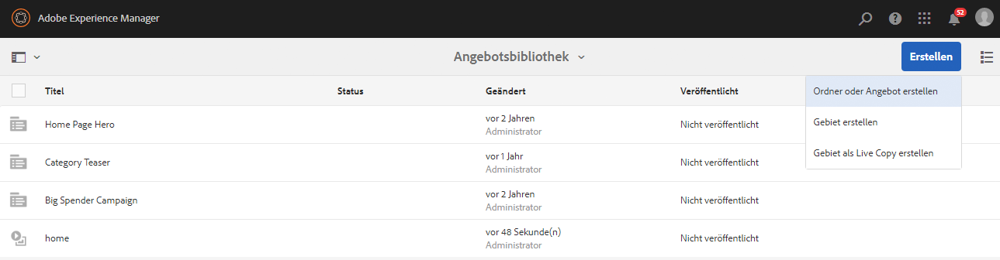
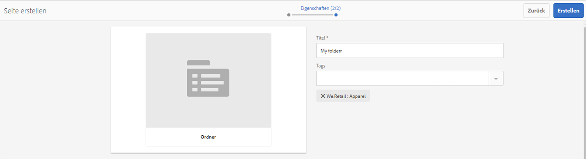
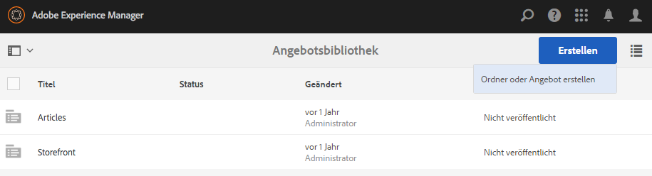
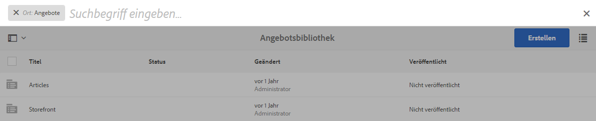

# Erstellen und Verwalten von Angeboten{#creating-and-managing-offers}

>[!CAUTION]
>
>AEM 6.4 hat das Ende der erweiterten Unterstützung erreicht und diese Dokumentation wird nicht mehr aktualisiert. Weitere Informationen finden Sie in unserer [technische Unterstützung](https://helpx.adobe.com/de/support/programs/eol-matrix.html). Unterstützte Versionen suchen [here](https://experienceleague.adobe.com/docs/?lang=de).

Verwenden Sie die Angebotskonsole, um Angebote zu erstellen, die Sie [Verwendung in Aktivitätserlebnissen](/help/sites-authoring/content-targeting-touch.md). Das Erstellen von Angeboten in der Angebotskonsole spart Zeit, wenn mehrere Erlebnisse dasselbe Angebot erfordern:

* Erstellen Sie das Angebot einmal in der Bibliothek und verwenden Sie es in mehreren Erlebnissen Ihrer Markenaktivitäten.
* Ändern Sie das Angebot in der Bibliothek, und die Änderung wirkt sich auf alle Erlebnisse aus, die es verwenden.

Die Angebotskonsole organisiert Angebote nach Marken. Jede Marke enthält eine Bibliothek von Angeboten, die in den Erlebnissen einer Marke verwendet werden können. Verwenden Sie Ordner, um eine hierarchische Struktur für die Organisation von Angeboten in den einzelnen Bibliotheken zu definieren. Eine logische Ordnerstruktur ermöglicht es Autoren, Angebote einfach zu finden, indem sie durchsuchen. Tagging- und Suchwerkzeuge ermöglichen es Autoren auch, Angebote zu finden.

## Hinzufügen von Marken mithilfe der Angebotskonsole {#add-a-brand-using-the-offers-console}

Erstellen Sie eine Marke, mit der Angebote verknüpft werden sollen. Öffnen Sie eine Marke in der Angebotskonsole, um auf deren Angebotsbibliothek zuzugreifen, in der Sie Ordner und Angebote erstellen können.

Wenn Sie eine Marke mithilfe der Angebotskonsole erstellen, wird sie auch in der [Aktivitätskonsole](/help/sites-authoring/activitylib.md) wo Sie Aktivitäten für die Marke hinzufügen und verwalten können.

1. Tippen/klicken Sie in der Navigationskonsole auf **Personalisierung** > **Angebote**.

   

1. Klicken oder tippen Sie auf **Erstellen** und anschließend auf **Marke erstellen**.
1. Wählen Sie die Markenvorlage aus und klicken oder tippen Sie auf **Nächste**.
1. Geben Sie einen Titel für die Marke ein, wie er in den Konsolen Angebote und Aktivitäten angezeigt werden soll. Optional können Sie einen oder mehrere Tags eingeben oder auswählen, die mit der Marke verknüpft werden sollen.
1. Klicken oder tippen Sie auf **Erstellen**.

## Hinzufügen von Ordnern zu Angebotsbibliotheken {#add-a-folder-to-an-offer-library}

Fügen Sie der Angebotsbibliothek einer Marke einen Ordner hinzu, um Angebote zu organisieren und zu speichern. Sie können einen Ordner unter der Marke oder unter anderen Ordnern erstellen.

1. Öffnen Sie in der Angebotskonsole den Speicherort, an dem Sie den Ordner erstellen möchten. Öffnen Sie beispielsweise die Marke, um einen Ordner der obersten Ebene zu erstellen, oder öffnen Sie einen anderen Ordner in der Bibliothek.
1. Klicken oder tippen Sie auf **Erstellen** > **Ordner oder Angebot erstellen**.

   

1. Wählen Sie **Ordner** aus und klicken Sie auf **Weiter**.
1. Geben Sie den Ordnernamen ein, der in der Angebotsbibliothek angezeigt werden soll, und geben Sie Tags ein oder wählen Sie diese aus.

   

1. Klicken oder tippen Sie auf **Erstellen**.

## Hinzufügen von Angeboten zu Angebotsbibliotheken {#add-an-offer-to-an-offer-library}

Fügen Sie der Angebotsbibliothek einer Marke ein Angebot hinzu, damit es den Erlebnissen der Marke hinzugefügt werden kann. Wenn Sie ein Angebot hinzufügen, geben Sie einen Titel ein. Sie können das Angebot auch mit einem oder mehreren Tags verknüpfen, um die Suchbarkeit zu verbessern.

Nachdem Sie das Angebot erstellt haben, können Sie es öffnen, um den Inhalt zu erstellen.

1. Öffnen Sie in der Angebotskonsole den Ort, an dem Sie das Angebot erstellen möchten. Öffnen Sie beispielsweise die Marke, um ein Angebot der obersten Ebene zu erstellen, oder öffnen Sie einen Ordner in der Bibliothek.
1. Klicken oder tippen Sie auf **Erstellen** > **Ordner oder Angebot erstellen**.

   

1. Wählen Sie die **Angebotsseite** und klicken oder tippen Sie auf **Nächste**.
1. Geben Sie einen Titel für das Angebot ein und wählen Sie optional ein oder mehrere Tags aus, die mit dem Angebot verknüpft werden sollen. Klicken oder tippen Sie dann auf **Erstellen**.
1. Klicken oder tippen Sie im Bestätigungsdialogfeld auf **Seite öffnen**, um das Angebot zur Bearbeitung zu öffnen.

## Bearbeiten von Angeboten {#editing-an-offer}

Öffnen Sie ein Angebot und bearbeiten Sie den Inhalt so, wie er in den Erlebnissen angezeigt werden soll, die es verwenden. Wenn Sie ein Angebot bearbeiten, das in Erlebnissen verwendet wird, erscheinen Ihre Änderungen in den Erlebnissen.

Sie können Angebote aus einem Ordner in einer Angebotsbibliothek oder aus Suchergebnissen öffnen. Sie können auch ein Angebot aus einem Erlebnis öffnen, das das Angebot verwendet.

1. Tippen oder klicken Sie in der Angebotskonsole auf das Symbol neben dem Angebot und klicken oder tippen Sie auf **Bearbeiten**.
1. Fügen Sie dem Angebot Komponenten hinzu und bearbeiten Sie den Komponenteninhalt wie gewohnt.

## Löschen von Angeboten {#deleting-an-offer}

Löschen Sie ein Angebot, das nicht mehr benötigt wird. Wenn Sie versuchen, ein Angebot zu löschen, das in einem Erlebnis verwendet wird, werden Sie aufgefordert, den Löschvorgang zu bestätigen. Durch die Bestätigung wird das Angebot gelöscht und aus den Erlebnissen entfernt.

Sie können Angebote löschen, indem Sie entweder Ordnerinhalte in einer Angebotsbibliothek anzeigen oder Suchergebnisse anzeigen.

1. Tippen oder klicken Sie in der Angebotskonsole auf das Symbol neben dem Angebot und klicken oder tippen Sie auf **Löschen**.

   Wählen Sie das Angebot aus und klicken oder tippen Sie auf **Löschen**.

1. Klicken oder tippen Sie im angezeigten Dialogfeld auf **Löschen** , um den Löschvorgang zu bestätigen.
1. Wenn das Angebot in einem oder mehreren Erlebnissen verwendet wird, erscheint ein Dialogfeld, das angibt, dass auf das Angebot verwiesen wird:

   * Um das Angebot zu löschen und aus den Erlebnissen zu entfernen, klicken oder tippen Sie auf **Löschen erzwingen**.
   * Um das Angebot beizubehalten, klicken oder tippen Sie auf **Abbrechen**.

## Suchen nach Angeboten {#searching-for-offers}

Suchen Sie in den Angeboten Ihrer Marken mithilfe von Keywords nach passenden Titeln.

Die aktuellen Suchkriterien werden neben den Suchergebnissen angezeigt. Sie können die Ergebnisse auch in auf- oder absteigender Reihenfolge nach Spalten sortieren. Sie können beliebige Ordner einer Bibliothek durchsuchen. Die Suchergebnisse sind unabhängig vom aktuellen Ordner identisch.

So suchen Sie Angebote:

1. Klicken oder tippen Sie oben in der Angebotskonsole auf das Lupensymbol. Die Suche wird standardmäßig auf Angebote beschränkt.
1. Geben Sie Ihren Suchbegriff ein, um nach Angeboten zu suchen. Wählen Sie aus den Ergebnissen aus.
