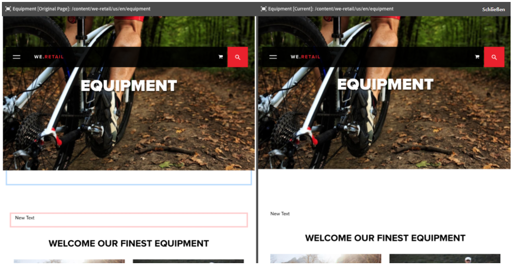
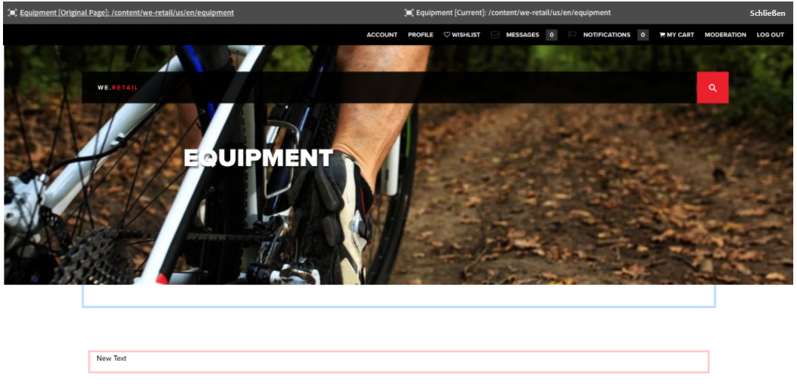

# Seitenvergleich{#page-diff}

>[!CAUTION]
>
>AEM 6.4 hat das Ende der erweiterten Unterstützung erreicht und diese Dokumentation wird nicht mehr aktualisiert. Weitere Informationen finden Sie in unserer [technische Unterstützung](https://helpx.adobe.com/de/support/programs/eol-matrix.html). Unterstützte Versionen suchen [here](https://experienceleague.adobe.com/docs/?lang=de).

## Einführung {#introduction}

Die Inhaltserstellung ist ein iterativer Prozess. Damit ein Autor effizient arbeiten kann, muss er sehen können, was sich von Iteration zu Iteration verändert hat. Es ist ineffizient und bringt Fehler mit sich, wenn eine Seitenversion und danach die andere geprüft wird. Ein Autor möchte die aktuelle Seite einfach nebeneinander mit einer anderen Version vergleichen können.

Die Seitenvergleich-Funktion ermöglicht einen bequemen parallelen Vergleich zweier Seiten mit hervorgehobenen Unterschieden.

>[!CAUTION]
>
>Wenn Sie eine Version vor AEM 6.4.3 ausführen, muss der Benutzer über die **Ändern/Erstellen/Löschen** Berechtigung auf dem Knoten `/content/versionhistory` , um die Funktion zu verwenden.
>
>Weitere Informationen zu dieser Funktion finden Sie unter [Entwicklung und Seitenvergleich](/help/sites-developing/pagediff.md#operation-details).

## Verwenden Sie {#use}

Folgendes kann verglichen werden:

* [Versionen](/help/sites-authoring/working-with-page-versions.md#comparing-a-version-with-current-page) – frühere Version einer Seite mit ihrem aktuellen Status
* [Live Copies](/help/sites-administering/msm-livecopy.md#comparing-a-live-copy-page-with-a-blueprint-page) – Live Copy mit ihrer Blueprint
* [Launches](/help/sites-authoring/launches-editing.md#comparing-a-launch-page-to-its-source-page) – Launch mit seiner Quelle
* [Sprachkopien](/help/sites-administering/tc-manage.md#comparing-language-copies) – eine Seite vor und nach der (erneuten) Übersetzung

Informieren Sie sich unter den entsprechenden Themen, wie der Seitenvergleich im gegebenen Zusammenhang verwendet wird.

### Darstellung von Unterschieden {#presentation-of-differences}

Unabhängig vom verglichenen Inhalt bleibt die Darstellung des Vergleichs gleich.

* Der Inhalt, der beim Start des Vergleichs ausgewählt wurde, wird auf der linken Seite angezeigt (der diff-Einstiegspunkt).
* Der Vergleich mit dem Inhalt wird rechts angezeigt (mit dem der ausgewählte Inhalt verglichen wird).

Wenn Sie beispielsweise Versionen vergleichen, wird die aktuelle Version auf der linken Seite und die vorherige Version auf der rechten Seite angezeigt.

Die Quelle beider Seiten wird deutlich in der Kopfzeile am oberen Rand des Browser-Fensters angezeigt.

Der Vergleich erkennt Änderungen auf Komponenten- und HTML-Ebene. Geänderte Elemente werden mit unterschiedlichen Farben hervorgehoben.

**Komponentenänderungen**

* Hellgrün - Komponente hinzugefügt
* Rosa - Komponente entfernt
* Blau - Komponente geändert
* Blau - Komponente verschoben

Beachten Sie, dass die Farben Geändert und Verschieben identisch sind.

**HTML-Änderungen**

* Dunkelgrün - HTML hinzugefügt
* Rot – HTML entfernt

>[!NOTE]
>
>Beim Vergleich von Sprachkopien ist die Hervorhebung deaktiviert, da sich in einer Übersetzung alles ändert und Hervorhebung nutzlos wäre.

### Vollbild und Beenden {#fullscreen-and-exiting}

Damit Sie sich auf einen bestimmten Inhalt konzentrieren können, haben Sie die Möglichkeit, auf jeder Seite des Seitenvergleichs auf das Vollbildsymbol zu klicken, um die Ansicht auf das ganze Browser-Fenster zu vergrößern.

Die gewählte Seite füllt dann das gesamte Fenster aus, aber die Leiste am oberen Rand bleibt weiterhin angezeigt und bietet Ihnen die Möglichkeit, zwischen den zwei Seiten zu wechseln.

Sie können die Vollbildansicht auch schließen, indem Sie auf das Symbol „Vollbildmodus beenden“ klicken.

Sie können den Seitenvergleich jederzeit beenden, indem Sie in der Kopfzeile auf die Schaltfläche „Schließen“ klicken.

## Beschränkungen {#limitations}

Es gibt Situationen, in denen der Seitenvergleich möglicherweise keine Unterschiede wie erwartet erkennt.

* Bei der Variation von Versionen und Launches berücksichtigt der Vergleich keine dynamischen Komponenten wie Breadcrumbs, Menüs, Produktlisten oder Logos (Komponenten, die für die Wiedergabe ihres Inhalts auf die Site-Struktur angewiesen sind).
* Bei Versionen erstellt der Vergleich nicht die Zugriffssteuerungsrichtlinie und die Live Copy-Beziehungen.
* Wenn Änderungen an einem Bild vorgenommen werden, z. B. eine Änderung der alt-, title- oder der src-Attribute, wird das geänderte Element blau hervorgehoben. In manchen Fällen weist ein Bild jedoch eine Base64-Darstellung des src-Attributs auf und selbst dann, wenn beide Bilder gleich aussehen, werden sie vom Seitenvergleich aufgrund der unterschiedlichen src-Attribute gekennzeichnet.
* Der Seitenvergleich erkennt keine Bilddrehung.
* Wenn eine Seite verschoben wird, können Sie mit Versionen, die vor dem Verschieben vorgenommen wurden, keinen Vergleich mehr durchführen.

   * Wenn Probleme beim Vergleich auftreten, überprüfen Sie in der [Zeitleiste](/help/sites-authoring/basic-handling.md#timeline) der Seite, ob die Seite verschoben wurde.

>[!NOTE]
>
>Versionen können nicht miteinander verglichen werden. Nur die aktuelle Version kann mit anderen Versionen der Seite verglichen werden. Die aktuelle Version ist immer die Version, deren Änderungen hervorgehoben sind.

>[!NOTE]
>
>Weitere Informationen zum Ablauf des Seitenvergleichsmechanismus sowie Einschränkungen, die sich auf den Seitenvergleich auswirken können, finden Sie in der [Entwickler-Dokumentation](/help/sites-developing/pagediff.md) zu dieser Funktion.
