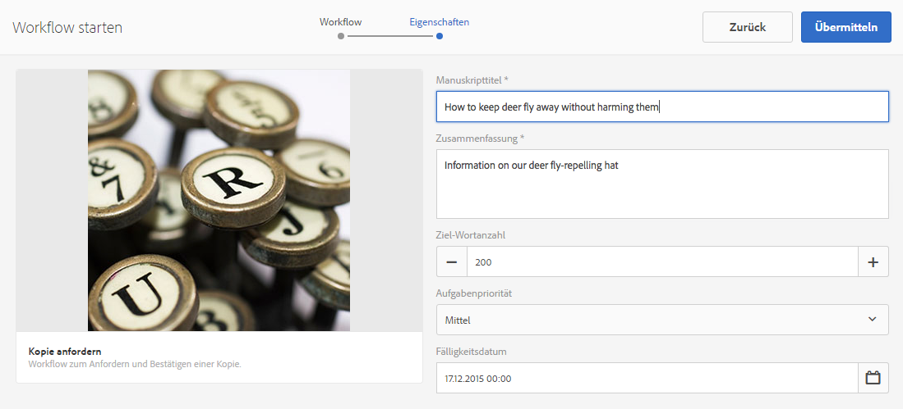
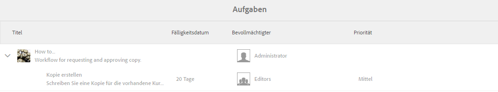
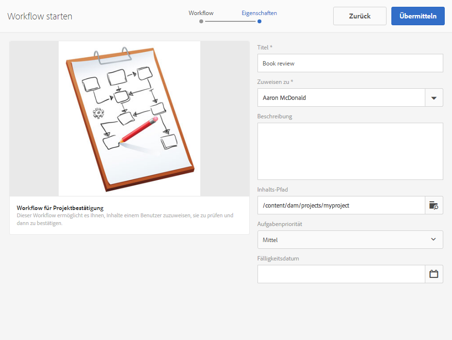
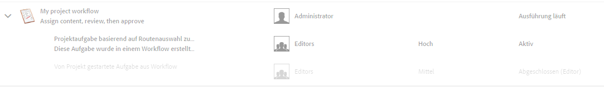
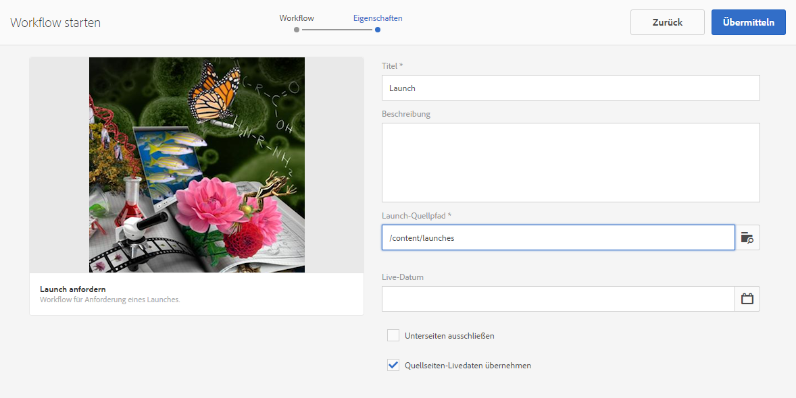
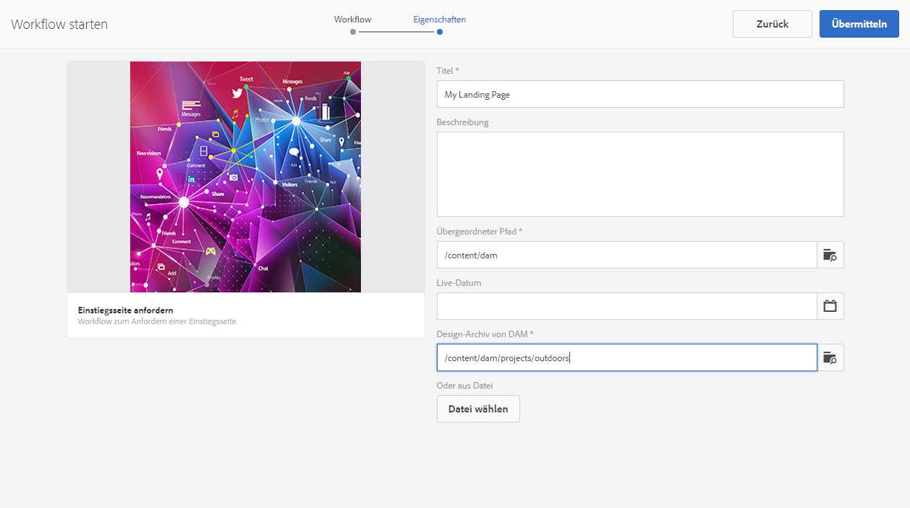
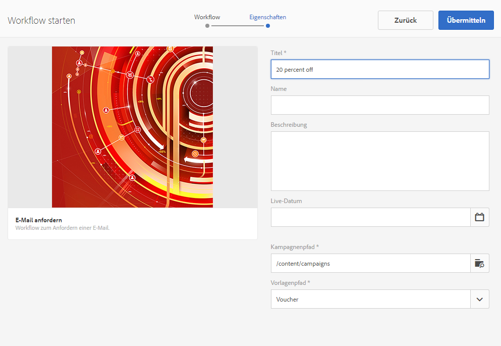
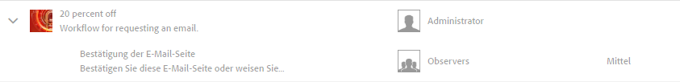

# Arbeiten mit Projekt-Workflows{#working-with-project-workflows}

>[!CAUTION]
>
>AEM 6.4 hat das Ende der erweiterten Unterstützung erreicht und diese Dokumentation wird nicht mehr aktualisiert. Weitere Informationen finden Sie in unserer [technische Unterstützung](https://helpx.adobe.com/de/support/programs/eol-matrix.html). Unterstützte Versionen suchen [here](https://experienceleague.adobe.com/docs/?lang=de).

Folgende Projekt-Workflows sind im Lieferumfang enthalten:

* **Workflow für Projektbestätigung** - Dieser Workflow ermöglicht es Ihnen, Inhalte einem Benutzer zuzuweisen, sie zu prüfen und dann zu bestätigen.
* **Launch anfragen** - Ein Workflow, der einen Launch anfordert.
* **Einstiegsseite anfragen** - Dieser Workflow fragt eine Landingpage an.
* **E-Mail anfragen** - Workflow zum Anfragen einer E-Mail.
* **Produkt-Fotoshooting und Produkt-Fotoshooting (Commerce)** - Ordnet Assets Produkten zu
* **DAM-Kopie erstellen und übersetzen und DAM-Sprachkopie erstellen** - Erstellt übersetzte Binärdateien, Metadaten und Tags für Assets und Ordner.

Je nachdem, welche Projektvorlage Sie auswählen, stehen Ihnen bestimmte Workflows zur Verfügung:

|  | **Einfaches Projekt** | **Medienprojekt** | **Projekt für Produkt-Fotoshooting** | **Übersetzungsprojekt** |
|---|:-:|:-:|:-:|:-:|
| Kopie anfragen |  | x |  |  |
| Produkt-Fotoshooting |  | x | x |  |
| Produkt-Fotoshooting   (Commerce) |  |  | x |  |
| Projektvalidierung | x |  |  |  |
| Launch anfragen | x |  |  |  |
| Einstiegsseite anfragen | x |  |  |  |
| E-Mail anfragen | x |  |  |  |
| DAM-Sprachkopie erstellen&amp;ast; |  |  |  | x |
| DAM-Sprachkopie erstellen und übersetzen&amp;ast; |  |  |  | x |

>[!NOTE]
>
>&amp;ast; Diese Workflows werden nicht auf der Kachel **Workflow** in Projekten gestartet. Weitere Informationen finden Sie unter [Erstellen von Sprachkopien für Assets](/help/sites-administering/tc-manage.md).

Das Starten und Abschließen eines Workflows ist unabhängig vom gewählten Workflow immer gleich. Nur die Schritte ändern sich.

Sie starten einen Workflow direkt in Projekten (mit Ausnahme von DAM Create Language Copy oder DAM Create and Translate Language Copy). Informationen zu ausstehenden Aufgaben in einem Projekt finden Sie in der **Aufgaben** Kachel. Benachrichtigungen zu auszuführenden Aufgaben werden neben dem Benutzersymbol angezeigt.

Weitere Informationen zum Arbeiten mit Workflows in AEM finden Sie in den folgenden Abschnitten:

* [Teilnehmen an Workflows](/help/sites-authoring/workflows-participating.md)
* [Anwenden von Workflows auf Seiten](/help/sites-authoring/workflows-applying.md)
* [Konfigurieren von Workflows](/help/sites-administering/workflows.md)

Dieser Abschnitt beschreibt die Workflows, die für Projekte verfügbar sind.

## Workflow „Kopie anfordern“ {#request-copy-workflow}

Mit diesem Workflow können Sie ein Manuskript von einem Benutzer anfragen und es dann genehmigen. So starten Sie den Workflow „Kopie anfragen“:

1. Wählen Sie in Ihrem Medienprojekt das **Plussymbol** in der Kachel **Workflows** aus und wählen Sie dann **Workflow „Kopie anfordern“** aus.
1. Geben Sie einen Manuskripttitel und eine kurze Zusammenfassung dazu ein, was Sie anfordern. Geben Sie gegebenenfalls eine Zielwortanzahl, Aufgabenpriorität und ein Fälligkeitsdatum ein.

   

1. Klicken Sie auf **Erstellen**. Der Workflow startet. Die Aufgabe wird in der Kachel **Aufgaben** angezeigt.

   

## Workflow „Produkt-Fotoshooting“ {#product-photo-shoot-workflow}

Die Workflows für Produkt-Fotoshootings (sowohl Handel als auch ohne Commerce) werden ausführlich im Abschnitt [Creative Project](/help/sites-authoring/managing-product-information.md).

## Workflow für Projektbestätigung {#project-approval-workflow}

Im Workflow für Projektbestätigung weisen Sie Inhalte einem Benutzer zu, überprüfen diese und genehmigen sie dann.

1. Wählen Sie in Ihrem einfachen Projekt ** aus.**+** anmelden **Workflows** Kachel und wählen Sie **Workflow für Projektbestätigung**.
1. Geben Sie einen Titel ein und wählen Sie aus, welchem Mitglied der Teamliste Sie den Workflow zuweisen möchten. Geben Sie bei Bedarf eine Beschreibung, einen Inhaltspfad, eine Aufgabenpriorität und ein Fälligkeitsdatum ein.

   

1. Klicken Sie auf **Erstellen**. Der Workflow startet. Die Aufgabe wird in der Kachel **Aufgaben** angezeigt.

   

## Workflow „Launch anfordern“ {#request-launch-workflow}

Mit diesem Workflow können Sie einen Launch anfordern.

1. Wählen Sie in Ihrem einfachen Projekt das **Plussymbol** in der Kachel **Workflows** aus und wählen Sie dann **Workflow „Launch anfordern“** aus.
1. Geben Sie einen Titel für den Launch ein und geben Sie den Launch-Quellpfad an. Sie können bei Bedarf auch eine Beschreibung und ein Live-Datum hinzufügen. Wählen Sie &quot;Quellseiten-Live-Daten übernehmen&quot;oder &quot;Unterseiten ausschließen&quot;, je nachdem, wie sich der Launch verhalten soll.

   

1. Klicken Sie auf **Erstellen**. Der Workflow startet. Der Workflow wird in der Liste **Workflows** angezeigt (klicken Sie auf das Auslassungszeichen **…** auf der Kachel **Workflows**, um auf diese Liste zugreifen).

## Workflow &quot;Einstiegsseite anfordern&quot; {#request-landing-page-workflow}

Mit diesem Workflow können Sie eine Landingpage anfragen.

1. Wählen Sie in Ihrem einfachen Projekt die **+** anmelden **Workflows** und wählen Sie &quot;Einstiegsseiten-Workflow anfordern&quot;.
1. Geben Sie einen Titel für Ihre Landingpage und den übergeordneten Pfad ein. Geben Sie gegebenenfalls ein Live-Datum ein oder wählen Sie eine Datei für Ihre Landingpage aus.

   

1. Klicken Sie auf **Erstellen**. Der Workflow startet. Die Aufgabe wird in der Kachel **Aufgaben** angezeigt.

## Workflow „E-Mail anfragen“ {#request-email-workflow}

Mit diesem Workflow können Sie eine E-Mail anfragen. Es handelt sich um denselben Workflow, der im **E-Mails** Kachel.

1. Wählen Sie in Ihrem Media- oder Simple-Projekt die **+** anmelden **Workflows** Kachel und wählen Sie **Email-Workflow anfordern**.
1. Geben Sie einen E-Mail-Titel sowie den Kampagnen- und Vorlagenpfad ein. Darüber hinaus können Sie einen Namen, eine Beschreibung und ein Live-Datum angeben.

   

1. Klicken Sie auf **Erstellen**. Der Workflow startet. Die Aufgabe wird in der Kachel **Aufgaben** angezeigt.

   

## Workflow „Sprachkopie erstellen (und übersetzen)“ für Assets {#create-and-translate-language-copy-workflow-for-assets}

Die **Sprachkopie erstellen** und **Sprachkopie erstellen und übersetzen** Workflows werden im Detail unter [Erstellen von Sprachkopien für Assets.](/help/assets/translation-projects.md)
