# Veröffentlichen von Seiten{#publishing-pages}

>[!CAUTION]
>
>AEM 6.4 hat das Ende der erweiterten Unterstützung erreicht und diese Dokumentation wird nicht mehr aktualisiert. Weitere Informationen finden Sie in unserer [technische Unterstützung](https://helpx.adobe.com/de/support/programs/eol-matrix.html). Unterstützte Versionen suchen [here](https://experienceleague.adobe.com/docs/?lang=de).

Nachdem Sie Ihren Inhalt in der Autorenumgebung erstellt und geprüft haben, besteht das Ziel darin, [Veröffentlichung auf der öffentlichen Website](/help/sites-authoring/author.md#concept-of-authoring-and-publishing) (Ihre Veröffentlichungsumgebung).

Dies wird als Veröffentlichen einer Seite bezeichnet. Wenn Sie eine Seite aus der Veröffentlichungsumgebung entfernen möchten, wird dies als Rückgängigmachen der Veröffentlichung bezeichnet. Beim Veröffentlichen und Rückgängigmachen der Veröffentlichung bleibt die Seite in der Autorenumgebung für weitere Änderungen verfügbar, bis Sie sie löschen.

Sie können eine Seite auch sofort oder zu einem vordefinierten Zeitpunkt (Datum/Uhrzeit) in der Zukunft veröffentlichen bzw. deren Veröffentlichung rückgängig machen.

>[!NOTE]
>
>Bestimmte Begriffe im Zusammenhang mit der Veröffentlichung können verwirrt werden:
>
>* **Veröffentlichen/Veröffentlichung rückgängig machen**
   >  Dies sind die Hauptbegriffe für die Aktionen, mit denen Sie Ihren Inhalt in Ihrer Veröffentlichungsumgebung verfügbar machen (oder dies rückgängig machen).
>
>* **Aktivieren/Deaktivieren**
   >  Diese Begriffe sind Synonyme für das Veröffentlichen/Rückgängigmachen der Veröffentlichung.
>
>* **Replizieren/Replikation**
   >  Dies sind technische Begriffe, die für die Verschiebung von Daten (z. B. Seiteninhalten, Dateien, Code, Benutzerkommentaren) zwischen Umgebungen verwendet werden, z. B. beim Veröffentlichen oder Zurückreplizieren von Benutzerkommentaren.
>

>[!NOTE]
>
>Wenn Sie nicht über die erforderlichen Berechtigungen zum Veröffentlichen einer bestimmten Seite verfügen:
>
>* Es wird ein Workflow ausgelöst, der die entsprechende Person über Ihre Veröffentlichungsanfrage informiert.
>* Diese [Workflow wurde möglicherweise angepasst](/help/sites-developing/workflows-models.md) durch Ihr Entwicklungsteam.
>* Sie werden in einer Mitteilung darüber informiert, dass der Workflow ausgelöst wurde.
>

## Veröffentlichen von Seiten {#publishing-pages-2}

Abhängig davon, wo Sie sich gerade befinden, können Sie Veröffentlichungen folgendermaßen vornehmen:

* [Im Seiten-Editor](/help/sites-authoring/publishing-pages.md#publishing-from-the-editor)
* [In der Sites-Konsole](/help/sites-authoring/publishing-pages.md#publishing-from-the-console)

### Veröffentlichungen im Editor {#publishing-from-the-editor}

Wenn Sie eine Seite bearbeiten, kann sie direkt im Editor veröffentlicht werden.

1. Wählen Sie das Symbol **Seiteninformationen** aus, um das Menü zu öffnen, und danach die Option **Seite veröffentlichen**.

   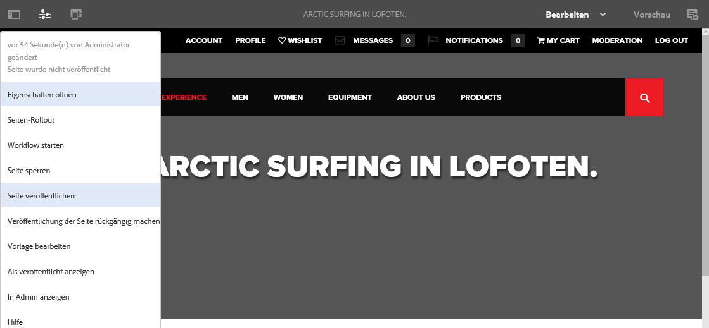

1. Je nachdem, ob die Seite Verweise enthält, die veröffentlicht werden müssen, geschieht Folgendes:

   * Die Seite wird direkt veröffentlicht, wenn keine Verweise veröffentlicht werden müssen.
   * Wenn die Seite Verweise enthält, die veröffentlicht werden müssen, werden diese im **Veröffentlichungsassistenten** aufgeführt und Sie können eine der folgenden Aktionen ausführen:

      * Geben Sie an, welche Assets, Tags usw. Sie mit der Seite veröffentlichen möchten, und wählen Sie **Veröffentlichen** aus, um den Vorgang abzuschließen.
      * Mit **Abbrechen** können Sie den Vorgang abbrechen.

   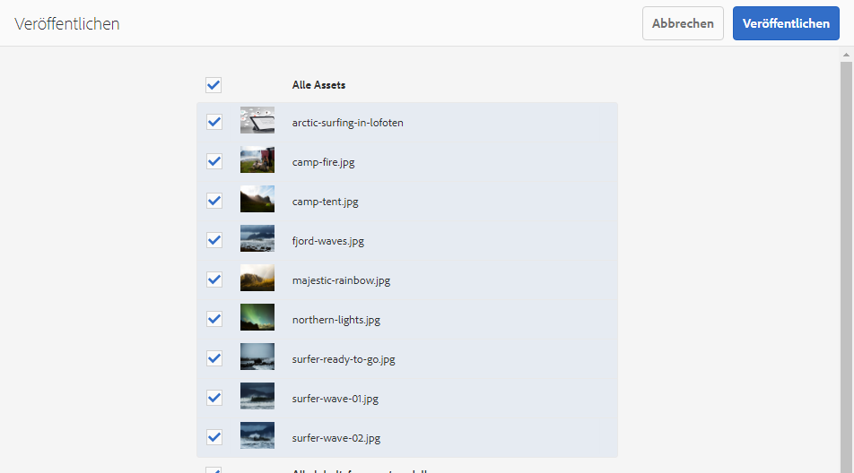

1. Mit **Veröffentlichen** wird die Seite in der Veröffentlichungsumgebung repliziert. Im Seiteneditor wird ein Hinweis angezeigt, in dem die Veröffentlichung bestätigt wird.

   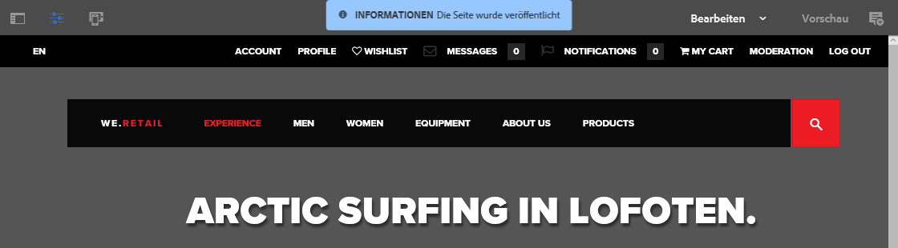

   Wird diese Seite in der Konsole dargestellt, ist der aktualisierte Veröffentlichungsstatus sichtbar.

   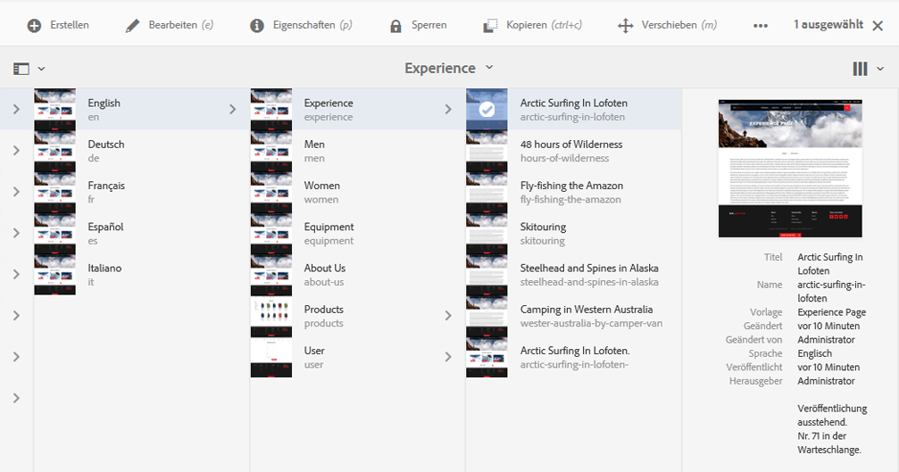

>[!NOTE]
>
>Im Editor kann nur eine teilweise Veröffentlichung vorgenommen werden, d. h. nur die ausgewählten und keine untergeordneten Seiten werden veröffentlicht.

>[!NOTE]
>
>Seiten, auf die im Editor über [Aliasnamen](/help/sites-authoring/editing-page-properties.md#advanced) zugegriffen wird, können nicht veröffentlicht werden. Veröffentlichungsoptionen im Editor sind nur für Seiten verfügbar, auf die über ihre tatsächlichen Pfade zugegriffen wird.

### Veröffentlichungen über die Konsole {#publishing-from-the-console}

In der Sites-Konsole gibt es zwei Möglichkeiten zur Veröffentlichung:

* [Quick Publish](/help/sites-authoring/publishing-pages.md#quick-publish)
* [Veröffentlichung verwalten](/help/sites-authoring/publishing-pages.md#manage-publication)

#### Quick Publish {#quick-publish}

**Quick Publish** wird für einfache Fälle verwendet. Die ausgewählten Seiten werden damit sofort ohne weitere Interaktion veröffentlicht. Aus diesem Grund werden auch alle nicht veröffentlichten Verweise automatisch veröffentlicht.

So veröffentlichen Sie eine Seite mit der Funktion „Quick Publish“:

1. Wählen Sie die gewünschten Seiten in der Sites-Konsole aus und klicken Sie auf die Schaltfläche **Quick Publish**.

   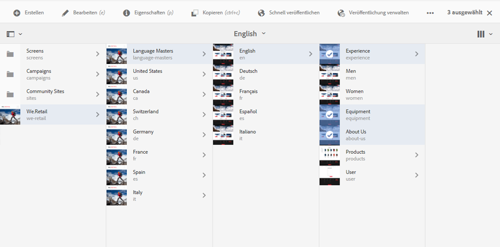

1. Bestätigen Sie im Dialogfeld „Schnell veröffentlichen“ die Veröffentlichung, indem Sie auf **Veröffentlichen** klicken, oder brechen Sie den Vorgang ab, indem Sie auf **Abbrechen** klicken. Beachten Sie, dass auch alle unveröffentlichten Verweise ebenfalls automatisch veröffentlicht werden.

   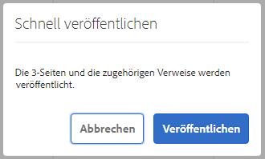

1. Bei der Veröffentlichung der Seite wird ein Warnhinweis angezeigt, in dem die Veröffentlichung bestätigt wird.

>[!NOTE]
>
>Die Option „Quick Publish“ ermöglicht nur die teilweise Veröffentlichung, d. h. nur die ausgewählten und keine untergeordneten Seiten werden veröffentlicht.

#### Veröffentlichung verwalten {#manage-publication}

**Veröffentlichung verwalten** bietet mehr Optionen als „Quick Publish“. Mit dieser Funktion können Sie auch untergeordnete Seiten einschließen, Verweise anpassen, alle nötigen Workflows starten und bei Bedarf zu einem späteren Zeitpunkt veröffentlichen.

So veröffentlichen Sie eine Seite bzw. machen ihre Veröffentlichung rückgängig mit „Veröffentlichung verwalten“:

1. Wählen Sie in der Sites-Konsole die entsprechenden Seiten aus und klicken Sie auf die Schaltfläche **Veröffentlichung verwalten**.

   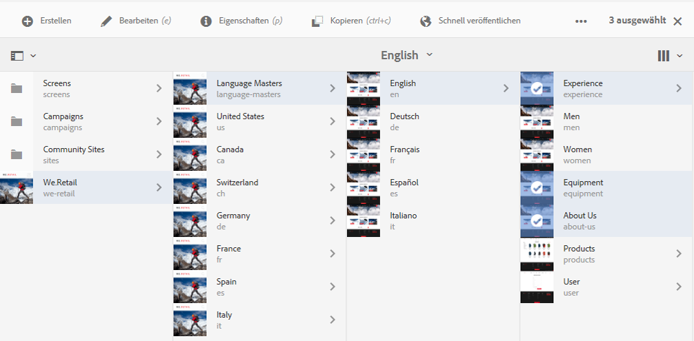

1. Der Assistent **Veröffentlichung verwalten** wird geöffnet. Im ersten Schritt **Optionen** haben Sie folgende Möglichkeiten:

   * Veröffentlichen Sie die ausgewählte Seite oder machen Sie die Veröffentlichung rückgängig.
   * Entscheiden Sie, ob Sie diese Aktion jetzt oder zu einem späteren Zeitpunkt durchführen möchten.

   Später veröffentlichen startet einen Workflow zum Veröffentlichen der ausgewählten Seiten zum angegebenen Zeitpunkt. Umgekehrt startet das Rückgängigmachen der Veröffentlichung später einen Workflow zum Rückgängigmachen der Veröffentlichung der ausgewählten Seiten zu einem bestimmten Zeitpunkt.

   Wenn Sie eine Veröffentlichung/rückgängig gemachte Veröffentlichung später abbrechen möchten, gehen Sie zur Konsole [Workflow](/help/sites-administering/workflows.md), um den entsprechenden Workflow zu beenden.

   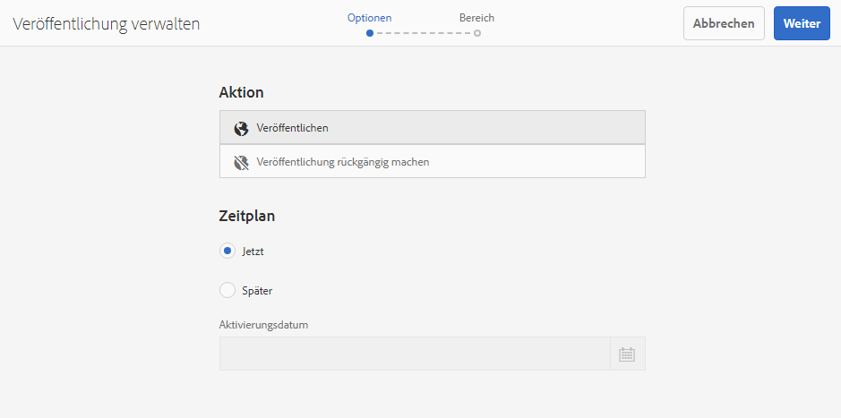

   Klicken Sie auf **Weiter**, um fortzufahren.

1. Im nächsten Schritt des Assistenten „Veröffentlichung verwalten“, **Umfang**, können Sie den Umfang der Veröffentlichung/der rückgängig gemachten Veröffentlichung definieren, wie z. B. das Einschließen von untergeordneten Seiten und/oder von Verweisen.

   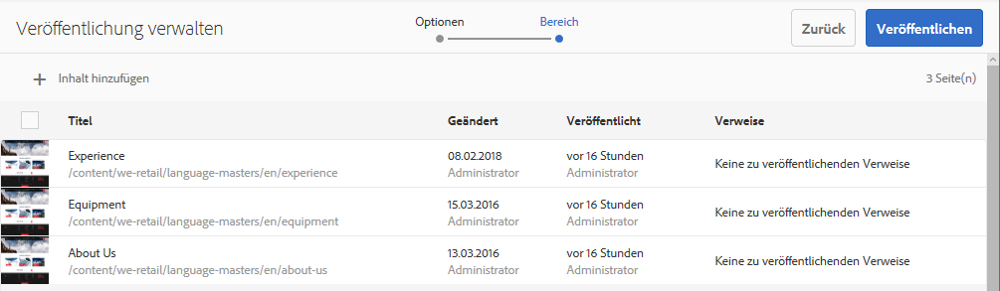

   Mit der Schaltfläche **Inhalt hinzufügen** können Sie zusätzliche Seiten zur Liste der zu veröffentlichenden Seiten hinzufügen, falls Sie dies noch nicht vor dem Starten des Assistenten „Veröffentlichung verwalten“ getan haben.

   Durch Klicken auf die Schaltfläche „Inhalt hinzufügen“ wird der [Pfad-Browser](/help/sites-authoring/author-environment-tools.md#path-browser) gestartet, mit dem Inhalte ausgewählt werden können.

   Wählen Sie die gewünschten Seiten aus und klicken Sie dann auf **Auswählen**, um den Inhalt dem Assistenten hinzuzufügen, oder auf **Abbrechen**, um die Auswahl abzubrechen und zum Assistenten zurückzukehren.

   Im Assistenten können Sie ein Element in der Liste auswählen, um seine weiteren Optionen zu konfigurieren, z. B.:

   * Untergeordnete Elemente einschließen.
   * Entfernen Sie sie aus der Auswahl.
   * Verwalten der veröffentlichten Verweise

   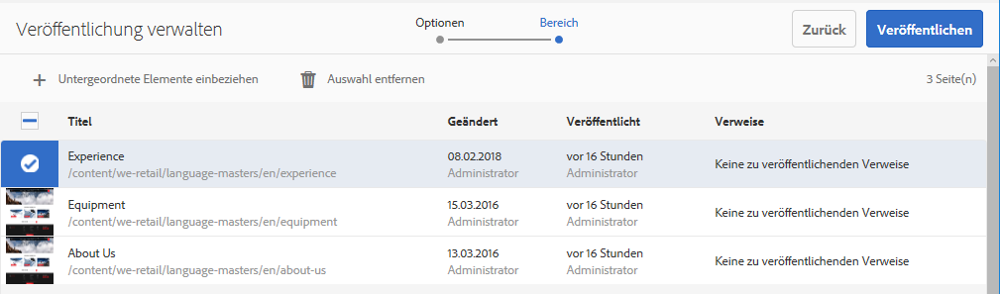

   Durch Klicken auf **Untergeordnete Elemente einbeziehen** wird ein Dialogfeld geöffnet, in dem Sie folgende Möglichkeiten haben:

   * Nur unmittelbar untergeordnete Elemente einbeziehen.
   * Nur geänderte Seiten einbeziehen.
   * Nur bereits veröffentlichte Seiten einbeziehen.

   Klicken Sie auf **Hinzufügen**, um die untergeordneten Seiten zur Liste der Seiten hinzuzufügen, die je nach Auswahloptionen veröffentlicht werden sollen oder deren Veröffentlichung rückgängig gemacht werden soll. Klicken Sie auf **Abbrechen**, um die Auswahl abzubrechen und zum Assistenten zurückzukehren.

   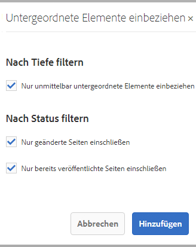

   Dort sehen Sie die hinzugefügten Seiten entsprechend Ihrer Auswahl im Dialogfeld „Untergeordnete Elemente einbeziehen“.

   Zur Ansicht und zum Ändern der Verweise, die für eine Seite veröffentlicht werden sollen bzw. deren Veröffentlichung rückgängig gemacht werden soll, wählen Sie sie aus und klicken Sie anschließend auf die Schaltfläche **Veröffentlichte Verweise**.

   

   Das Dialogfeld **Veröffentlichte Verweise** zeigt die Verweise für den ausgewählten Inhalt an. Standardmäßig sind alle ausgewählt und werden veröffentlicht bzw. die Veröffentlichung wird rückgängig gemacht. Sie können sie aber auch deaktivieren, um die Auswahl aufzuheben, sodass sie nicht in die Aktion einbezogen werden.

   Klicken Sie auf **Fertig**, um Ihre Änderungen zu speichern, oder auf **Abbrechen**, um die Auswahl abzubrechen und zum Assistenten zurückzukehren.

   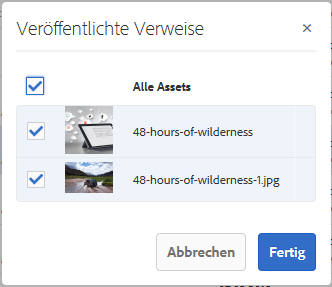

   Im Assistenten wird die Spalte **Verweise** aktualisiert und zeigt Ihre Auswahl von Verweisen an, die veröffentlicht werden sollen bzw. deren Veröffentlichung rückgängig gemacht werden soll.

   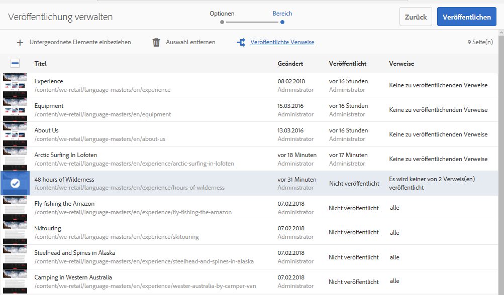

1. Klicken Sie auf **Veröffentlichen**, um den Vorgang abzuschließen.

   In der Sites-Konsole wird die Veröffentlichung durch eine Benachrichtigung bestätigt.

   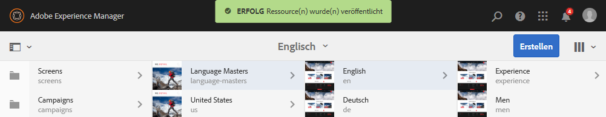

1. Wenn die veröffentlichten Seiten mit Workflows verknüpft sind, werden diese im abschließenden **Workflow**-Schritt des Veröffentlichungsassistenten gezeigt.

   >[!NOTE]
   >
   >Der gezeigte **Workflow**-Schritt hängt von den Rechten des jeweiligen Benutzers ab. Weitere Informationen finden Sie im [vorherigen Hinweis auf dieser Seite](/help/sites-authoring/publishing-pages.md) bezüglich Berechtigungen für die Veröffentlichung sowie unter [Verwaltung der Zugriffsrechte auf Workflows](/help/sites-administering/workflows-managing.md) und unter [Anwenden von Workflows auf Seiten](/help/sites-authoring/workflows-applying.md).

   Die Ressourcen werden nach den ausgelösten Workflows gruppiert und erhalten jeweils folgende Optionen:

   * Definieren Sie den Titel des Workflows.
   * Beibehalten des Workflow-Pakets, vorausgesetzt der Workflow verfügt über [Unterstützung mehrerer Ressourcen](/help/sites-developing/workflows-models.md#configuring-a-workflow-for-multi-resource-support).
   * Definieren des Titels des Workflow-Pakets, sofern die Option zum Beibehalten des Workflow-Pakets ausgewählt wurde

   Klicken **Veröffentlichen** oder **Später veröffentlichen**, um die Veröffentlichung abzuschließen.

   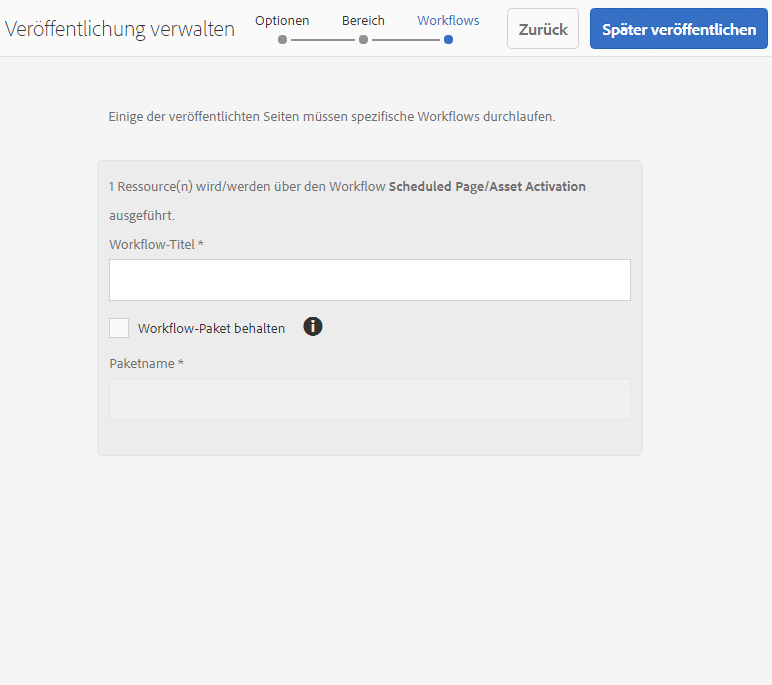

## Veröffentlichen von Seiten rückgängig machen {#unpublishing-pages}

Wenn Sie die Veröffentlichung einer Seite rückgängig machen, wird sie aus der Veröffentlichungsumgebung gelöscht, sodass sie nicht mehr für Ihre Leser verfügbar ist.

[Ähnlich wie beim Veröffentlichen](/help/sites-authoring/publishing-pages.md#publishing-pages) können Sie auch die Veröffentlichung einer oder mehrerer Seiten aufheben:

* [Im Seiten-Editor](/help/sites-authoring/publishing-pages.md#unpublishing-from-the-editor)
* [In der Sites-Konsole](/help/sites-authoring/publishing-pages.md#unpublishing-from-the-console)

### Rückgängigmachen der Veröffentlichung im Editor {#unpublishing-from-the-editor}

Wenn Sie die Veröffentlichung einer von Ihnen bearbeiteten Seite rückgängig machen möchten, wählen Sie analog zur [Veröffentlichung einer Seite](/help/sites-authoring/publishing-pages.md#publishing-from-the-editor) im Menü **Seiteninformationen** die Option **Veröffentlichung der Seite rückgängig machen** aus.

>[!NOTE]
>
>Die Veröffentlichung von Seiten, auf die im Editor über [Aliasnamen](/help/sites-authoring/editing-page-properties.md#advanced) zugegriffen wird, kann nicht rückgängig gemacht werden. Veröffentlichungsoptionen im Editor sind nur für Seiten verfügbar, auf die über ihre tatsächlichen Pfade zugegriffen wird.

### Rückgängigmachen der Veröffentlichung in der Konsole {#unpublishing-from-the-console}

Ebenso wie Sie [die Option „Veröffentlichung verwalten“ zur Veröffentlichung verwenden](/help/sites-authoring/publishing-pages.md#manage-publication), können Sie damit auch eine Veröffentlichung aufheben.

1. Wählen Sie in der Sites-Konsole die entsprechenden Seiten aus und klicken Sie auf die Schaltfläche **Veröffentlichung verwalten**.
1. Der Assistent **Veröffentlichung verwalten** wird geöffnet. Wählen Sie im ersten Schritt **Optionen** die Option **Veröffentlichung aufheben** anstelle der Standardoption **Veröffentlichen** aus.

   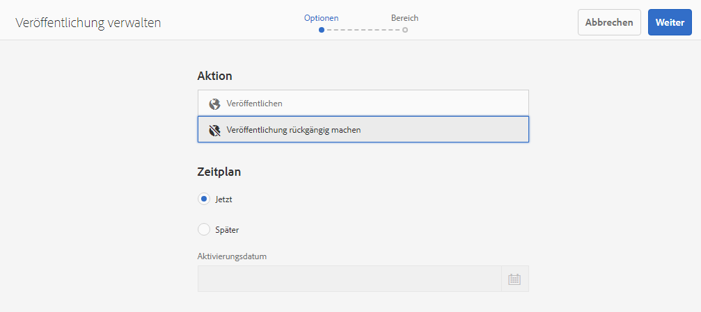

   Die Auswahl von „Später veröffentlichen“ startet einen Workflow zur Veröffentlichung der Seite zum angegebenen Zeitpunkt. Entsprechend startet die Auswahl von „Später deaktivieren“ einen Workflow zum Rückgängigmachen der Veröffentlichung der ausgewählten Seiten zum angegebenen Zeitpunkt.

   Wenn Sie eine Veröffentlichung/rückgängig gemachte Veröffentlichung später abbrechen möchten, gehen Sie zur Konsole [Workflow](/help/sites-administering/workflows.md), um den entsprechenden Workflow zu beenden.

1. Um die Aufhebung der Veröffentlichung abzuschließen, fahren Sie mit dem Assistenten wie gewünscht fort [Seite veröffentlichen](/help/sites-authoring/publishing-pages.md#manage-publication).

## Veröffentlichen und Rückgängigmachen der Veröffentlichung eines Baums {#publishing-and-unpublishing-a-tree}

Wenn Sie eine beträchtliche Anzahl von Inhaltsseiten eingegeben oder aktualisiert haben, die sich alle unter derselben Stammseite befinden, kann es einfacher sein, den gesamten Baum in einer Aktion zu veröffentlichen.

Sie können die [Veröffentlichung verwalten](/help/sites-authoring/publishing-pages.md#manage-publication) auf der Sites-Konsole zu.

1. Wählen Sie in der Sites-Konsole die Stammseite des Baums aus, den Sie veröffentlichen oder dessen Veröffentlichung rückgängig machen möchten, und wählen Sie **Veröffentlichung verwalten**.
1. Der Assistent **Veröffentlichung verwalten** wird geöffnet. Wählen Sie „Veröffentlichen“ oder „Veröffentlichung aufheben“ sowie den Zeitpunkt aus und danach **Weiter**, um fortzufahren.
1. Im **Anwendungsbereich** Schritt, wählen Sie die Stammseite aus und wählen Sie **Untergeordnete Elemente einschließen**.

   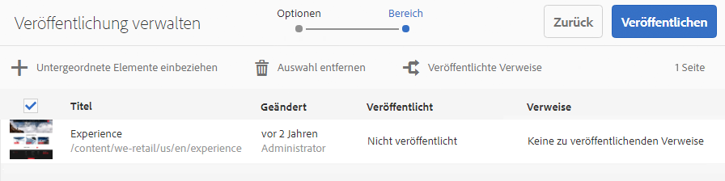

1. Im **Untergeordnete Elemente einschließen** deaktivieren Sie die Optionen:

   * Nur unmittelbar untergeordnete Elemente einbeziehen
   * Nur bereits veröffentlichte Seiten einbeziehen

   Diese Optionen sind standardmäßig ausgewählt, Sie müssen also daran denken, die Auswahl aufzuheben. Klicken **Hinzufügen** , um den Inhalt zu validieren und zur Veröffentlichung bzw. Rückgängigmachung der Veröffentlichung hinzuzufügen.

   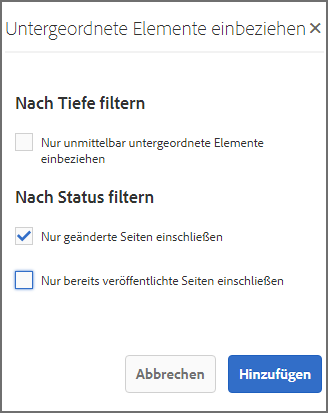

1. Im Assistenten **Veröffentlichung verwalten** wird der Inhalt des Baums zur Überprüfung aufgelistet. Sie können die Auswahl weiter anpassen, indem Sie zusätzliche Seiten hinzufügen oder die ausgewählten Seiten entfernen.

   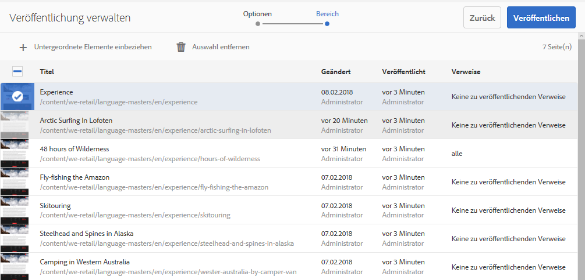

   Sie können die zu veröffentlichenden Verweise auch in der Option **Veröffentlichte Verweise** überprüfen.

1. [Fahren Sie mit dem Assistenten „Veröffentlichung verwalten“ wie üblich fort](#manage-publication), um die Veröffentlichung oder das Rückgängigmachen der Veröffentlichung der Baumstruktur abzuschließen.

## Bestimmen des Veröffentlichungsstatus {#determining-publication-status}

Sie können den Veröffentlichungsstatus einer Seite bestimmen:

* In der [Ressourcenübersicht in der Sites-Konsole](/help/sites-authoring/basic-handling.md#viewing-and-selecting-resources)

   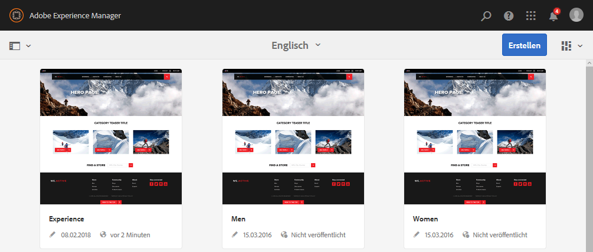

   Der Veröffentlichungsstatus wird in der Sites-Konsole in der Ansicht [Karte](/help/sites-authoring/basic-handling.md#card-view), [Spalte](/help/sites-authoring/basic-handling.md#column-view) und [Liste](/help/sites-authoring/basic-handling.md#list-view) angezeigt.

* in der [Zeitleisten](/help/sites-authoring/basic-handling.md#timeline)

   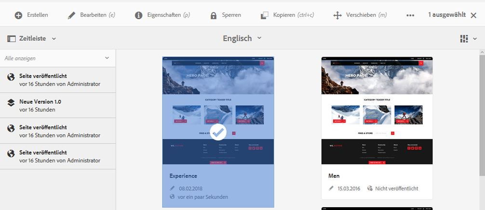

* im Menü [Seiteninformationen](/help/sites-authoring/author-environment-tools.md#page-information) beim Bearbeiten einer Seite

   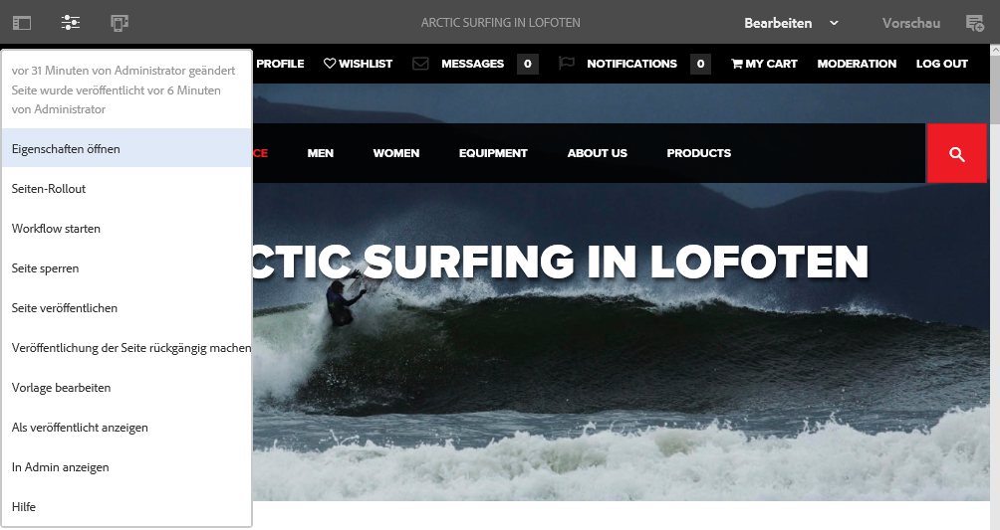
