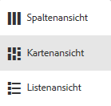
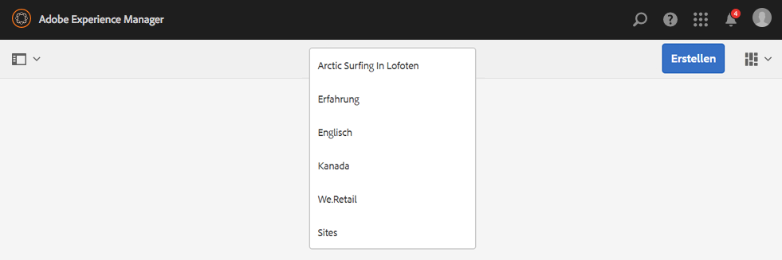
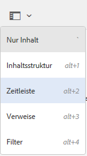
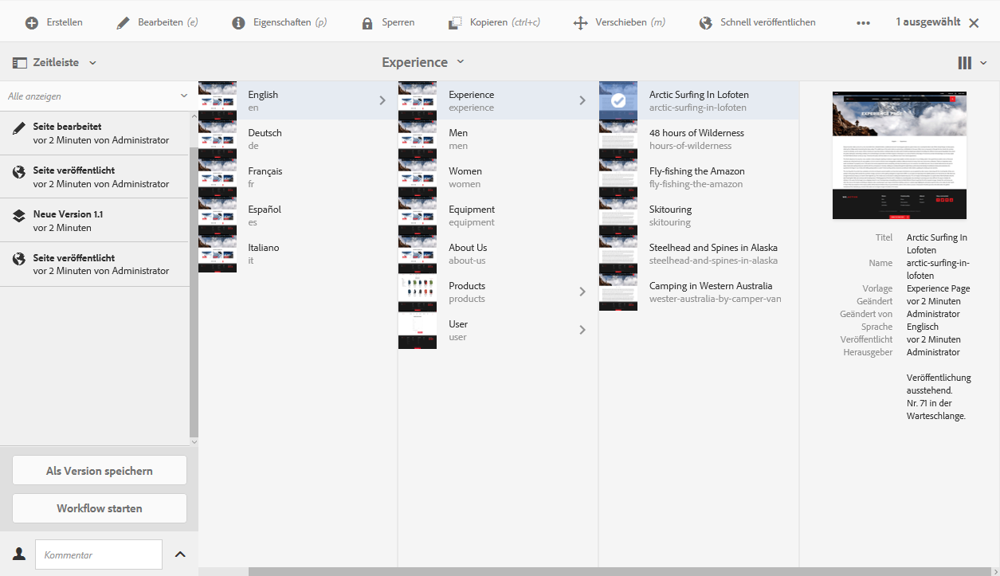

# Kurzanleitung zur Seitenbearbeitung (Authoring){#quick-guide-to-authoring-pages}

Diese Verfahren stellen eine (grobe) Kurzanleitung zu den Hauptaktionen beim Bearbeiten von Seiteninhalt in AEM dar.

Sie:

* stellen keine umfassende Erläuterung dar
* enthalten Links zur detaillierten Dokumentation

Genauere Informationen zur Bearbeitung mit AEM finden Sie unter:

* [Erste Schritte für Autoren](/help/sites-authoring/first-steps.md)
* [Arbeiten mit der Autorenumgebung](/help/sites-authoring/author-environment-tools.md)

## Tipps {#a-few-quick-hints}

Vor der Zusammenfassung der Details finden Sie hier zunächst einige allgemeine Tipps und Hinweise, die Sie beachten sollten, insbesondere wenn Sie bislang die [klassische Benutzeroberfläche](/help/sites-classic-ui-authoring/classicui.md) verwendet haben.

### Sites-Konsole {#sites-console}

* **Erstellen**

   * Diese Schaltfläche ist in vielen Konsolen verfügbar. Die aufgeführten Optionen sind kontextsensitiv und können je nach Szenario variieren.

* Neuanordnen von Seiten in einem Ordner

   * Dies kann in der [Listenansicht](/help/sites-authoring/basic-handling.md#list-view) erfolgen. Die Änderungen werden übernommen und in anderen Ansichten angezeigt.

* Ändern der Benutzeroberfläche

   * Dies kann von verschiedenen Stellen aus erfolgen. Siehe [Festlegen der Benutzeroberfläche](/help/sites-authoring/select-ui.md).

### Bearbeiten von Seiten {#page-authoring}

* Navigieren per Links

   * ***Es stehen keine Links zur Navigation zur Verfügung***, wenn Sie sich im **Bearbeitungsmodus** befinden. Für die Navigation mithilfe von Links müssen Sie [die Seite in der Vorschau anzeigen](/help/sites-authoring/editing-content.md#previewing-pages), indem Sie eine der folgenden Optionen verwenden:

      * [Vorschaumodus](/help/sites-authoring/editing-content.md#preview-mode)
      * [Als veröffentlicht anzeigen](/help/sites-authoring/editing-content.md#view-as-published)

* Workflows und Versionen werden nicht mehr über den Seiten-Editor gestartet bzw. erstellt. Dies erfolgt nun über die [Timeline](/help/sites-authoring/basic-handling.md#timeline), auf die Sie über die Konsole zugreifen können.

>[!NOTE]
>
>Es gibt eine Reihe von Tastaturbefehlen, die die Bearbeitung vereinfachen.
>
>* [Tastaturbefehle bei der Seitenbearbeitung](/help/sites-authoring/page-authoring-keyboard-shortcuts.md)
>* [Tastaturbefehle für Konsolen](/help/sites-authoring/keyboard-shortcuts.md)

## Suchen nach Seiten {#finding-your-page}

1. Öffnen Sie die **Sites-Konsole** mithilfe der Option **Sites** im Feld [Globale Navigation](/help/sites-authoring/basic-handling.md#global-navigation). Diese wird als Dropdown-Liste angezeigt, wenn Sie links oben auf den Link „Adobe Experience Manager“ klicken.

1. Navigieren Sie durch Tippen/Klicken auf die entsprechende Seite in der Baumstruktur nach unten. Die Darstellung der Seitenressourcen ist von der verwendeten Ansicht abhängig: [Karte, Liste oder Spalte](/help/sites-authoring/basic-handling.md#viewing-and-selecting-resources):

   

1. Navigieren Sie in der Baumstruktur nach oben, indem Sie [die Breadcrumbs in der Kopfzeile](/help/sites-authoring/basic-handling.md#the-header) verwenden. Dies ermöglicht es Ihnen, zum ausgewählten Pfad zurückzukehren:

   

### Erstellen einer neuen Seite {#creating-a-new-page}

1. [Navigieren Sie zu der Position, an der Sie die neue Seite erstellen möchten.](#finding-your-page)
1. Verwenden Sie das Symbol **Erstellen** und wählen Sie dann in der Liste die Option **Seite**:

   

1. Dadurch wird der Assistent geöffnet, der Sie durch das Erfassen der erforderlichen Informationen beim [Erstellen der neuen Seite](/help/sites-authoring/managing-pages.md#creating-a-new-page) führt. Befolgen Sie die Anweisungen auf dem Bildschirm.

## Auswählen Ihrer Seite für weitere Aktionen   {#selecting-your-page-for-further-action}

Sie können eine Seite auswählen, um Aktionen damit auszuführen. Wenn Sie eine Seite auswählen, wird die Symbolleiste automatisch aktualisiert, damit die für diese Ressource relevanten Aktionen angezeigt werden.

Wie Sie eine Seite auswählen, hängt von der in der Konsole verwendeten Ansicht ab:

1. Kartenansicht:

   * Wechseln Sie in den Auswahlmodus, indem Sie folgendermaßen [die gewünschte Ressource wählen](/help/sites-authoring/basic-handling.md#viewing-and-selecting-resources):

      * Mobilgerät: tippen und halten
      * Desktop: [Schnellaktion](/help/sites-authoring/basic-handling.md#quick-actions) – Häkchen:

         

      * Auf der Karte wird die ausgewählte Seite durch ein Häkchen gekennzeichnet.
   >[!NOTE]
   >
   >Wenn Sie sich im Auswahlmodus befinden, ändert sich das Symbol **Auswählen** (ein Häkchen) in das Symbol **Deaktivieren** (ein Kreuz).

1. Listenansicht:

   * Tippen/klicken Sie auf die Miniatur für die gewünschte Ressource. Auf der Miniaturansicht wird die ausgewählte Ressource durch ein Häkchen gekennzeichnet

1. Spaltenansicht:

   * Tippen/klicken Sie auf die Miniatur für die gewünschte Ressource. Auf der Miniaturansicht wird die ausgewählte Ressource durch ein Häkchen gekennzeichnet

## Schnellaktionen (nur Kartenansicht/Desktop) {#quick-actions-card-view-desktop-only}

1. [Navigieren Sie zu der Seite,](#finding-your-page) mit der Sie eine Aktion ausführen möchten.
1. Zeigen Sie mit der Maus auf die Karte für die gewünschte Ressource. Die Schnellaktionen werden angezeigt: 

   

## Bearbeiten des Seiteninhalts {#editing-your-page-content}

1. [Navigieren Sie zu der Seite](#finding-your-page), die Sie bearbeiten möchten.
1. [Öffnen Sie die zu bearbeitende Seite](/help/sites-authoring/managing-pages.md#opening-a-page-for-editing) über das Symbol „Bearbeiten“ (Bleistift):

   

   Darauf können Sie zugreifen, indem Sie wahlweise Folgendes verwenden:

   * [Schnellaktionen (nur Kartenansicht/Desktop)](#quick-actions-card-view-desktop-only) für die jeweilige Ressource
   * Symbolleiste, wenn die [Seite ausgewählt wurde](#selecting-your-page-for-further-action)

1. Wenn der Editor geöffnet wird, können Sie folgende Aktionen ausführen:

   * [Der Seite eine neue Komponente hinzufügen,](/help/sites-authoring/editing-content.md#inserting-a-component) indem Sie:

      * den Seitenbereich öffnen
      * die Komponentenregisterkarte (den [Komponenten-Browser](/help/sites-authoring/author-environment-tools.md#components-browser)) auswählen
      * die gewünschte Komponente auf Ihre Seite ziehen

      Der Seitenbereich kann mit folgendem Symbol geöffnet (und geschlossen) werden:

      

   * [Den Inhalt einer vorhandenen Komponente](/help/sites-authoring/editing-content.md#edit-configure-copy-cut-delete-paste) auf der Seite bearbeiten:

      * Öffnen Sie die Komponenten-Symbolleiste durch Tippen oder Klicken. Öffnen Sie das Dialogfeld über das Symbol **Bearbeiten** (Bleistift).
      * Öffnen Sie den Editor für Bearbeitung in Kontext durch langes Tippen oder langsamen Doppelklick. Die verfügbaren Aktionen werden angezeigt (bei einigen Komponenten ist dies eine begrenzte Auswahl).
      * Um alle verfügbaren Aktionen anzuzeigen, starten Sie mit folgendem Symbol den Vollbildmodus:

      

   * [Die Eigenschaften einer vorhandenen Komponente konfigurieren](/help/sites-authoring/editing-content.md#component-edit-dialog)

      * Öffnen Sie die Komponenten-Symbolleiste durch Tippen oder Klicken. Öffnen Sie das Dialogfeld über das Symbol **Konfigurieren** (Schraubenschlüssel).
   * Eine Komponente mit einem der folgenden Verfahren [verschieben:](/help/sites-authoring/editing-content.md#moving-a-component)

      * Ziehen Sie die benötigte Komponente an die neue Position.
      * Öffnen Sie die Komponenten-Symbolleiste durch Tippen oder Klicken. Verwenden Sie die Symbole **Ausschneiden** und **Einfügen** nach Bedarf.
   * Eine Komponente [kopieren (und einfügen):](/help/sites-authoring/editing-content.md#edit-configure-copy-cut-delete-paste)

      * Öffnen Sie die Komponenten-Symbolleiste durch Tippen oder Klicken. Verwenden Sie die Symbole **Kopieren** und **Einfügen** nach Bedarf.
      >[!NOTE]
      >
      >Sie können Komponenten auf derselben oder einer anderen Seite **einfügen**. Wenn Sie Komponenten auf einer anderen Seite einfügen, die bereits vor dem Ausschneiden und Kopieren geöffnet war, muss diese Seite aktualisiert werden.

   * Eine Komponente [löschen](/help/sites-authoring/editing-content.md#edit-configure-copy-cut-delete-paste):

      * Öffnen Sie die Komponenten-Symbolleiste durch Tippen oder Klicken. Verwenden Sie dann das Symbol **Löschen**.
   * Der Seite [Anmerkungen hinzufügen:](/help/sites-authoring/annotations.md#annotations)

      * Wählen Sie den Modus **Anmerken** (Sprechblasensymbol). Fügen Sie Anmerkungen mit dem Symbol **Anmerkung hinzufügen** (Plussymbol) hinzu. Beenden Sie den Anmerkungsmodus mit dem X oben rechts.

      

   * [Eine Seite prüfen](/help/sites-authoring/editing-content.md#preview-mode) (um ihre Darstellung in der Veröffentlichungsumgebung anzuzeigen)

      * Wählen Sie in der Symbolleiste die Option **Vorschau**.
   * Mit der Dropdown-Auswahl **Bearbeiten** zum Bearbeitungsmodus zurückkehren (oder einen anderen Modus auswählen)

   >[!NOTE]
   >
   >Verwenden Sie den [Vorschaumodus](/help/sites-authoring/editing-content.md#preview-mode), wenn Sie mithilfe von Links im Inhalt navigieren möchten.

## Bearbeiten der Seiteneigenschaften    {#editing-the-page-properties}

Es gibt zwei (wesentliche) Möglichkeiten für die [Bearbeitung von Seiteneigenschaften](/help/sites-authoring/editing-page-properties.md):

* In der Konsole **Sites**:

   1. [Navigieren Sie zu der Seite,](#finding-your-page) die Sie veröffentlichen möchten.
   1. Wählen Sie das Symbol **Eigenschaften** aus, indem Sie wahlweise Folgendes verwenden:

      * [Schnellaktionen (nur Kartenansicht/Desktop)](#quick-actions-card-view-desktop-only) für die jeweilige Ressource
      * Symbolleiste, wenn die [Seite ausgewählt wurde](#selecting-your-page-for-further-action)

   

* Die Seiteneigenschaften werden angezeigt. Sie können nach Bedarf Aktualisierungen vornehmen. Speichern Sie diese anschließend, um sie beizubehalten.

   * Beim [Bearbeiten Ihrer Seite](#editing-your-page-content):

      1. Öffnen Sie das Menü **Seiteninformationen**.
      1. Wählen Sie **Eigenschaften öffnen**, um das Dialogfeld zu öffnen, in dem Sie die Eigenschaften bearbeiten können.

         

## Veröffentlichen Ihrer Seite (oder Rückgängigmachen der Veröffentlichung) {#publishing-your-page-or-unpublishing}

Es gibt zwei wesentliche Verfahren zum [Veröffentlichen Ihrer Seite](/help/sites-authoring/publishing-pages.md) (und zum Rückgängigmachen der Veröffentlichung):

* In der Konsole **Sites**:

   1. [Navigieren Sie zu der Seite,](#finding-your-page) die Sie veröffentlichen möchten.
   1. Wählen Sie das Symbol **Quick Publish** aus, indem Sie wahlweise Folgendes verwenden:

      * [Schnellaktionen (nur Kartenansicht/Desktop)](#quick-actions-card-view-desktop-only) für die jeweilige Ressource
      * Symbolleiste, wenn die [Seite ausgewählt wurde](#selecting-your-page-for-further-action) (ermöglicht auch Zugriff auf [Später veröffentlichen](/help/sites-authoring/publishing-pages.md#manage-publication)).

   

* Beim [Bearbeiten Ihrer Seite](#editing-your-page-content):

   1. Öffnen Sie das Menü **Seiteninformationen**.
   1. Wählen Sie **Seite veröffentlichen**.

   

* Das Rückgängigmachen der Veröffentlichung einer Seite in der Konsole kann nur über die Option **Veröffentlichung verwalten** erfolgen, die nur auf der Symbolleiste verfügbar ist (nicht über Schnellaktionen).

   Die Option **Veröffentlichung der Seite rückgängig machen** ist weiterhin über das Menü **Seiteninformationen** im Editor verfügbar.

   

   Weitere Informationen finden Sie unter [Veröffentlichen von Seiten](/help/sites-authoring/publishing-pages.md#unpublishing-pages).

## Verschieben, Kopieren und Einfügen oder Löschen Ihrer Seite    {#move-copy-and-paste-or-delete-your-page}

1. [Navigieren Sie zu der Seite](#finding-your-page), die Sie verschieben, kopieren und einfügen oder löschen möchten.
1. Wählen Sie das Symbol zum Kopieren (und dann Einfügen), Verschieben oder Löschen nach Bedarf aus, indem Sie eine der folgenden Aktionen durchführen:

   * [Schnellaktionen (nur Kartenansicht/Desktop)](#quick-actions-card-view-desktop-only) für die gewünschte Ressource
   * Symbolleiste, wenn die [Seite ausgewählt wurde](#selecting-your-page-for-further-action)

   * Kopieren:

      * Navigieren Sie dann zum neuen Ort und fügen Sie die Seite ein.
   * Verschieben:

      * Der Assistent wird geöffnet, mit dem Sie die erforderlichen Informationen zum Verschieben der Seite erfassen. Befolgen Sie die Anweisungen auf dem Bildschirm.
   * Löschen:

      * Sie werden aufgefordert, den Vorgang zu bestätigen.
   >[!NOTE]
   >
   >Löschen ist nicht als Schnellaktion verfügbar.

## Sperren (und Entsperren) Ihrer Seite {#locking-your-page-then-unlocking}

[Sperren einer Seite](/help/sites-authoring/editing-content.md#locking-a-page): Verhindert, dass andere Autoren daran arbeiten, während Sie dies tun. Das Symbol bzw. die Schaltfläche „Sperren“ (und „Entsperren“) ist verfügbar:

* Symbolleiste, wenn die [Seite ausgewählt wurde](#selecting-your-page-for-further-action)
* Dropdown-Menü [Seiteninformationen](#editing-the-page-properties) beim Bearbeiten einer Seite
* Seitensymbolleiste beim Bearbeiten einer Seite (wenn die Seite gesperrt ist)

Beispielsweise sieht das Schloss-Symbol folgendermaßen aus:

## Zugreifen auf Seitenverweise {#accessing-page-references}

[Schnellzugriff auf Verweise](/help/sites-authoring/author-environment-tools.md#references) von/zu einer Seite ist in der Verweisleiste verfügbar.

1. Wählen Sie die Option **Verweise** mithilfe des Symbolleistensymbols (vor oder nach dem [Auswählen Ihrer Seite](#selecting-your-page-for-further-action)):

   

   Ein Liste von Verweistypen wird angezeigt:

   

1. Tippen/klicken Sie auf den gewünschten Verweistyp, um weitere Details anzuzeigen und (bei Bedarf) weitere Aktionen auszuführen.

## Erstellen einer Seitenversion    {#creating-a-version-of-your-page}

1. Wählen Sie zum Öffnen der Timeline-Leiste die Option **[Timeline](/help/sites-authoring/basic-handling.md#timeline)** mithilfe des Symbolleistensymbols (vor oder nach dem [Auswählen Ihrer Seite](#selecting-your-page-for-further-action)):

   

1. Tippen oder klicken Sie unten rechts in der Spalte „Timeline“ auf den Nach-oben-Pfeil, um weitere Schaltflächen einzublenden, darunter auch **Als Version speichern**.

   

1. Wählen Sie **Als Version speichern**, gefolgt von **Erstellen**.

## Wiederherstellen/Vergleichen einer Seitenversion {#restoring-comparing-a-version-of-your-page}

Beim Wiederherstellen und/oder Vergleichen von Seitenversionen wird dasselbe grundlegende Verfahren eingesetzt:

1. Wählen Sie mithilfe des Symbolleistensymbols die Option **[Timeline](/help/sites-authoring/basic-handling.md#timeline)** (vor oder nach dem [Auswählen Ihrer Seite](#selecting-your-page-for-further-action)):

   

   Wenn bereits eine Version der Seite gespeichert wurde, wird diese in der Timeline aufgeführt.

1. Tippen/klicken Sie auf die wiederherzustellende Version. Dadurch werden weitere Aktionsschaltflächen angezeigt:

   * **Auf diese Version zurück**

      * Die Version wird wiederhergestellt.
   * **Unterschiede anzeigen**

      * Die Seite wird geöffnet und die Unterschiede (zwischen den beiden Versionen) werden hervorgehoben.

