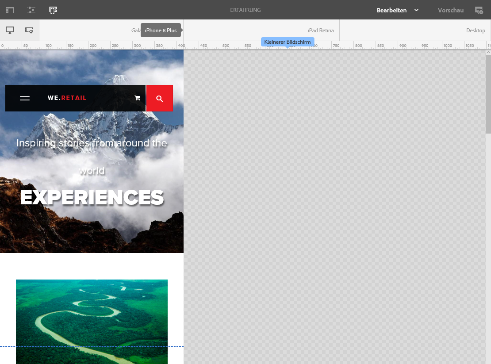
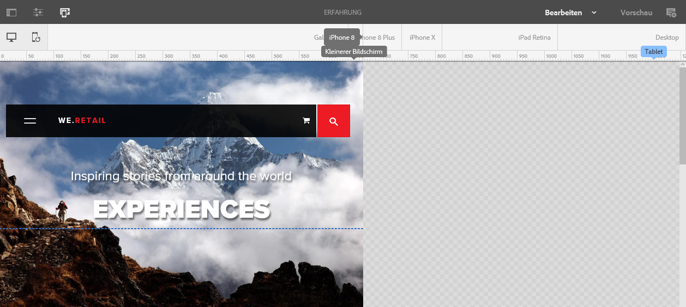
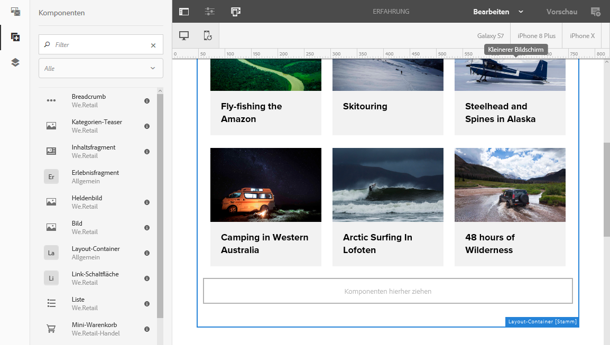
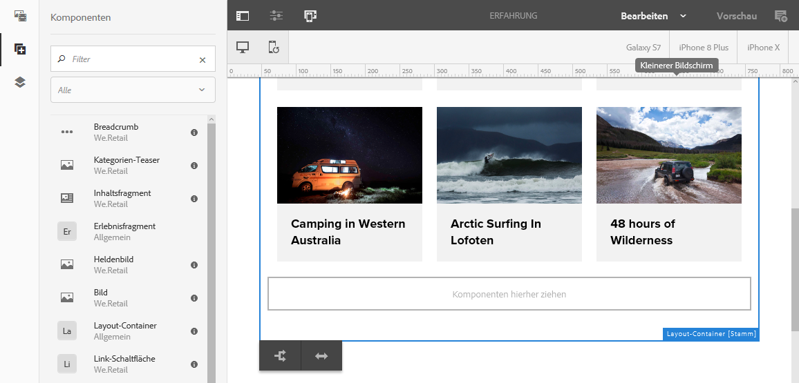
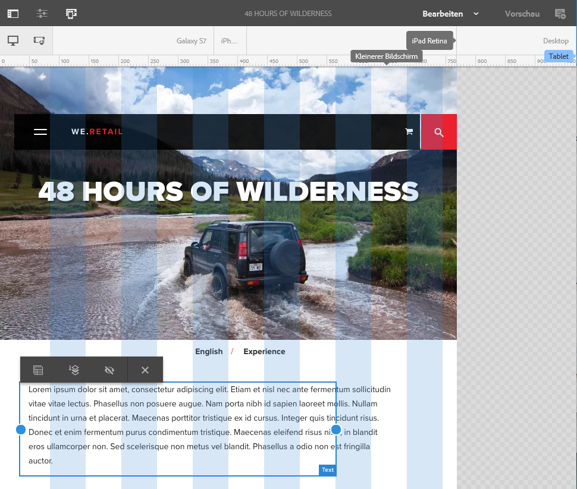

# Responsives Layout  {#responsive-layout}

AEM ermöglicht das Erstellen eines responsiven Layouts für Ihre Seiten mithilfe der Komponente **Layout-Container**.

Dieses liefert ein Absatzsystem, mit dem Sie Komponenten in einem responsiven Raster hinzufügen und positionieren können. Dieses Raster kann das Layout abhängig von der Größe des Geräts/Fensters und des Formats neu anordnen. Die Komponente wird zusammen mit dem [**Layout **-Modus](/help/sites-authoring/responsive-layout.md#defining-layouts-layout-mode)verwendet, in dem Sie Ihr responsives Layout geräteabhängig erstellen und bearbeiten können.

Der Layout-Container:

* Bietet horizontales Ausrichten am Raster zusammen mit der Möglichkeit Komponenten im Raster nebeneinander zu platzieren und zu definieren wann ein Reduzieren/Umfließen stattfinden soll.
* Verwendet vordefinierte Breakpoints (z. B. für Smartphones, Tablets usw.), sodass Sie das erforderliche Verhalten des Inhalts für ähnliche Geräte/Ausrichtungen definieren können.

   * Sie können z. B. die Größe der Komponente anpassen oder festlegen, ob die Komponente auf bestimmten Geräten sichtbar ist.

* Kann für die Spaltensteuerung verschachtelt werden.

Der Benutzer kann sich mit dem Emulator ansehen, wie der Inhalt für bestimmte Geräte gerendert wird.

>[!CAUTION]
>
>Auch wenn die Layout-Container-Komponente in der klassischen Benutzeroberfläche verfügbar ist, steht der vollständige Funktionsumfang nur in der Touch-optimierten Benutzeroberfläche zur Verfügung.

Das responsive Layout für Ihre Seiten wird von AEM mithilfe einer Kombination von Mechanismen ermöglicht:

* [**Layout-Container-Komponente **](#adding-a-layout-container-and-its-content-edit-mode)

   Diese Komponente ist im [Komponenten-Browser](/help/sites-authoring/author-environment-tools.md#components-browser) verfügbar. Sie bietet ein Raster-Absatzsystem, mit dem Sie Komponenten in einem responsiven Raster hinzufügen und positionieren können. Dieses kann auf Ihrer Seite auch als Standardabsatzsystem festgelegt werden.

* [**Layout-Modus **](/help/sites-authoring/responsive-layout.md#defining-layouts-layout-mode)

   Sobald der Layout-Container auf der Seite positioniert ist, können Sie im **Layout**-Modus Inhalte im responsiven Raster positionieren.

* [**Emulator **](#selecting-a-device-to-emulate)Hiermit können Sie responsive Websites erstellen und bearbeiten, deren Layout durch eine interaktive Größenanpassung der Komponenten an die Größe des Geräts oder Fensters angepasst wird. Der Benutzer kann sich dann mit dem Emulator ansehen, wie der Inhalt für bestimmte Geräte gerendert wird.

Dieser responsive Rastermechanismus bietet folgende Möglichkeiten:

* Verwendung von Breakpoints zur Definition verschiedener Inhaltslayouts basierend auf der Gerätebreite (nach Gerätetyp und -ausrichtung).
* Verwendung derselben Breakpoints und Inhaltslayouts, um sicherzustellen, dass Ihr Inhalt an die Größe des Browser-Fensters auf dem Desktop angepasst wird.
* Mit der horizontalen Ausrichtung am Raster können Sie Komponenten im Raster platzieren, die Größe anpassen und definieren, wann ein Reduzieren/Umfließen daneben oder drüber/darunter erfolgen soll.
* Ausblenden von Komponenten für bestimmte Gerätelayouts.
* Realisieren einer Spaltensteuerung.

Je nach Projekt kann der Layout-Container als standardmäßiges Absatzsystem für Ihre Seiten oder als Komponente verwendet werden, die über den Komponenten-Browser zu Ihrer Seite hinzugefügt werden kann (oder beides).

>[!NOTE]
>
>Adobe stellt eine [GitHub-Dokumentation](https://adobe-marketing-cloud.github.io/aem-responsivegrid/) zum responsiven Layout als Referenz bereit. Diese kann Frontend-Entwicklern zur Verfügung gestellt werden, damit sie das AEM-Raster außerhalb von AEM verwenden können, um beispielsweise statische HTML-Modelle für künftige AEM-Sites zu erstellen.

>[!NOTE]
>
>Die Verwendung des obigen Mechanismus wird durch die Konfiguration der Vorlage aktiviert. See [Configuring Responsive Layout](/help/sites-administering/configuring-responsive-layout.md) for further information.

## Layout-Definitionen, Geräteemulation und Breakpoints {#layout-definitions-device-emulation-and-breakpoints}

Wenn Sie den Inhalt Ihrer Website erstellen, möchten Sie sicherstellen, dass Ihr Inhalt auf dem für die Anzeige verwendeten Gerät angemessen angezeigt wird.

AEM ermöglicht die Definition von Layouts, die von der Breite des Geräts abhängig sind:

* Mit dem Emulator können Sie diese Layouts auf verschiedenen Geräten emulieren. Abgesehen vom Gerätetyp kann sich auch die durch die Option **Gerät drehen** ausgewählte Ausrichtung auf den ausgewählten Breakpoint auswirken, da sich die Breite ändert.
* Breakpoints sind Punkte, die die Layout-Definitionen trennen.

   * Sie definieren die maximale Breite (in Pixel) der Geräte, die ein bestimmtes Layout verwenden.
   * Breakpoints gelten in der Regel für eine Auswahl an Geräten und hängen von der Breite der Displays ab.
   * Ein Breakpoint reicht nach links bis zum nächsten Breakpoint.
   * Sie können den Breakpoint nicht spezifisch auswählen - durch die Auswahl eines Geräts und einer Ausrichtung wird der entsprechende Breakpoint automatisch ausgewählt.

Das Gerät **Desktop**, das keine bestimmte Breite aufweist und sich auf den Standard-Breakpoint bezieht (d. h. auf alles über dem letzten konfigurierten Breakpoint).

>[!NOTE]
>
>Es wäre möglich, Breakpoints für jedes einzelne Gerät zu definieren. Dies würde jedoch den Aufwand für die Layout-Definition und die Wartung deutlich erhöhen.

Wenn Sie mit dem Emulator ein bestimmtes zu emulierendes Gerät und die Layout-Definition auswählen, wird auch der zugehörige Breakpoint hervorgehoben. Alle von Ihnen durchgeführten Änderungen am Layout wirken sich auch auf andere Geräte aus, für die derselbe Breakpoint gilt – also auf alle links vom aktiven Breakpoint bis zum nächsten Breakpoint platzierten Geräte.

Wenn Sie z. B. das Gerät **iPhone 6 Plus** für die Emulation und das Layout auswählen (das mit einer Breite von 540 Pixel definiert ist), wird auch der Breakpoint **Telefon** (768 Pixel) aktiviert. Alle Änderungen am Layout, die Sie für das **iPhone 6** durchführen, gelten auch für die anderen Geräte unter dem Breakpoint **Telefon**, wie das **iPhone 5** (mit 320 Pixel definiert).

## Auswahl eines zu emulierenden Geräts {#selecting-a-device-to-emulate}

1. Öffnen Sie die gewünschte Seite für die Bearbeitung. Beispiel:

   `http://localhost:4502/editor.html/content/we-retail/us/en/experience.html`

1. Wählen Sie in der oberen Symbolleiste das Symbol **Emulator** aus:

   

1. Die Emulator-Symbolleiste wird geöffnet.

   

   In der Emulator-Symbolleiste werden zusätzliche Layout-Optionen angezeigt:

   * **Gerät drehen** – Ermöglicht es Ihnen, die vertikale Ausrichtung (Hochformat) eines Geräts in eine horizontale Ausrichtung (Querformat) zu ändern und umgekehrt.

    

   * **Gerät auswählen** – Ermöglicht es Ihnen, ein bestimmtes Gerät anzugeben, das aus einer Liste emuliert werden soll (Einzelheiten dazu werden im nächsten Schritt beschrieben).

   

1. Um ein bestimmtes Gerät für das Emulieren auszuwählen, können Sie wie folgt vorgehen:

   * Wählen Sie über das Symbol „Gerät auswählen“ eine Option aus der Dropdown-Liste aus.
   * Tippen/klicken Sie auf der Emulator-Symbolleiste auf das Gerätezeichen.

   

1. Nachdem Sie ein bestimmtes Gerät ausgewählt haben, sind folgende Möglichkeiten verfügbar:

   * Sie können die aktive Markierung für das ausgewählte Gerät anzeigen, z. B. **iPad**.
   * Sie können die aktive Markierung für den entsprechenden [Breakpoint](/help/sites-authoring/responsive-layout.md#layout-definitions-device-emulation-and-breakpoints) anzeigen, z. B. **Tablet**.

   

   * Die gepunktete blaue Linie stellt den *Falz* für das ausgewählte Gerät dar (in diesem Fall ein **iPhone 6**).

   

   * Dabei handelt es sich um eine Art Seitenumbruch für den Inhalt (nicht zu verwechseln mit den [Breakpoints](/help/sites-authoring/responsive-layout.md#layout-definitions-device-emulation-and-breakpoints)). Dies wird zur Vereinfachung angezeigt, um zu veranschaulichen, welchen Teil des Inhalts der Benutzer vor dem Bildlauf auf dem Gerät sehen wird.
   * Die Linie für den Falz wird nicht angezeigt, wenn die Höhe des zu emulierenden Geräts die Bildschirmgröße überschreitet.
   * Der Falz wird aus Komfortgründen für Autoren, aber nicht auf der veröffentlichten Seite angezeigt.

## Hinzufügen eines Layout-Containers und seiner Inhalte (Bearbeitungsmodus) {#adding-a-layout-container-and-its-content-edit-mode}

Ein **Layout-Container** ist ein Absatzsystem mit folgenden Eigenschaften:

* Enthält andere Komponenten.
* Definiert das Layout.
* Reagiert auf Änderungen.

>[!NOTE]
>
>Falls er noch nicht verfügbar ist, muss der **Layout-Container** explizit [für ein Absatzsystem/eine Seite aktiviert werden](/help/sites-administering/configuring-responsive-layout.md) (z. B. über den [**Designmodus **](/help/sites-authoring/default-components-designmode.md)).

1. Der **Layout-Container** ist als Standardkomponente im [Komponentenbrowser](/help/sites-authoring/author-environment-tools.md#components-browser) verfügbar. Von hier können Sie ihn an die gewünschte Position auf der Seite ziehen, nach der der Platzhalter **Komponenten hierher ziehen** angezeigt wird.
1. Anschließend können Sie Komponenten zum Layout-Container hinzufügen. Diese Komponenten enthalten dann den eigentlichen Inhalt:

   

## Auswählen und Bearbeiten eines Layout-Containers (Bearbeitungsmodus) {#selecting-and-taking-action-on-a-layout-container-edit-mode}

Einen Layout-Container können Sie wie andere Komponenten im **Bearbeitungsmodus** auswählen und anschließend bearbeiten (ausschneiden, kopieren, löschen):

>[!CAUTION]
>
>Da ein Layout-Container ein Absatzsystem ist, werden beim Löschen der Komponente sowohl das Layout-Raster als auch sämtliche im Container vorhandenen Komponenten und deren Inhalte gelöscht.

1. Wenn Sie den Mauszeiger über den Rasterplatzhalter halten oder darauf tippen, wird das Aktionsmenü angezeigt.

   

   Wählen Sie daraufhin die Option  **Übergeordnetes Element** aus.

   

1. Wenn die Layout-Komponente verschachtelt ist, wird durch Auswählen der Option **Übergeordnetes Element** eine Dropdown-Liste geöffnet, über die Sie den verschachtelten Layout-Container oder seine übergeordneten Elemente auswählen können.

   Wenn Sie den Mauszeiger im Dropdown-Menü über die Container-Namen halten, wird ihre Gliederung auf der Seite angezeigt.

   * Der am wenigsten verschachtelte Layout-Container ist schwarz dargestellt.
   * Der nächste Layout-Container ist dunkelgrau dargestellt.
   * Alle folgenden Container sind in jeweils helleren Grautönen dargestellt.

   

1. Dadurch wird das gesamte Raster mit den Inhalten markiert. Die Aktionssymbolleiste wird angezeigt, über die Sie eine Aktion auswählen können, z. B. **Löschen**.

   

## Definieren von Layouts (Layout-Modus) {#defining-layouts-layout-mode}

>[!NOTE]
>
>Sie können für jeden [Breakpoint](#layout-definitions-device-emulation-and-breakpoints) (der durch den emulierten Gerätetyp und die Ausrichtung bestimmt wird) ein eigenes Layout definieren.

Das Layout eines mit dem Layout-Container implementierten responsiven Rasters muss im **Layout**-Modus konfiguriert werden.

Der **Layout**-Modus kann auf zwei Arten aktiviert werden.

* Durch Verwenden des [Modusmenüs in der Symbolleiste](/help/sites-authoring/author-environment-tools.md#page-modes) und Auswählen des **Layout**-Modus

   * Wählen Sie den **Layout**-Modus so aus, wie Sie den Modus **Bearbeiten** oder **Targeting** auswählen.
   * Der **Layout**-Modus wird zunächst automatisch beibehalten. Sie können den **Layout**-Modus nur beenden, indem Sie über die Modusauswahl einen anderen Modus auswählen.

* Beim [Bearbeiten einer einzelnen Komponente](/help/sites-authoring/editing-content.md#edit-component-layout)

   * Durch Verwenden der Option **Layout** im Schnellaktionsmenü der Komponente können Sie in den **Layout**-Modus wechseln.
   * Der **Layout**-Modus wird zunächst automatisch beibehalten, während Sie die Komponente bearbeiten. Sobald Sie den Fokus auf eine andere Komponente richten, kehren Sie in den **Bearbeitungsmodus** zurück.

Im Layout-Modus können Sie verschiedene Aktionen für ein Raster durchführen:

* Passen Sie die Größe der Inhaltskomponenten mithilfe der blauen Punkte an. Die Größenanpassung wird immer am Raster ausgerichtet. Während der Größenanpassung wird im Hintergrund das Raster sichtbar, das die Ausrichtung erleichtert:

   

   >[!NOTE]
   >
   >Wenn Sie die Größe von Komponenten wie **Bildern** ändern, bleiben die Proportionen und Seitenverhältnisse erhalten.

* Wenn Sie auf eine Inhaltskomponente klicken/tippen, bietet Ihnen die Symbolleiste folgende Möglichkeiten:

   * **Übergeordnet**

      Ermöglicht die Auswahl der gesamten Layout-Container-Komponente zum Durchführen von Aktionen.

   * **Gleitkommawert in neue Zeile**

      Die Komponente wird je nach dem im Raster verfügbaren Platz in eine neue Zeile verschoben.

   * **Komponente ausblenden**

      Die Komponente wird unsichtbar gemacht (sie kann über die Symbolleiste des Layout-Containers wiederhergestellt werden).
   

* Im **Layout**-Modus können Sie auf **Komponenten hierher ziehen** tippen/klicken, um die gesamte Komponente auszuwählen. Dadurch wird die Symbolleiste für diesen Modus angezeigt.

   Die Symbolleiste weist je nach Status der Layout-Komponente und zugehörigen Komponenten verschiedene Optionen auf. Beispiel:

   * **Übergeordnetes Element**: Wählt die übergeordnete Komponente aus.

   

   * **Verborgene Komponenten einblenden**: Ermöglicht das Einblenden aller oder einzelner Komponenten. Die Zahl gibt an, wie viele verborgene Komponenten es jeweils gibt. Der Zähler zeigt an, wie viele Komponenten ausgeblendet sind.

   

   * **Breakpoint-Layout zurücksetzen**: Ermöglicht die Rückkehr zum Standard-Layout. Dies bedeutet, dass kein benutzerdefiniertes Layout vorgegeben wird.

   

   * **In neue Zeile verschieben**: Verschiebt die Komponente um eine Position nach oben, wenn der Leerraum dies erlaubt.

   

   * **Komponente ausblenden**: Blendet die aktuelle Komponente aus.

   

   >[!NOTE]
   >
   >Im obigen Beispiel sind die Aktionen zum Verschieben und Ausblenden verfügbar, weil dieser Layout-Container in einem übergeordneten Layout-Container verschachtelt ist.

   * **Aufheben der Komponenten** Wählen Sie die übergeordneten Komponenten aus, um die Aktionsleiste mit der 
**Option &quot;Ausgeblendete Komponenten** anzeigen&quot;. In diesem Beispiel gibt es zwei ausgeblendete Komponenten.
   

   Bei Auswahl der Option **Verborgene Komponenten einblenden** werden die jeweils ausgeblendeten Komponenten in Blau an ihren ursprünglichen Positionen angezeigt.

   

   Bei Auswahl der Option **Alle wiederherstellen** werden alle verborgenen Komponenten eingeblendet.

