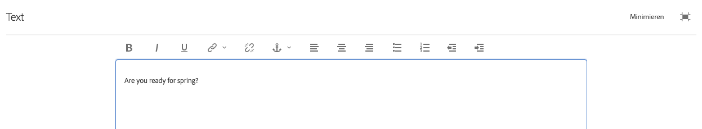

# Verwenden des Rich-Text-Editors zum Erstellen von Inhalten {#using-the-rich-text-editor-to-author-content}

>[!CAUTION]
>
>AEM 6.4 hat das Ende der erweiterten Unterstützung erreicht und diese Dokumentation wird nicht mehr aktualisiert. Weitere Informationen finden Sie in unserer [technische Unterstützung](https://helpx.adobe.com/de/support/programs/eol-matrix.html). Unterstützte Versionen suchen [here](https://experienceleague.adobe.com/docs/?lang=de).

Der Rich-Text-Editor (RTE) ist ein grundlegender Baustein für die Textbearbeitung in AEM Seiten. Viele Komponenten wie Text, Text und Bild sowie Tabelle basieren auf dem RTE.

>[!NOTE]
>
>Das Kopieren verschachtelter Listen in den RTE funktioniert nicht erwartungsgemäß. Beim Kopieren verschachtelter Listen aus Microsoft Word müssen Sie die Listen manuell bereinigen, nachdem Sie den Text in den RTE eingefügt haben.

## Bearbeitung im Kontext {#in-place-editing}

Wenn Sie eine textbasierte Komponente mit einem einzigen Tippen oder Klicken auswählen, wird die [Komponenten-Symbolleiste](../sites-authoring/editing-content.md#edit-configure-copy-cut-delete-paste).

Durch erneutes Tippen/Klicken oder erstmaliges Auswählen der Komponente mit langsamem Doppeltippen/Klicken wird die Bearbeitung im Kontext geöffnet, die über eine eigene Symbolleiste verfügt. Hier können Sie den Inhalt bearbeiten und grundlegende Formatierungsänderungen vornehmen.

Diese Symbolleiste beinhaltet die folgenden Optionen:

* **Format**: Formatierung &quot;Fett&quot;, &quot;Kursiv&quot;und &quot;Unterstrichen&quot;festlegen.

* **Listen**: Erstellen Sie Listen mit Aufzählungszeichen oder Nummerierungen oder legen Sie den Einzug fest.

* **Hyperlink**

* **Verknüpfung aufheben**

* **Vollbild**

* **Schließen**

* **Speichern**

## Vollbildbearbeitung {#full-screen-editing}

Bei textbasierten Komponenten wird durch Auswahl des Vollbildmodus in der Symbolleiste der Rich-Text-Editor geöffnet und der restliche Seiteninhalt ausgeblendet.

Der Vollbildmodus zeigt alle Optionen Ihres Rich-Text-Editors an, die von Ihrem Administrator konfiguriert wurden. Diese können AEM Instanzen variieren [je nach Konfiguration](../sites-administering/rich-text-editor.md) bereitgestellt von den Administratoren oder AEM Entwicklern. Wenn eine Option fehlt, bitten Sie Ihren Administrator, sie verfügbar zu machen.

Zusätzliche Optionen für den Rich-Text-Editor sind:

* **Anker**: Erstellen Sie einen Anker im Text, zu dem Sie später eine Verknüpfung/einen Verweis herstellen können.
* **Text links ausrichten**
* **Text zentrieren**
* **Text rechts ausrichten**

Um den Vollbildmodus zu schließen, klicken Sie auf das Symbol &quot;Minimieren&quot;.

