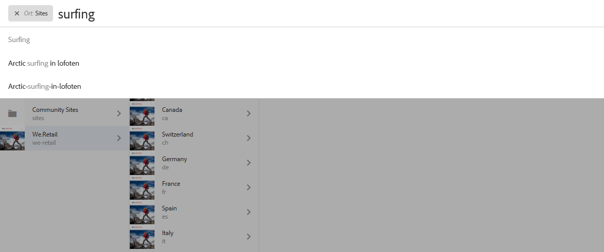
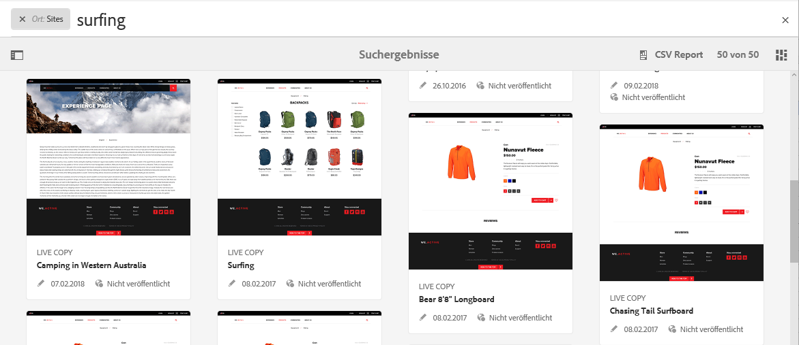
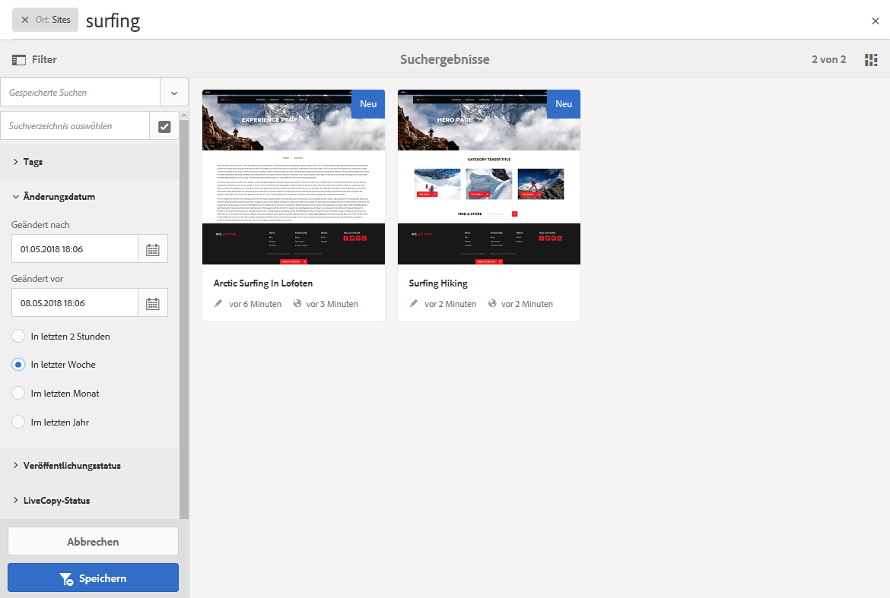
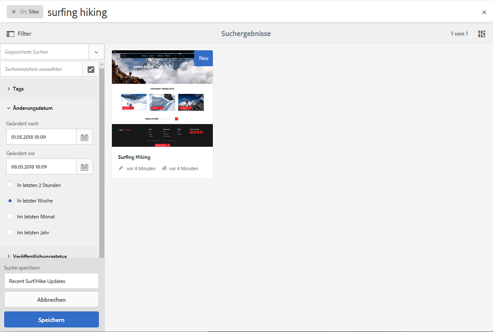
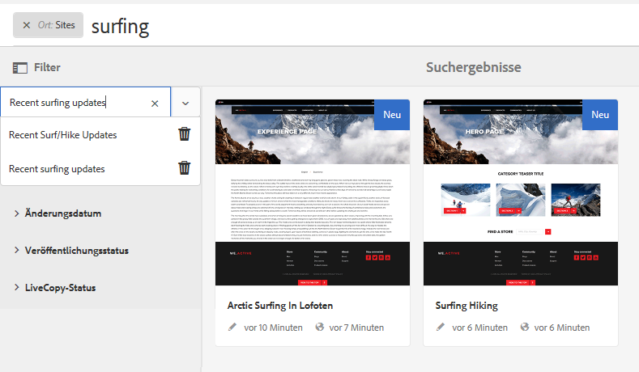
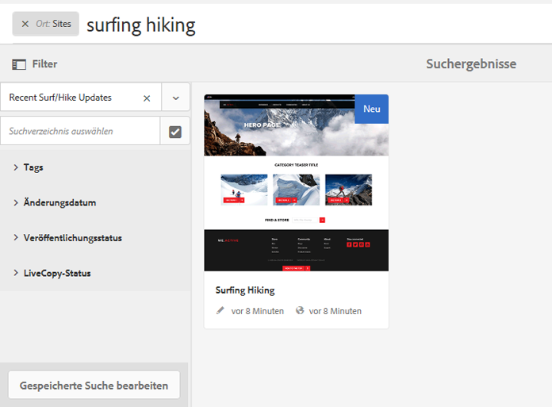

# Suchen{#search-features}

>[!CAUTION]
>
>AEM 6.4 hat das Ende der erweiterten Unterstützung erreicht und diese Dokumentation wird nicht mehr aktualisiert. Weitere Informationen finden Sie in unserer [technische Unterstützung](https://helpx.adobe.com/de/support/programs/eol-matrix.html). Unterstützte Versionen suchen [here](https://experienceleague.adobe.com/docs/?lang=de).

Die Autorenumgebung von AEM bietet abhängig vom Ressourcentyp verschiedene Möglichkeiten zur Inhaltssuche.

>[!NOTE]
>
>Außerhalb der Autorenumgebung stehen auch andere Mechanismen für die Suche zur Verfügung, z. B. die [Query Builder](/help/sites-developing/querybuilder-api.md) und [CRXDE Lite](/help/sites-developing/developing-with-crxde-lite.md).

## Grundlagen zur Suche {#search-basics}

Die Suchfunktion ist über die obere Symbolleiste verfügbar:

Die Suchleiste bietet Ihnen folgende Möglichkeiten:

* Suchen Sie nach einem bestimmten Keyword, Pfad oder Tag.
* Filtern nach ressourcenspezifischen Kriterien, wie Änderungsdatumsangaben, Seitenstatus, Dateigröße usw.
* Definieren und Verwenden einer [gespeicherten Suche](#saved-searches), die auf den oben genannten Kriterien basiert.

>[!NOTE]
>
>Sie können die Suche auch aufrufen, indem Sie den Hotkey `/` (Schrägstrich) verwenden, wenn die Suchleiste sichtbar ist.

## Suchen und Filtern {#search-and-filter}

So durchsuchen und filtern Sie Ressourcen:

1. Öffnen **Suche** (mit der Lupe in der Symbolleiste) und geben Sie Ihren Suchbegriff ein. Vorschläge werden erstellt und können ausgewählt werden:

   

   Standardmäßig sind die Suchergebnisse auf Ihre aktuelle Position begrenzt (d. h. Konsolen- und zugehörigen Ressourcentyp):

   

1. Bei Bedarf können Sie den Standortfilter entfernen (wählen Sie **X** auf dem Filter, den Sie entfernen möchten), um über alle Konsolen/Ressourcentypen zu suchen.
1. Die Ergebnisse werden angezeigt und nach Konsole und Ressourcentyp gruppiert.

   Sie können entweder eine spezifische Ressource (für eine spätere Aktion) oder eine Drilldown-Suche auswählen, indem Sie den erforderlichen Ressourcentyp auswählen, z. B. **Alle Sites anzeigen**:

   

1. Wenn Sie einen Drilldown durchführen möchten, wählen Sie das Symbol für die Seitenleiste (oben links) aus, um den Seitenbereich **Filter und Optionen** zu öffnen.

   

   Je nach Ressourcentyp zeigt die Suche eine vordefinierte Auswahl von Such-/Filterkriterien an.

   Im seitlichen Bedienfeld können Sie Folgendes auswählen:

   * Gespeicherte Suchvorgänge
   * Suchverzeichnis
   * Tags
   * Suchkriterien, z. B. Änderungsdatum, Veröffentlichungsstatus, Live Copy-Status. 

   >[!NOTE]
   >
   >Die Suchkriterien können variieren:
   >
   >* Je nach ausgewähltem Ressourcentyp; Beispielsweise sind die Kriterien Assets und Communities verständlicherweise spezialisiert.
   >* Ihre Instanz als [Forms durchsuchen](/help/sites-administering/search-forms.md) kann angepasst werden (entsprechend dem Speicherort in AEM).

   

1. Sie können auch zusätzliche Suchbegriffe hinzufügen:

   

1. Schließen Sie die **Suche** mit dem **X** (oben rechts).

>[!NOTE]
>
>Suchkriterien werden beibehalten, wenn ein Element in den Suchergebnissen ausgewählt wird.
>
>Bei Auswahl eines Elements auf der Seite mit den Suchergebnissen bleiben die Suchkriterien erhalten, wenn Sie über die Zurück-Schaltfläche des Browsers zur Suchseite zurückkehren.

## Gespeicherte Suchvorgänge {#saved-searches}

Neben der Suche nach einer Vielzahl von Facetten können Sie auch eine bestimmte Suchkonfiguration speichern, um sie später abzurufen und zu verwenden:

1. Definieren Sie Ihre Suchkriterien und wählen Sie **Speichern**.

   

1. Weisen Sie einen Namen zu und wählen Sie zur Bestätigung **Speichern** aus:

   

1. Die gespeicherte Suche ist außerdem in der Auswahl verfügbar, wenn Sie das nächste Mal auf den Suchbereich zugreifen:

   

1. Nach dem Speichern können Sie:

   * Verwendung **x** (neben dem Namen der gespeicherten Suche), um eine neue Abfrage zu starten (die gespeicherte Suche selbst wird nicht gelöscht).
   * **Gespeicherte Suche bearbeiten**, ändern Sie die Suchbedingungen und **Speichern** erneut.

Gespeicherte Suchen können geändert werden, indem Sie die gespeicherte Suche auswählen und unten im Suchfeld auf **Gespeicherte Suche bearbeiten** klicken.

