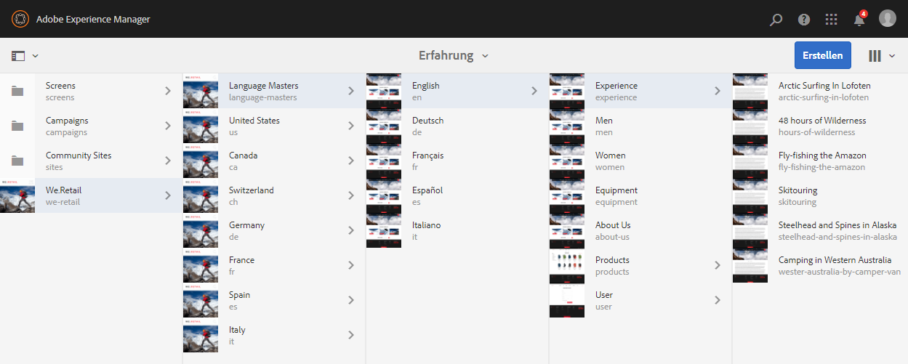
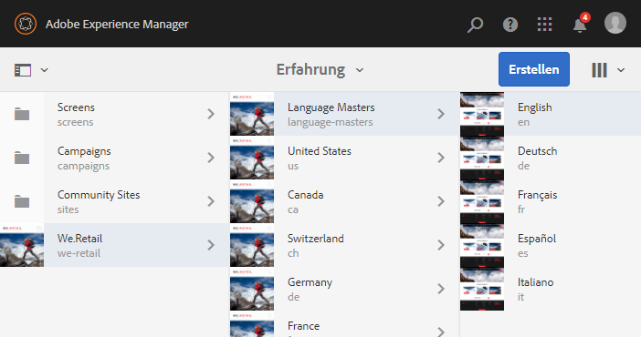
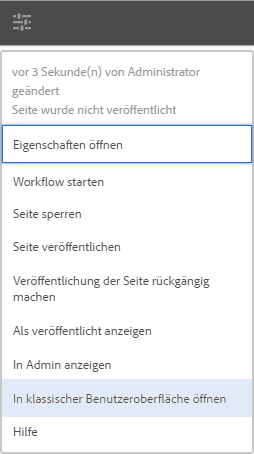

# Auswahl der Benutzeroberfläche{#selecting-your-ui}

>[!CAUTION]
>
>AEM 6.4 hat das Ende der erweiterten Unterstützung erreicht und diese Dokumentation wird nicht mehr aktualisiert. Weitere Informationen finden Sie in unserer [technische Unterstützung](https://helpx.adobe.com/de/support/programs/eol-matrix.html). Unterstützte Versionen suchen [here](https://experienceleague.adobe.com/docs/?lang=de).

## Grundlegendes zu den Benutzeroberflächen

Die Autorenumgebung ermöglicht Folgendes:

* [Authoring](/help/sites-authoring/author.md) (einschließlich [Seitenbearbeitung](/help/sites-authoring/author-environment-tools.md), [Verwalten von Assets](/help/assets/home.md), [communities](/help/communities/author-communities.md))

* [Verwaltungsaufgaben](/help/sites-administering/home.md), die Sie für die Erstellung und Verwaltung des Inhalts auf Ihrer Website benötigen

Hierfür stehen zwei grafische Benutzeroberflächen zur Verfügung. Diese sind über jeden modernen Browser zugänglich.

1. Touch-optimierte Benutzeroberfläche

   * Dies ist die moderne, standardmäßige AEM Benutzeroberfläche.
   * Es ist vorwiegend grau, mit einer sauberen, flachen Oberfläche.
   * Design für die Verwendung auf Touch- und Desktop-Geräten. Aussehen und Erscheinungsbild sind auf allen Geräten identisch, allerdings [Anzeigen und Auswählen von Ressourcen](/help/sites-authoring/basic-handling.md#viewing-and-selecting-resources) geringfügig abweicht (Tippen/Klicken).

      * Desktop:

   

   * Tablets (oder Desktop mit einer Breite von weniger als 1024 Pixeln):

   

1. Klassische Benutzeroberfläche

   * Dies ist die alte Benutzeroberfläche, die seit vielen Jahren in AEM verfügbar ist.
   * Es ist überwiegend grün.
   * Sie wurde für die Verwendung auf Desktop-Geräten entwickelt.
   * Die folgende Dokumentation konzentriert sich auf die moderne Benutzeroberfläche. Informationen zum Authoring in der klassischen Benutzeroberfläche finden Sie in der [Bearbeitungsdokumentation für die klassische Benutzeroberfläche](/help/sites-classic-ui-authoring/classicui.md).

   

## Wechseln von Benutzeroberflächen

Obwohl die Touch-optimierte Benutzeroberfläche jetzt die standardmäßige Benutzeroberfläche ist und [Funktionsparität](../release-notes/touch-ui-features-status.md) mit der Verwaltung und Bearbeitung von Sites nahezu erreicht wurde, kann es vorkommen, dass der Benutzer zum [klassische Benutzeroberfläche](/help/sites-classic-ui-authoring/classicui.md). Dazu gibt es mehrere Möglichkeiten.

>[!NOTE]
>
>Weitere Informationen zum Status der Funktionsparität mit der klassischen Benutzeroberfläche finden Sie im Dokument [Funktionsparität bei der Touch-optimierten Benutzeroberfläche](../release-notes/touch-ui-features-status.md).

Es gibt verschiedene Stellen, an denen Sie definieren können, welche Benutzeroberfläche verwendet werden soll:

* [Konfigurieren der Standard-Benutzeroberfläche für Ihre Instanz](#configuring-the-default-ui-for-your-instance) - Dadurch wird die Standardbenutzeroberfläche festgelegt, die bei der Benutzeranmeldung angezeigt wird. Der Benutzer kann dies jedoch außer Kraft setzen und eine andere Benutzeroberfläche für sein Konto oder die aktuelle Sitzung auswählen.

* [Einrichten der klassischen Benutzeroberflächen-Bearbeitung für Ihr Konto](/help/sites-authoring/select-ui.md#setting-classic-ui-authoring-for-your-account) - Dadurch wird die Benutzeroberfläche festgelegt, die beim Bearbeiten von Seiten als Standard verwendet werden soll. Der Benutzer kann dies jedoch außer Kraft setzen und eine andere Benutzeroberfläche für sein Konto oder die aktuelle Sitzung auswählen.

* [Wechsel zur klassischen Benutzeroberfläche für die aktuelle Sitzung](#switching-to-classic-ui-for-the-current-session) - Dies wechselt zur klassischen Benutzeroberfläche für die aktuelle Sitzung.

* Im Falle von [Seitenbearbeitung des Systems überschreibt bestimmte Aspekte in Bezug auf die Benutzeroberfläche](#ui-overrides-for-the-editor).

>[!CAUTION]
>
>Verschiedene Optionen zum Wechseln zur klassischen Benutzeroberfläche sind nicht sofort standardmäßig verfügbar, sondern müssen speziell für Ihre Instanz konfiguriert werden.
>
>Weitere Informationen finden Sie unter [Aktivieren des Zugriffs auf die klassische Benutzeroberfläche](/help/sites-administering/enable-classic-ui.md).

>[!NOTE]
>
>Instanzen, bei denen ein Upgrade von einer früheren Version durchgeführt wurde, behalten die klassische Benutzeroberfläche für die Seitenbearbeitung bei.
>
>Nach dem Upgrade wechselt die Seitenbearbeitung nicht automatisch zur Touch-optimierten Benutzeroberfläche. Sie können dies aber mit der [OSGi-Konfiguration](/help/sites-deploying/configuring-osgi.md) des **WCM Authoring UI Mode Service** (`AuthoringUIMode`-Service) konfigurieren. Weitere Informationen dazu finden Sie unter [Benutzeroberflächenüberschreibung für den Editor](#ui-overrides-for-the-editor).

## Konfigurieren der Standard-Benutzeroberfläche für Ihre Instanz {#configuring-the-default-ui-for-your-instance}

Ein Systemadministrator kann die Benutzeroberfläche konfigurieren, die beim Start und bei der Anmeldung angezeigt wird, indem er [Stammzuordnung](/help/sites-deploying/osgi-configuration-settings.md).

Dies kann durch Benutzereinstellungen oder Sitzungseinstellungen überschrieben werden.

## Einrichten der klassischen Benutzeroberflächen-Bearbeitung für Ihr Konto {#setting-classic-ui-authoring-for-your-account}

Jeder Benutzer kann auf seine [Benutzereinstellungen](/help/sites-authoring/user-properties.md) , um zu definieren, ob er die klassische Benutzeroberfläche für die Seitenbearbeitung verwenden möchte (anstelle der Standard-Benutzeroberfläche).

Dies kann durch Sitzungseinstellungen überschrieben werden.

## Wechseln zur klassischen Benutzeroberfläche für die aktuelle Sitzung {#switching-to-classic-ui-for-the-current-session}

Bei Verwendung der Touch-optimierten Benutzeroberfläche möchten Benutzer vielleicht zur klassischen Benutzeroberfläche (nur für Desktops) zurückzukehren. Es gibt mehrere Methoden, um für die aktuelle Sitzung zur klassischen Benutzeroberfläche zu wechseln:

* **Navigationslinks**

   >[!CAUTION]
   >
   >Diese Option zum Wechseln zur klassischen Benutzeroberfläche ist nicht sofort standardmäßig verfügbar, sondern muss speziell für Ihre Instanz konfiguriert werden.
   >
   >
   >Weitere Informationen finden Sie unter [Aktivieren des Zugriffs auf die klassische Benutzeroberfläche](/help/sites-administering/enable-classic-ui.md).

   Wenn diese Funktion aktiviert ist, erscheint immer, wenn Sie die Maus über eine entsprechende Konsole bewegen, ein Symbol (eines Bildschirms). Wenn Sie darauf tippen/klicken, öffnet sich der entsprechende Bereich in der klassischen Benutzeroberfläche.

   Zum Beispiel die Verknüpfungen von **Sites** zu **siteadmin**: 

   

* **URL**

   Die klassische Benutzeroberfläche kann über die URL für den Begrüßungsbildschirm unter `welcome.html` aufgerufen werden. Beispiel:

   `http://localhost:4502/welcome.html`

   >[!NOTE]
   >
   >Die Touch-optimierte Benutzeroberfläche kann über `sites.html` aufgerufen werden. Beispiel:
   >
   >
   >`http://localhost:4502/sites.html`

### Wechseln zur klassischen Benutzeroberfläche bei der Bearbeitung einer Seite {#switching-to-classic-ui-when-editing-a-page}

>[!CAUTION]
>
>Diese Option zum Wechseln zur klassischen Benutzeroberfläche ist nicht sofort standardmäßig verfügbar, sondern muss speziell für Ihre Instanz konfiguriert werden.
>
>Weitere Informationen finden Sie unter [Aktivieren des Zugriffs auf die klassische Benutzeroberfläche](/help/sites-administering/enable-classic-ui.md).

Sofern aktiviert, ist die Option **Klassische Benutzeroberfläche öffnen** im Dialogfeld **Seiteninformationen** verfügbar: 

### UI-Überschreibungen für den Editor {#ui-overrides-for-the-editor}

Die von einem Benutzer oder Systemadministrator festgelegten Einstellungen können vom System bei der Seitenbearbeitung überschrieben werden.

* Beim Erstellen von Seiten:

   * Die Verwendung des klassischen Editors wird erzwungen, wenn die Seite über eine URL aufgerufen wird, die `cf#` enthält. Beispiel:

      `http://localhost:4502/cf#/content/geometrixx/en/products/triangle.html`

   * Die Verwendung des Touch-optimierten Editors wird erzwungen, wenn `/editor.html` in der URL verwendet oder ein Touch-Gerät genutzt wird. Beispiel:

      `http://localhost:4502/editor.html/content/geometrixx/en/products/triangle.html`

* Jede erzwungene Einstellung ist temporär und nur für die aktuelle Browser-Sitzung gültig.

   * Ein Cookie wird abhängig davon gesetzt, ob die Touch-optimierte (`editor.html`) oder die klassische (`cf#`) Variante verwendet wird.

* Beim Öffnen von Seiten über `siteadmin` wird nach Folgendem gesucht:

   * dem Cookie
   * einer Benutzervoreinstellung
   * Wenn keines von beiden vorhanden ist, werden standardmäßig die in der [OSGi-Konfiguration](/help/sites-deploying/configuring-osgi.md) des **WCM Authoring UI Mode Service** (`AuthoringUIMode`-Service) festgelegten Definitionen verwendet.

>[!NOTE]
>
>Wenn [ein Benutzer bereits eine Voreinstellung für die Seitenbearbeitung definiert hat](#setting-classic-ui-authoring-for-your-account), das nicht durch Ändern der OSGi-Eigenschaft überschrieben wird.

>[!CAUTION]
>
>Aufgrund der Verwendung von Cookies, wie bereits beschrieben, wird Folgendes nicht empfohlen:
>
>* Manuelles Bearbeiten der URL - Eine nicht standardmäßige URL könnte zu einer unbekannten Situation und Funktionslosigkeit führen.
>* Verwenden Sie beide Editoren zur selben Zeit, z. B. in separaten Fenstern.
>

