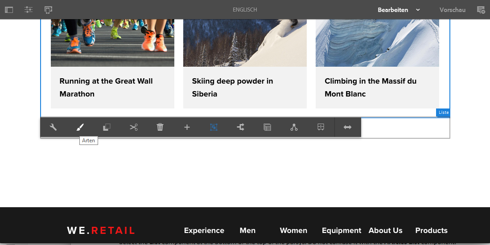
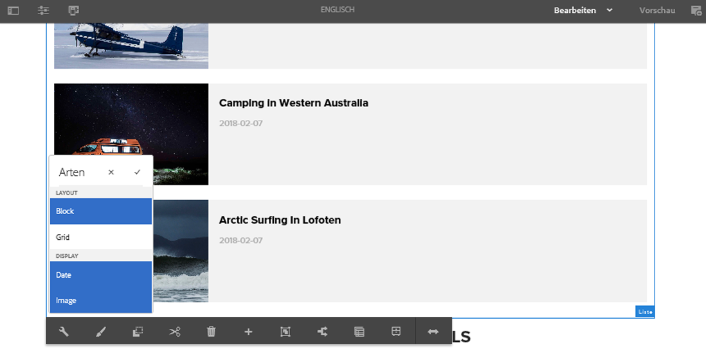
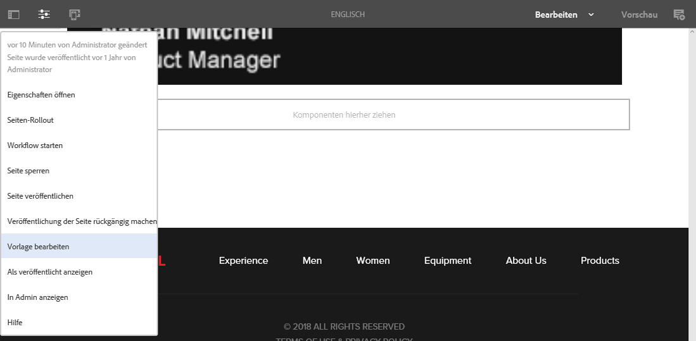
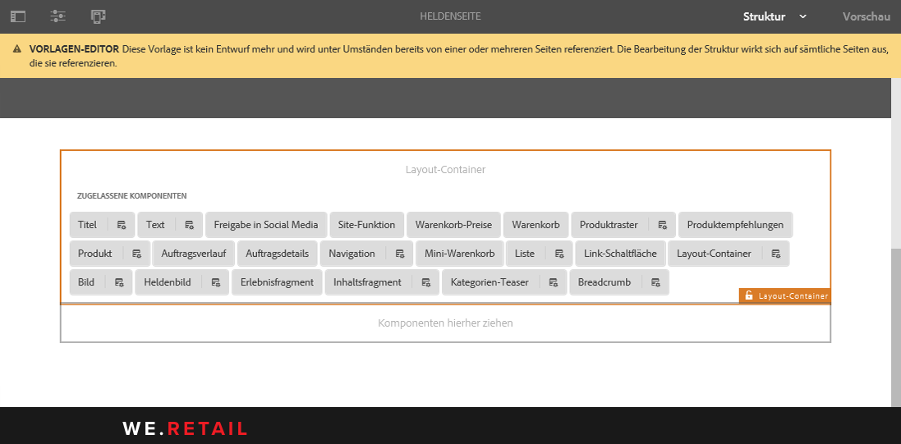
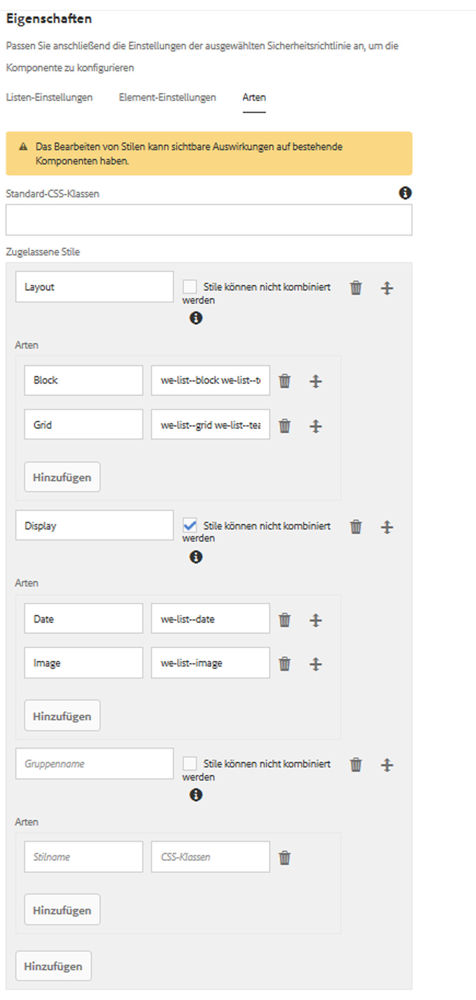

# Stilsystem{#style-system}

Das Stilsystem ermöglicht es einem Vorlagenautor, in der Inhaltsrichtlinie für Komponenten Stilklassen festzulegen, die ein Inhaltsautor später bei der Bearbeitung der Komponente auf einer Seite auswählen kann. Diese Stile können alternative visuelle Varianten einer Komponente sein, um das Verfahren flexibler zu gestalten.

So muss nicht eigens für jeden Stil eine benutzerdefinierte Komponente entwickelt oder der Komponentendialog angepasst werden, um eine derartige Stilfunktionalität zu ermöglichen. Das Resultat sind mehr wiederverwendbare Komponenten, die schnell und einfach an die Bedürfnisse von Inhaltsautoren angepasst werden können, ohne dass eine AEM-Back-End-Entwicklung erforderlich ist.

## Nutzungsszenario {#use-case}

Vorlagenautoren müssen nicht nur die Funktionsweise der Komponenten für die Inhaltsautoren konfigurieren können, sondern auch eine Reihe alternativer visueller Varianten einer Komponente.

Genauso müssen Inhaltsautoren ihre Inhalte nicht nur strukturieren und anordnen können. Sie müssen auch auswählen können, wie der Inhalt visuell präsentiert wird.

Das Stilsystem bietet eine einheitliche Lösung für die Anforderungen des Vorlagenautors und des Inhaltsautors:

* Vorlagenautoren können in den Inhaltsrichtlinien für Komponenten Stilklassen festlegen.
* Inhaltsautoren können diese Klassen später aus einem Dropdown-Menü auswählen, wenn sie die Komponente auf einer Seite bearbeiten, um die jeweiligen Stile darauf anzuwenden.

Die Stilklasse wird daraufhin in das Decoration-Wrapper-Element der Komponente eingefügt, sodass sich der Komponentenentwickler nicht mit der Handhabung der Stile über die Bereitstellung der CSS-Regeln hinaus befassen muss.

## Überblick {#overview}

Die allgemeine Verwendung des Stilsystems sieht wie folgt aus.

1. Der Webdesigner erstellt unterschiedliche visuelle Varianten einer Komponente.

1. Dem HTML-Entwickler werden die HTML-Ausgabe der Komponenten sowie die zu implementierenden visuellen Varianten zur Verfügung übermittelt.

1. Der HTML-Entwickler definiert die CSS-Klassen, die jeder visuellen Variante entsprechen und in das Element eingefügt werden sollen, das die Komponenten umschließt.

1. Der HTML-Entwickler implementiert den entsprechenden CSS-Code (und optional JS-Code) für jede visuelle Variation, sodass sie wie definiert aussehen.

1. Der AEM-Entwickler legt den bereitgestellten CSS-Code (und optional JS-Code) in einer [Client-Bibliothek](/help/sites-developing/clientlibs.md) ab und stellt ihn bereit.

1. Der AEM-Entwickler oder Vorlagenautor konfiguriert die Seitenvorlagen und bearbeitet die Richtlinie jeder formatierten Komponente, fügt die definierten CSS-Klassen hinzu, gibt benutzerfreundliche Namen zu jedem Stil und gibt an, welche Stile kombiniert werden können.

1. Der AEM-Seitenautor kann die entworfenen Stile daraufhin über das Stilmenü in der Symbolleiste einer Komponente im Seiten-Editor auswählen.

Beachten Sie, dass nur die letzten drei Schritte direkt in AEM ausgeführt werden. Das bedeutet, dass die gesamte erforderliche CSS- und JavaScript-Entwicklung ohne AEM durchgeführt werden kann.

Für die eigentliche Implementierung der Stile ist nur die Bereitstellung in AEM sowie die Auswahl innerhalb der Komponenten der gewünschten Vorlagen erforderlich.

Das folgende Diagramm stellt die Architektur des Stilsystems dar.

## Verwenden Sie:{#use}

Um die Funktion zu demonstrieren, müssen Stile für eine Komponente erstellt werden. Mit der [Listenkomponente](/help/sites-developing/we-retail.md) der Kernkomponentenimplementierung von [We.Retail](https://helpx.adobe.com/experience-manager/core-components/using/list.html) als Grundlage können Sie das angehängte Paket mit Stilen installieren, um die Funktionalität der Funktion kennenzulernen.

Herunterladen des Demopakets zum [Style-System](assets/package_-_style_systemdemo.zip)

>[!NOTE]
>
>Das Demopaket soll zeigen, wie Autoren das Stilsystem verwenden können. Es ist nicht als Referenz für die bestmögliche Implementierung gedacht.
>
>Dieses Paket ist nur erforderlich, bis We.Retail ein integriertes Beispiel sowie Best Practices zur Implementierung bereitstellt.

In den folgenden Abschnitten [Als Inhaltsautor](/help/sites-authoring/style-system.md#as-a-content-author) und [Als Vorlagenautor](/help/sites-authoring/style-system.md#as-a-template-author) wird beschrieben, wie Sie die Funktionalität des Stilsystems mit dem Stilsystem-Demopaket sowie We.Retail testen können.

Wenn Sie das Stilsystem für Ihre eigenen Komponenten verwenden möchten, gehen Sie wie folgt vor:

1. Installieren Sie den CSS-Code als Client-Bibliotheken, wie im Abschnitt [Überblick](/help/sites-authoring/style-system.md#overview) erklärt.
1. Konfigurieren Sie die CSS-Klassen, die Sie Ihren Inhaltsautoren zur Verfügung stellen möchten, wie im Abschnitt [Als Vorlagenautor](/help/sites-authoring/style-system.md#as-a-template-author) beschrieben.
1. Inhaltsautoren können die Stile daraufhin wie im Abschnitt [Als Inhaltsautor](/help/sites-authoring/style-system.md#as-a-content-author) beschrieben verwenden.

### Als Inhaltsautor {#as-a-content-author}

1. After installing the style system demo package, navigate to We.Retail&#39;s English language master home page at `http://localhost:4502/sites.html/content/we-retail/language-masters/en` and edit the page.
1. Wählen Sie die Komponente **Listen** unten oder oben im Absatzsystem aus. Do not confuse it with the **Articles List** component.

   

1. Tippen oder klicken Sie auf die Schaltfläche **Stile** in der Symbolleiste der Komponente **Liste**, um das Stilmenü zu öffnen und das Erscheinungsbild der Komponente zu bearbeiten.

   

   >[!NOTE]
   >
   >In diesem Beispiel schließen sich die **Layout** stile (**Block** und **Raster**) gegenseitig aus, während die **Anzeige** optionen (**Image** oder **Datum**) miteinander kombiniert werden können. Dies kann [in der Vorlage durch den Vorlagenautor konfiguriert werden](/help/sites-authoring/style-system.md#as-a-template-author).

### Als Vorlagenautor {#as-a-template-author}

1. While editing We.Retail&#39;s English language master home page at `http://localhost:4502/sites.html/content/we-retail/language-masters/en`, edit the template of the page via **Page Information -> Edit Template**.

   

1. Bearbeiten Sie die Richtlinien für die Komponente **Liste**, indem Sie auf die Schaltfläche **Richtlinie** der Komponente klicken. Verwechseln Sie sie nicht mit der Komponente **Artikelliste**.

   

1. Auf der Registerkarte „Stile“ in den Eigenschaften können Sie sehen, wie die Stile konfiguriert wurden.

   

   * **Gruppenname:** Stile können im Stilmenü gruppiert werden, das dem Inhaltsautor angezeigt wird, während er den Stil einer Komponente konfiguriert.
   * **Stile können kombiniert werden:** Legt fest, dass mehrere Stile innerhalb einer Gruppe gleichzeitig ausgewählt werden können.
   * **Stilname:** Die Beschreibung des Stils, der dem Inhaltsautor bei der Konfiguration des Stils der Komponente angezeigt wird.
   * **CSS-Klassen:** Der tatsächliche Name der dem Stil zugeordneten CSS-Klasse.
   Ordnen Sie die Gruppen und die Stile innerhalb der Gruppen mit den Ziehpunkten. Nutzen Sie die Symbole „Hinzufügen“ oder „Löschen“, um Gruppen bzw. Stile innerhalb der Gruppen hinzuzufügen oder zu entfernen.

>[!CAUTION]
>
>The CSS classes (as well as any necessary Javascript) configured as style properties of a component&#39;s policy must be deployed as [Client Libraries](/help/sites-developing/clientlibs.md) in order to work.

## Einrichtung {#setup}

>[!NOTE]
>
>Version 2 der Kernkomponenten kann das Stilsystem vollständig nutzen. Dafür ist keine zusätzliche Konfiguration erforderlich.
>
>Führen Sie die nächsten Schritte aus, um das Stilsystem für Ihre eigenen benutzerdefinierten Komponenten zu aktivieren oder die Hauptkomponenten von Version 1 zu erweitern und die Funktion zu nutzen.

Damit eine Komponente mit dem Stilsystem von AEM verwendet werden kann und die Registerkarte „Stil“ im Dialogfeld „Design“ angezeigt wird, muss der Komponentenentwickler diese Registerkarte mit den folgenden Einstellungen für die Komponente miteinbeziehen:

* `path = "/mnt/overlay/cq/gui/components/authoring/dialog/style/tab_design/styletab"`
* `sling:resourceType = "granite/ui/components/coral/foundation/include"`

Ist die Komponente entsprechend konfiguriert, fügt AEM die von den Seitenautoren festgelegten Stile automatisch in den Decoration-Element-Wrapper ein, der automatisch auf alle bearbeitbaren Komponenten angewendet wird. Dafür ist keine weitere Aktion der Komponente erforderlich.

### Stile mit Elementnamen {#styles-with-element-names}

Mit der String-Array-Eigenschaft `cq:styleElements` können Entwickler auch eine Liste der zulässigen Elementnamen für Stile in der Komponente konfigurieren. In der Registerkarte „Stile“ für die Richtlinie im Dialogfeld „Design“ kann der Vorlagenautor außerdem Elementnamen auswählen, die für die einzelnen Stile festgelegt werden sollen. Dadurch wird der Elementname des Wrapper-Elements definiert.

This property is set on the `cq:Component` node. Beispiel:

* `/apps/weretail/components/content/list@cq:styleElements=[div,section,span]`

>[!CAUTION]
>
>Definieren Sie keine Elementnamen für Stile, die kombiniert werden können. Wenn mehrere Elementnamen definiert werden, gilt die folgende Prioritätsreihenfolge:
>
>1. HTL hat Vorrang vor allem: `data-sly-resource="${'path/to/resource' @ decorationTagName='span'}`
>1. Danach wird unter mehreren aktiven Stilen der erste Stil in der Liste der in der Komponentenrichtlinie konfigurierten Stile ausgewählt.
>1. Finally, the component&#39;s `cq:htmlTag`/ `cq:tagName` will be considered as a fallback value.
>

Die Fähigkeit, Stilnamen zu definieren, ist bei sehr generischen Komponenten wie dem Layout-Container oder der Inhaltsfragmentkomponente hilfreich, um diesen eine zusätzliche Bedeutung zu verleihen.

For instance it allows a Layout Container to be given semantics like `<main>`, `<aside>`, `<nav>`, etc.
