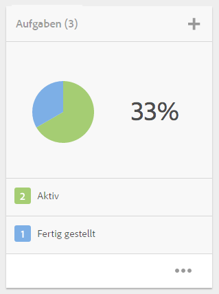
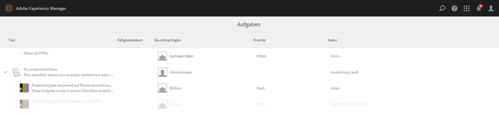
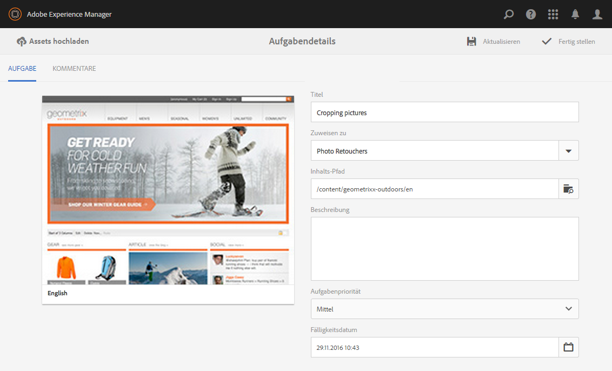
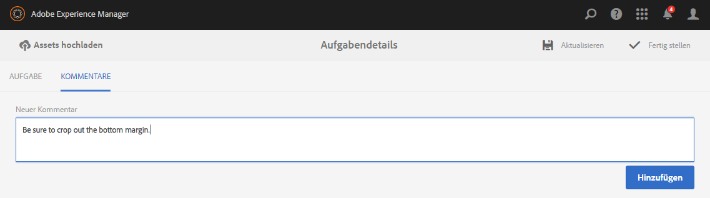
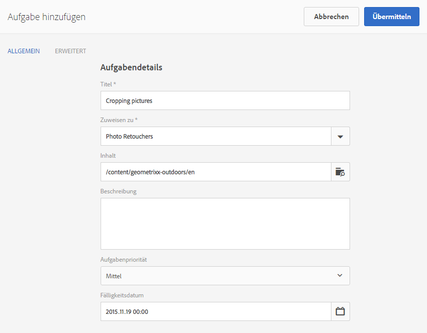
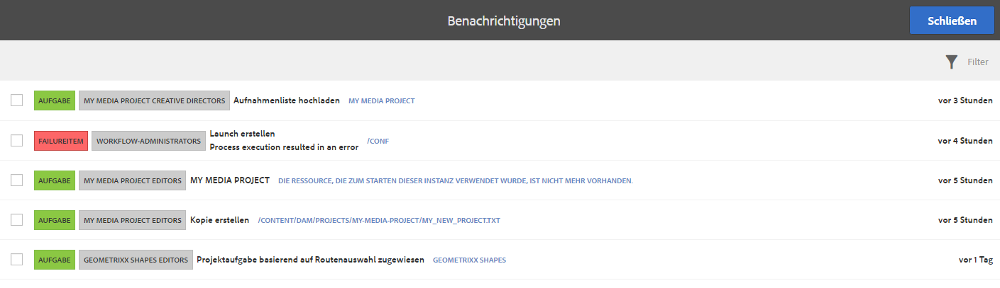
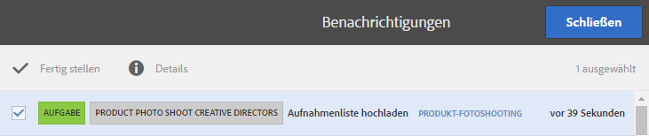

# Arbeiten mit Aufgaben{#working-with-tasks}

>[!CAUTION]
>
>AEM 6.4 hat das Ende der erweiterten Unterstützung erreicht und diese Dokumentation wird nicht mehr aktualisiert. Weitere Informationen finden Sie in unserer [technische Unterstützung](https://helpx.adobe.com/de/support/programs/eol-matrix.html). Unterstützte Versionen suchen [here](https://experienceleague.adobe.com/docs/?lang=de).

Bei Aufgaben handelt es sich um Arbeitsschritte, die auf Inhalt ausgeführt werden. Wenn Ihnen eine Aufgabe zugewiesen wird, wird diese in Ihrem Workflow-Posteingang angezeigt. Aufgabenelemente enthalten in der Spalte &quot;Typ&quot;den Wert &quot;task&quot;.

Aufgaben werden auch in Projekten verwendet, um den Grad der Vollständigkeit aktueller Aufgaben, einschließlich Workflow-Aufgaben, zu bestimmen.

## Verfolgen des Projektfortschritts {#tracking-project-progress}

Sie können den Projektfortschritt verfolgen, indem Sie sich die aktiven/abgeschlossenen Aufgaben in einem Projekt ansehen, das durch die **Aufgaben** Kachel. Der Projektfortschritt kann durch Folgendes bestimmt werden:

* **Aufgabenkachel:** Ein Gesamtfortschritt des Projekts wird in der Aufgabenkachel dargestellt, die auf der Seite „Projektdetails“ verfügbar ist.

* **Aufgabenliste:** Beim Klicken auf die Aufgabenkachel wird eine Liste von Aufgaben angezeigt. Diese Liste enthält detaillierte Informationen zu allen Aufgaben in Zusammenhang mit dem Projekt.

Beide listen Workflow-Aufgaben sowie Aufgaben auf, die Sie direkt in der **Aufgaben** Kachel.

### Aufgabenkachel {#task-tile}

Wenn ein Projekt verwandte Aufgaben hat, wird innerhalb des Projekts eine Aufgabenkachel angezeigt. Die Aufgabenkachel zeigt den aktuellen Status des Projekts an. Die Anzeige basiert auf den vorhandenen Aufgaben innerhalb des Workflows und beinhaltet keine Aufgaben, die in der Zukunft erzeugt werden, während der Workflow fortgesetzt wird. Die folgenden Informationen sind in der Aufgabenkachel sichtbar:

* Prozentsatz der abgeschlossenen Aufgaben
* Prozentsatz der aktiven Aufgaben
* Prozentsatz der überfälligen Aufgaben

### Anzeigen oder Ändern von Aufgaben in einem Projekt {#viewing-or-modifying-the-tasks-in-a-project}

Zusätzlich zur Verfolgung des Fortschritts möchten Sie vielleicht auch Informationen über das Projekt anzeigen oder es ändern.

#### Aufgabenliste {#task-list}

Klicken Sie auf das Auslassungszeichen (...) in der Aufgabenkachel, um die Liste der Aufgaben anzuzeigen, die mit dem Projekt verbunden sind. Die Aufgaben werden durch übergeordnete Workflows aufgeteilt. Die Aufgabendetails werden zusammen mit Metadaten wie Fälligkeitsdatum, Verantwortlicher, Priorität und Status angezeigt.

#### Aufgabendetails {#task-details}

Tippen/klicken Sie für weitere Informationen über eine bestimmte Aufgabe in der Aufgabenliste auf die Aufgabe und öffnen Sie „Aufgabendetails“.

### Anzeigen und Ändern von Aufgabenkommentaren {#viewing-and-modifying-task-comments}

In Aufgabendetails können Sie Kommentare bearbeiten oder hinzufügen. Darüber hinaus sind alle Kommentare in einem Projekt im Bereich Kommentare sichtbar.

### Hinzufügen von Aufgaben {#adding-tasks}

Sie können Projekten neue Aufgaben hinzufügen. Diese Aufgaben werden dann in der Kachel Aufgaben angezeigt und stehen im Benachrichtigungs-Posteingang zur Durchführung von Aktionen zur Verfügung.

So fügen Sie eine Aufgabe hinzu:

1. Tippen/Klicken Sie im Projekt in der Kachel **Aufgaben** auf das Plussymbol (+). Das Fenster **Aufgabe hinzufügen** wird geöffnet.
1. Geben Sie Informationen zur Aufgabe ein. Der Titel der Aufgabe und die Gruppe, der sie zugewiesen ist, sind obligatorisch. Zusätzliche Informationen wie der Inhaltspfad, die Beschreibung, die Aufgabenpriorität und das Fälligkeitsdatum sind optional. Darüber hinaus können Sie die **Erweitert** um den Namen der Aufgabe einzugeben, die zum Benennen der URL verwendet wird.

   

1. Tippen oder klicken Sie auf **Erstellen**.

## Arbeiten mit Aufgaben im Posteingang {#working-with-tasks-in-the-inbox}

Eine andere Möglichkeit, auf Aufgaben zuzugreifen, bietet der Posteingang. Sie können den Inhalt aus dem Posteingang öffnen, um die erforderlichen Änderungen vorzunehmen. Wenn Sie fertig sind, ändern Sie den Aufgabenstatus in „Fertig gestellt“. Aufgaben werden auch in Ihrem Posteingang angezeigt, wenn sie einer Benutzergruppe zugewiesen werden, der Sie angehören. In diesem Fall kann jedes Mitglied der Gruppe die Arbeit durchführen und die Aufgabe abschließen.

Um eine Aufgabe abzuschließen, wählen Sie die Aufgabe aus und klicken Sie auf **Fertig**. Fügen Sie Informationen zur Aufgabe hinzu und klicken Sie auf **Fertig**. Siehe [Ihr Posteingang](/help/sites-authoring/inbox.md) für weitere Informationen.

