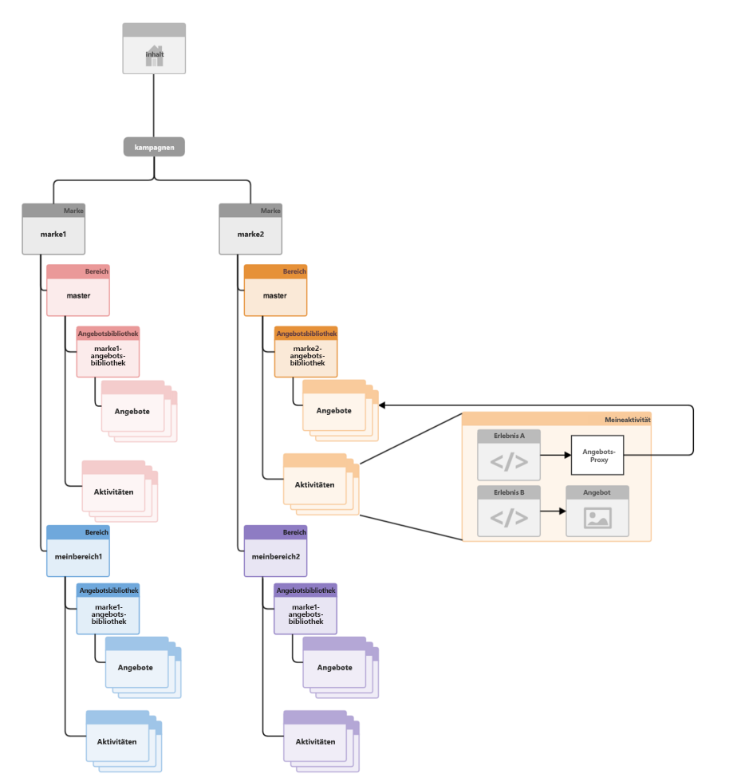
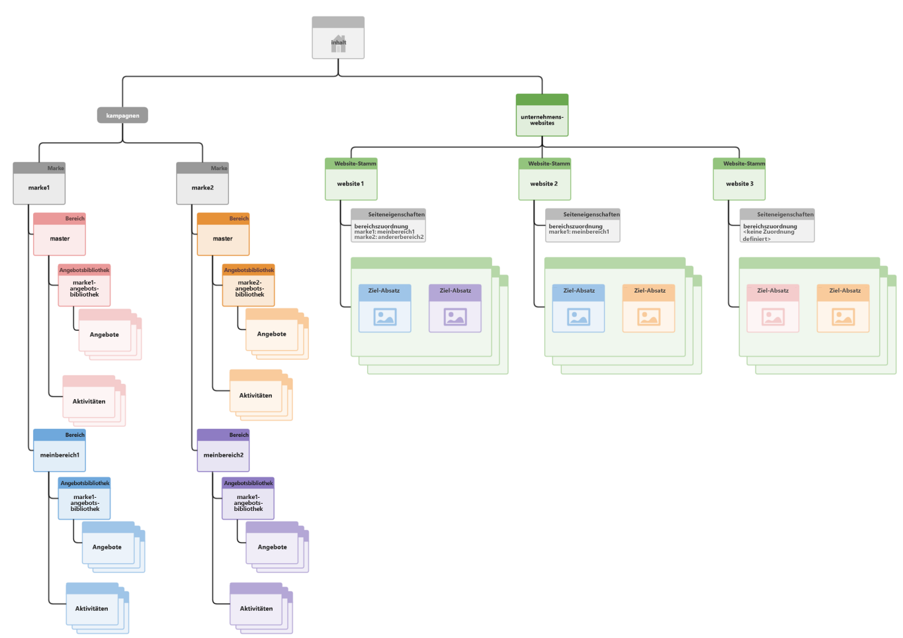

# Strukturierung von Multisite-Management für zielgerichtete Inhalte{#how-multisite-management-for-targeted-content-is-structured}

>[!CAUTION]
>
>AEM 6.4 hat das Ende der erweiterten Unterstützung erreicht und diese Dokumentation wird nicht mehr aktualisiert. Weitere Informationen finden Sie in unserer [technische Unterstützung](https://helpx.adobe.com/de/support/programs/eol-matrix.html). Unterstützte Versionen suchen [here](https://experienceleague.adobe.com/docs/?lang=de).

Im folgenden Diagramm ist der Aufbau der Multisite-Unterstützung für Targeting-Inhalte dargestellt.

Gebiete werden unter **/content/campaigns/&lt;Marke>** eingeordnet und jede Marke verfügt standardmäßig über ein automatisch erstelltes Hauptgebiet. In jedem Gebiet ist ein eigener Satz Aktivitäten, Erlebnisse und Angebote enthalten.

Zum Nachschlagen zielgerichteter Inhalte können die Seiten oder Sites einem Gebiet zugeordnet werden. Sollte kein Gebiet konfiguriert sein, bezieht sich AEM für diese Marke auf das primäre Gebiet.

Im folgenden Diagramm finden Sie ein Beispiel dafür, wie die Logik im Falle der drei Sites Site1, Site2 und Site3 funktioniert.

* site1 sucht basierend auf der Bereichszuordnung nach myarea1 für brand1 und other area2 für brand2.
* Site2 bezieht sich für Marke1 auf MeinGebiet1 und für Marke2 auf das primäre Gebiet, da nur für Marke1 Gebiete zugewiesen wurden.
* Site3 bezieht sich für Marke1 und für Marke2 auf das primäre Gebiet, weil für diese Site keine Gebietszuordnung vorgenommen wurde.
