# Verwalten von Projekten{#managing-projects}

>[!CAUTION]
>
>AEM 6.4 hat das Ende der erweiterten Unterstützung erreicht und diese Dokumentation wird nicht mehr aktualisiert. Weitere Informationen finden Sie in unserer [technische Unterstützung](https://helpx.adobe.com/de/support/programs/eol-matrix.html). Unterstützte Versionen suchen [here](https://experienceleague.adobe.com/docs/?lang=de).

Mithilfe von Projekten können Sie Ressourcen zu einer Einheit gruppieren.

In der **Projektekonsole** können Sie Ihre Projekte aufrufen und bearbeiten:

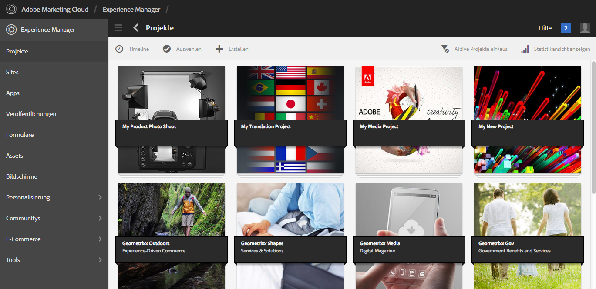

In „Projekte“ können Sie ein Projekt erstellen, Ressourcen mit Ihrem Projekt verknüpfen sowie Projekte oder Ressourcenlinks löschen. Sie können eine Kachel öffnen, um den Projektinhalt anzuzeigen oder Elemente hinzuzufügen. In diesem Thema werden diese Vorgehensweisen beschrieben.

>[!NOTE]
>
>In 6.2 wurde die Möglichkeit eingeführt, Projekte in Ordnern zu organisieren. Auf der Seite &quot;Projekte&quot;können Sie ein Projekt oder einen Ordner erstellen.
>
>Wenn ein Ordner erstellt wird, wird der Benutzer in diesen Ordner geleitet, in dem er einen anderen Ordner oder ein Projekt erstellen kann. Sie können Projekte anhand von Kategorien wie Produktkampagnen, Standort, Übersetzungssprachen usw. in Ordnern organisieren.
>
>Die Projekte und Ordner können in einer Listenansicht angezeigt und durchsucht werden.

>[!CAUTION]
>
>Damit Benutzer in Projekten andere Benutzer/Gruppen sehen können, während sie Projektfunktionen wie das Erstellen von Projekten, das Erstellen von Aufgaben/Workflows, das Anzeigen und Verwalten des Teams verwenden, müssen diese Benutzer Lesezugriff auf **/home/users** und **/home/groups**. Die einfachste Möglichkeit, dies zu implementieren, besteht darin, die **projects-users** GruppenLesezugriff auf **/home/users** und **/home/groups**.

## Erstellen eines Projekts {#creating-a-project}

Standardmäßig enthält AEM folgende Vorlagen für die Projekterstellung:

* Einfaches Projekt
* Medienprojekt
* Projekt für Produkt-Fotoshooting
* Übersetzungsprojekt

Die Vorgehensweise beim Erstellen eines Projekts ist für jedes Projekt identisch. Unterschiede zwischen den Projekttypen gibt es in Bezug auf verfügbare [Benutzerrollen](/help/sites-authoring/projects.md) und [Workflows](/help/sites-authoring/projects-with-workflows.md).  So erstellen Sie ein neues Projekt:

1. Tippen Sie in **Projekte** auf **Erstellen**, um den Assistenten zur **Projekterstellung** zu öffnen:
1. Auswählen einer Vorlage. Standardmäßig, Einfaches Projekt, Medienprojekt, [Übersetzungsprojekt](/help/sites-administering/tc-manage.md)und [Produkt-Fotoshooting](/help/sites-authoring/managing-product-information.md) sind verfügbar und klicken Sie auf **Nächste**.

   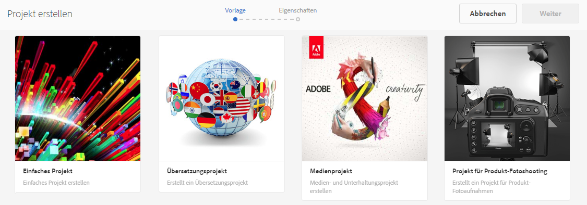

1. Definieren Sie den **Titel** und die **Beschreibung** und fügen Sie eine **Miniatur** hinzu, falls erforderlich. Hier können Sie auch Benutzer und deren Gruppenzugehörigkeit hinzufügen oder löschen. Sie können darüber hinaus auf **Erweitert** klicken, um einen Namen anzugeben, der in der URL verwendet werden soll.

   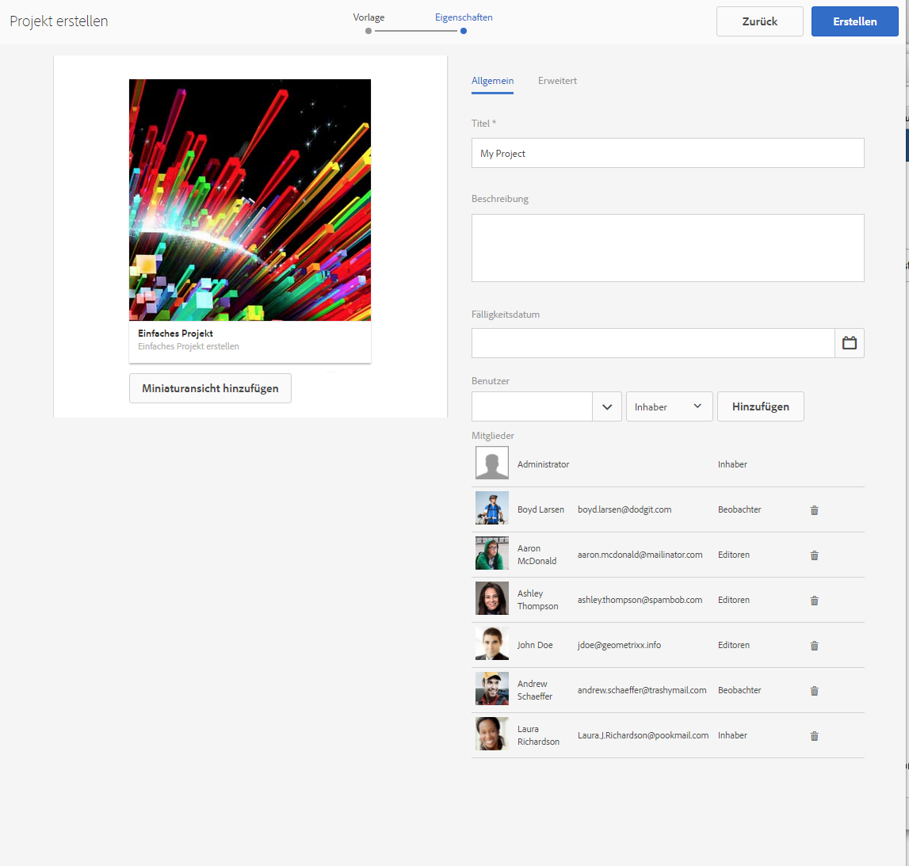

1. Tippen oder klicken Sie auf **Erstellen**. Daraufhin werden Sie gefragt, ob Sie ein neues Projekt öffnen oder zur Konsole zurückkehren möchten.

### Zuordnen von Ressourcen zum Projekt {#associating-resources-with-your-project}

Da Projekte es Ihnen ermöglichen, Ressourcen zu einer Einheit zu gruppieren, können Sie diese Ressourcen nun Ihrem Projekt hinzufügen. Die Ressourcen werden als **Kacheln** bezeichnet. Die Ressourcentypen, die Sie mit einem Projekt verknüpfen können, werden unter [Projektkacheln](/help/sites-authoring/projects.md#project-tiles) beschrieben.

So ordnen Sie Ihrem Projekt Ressourcen zu:

1. Öffnen Sie das Projekt in der **Projektekonsole**.
1. Tippen/klicken Sie auf **Bereich hinzufügen** und wählen Sie die gewünschte Kachel aus. Sie können mehrere Arten von Kacheln auswählen.

   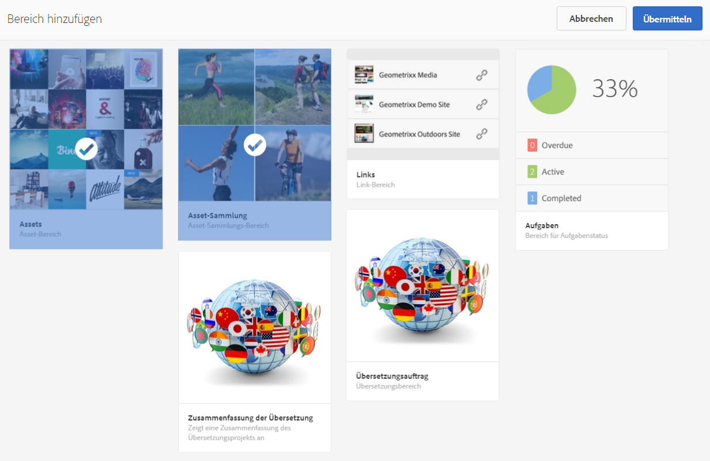

   >[!NOTE]
   >
   >Die Projektkacheln, die mit einem Projekt verknüpft werden können, werden ausführlich unter [Projektkacheln](/help/sites-authoring/projects.md#project-tiles) beschrieben.

1. Tippen oder klicken Sie auf **Erstellen**. Die Ressource wird mit Ihrem Projekt verknüpft und danach können Sie über Ihr Projekt auf sie zugreifen.

### Löschen eines Projekts oder Ressourcen-Links {#deleting-a-project-or-resource-link}

Dieselbe Methode wird zum Löschen eines Projekts aus der Konsole oder einer verknüpften Ressource aus Ihrem Projekt angewendet:

1. Navigieren Sie zum entsprechenden Ort:

   * Um ein Projekt zu löschen, gehen Sie zur obersten Ebene der **Projektekonsole**.
   * Um einen Ressourcen-Link innerhalb eines Projekts zu löschen, öffnen Sie das Projekt in der **Projektekonsole**.

1. Aktivieren Sie den Auswahlmodus, indem Sie auf **Auswahl** klicken und Ihr Projekt oder Ihren Ressourcen-Link auswählen.
1. Tippen/klicken Sie auf **Löschen**.

1. Sie müssen den Löschvorgang in einem Dialogfeld bestätigen. Nach der Bestätigung wird das Projekt oder der Ressourcenlink gelöscht. Tippen/klicken Sie auf **Auswahl aufheben**, um den Auswahlmodus zu verlassen.

>[!NOTE]
>
>Wenn Sie das Projekt erstellen und den verschiedenen Rollen Benutzer hinzufügen, werden mit dem Projekt verknüpfte Gruppen automatisch erstellt, um die zugehörigen Berechtigungen zu verwalten. Ein Projekt mit dem Namen Myproject könnte z. B. drei Gruppen **Myproject-Eigentümer**, **MyProject-Editor**, **MyProject-Beobachter** haben. Wird das Projekt jedoch gelöscht, werden diese Gruppen nicht automatisch gelöscht. Ein Administrator muss die Gruppen unter **Werkzeuge** > **Sicherheit** > **Gruppen** manuell löschen.

### Hinzufügen von Elementen zu einer Kachel {#adding-items-to-a-tile}

In einigen Kacheln benötigen Sie möglicherweise mehr als ein Element. Dies ist zum Beispiel der Fall, wenn Sie mehr als einen gleichzeitig ausgeführten Workflow oder mehr als ein Erlebnis haben.

So fügen Sie einer Kachel Elemente hinzu:

1. Navigieren Sie in **Projekte** zum Projekt und klicken Sie in der Kachel, der Sie ein Element hinzufügen möchten, auf das Plussymbol.

   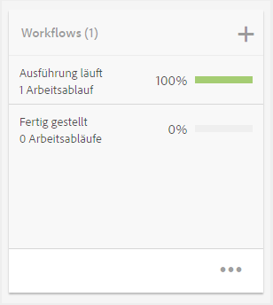

1. Fügen Sie der Kachel auf dieselbe Weise ein Element hinzu wie bei der Erstellung einer neuen Kachel. Projektkacheln werden [hier](/help/sites-authoring/projects.md#project-tiles) beschrieben. In diesem Beispiel wurde ein Workflow hinzugefügt.

   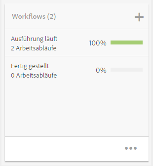

### Öffnen einer Kachel {#opening-a-tile}

Manchmal kann es nötig sein zu wissen, welche Elemente in einer aktuellen Kachel enthalten sind, oder die Elemente in einer Kachel zu ändern oder zu löschen.

Dazu öffnen Sie die Kachel, sodass Sie ihre Elemente anzeigen und ändern können:

1. Tippen/klicken Sie in der Projektekonsole auf die Auslassungszeichen (...).

   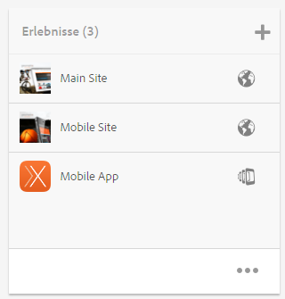

1. In AEM wird eine Liste mit den Elementen in der Kachel angezeigt. Sie können den Auswahlmodus aktivieren, um die Elemente zu ändern oder zu löschen.

   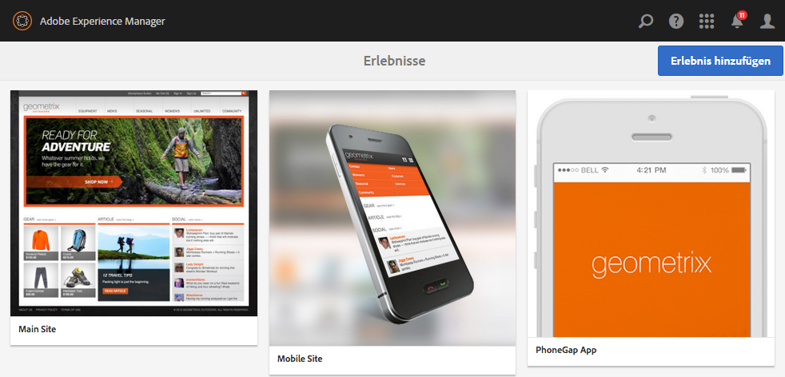

## Anzeigen von Projektstatistiken {#viewing-project-statistics}

So zeigen Sie Projektstatistiken in der **Projekte** Console, klicken Sie auf **Statistikansicht anzeigen**. Die Fertigstellungsstufe für jedes Projekt wird angezeigt. Klicken Sie erneut auf **Statistikansicht anzeigen**, um zur **Projektekonsole** zurückzukehren.

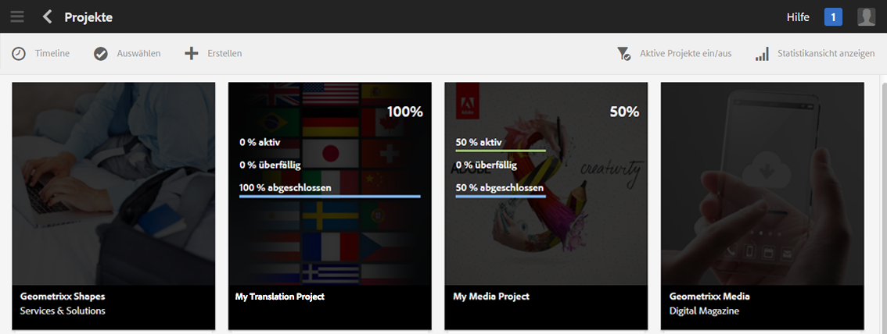

### Anzeigen einer Projekt-Zeitleiste {#viewing-a-project-timeline}

Die Projekt-Zeitleiste enthält Informationen dazu, wann Assets des Projekts zuletzt verwendet wurden. Klicken/tippen Sie zum Anzeigen der Projekt-Zeitleiste auf **Zeitleiste**, aktivieren Sie dann den Auswahlmodus und wählen Sie das Projekt aus. Die Assets werden im linken Bereich angezeigt. Klicken/tippen Sie auf **Zeitleiste**, um zur **Projektekonsole** zurückzukehren.

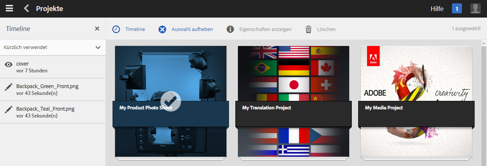

### Anzeigen aktiver/inaktiver Projekte {#viewing-active-inactive-projects}

Um zwischen aktiven und inaktiven Projekten zu wechseln, klicken Sie in der **Projektekonsole** auf **Aktive Projekte ein/aus**. Wenn neben dem Symbol ein Häkchen angezeigt wird, werden die aktiven Projekte angezeigt.

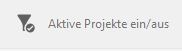

Wenn neben dem Symbol ein x zu sehen ist, werden die inaktiven Projekte angezeigt.

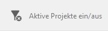

## Festlegen von Projekten als inaktiv oder aktiv {#making-projects-inactive-or-active}

Sie können ein Projekt als inaktiv festlegen, wenn Sie es abgeschlossen haben, aber die Informationen beibehalten möchten.

So legen Sie ein Projekt als inaktiv (oder aktiv) fest:

1. Öffnen Sie das Projekt in der **Projektekonsole** und suchen Sie die Kachel **Projektinformationen**.

   >[!NOTE]
   Möglicherweise müssen Sie diese Kachel erst noch einfügen, wenn sie nicht bereits in Ihrem Projekt enthalten ist. Weitere Informationen finden Sie unter [Hinzufügen von Kacheln](#adding-items-to-a-tile).

1. Tippen/klicken Sie auf **Bearbeiten**.
1. Ändern Sie die Auswahl von **Aktiv** in **Inaktiv** (oder umgekehrt).

   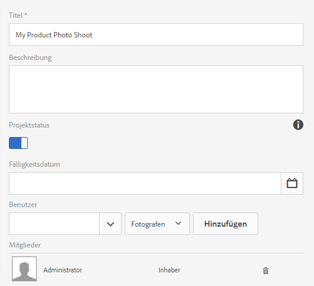

1. Tippen/klicken Sie auf **Fertig**, um Ihre Änderungen zu speichern.
