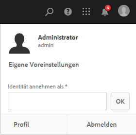
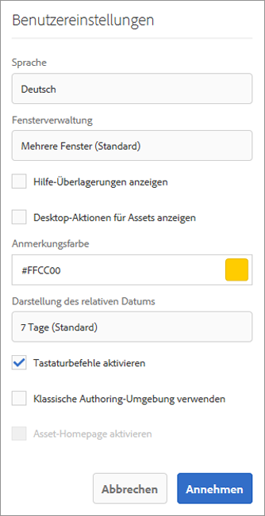

# Konfigurieren der Kontoumgebung{#configuring-your-account-environment}

AEM bietet Ihnen die Möglichkeit, Ihr Konto und bestimmte Aspekte der Autorenumgebung zu konfigurieren.

Mit der Option [Benutzer](/help/sites-authoring/user-properties.md#user-settings) im [Header](/help/sites-authoring/basic-handling.md#the-header) und dem zugehörigen Dialogfeld [Meine Voreinstellungen](#my-preferences) können Sie Ihre Benutzeroptionen ändern.

## Benutzereinstellungen {#user-settings}

Im Dialogfeld **Benutzereinstellungen** haben Sie Zugriff auf folgende Optionen:

* Identität annehmen als

   * Mit der Funktion [Stellvertretend agieren](/help/sites-administering/security.md#impersonating-another-user) kann ein Benutzer im Namen eines anderen Benutzers arbeiten.

* Profil

   * Über das Profil kann bequem über einen Link auf [Benutzereinstellungen](/help/sites-administering/security.md) zugegriffen werden.

* [Benutzereinstellungen](/help/sites-authoring/user-properties.md#my-preferences)

   * Hier können verschiedene auf den jeweiligen Benutzer zugeschnittene Einstellungen festgelegt werden.

## Benutzereinstellungen{#my-preferences}

Auf das Dialogfeld **Benutzereinstellungen** kann über die Option [Benutzer](/help/sites-authoring/user-properties.md#user-settings) in der Kopfzeile zugegriffen werden.

Jeder Benutzer kann bestimmte Eigenschaften für sich selbst festlegen.

* **Sprache**

   Hiermit wird die Sprache definiert, in der die Benutzeroberfläche der Autorenumgebung angezeigt werden soll. Wählen Sie die gewünschte Sprache aus der Liste der verfügbaren Sprachen aus.

   Diese Konfiguration wird ebenfalls für die klassische Benutzeroberfläche verwendet.

* **Fensterverwaltung**

   Hiermit wird das Verhalten oder das Öffnen von Fenstern definiert. Wählen Sie eine der folgenden beiden Optionen aus:

   * **Mehrere Fenster** (Standard)

      * Seiten werden in einem neuen Fenster geöffnet.
   * **Einfaches Fenster**

      * Seiten werden im aktuellen Fenster geöffnet.

* **Desktop-Aktionen für Assets anzeigen**

   Für diese Option ist das AEM-Desktop-Programm erforderlich.

* **Anmerkungsfarbe**

   Hiermit wird die Standardfarbe für Anmerkungen definiert.

   * Klicken Sie auf den Farbblock, um die Musterauswahl zur Festlegung einer Farbe zu öffnen.
   * Alternativ dazu können Sie in das Feld den Hexcode für die gewünschte Farbe eingeben.

* **Darstellung des relativen Datums**

   Zur besseren Lesbarkeit rendert AEM Daten der letzten sieben Tage als relative Daten (z. B. „vor drei Tagen“) und ältere Daten als genaue Datumsangaben (z. B. 20. März 2017).

   Diese Option definiert, wie Daten im System angezeigt werden. Die folgenden Optionen sind verfügbar:

   * **Immer exaktes Datum anzeigen**: Es wird immer das genaue Datum angezeigt (niemals ein relatives Datum).
   * **1 Tag**: Das relative Datum wird für Datumsangaben innerhalb eines Tages angezeigt; ansonsten wird das genaue Datum angegeben.
   * **7 Tage (Standard)**: Das relative Datum wird für Datumsangaben innerhalb eines Zeitraums von sieben Tages angezeigt; ansonsten wird das genaue Datum angegeben.
   * **1 Monat**: Das relative Datum wird für Datumsangaben innerhalb eines Monats angezeigt; ansonsten wird das genaue Datum angegeben.
   * **1 Jahr**: Das relative Datum wird für Datumsangaben innerhalb eines Jahres angezeigt; ansonsten wird das genaue Datum angegeben.
   * **Immer relatives Datum anzeigen**: Es werden niemals genaue Datumsangaben, sondern nur relative Daten angezeigt.

* **Tastaturbefehle aktivieren**

   AEM unterstützt verschiedene Tastaturbefehle, die eine effizientere Bearbeitung ermöglichen.

   * [Tastaturbefehle für die Seitenbearbeitung](/help/sites-authoring/page-authoring-keyboard-shortcuts.md)
   * [Tastaturbefehle für Konsolen](/help/sites-authoring/keyboard-shortcuts.md)

   Diese Option aktiviert Tastaturbefehle. Diese sind zwar standardmäßig aktiviert, können aber deaktiviert werden, etwa wenn für einen Benutzer bestimmte Anforderungen in Bezug auf die Barrierefreiheit bestehen.

* **Klassisches Authoring-Erlebnis verwenden**

   Diese Option ermöglicht eine auf der [klassischen Benutzeroberfläche](/help/sites-classic-ui-authoring/home.md) basierende Seitenbearbeitung. Im Normalfall wird die Standard-Benutzeroberfläche verwendet.

* **Asset-Homepage aktivieren**

   Diese Option ist nur verfügbar, wenn der Systemadministrator die Asset-Homepage-Nutzung für das gesamte Unternehmen aktiviert hat.
