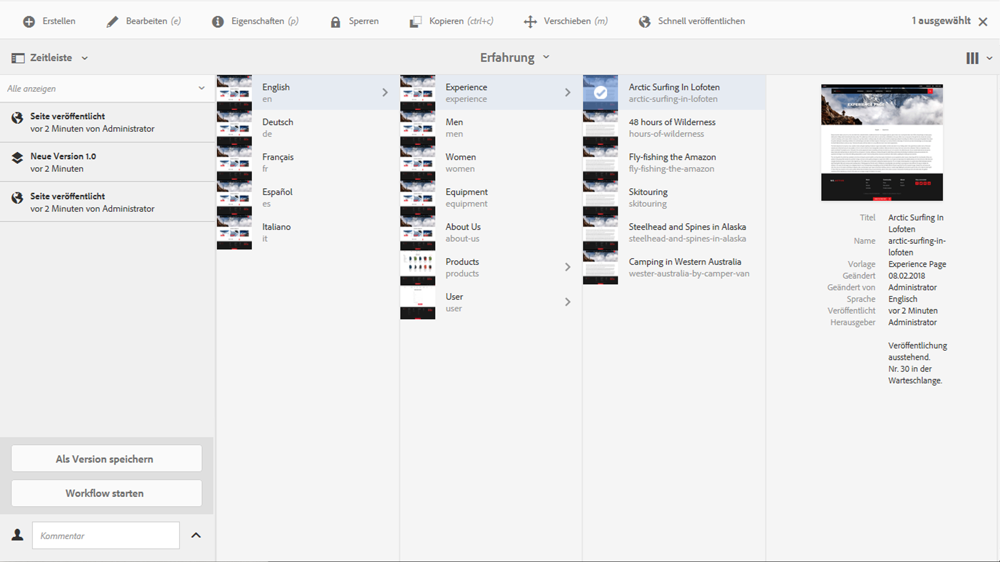

# Anwenden von Workflows auf Seiten{#applying-workflows-to-pages}

Beim Authoring können Sie Workflows aufrufen, um auf Ihren Seiten Maßnahmen zu ergreifen. Es ist auch möglich, mehrere Workflows anzuwenden.

Wenn Sie den Workflow anwenden, geben Sie die folgenden Informationen an:

* Der anzuwendende Workflow.

   Sie können jeden beliebigen Workflow anwenden (auf den Sie Zugriff haben, wie von Ihrem AEM-Administrator zugewiesen).

* Optional: Ein Titel, der dabei hilft, die Workflow-Instanz im Posteingang eines Benutzers zu erkennen.
* Die Workflow-Payload. Hierbei kann es sich um eine oder mehrere Seiten handeln.

Workflows können wie folgt gestartet werden:

* die Konsole **[Sites.](#starting-a-workflow-from-the-sites-console)**
* beim Bearbeiten einer Seite von den **[Seiteninformationen](#starting-a-workflow-from-the-page-editor)** aus.

>[!NOTE]
>
>Siehe auch:
>
>* [Anwenden von Workflows auf DAM-Assets](/help/assets/assets-workflow.md).
>* [Arbeiten mit Projekt-Workflows](/help/sites-authoring/projects-with-workflows.md).
>

>[!NOTE]
>
>AEM-Administratoren können [Workflows mithilfe mehrerer anderer Methoden starten](/help/sites-administering/workflows-starting.md).

## Starten eines Workflows von der Sites-Konsole aus {#starting-a-workflow-from-the-sites-console}

Sie können einen Workflow wie folgt starten:

* die Option **[Erstellen](#starting-a-workflow-from-the-sites-toolbar)** der Sites-Symbolleiste.
*  die **[Timeline](#starting-a-workflow-from-the-timeline)**-Leiste der Sites-Konsole.

In beiden Fällen ist Folgendes zu tun:

* [Geben Sie die Workflow-Details im Workflow-Erstellungs-Assistenten an](#specifying-workflow-details-in-the-create-workflow-wizard).

### Starten eines Workflows von der Sites-Symbolleiste aus {#starting-a-workflow-from-the-sites-toolbar}

Sie können einen Workflow von der Symbolleiste der **Sites**-Konsole aus starten:

1. Gehen Sie zur gewünschten Seite und wählen Sie sie aus.

1. Von der Option **Erstellen** in der Symbolleiste aus können Sie jetzt **Workflow** auswählen.

   

1. Der Assistent **Workflow erstellen** hilft Ihnen, [die Workflow-Details anzugeben](#specifying-workflow-details-in-the-create-workflow-wizard).

### Starten eines Workflows aus der Zeitleiste {#starting-a-workflow-from-the-timeline}

Aus der **Zeitleiste** können Sie einen Workflow starten, der auf Ihre ausgewählte Ressource angewendet werden soll.

1. [Wählen Sie die Ressource aus](/help/sites-authoring/basic-handling.md#viewing-and-selecting-resources) und öffnen Sie die [Zeitleiste](/help/sites-authoring/basic-handling.md#timeline) (oder öffnen Sie die Zeitleiste und wählen Sie dann die Ressource aus).
1. Der Pfeil neben dem Kommentarfeld kann verwendet werden, um **Workflow starten** anzuzeigen:

   

1. Der Assistent **Workflow erstellen** hilft Ihnen, [die Workflow-Details anzugeben](#specifying-workflow-details-in-the-create-workflow-wizard).

### Angeben von Workflow-Details im Assistenten „Workflow erstellen“ {#specifying-workflow-details-in-the-create-workflow-wizard}

Der Assistent **Workflow erstellen** hilft Ihnen, den Workflow auszuwählen und die erforderlichen Details anzugeben.

Öffnen Sie den Assistenten **Workflow erstellen** über

* die Option **[Erstellen](#starting-a-workflow-from-the-sites-toolbar)** der Sites-Symbolleiste.
*  die **[Timeline](#starting-a-workflow-from-the-timeline)**-Leiste der Sites-Konsole.

Anschließend können Sie Details angeben:

1. Unter **Eigenschaften** werden die grundlegenden Optionen des Workflows definiert:

   * **Workflow-Modell**
   * **Workflow-Titel**

      * Sie können einen Titel für diese Instanz angeben, damit Sie sie zu einem späteren Zeitpunkt identifizieren können.

   Abhängig vom Workflow-Modell stehen die folgenden Optionen zur Verfügung. Diese erlauben, das als Payload erstellte Paket zu behalten, nachdem der Workflow beendet ist.

   * **Workflow-Paket behalten**
   * **Paketname**

      * Sie können einen Titel für das Paket festlegen, um die Identifizierung erleichtern.
   >[!NOTE]
   >
   >Die Option **Workflow-Paket behalten** ist verfügbar, wenn der Workflow für Unterstützung für mehrere [Ressourcen konfiguriert](/help/sites-developing/workflows-models.md#configuring-a-workflow-for-multi-resource-support) wurde und mehrere Ressourcen ausgewählt wurden.

   Wenn Sie fertig sind, klicken Sie auf **Weiter**, um fortzufahren.

   

1. Im Schritt **Umfang** können Sie Folgendes auswählen:

   * **Inhalt hinzufügen**, um den [Pfad-Browser](/help/sites-authoring/author-environment-tools.md#path-browser) zu öffnen und zusätzliche Ressourcen auszuwählen; im Browser klicken/tippen Sie auf **Auswählen**, um den Inhalt zur Workflow-Instanz hinzuzufügen.
   * Eine vorhandene Ressource, um weitere Aktionen zu sehen:

      * **Untergeordnete Elemente einbeziehen**, um anzugeben, dass untergeordnete Elemente der betreffenden Ressource im Workflow enthalten sind.

         Ein Dialogfeld wird geöffnet, in dem Sie die Auswahl verfeinern können:

         * Nur unmittelbar untergeordnete Elemente einbeziehen.
         * Nur geänderte Seiten einbeziehen.
         * Nur bereits veröffentlichte Seiten einbeziehen.

         Alle angegebenen untergeordneten Elemente werden der Liste der Ressourcen hinzugefügt, auf die der Workflow angewendet wird.

      * **Auswahl entfernen**, um die betreffende Ressource aus dem Workflow zu entfernen.

   

   >[!NOTE]
   >
   >Wenn Sie zusätzliche Ressourcen hinzufügen, können Sie **Zurück** verwenden, um die Einstellung für **Workflow-Paket behalten** im Schritt **Eigenschaften** anzupassen.

1. Verwenden Sie **Erstellen**, um den Assistenten zu schließen und die Workflow-Instanz zu erstellen. In der Sites-Konsole wird eine Benachrichtigung angezeigt.

## Starten eines Workflows aus dem Seiten-Editor {#starting-a-workflow-from-the-page-editor}

Wenn Sie eine Seite bearbeiten, können Sie die **Seiteninformationen** von der Symbolleiste aus aufrufen. Das Dropdown-Menü enthält die Option **Im Workflow starten**. Ein Dialogfeld wird geöffnet, in dem Sie den gewünschten Workflow ggf. zusammen mit einem Titel angeben können:

