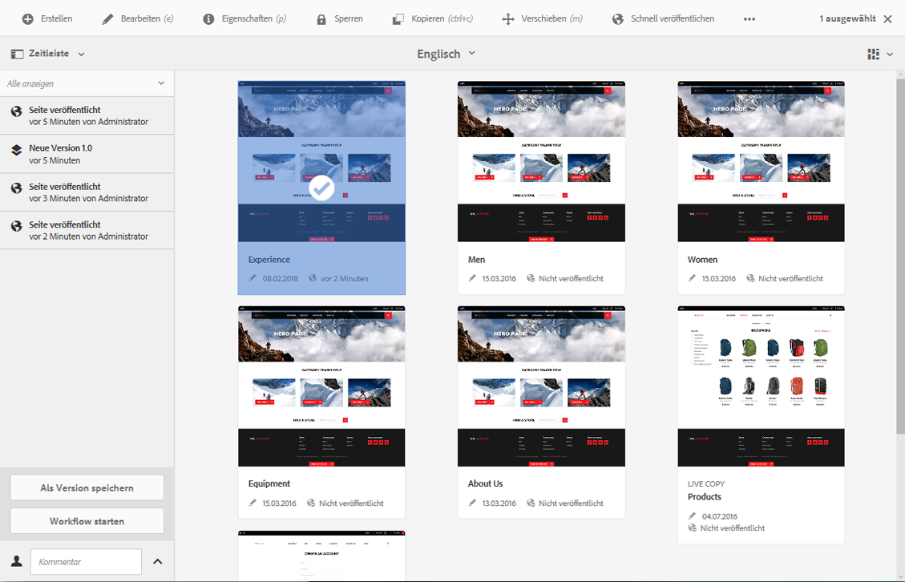
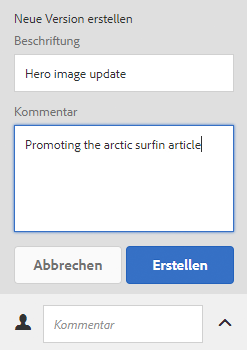
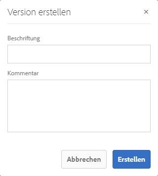
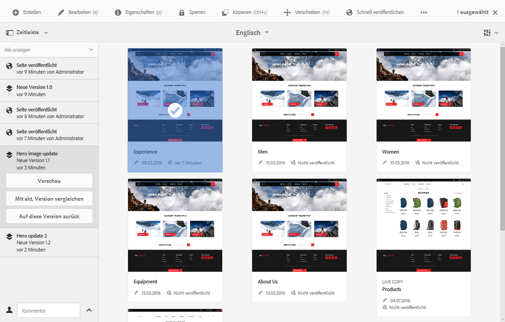
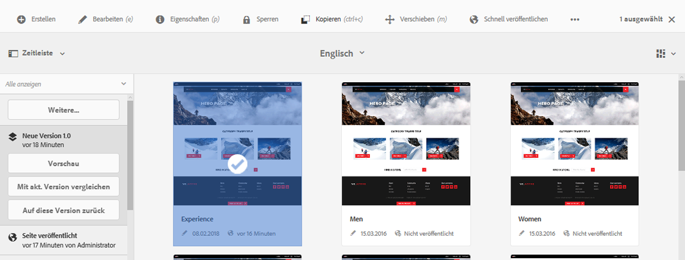
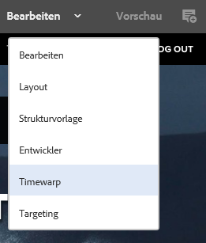
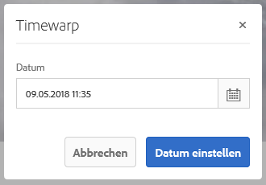

# Arbeiten mit Seitenversionen{#working-with-page-versions}

Durch die Versionierung wird die „Momentaufnahme“ einer Seite zu einem bestimmten Zeitpunkt festgehalten. Bei der Versionierung sind die folgenden Aktionen verfügbar:

* Erstellen einer Version einer Seite
* Wiederherstellen einer früheren Seitenversion, um z. B. eine Änderung rückgängig zu machen
* Vergleichen der aktuellen Version einer Seite mit einer früheren Version, wobei die Unterschiede in Text und Bildern hervorgehoben sind

## Erstellen einer neuen Version   {#creating-a-new-version}

Sie können eine Version Ihrer Ressource folgendermaßen erstellen:

* über die [Zeitleiste](#creating-a-new-version-timeline)
* mithilfe der Option [Erstellen](#creating-a-new-version-create-with-a-selected-resource) (wenn eine Ressource ausgewählt ist)

### Erstellen einer neuen Version – Zeitleiste {#creating-a-new-version-timeline}

1. Navigieren Sie zu der Seite, für die Sie eine Version erstellen möchten.
1. Wählen Sie die Seite im [Auswahlmodus](/help/sites-authoring/basic-handling.md#viewing-and-selecting-resources).
1. Öffnen Sie die Spalte **Zeitleiste**.
1. Klicken/tippen Sie auf den Pfeil neben dem Kommentarfeld, um die Optionen anzuzeigen:

   

1. Wählen Sie **Als Version speichern**.
1. Geben Sie eine **Beschriftung** an und ggf. einen **Kommentar** ein.

   

1. Bestätigen Sie die neue Version, indem Sie auf **Erstellen** klicken.

   Die Informationen in der Zeitleiste werden entsprechend der neuen Version aktualisiert.

### Erstellen einer neuen Version – Erstellen mit einer ausgewählten Ressource {#creating-a-new-version-create-with-a-selected-resource}

1. Navigieren Sie zu der Seite, für die Sie eine Version erstellen möchten.
1. Wählen Sie die Seite im [Auswahlmodus](/help/sites-authoring/basic-handling.md#viewing-and-selecting-resources).
1. Wählen Sie in der Symbolleiste die Option **Erstellen**.
1. Das Dialogfeld wird geöffnet. Sie können eine **Beschriftung** angeben und ggf. einen **Kommentar** eingeben:

   

1. Bestätigen Sie die neue Version, indem Sie auf **Erstellen** klicken.

   Die Informationen in der Zeitleiste werden entsprechend der neuen Version aktualisiert.

## Wiederherstellen einer früheren Seitenversion {#reverting-to-a-page-version}

Nachdem eine Version erstellt wurde, können Sie diese Version bei Bedarf wiederherstellen.

>[!NOTE]
>
>Wenn eine Seite wiederhergestellt wird, gehört die erstellte Version zu einem neuen Zweig.
>
>Beispiel:
>
>* Erstellen Sie Versionen einer beliebigen Seite.
>* Die anfänglichen Etiketten und Versionsknotennamen lauten 1.0, 1.1, 1.2 usw.
>* Stellen Sie die erste Version wieder her, d. h. Version 1.0.
>* Erstellen Sie weitere neue Versionen.
>* Die erzeugten Beschriftungen und Knotennamen lauten jetzt 1.0.0, 1.0.1, 1.0.2 usw.
>

So stellen Sie eine frühere Version wieder her:

1. Navigieren Sie zu der Seite, für die Sie eine frühere Version wiederherstellen möchten.
1. Wählen Sie die Seite im [Auswahlmodus](/help/sites-authoring/basic-handling.md#viewing-and-selecting-resources).
1. Öffnen Sie die **Zeitleiste** und wählen Sie entweder **Alle anzeigen** oder **Versionen** aus. Die Seitenversionen für die ausgewählte Seite werden aufgelistet.
1. Wählen Sie die Version, die Sie wiederherstellen möchten. Die möglichen Optionen werden angezeigt:

   

1. Wählen Sie **Auf diese Version zurück**. Die ausgewählte Version wird wiederhergestellt und die Informationen in der Zeitleiste werden aktualisiert.

## Vorschau einer Version   {#previewing-a-version}

Sie können eine Vorschau einer bestimmten Version anzeigen:

1. Navigieren Sie zu der Seite, die Sie vergleichen möchten.
1. Wählen Sie die Seite im [Auswahlmodus](/help/sites-authoring/basic-handling.md#viewing-and-selecting-resources).
1. Öffnen Sie die **Zeitleiste** und wählen Sie entweder **Alle anzeigen** oder **Versionen** aus.
1. Die Seitenversionen werden aufgeführt. Wählen Sie die Version, deren Vorschau Sie anzeigen möchten:

   

1. Wählen Sie **Vorschau**. Die Seite wird auf einer neuen Registerkarte angezeigt.

   >[!CAUTION]
   >
   >Wenn eine Seite verschoben wurde, können Sie keine Vorschau von Versionen mehr anzeigen, die vor dem Verschieben erstellt wurden.
   >
   >Wenn Probleme bei der Vorschau auftreten, überprüfen Sie in der [Zeitleiste](/help/sites-authoring/basic-handling.md#timeline) der Seite, ob die Seite verschoben wurde.

## Vergleichen einer Version mit der aktuellen Seite {#comparing-a-version-with-current-page}

So vergleichen Sie eine frühere Version mit der aktuellen Seite:

1. Navigieren Sie zu der Seite, die Sie vergleichen möchten.
1. Wählen Sie die Seite im [Auswahlmodus](/help/sites-authoring/basic-handling.md#viewing-and-selecting-resources).
1. Öffnen Sie die **Zeitleiste** und wählen Sie entweder **Alle anzeigen** oder **Versionen** aus.
1. Die Seitenversionen werden aufgeführt. Wählen Sie die Version, die Sie vergleichen möchten:

   

1. Wählen Sie **Mit akt. Version vergleichen** aus. Die Seite [Differenz](/help/sites-authoring/page-diff.md) wird geöffnet. Sie enthält alle vorhandenen Unterschiede.

## Timewarp {#timewarp}

Timewarp ist eine Funktion, die den *Veröffentlichungsstatus* einer Seite zu einer bestimmten Zeit in der Vergangenheit simuliert.

Ziel ist es, Ihnen die Nachverfolgung der veröffentlichten Website zu einem bestimmten Zeitpunkt zu ermöglichen. Hierbei werden die Seitenversionen verwendet, um den Status der Veröffentlichungsumgebung zu ermitteln.

Gehen Sie hierfür wie folgt vor:

* Das System sucht die Seitenversion, die zum gewählten Zeitpunkt aktiv war.
* Dies bedeutet, dass die angezeigte Version *vor* dem in Timewarp ausgewählten Zeitpunkt erstellt/aktiviert wurde.
* Wenn Sie zu einer inzwischen gelöschten Seite navigieren, wird diese ebenfalls wiedergegeben, sofern die alten Versionen der Seite nach wie vor im Repository verfügbar sind.
* Wenn keine veröffentlichte Version gefunden wird, kehrt Timewarp zum aktuellen Status der Seite in der Autorenumgebung zurück (dadurch wird eine Fehler-/404-Seite vermieden, die dazu führen würde, dass Sie nicht weiter browsen können).

### Verwenden von Timewarp {#using-timewarp}

Timewarp ist ein [Modus](/help/sites-authoring/author-environment-tools.md#page-modes) des Seiteneditors. Um ihn zu starten, aktivieren Sie ihn einfach wie jeden anderen Modus.

1. Starten Sie den Editor für die Seite, auf der Timewarp ausgeführt werden soll, und wählen Sie in der Modusauswahl **Timewarp**.

   

1. Legen Sie im Dialogfeld ein Datum und eine Uhrzeit fest und tippen/klicken Sie auf **Datum einstellen**. Wenn Sie keine Zeit auswählen, wird die aktuelle Zeit standardmäßig eingestellt.

   

1. Die Seite wird entsprechend dem eingestellten Datum angezeigt. Der Timewarp-Modus ist durch die blaue Statusleiste am oberen Fensterrand gekennzeichnet. Verwenden Sie die Links in der Statusleiste, um ein neues Datum auszuwählen oder den Timewarp-Modus zu beenden.

   

### Timewarp-Beschränkungen

Timewarp versucht, eine Seite zu einem bestimmten Zeitpunkt zu reproduzieren. Aufgrund der Komplexität der kontinuierlichen Bearbeitung von Inhalten in AEM ist dies jedoch nicht immer möglich. Diese Einschränkungen sollten bei der Verwendung von Timewarp beachtet werden.

* **Timewarp funktioniert auf veröffentlichten Seiten**: Timewarp funktioniert nur dann vollständig, wenn Sie die Seite bereits veröffentlicht haben. Andernfalls zeigt Timewarp die aktuelle Seite in der Autorenumgebung.
* **Timewarp verwendet Seitenversionen**: Wenn Sie zu einer inzwischen aus dem Repository gelöschten Seite navigieren, wird diese ebenfalls korrekt wiedergegeben, sofern die alten Versionen der Seite nach wie vor im Repository verfügbar sind.
* **Entfernte Versionen wirken sich auf Timewarp**: Wenn Versionen aus dem Repository entfernt wurden, kann Timewarp die korrekte Ansicht nicht anzeigen.
* **Timewarp ist schreibgeschützt**: Sie können die alte Version der Seite nicht bearbeiten. Sie kann nur angezeigt werden. Wenn Sie die ältere Version wiederherstellen möchten, müssen Sie dies über Wiederherstellen manuell ausführen.
* **Timewarp basiert nur auf dem Seiteninhalt**: Die Ansicht unterscheidet sich von der ursprünglichen Ansicht, wenn Elemente (Code, CSS, Assets/Bilder usw.) für die Anzeige der Website geändert wurden, da diese Elemente nicht im Repository versioniert werden.

>[!CAUTION]
>
>Timewarp wurde als Tool entwickelt, das Autoren beim Verstehen und Erstellen ihres Inhalts unterstützen kann. Es ist nicht als Prüfprotokoll oder zu rechtlichen Zwecken gedacht.
