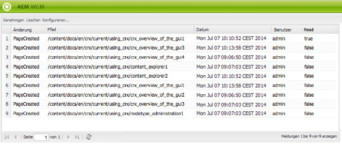
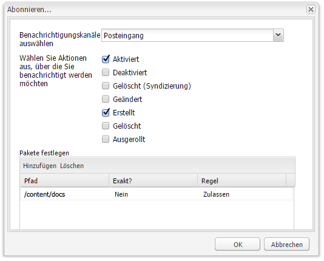

# Ihr Posteingang{#your-inbox}

Sie können Benachrichtigungen aus verschiedenen Bereichen von AEM erhalten, beispielsweise Benachrichtigungen zu Arbeitselementen oder Aufgaben bezüglich Aktionen, die Sie für Seiteninhalte durchführen müssen.

Diese Benachrichtigungen werden je nach Benachrichtigungstyp in zwei verschiedene Posteingänge zugestellt:

* Ein Posteingang, in dem die Benachrichtigungen empfangen werden, die Sie im Rahmen von Abonnements erhalten. Dieser wird im folgenden Abschnitt beschrieben.
* Ein spezieller Posteingang für Workflow-Elemente wird im Dokument [Teilnehmen an Workflows](/help/sites-classic-ui-authoring/classic-workflows-participating.md) beschrieben.

## Anzeigen von Benachrichtigungen {#viewing-your-notifications}

So zeigen Sie Ihre Benachrichtigungen an:

1. Öffnen Sie den Benachrichtigungs-Posteingang, indem Sie in der Konsole **Websites** auf die Benutzerschaltfläche oben rechts klicken und **Benachrichtigungs-Posteingang** wählen.

   

   >[!NOTE]
   >
   >Sie können auch direkt im Browser auf die Konsole zugreifen. Beispiel:
   >
   >` https://<host>:<port>/libs/wcm/core/content/inbox.html`

1. Ihre Benachrichtigungen werden angezeigt. Sie können die nötigen Aktionen durchführen:

   * [Abonnieren von Benachrichtigungen](#subscribing-to-notifications)
   * [Verarbeiten von Benachrichtigungen](#processing-your-notifications)

   

## Abonnieren von Benachrichtigungen {#subscribing-to-notifications}

So abonnieren Sie Benachrichtigungen:

1. Öffnen Sie den Benachrichtigungs-Posteingang, indem Sie in der Konsole **Websites** auf die Benutzerschaltfläche oben rechts klicken und **Benachrichtigungs-Posteingang** wählen.

   

   >[!NOTE]
   >
   >Sie können auch direkt im Browser auf die Konsole zugreifen. Beispiel:
   >
   >`https://<host>:<port>/libs/wcm/core/content/inbox.html`

1. Klicken Sie oben links auf **Konfigurieren...**, um das Konfigurationsdialogfeld zu öffnen.

   

1. Wählen Sie den Benachrichtigungskanal:

   * **Posteingang**: Die Benachrichtigungen werden in Ihrem AEM-Posteingang angezeigt.
   * **E-Mail**: Die Benachrichtigungen werden an die im Benutzerprofil angegebene E-Mail-Adresse gesendet.

   >[!NOTE]
   >
   >Einige Einstellungen müssen konfiguriert werden, damit die Benachrichtigung per E-Mail erfolgen kann. Außerdem können Sie die E-Mail-Vorlage anpassen oder eine E-Mail-Vorlage für eine neue Sprache hinzufügen. Informationen zum Konfigurieren von E-Mail-Benachrichtigungen in AEM finden Sie unter [Konfigurieren von E-Mail-Benachrichtigungen](/help/sites-administering/notification.md#configuringemailnotification).

1. Wählen Sie die Seitenaktionen, für die Sie eine Benachrichtigungen erhalten möchten:

   * Aktiviert: wenn eine Seite aktiviert wurde.
   * Deaktiviert: wenn eine Seite deaktiviert wurde.
   * Gelöscht (Syndizierung): wenn das Löschen einer Seite repliziert wurde.

      Wenn eine Seite gelöscht oder verschoben wurde, wird das Löschen automatisch repliziert, d. h. die Seite wurde sowohl in der Quellinstanz, in der die Löschaktion durchgeführt wurde, als auch in der von Replikationsagenten angegebenen Zielinstanz gelöscht.

   * Modifiziert: wenn eine Seite geändert wurde.
   * Erstellt: wenn eine Seite erstellt wurde.
   * Gelöscht: wenn eine Seite durch eine Seitenlöschaktion gelöscht wurde.
   * Ausgerollt: wenn eine Seite ausgerollt wurde.

1. Legen Sie die Pfade für die Seiten fest, über die Sie Benachrichtigungen erhalten möchten:

   * Klicken Sie auf **Hinzufügen**, um der Tabelle eine neue Zeile hinzuzufügen.
   * Klicken Sie auf die Tabellenzelle **Pfad**, und geben Sie den Pfad ein, z. B. `/content/docs`.
   * Um über alle Seiten in der Unter-Baumstruktur Benachrichtigungen zu erhalten, setzen Sie **Exakt?** auf **Nein**.

      Um über nur über die angegebene Seite Benachrichtigungen zu erhalten, setzen Sie **Exakt?** auf **Ja**.

   * Um die Regel zu aktivieren, setzen Sie **Regel** auf **Zulassen**. Ist dieser Wert auf **Ablehnen** gesetzt, wird die Regel deaktiviert, aber nicht entfernt, und kann zu einem späteren Zeitpunkt aktiviert werden.

   Um eine Definition zu entfernen, wählen Sie die Zeile aus, indem Sie auf eine Tabellenzelle klicken und auf **Löschen** klicken.

1. Klicken Sie auf **OK**, um die Konfiguration zu speichern.

## Verarbeiten von Benachrichtigungen {#processing-your-notifications}

Wenn Sie ausgewählt haben, dass Sie Benachrichtigungen in Ihrem AEM-Posteingang erhalten, werden die Benachrichtigungen an das Postfach versendet. Sie können [Ihre Benachrichtigungen anzeigen](#viewing-your-notifications) und anschließend die gewünschten Benachrichtigungen auswählen, um:

* sie durch Klicken auf **Genehmigen** zu genehmigen: Dann wird der Wert in der Spalte **Gelesen** auf **true** gesetzt.

* Löschen durch Klicken auf **Löschen**.

