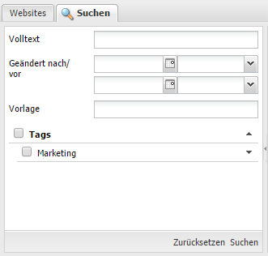
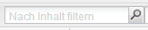
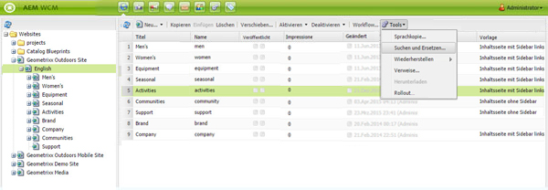
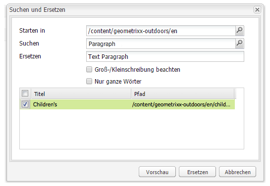

# Suche{#search-features}

Die Autorenumgebung von AEM bietet abhängig vom Ressourcentyp verschiedene Möglichkeiten zur Inhaltssuche.

>[!NOTE]
>
>Außerhalb der Autorenumgebung stehen auch andere Verfahren für die Suche zur Verfügung, wie der [Query Builder](/help/sites-developing/querybuilder-api.md) und [CRXDE Lite](/help/sites-developing/developing-with-crxde-lite.md).

## Grundlagen zur Suche {#search-basics}

Um den Suchbereich aufzurufen, klicken Sie in der jeweiligen Konsole im linken Bereich oben auf die Registerkarte **Suchen**.

Über das Suchfeld können Sie alle Seiten Ihrer Website durchsuchen. Es enthält Felder und Widgets für Folgendes:

* **Volltext**: Suche nach dem angegebenen Text
* **Geändert nach/vor**: Suche nur nach den Seiten, die zwischen bestimmten Datumsangaben geändert wurden
* **Vorlage**: Suche nur nach den Seiten, die auf der angegebenen Vorlage basieren
* **Tags**: Suche nur nach Seiten, die die angegebenen Tags enthalten

>[!NOTE]
>
>Wenn Ihre Instanz für die [Lucene-Recherche](/help/sites-deploying/queries-and-indexing.md) konfiguriert ist, können Sie folgende Elemente unter **Volltext** verwenden:
>
>* [Platzhalter](https://lucene.apache.org/core/5_3_1/queryparser/org/apache/lucene/queryparser/classic/package-summary.html#Wildcard_Searches) 
>* [Boolesche Operatoren](https://lucene.apache.org/core/5_3_1/queryparser/org/apache/lucene/queryparser/classic/package-summary.html#Boolean_operators)

   >
   >
* [Reguläre Ausdrücke](https://lucene.apache.org/core/5_3_1/queryparser/org/apache/lucene/queryparser/classic/package-summary.html#Regexp_Searches)
>* [Feld-Gruppierung](https://lucene.apache.org/core/5_3_1/queryparser/org/apache/lucene/queryparser/classic/package-summary.html#Field_Grouping) 
>* [Verstärkung](https://lucene.apache.org/core/5_3_1/queryparser/org/apache/lucene/queryparser/classic/package-summary.html#Boosting_a_Term) 

>

Starten Sie die Suche, indem Sie unten im Bereich auf **Suchen** klicken. Klicken Sie auf **Zurücksetzen**, um die Suchkriterien zu löschen.

## Filter {#filter}

An verschiedenen Positionen können Sie einen Filter setzen (oder löschen), um die Ansicht weiter zu spezialisieren und zu verfeinern:

## Suchen und Ersetzen {#find-and-replace}

In der Konsole **Websites** ermöglicht Ihnen die Menüoption **Suchen und Ersetzen** die Suche nach mehreren Instanzen einer Zeichenfolge innerhalb eines Abschnitts der Website und deren Ersetzung.

1. Wählen Sie die Stammseite (oder den Ordner) aus, von wo aus der Such- und Ersetzungsvorgang durchgeführt werden soll.
1. Wählen Sie **Tools** und dann **Suchen und Ersetzen**:

   

1. Das Dialogfeld **Suchen und Ersetzen** bietet die folgenden Möglichkeiten:

   * Angabe des Stammpfads, an dem der Suchvorgang gestartet werden soll
   * Angabe des zu suchenden Begriffs
   * Angabe des für die Ersetzung zu verwenden Begriffs
   * Angabe, ob Groß -und Kleinschreibung beachtet werden sollen
   * Angabe, ob nur ganze Wörter gefunden werden sollen (andernfalls werden auch Wortteile von der Suche erfasst)

   Wenn Sie auf **Vorschau** klicken, wird angezeigt, wo der Begriff gefunden wurde. Sie können bestimmte Instanzen auswählen/löschen, die ersetzt werden sollen:

   

1. Klicken Sie auf **Ersetzen**, um die tatsächliche Ersetzung aller Instanzen durchzuführen. Sie werden aufgefordert, den Vorgang zu bestätigen.

Der Standardbereich für das Servlet „Suchen und Ersetzen“ deckt die folgenden Eigenschaften ab:

* `jcr:title`
* `jcr:description`
* `jcr:text`
* `text`

Der Umfang kann mithilfe der Apache Felix Web Management Console geändert werden (z. B. unter `http://localhost:4502/system/console/configMgr`). Wählen Sie `CQ WCM Find Replace Servlet (com.day.cq.wcm.core.impl.servlets.FindReplaceServlet)` aus und konfigurieren Sie den Umfang nach Bedarf.

>[!NOTE]
>
>Bei der Standardinstallation von AEM wird für „Suchen und Ersetzen“ Lucene verwendet.
>
>Lucene indiziert Zeichenfolgen mit bis zu 16K Länge. Nach längeren Zeichenfolgen wird nicht gesucht.
