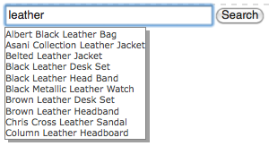

# Adding Search&amp;Promote features to your page {#adding-search-promote-features-to-your-page}

To integrate Search&amp;Promote capabilities in your web site, use the [!UICONTROL Search&amp;Promote] components to add the following features to your pages:

* Keyword-Suche
* Seite mit Suchergebnissen
* Präzisierung der Suche
* Banner

Beachten Sie, dass Sie Search&amp;Promote-Funktionen nur dann verwenden können, wenn Ihr AEM-Administrator sie aktiviert hat. Weitere Informationen finden Sie unter [Integration in Adobe Search&amp;Promote](/help/sites-administering/search-and-promote.md).

Facetten werden auf dem Search&amp;Promote-Server konfiguriert, genau wie die von jeder Komponente bereitgestellten Informationen. Die folgende Tabelle enthält eine kurze Beschreibung der einzelnen Komponenten. Die nachfolgenden Abschnitte enthalten ausführliche Informationen zu deren Verwendung.

<table> 
 <tbody> 
  <tr> 
   <th>Search&amp;Promote-Komponente</th> 
   <th>Beschreibung</th> 
  </tr> 
  <tr> 
   <td>Banner</td> 
   <td>Anzeige von Bannerwerbung. Banner werden auf Grundlage der Daten ausgewählt, die von Search&amp;Promote erfasst werden.  </td> 
  </tr> 
  <tr> 
   <td>Breadcrumb</td> 
   <td>Zeigt den Suchbegriff und die Reihenfolge der Filter an, die der Benutzer auf Suchergebnisse angewendet hat.</td> 
  </tr> 
  <tr> 
   <td>Facette als Kontrollkästchen-Liste</td> 
   <td>Eine Liste mit Kontrollkästchen zur Auswahl von Facetten für das Filtern von Suchergebnissen.</td> 
  </tr> 
  <tr> 
   <td>Facette als Dropdown</td> 
   <td>Eine Dropdown-Liste von Facetten für das Filtern von Suchergebnissen.</td> 
  </tr> 
  <tr> 
   <td>Facette als Link-Liste</td> 
   <td>Eine Liste der Facetten-Links für das Filtern von Suchergebnissen.</td> 
  </tr> 
  <tr> 
   <td>Seitenumbruch</td> 
   <td>Steuerelemente für die Navigation durch die Seiten von Suchergebnissen.</td> 
  </tr> 
  <tr> 
   <td>Ergebnisse</td> 
   <td>Zeigt die Ergebnisse einer Suche nach Begriffen an.</td> 
  </tr> 
  <tr> 
   <td>Suchen</td> 
   <td>Fügt ein Suchfeld in die Seite ein.</td> 
  </tr> 
 </tbody> 
</table>

## Erstellen der Suchergebnisseite {#creating-the-search-results-page}

Verwenden Sie die WCM-Websites-Konsole, um eine Seite für die Anzeige von Suchergebnissen zu erstellen. Die Suchergebnisse aus einer beliebigen Suchkomponente können auf dieser Seite angezeigt werden, sofern für sie dieselben Search&amp;Promote-Services verwendet werden.

Die Komponenten, die es Benutzern ermöglichen, Suchergebnisse zu überprüfen, sind „Ergebnisse“ und „Seitenumbruch“. Die Komponente **[!UICONTROL Ergebnisse]** weist weder im Bearbeitungs- noch im Designmodus konfigurierbare Eigenschaften auf.  Die Komponente „Ergebnisse“ listet lediglich Suchergebnisse auf, die Links zu anderen Seiten enthalten, und zeigt die Anzahl der Ergebnisse für jeden Suchbegriff an.

Die Komponente **[!UICONTROL Seitenumbruch]** ermöglicht Benutzern die Navigation durch mehrere Seiten mit Suchergebnissen. Benutzer können die Anzahl der Seiten einsehen, zur nächsten oder vorherigen Seite wechseln, eine zu öffnende Seite auswählen und alle Ergebnisse auf einer Seite zusammenfassen.

You can configure the following component properties in [!UICONTROL Edit] mode to control runtime behavior:

* **[!UICONTROL Einzelne Ergebnisseite]** ausblenden: Wählen Sie diese Option, um die Seitennavigationssteuerelemente auszublenden, wenn die Suche eine einzelne Ergebnisseite zurückgibt.
* **[!UICONTROL &quot;Erste/Letzte]** ausblenden&quot;- Wählen Sie diese Option, um zu verhindern, dass Benutzer zur ersten oder letzten Ergebnisseite springen.
* **[!UICONTROL Vorherige/Nächste]** ausblenden - Bestimmt, ob Benutzer relativ zur aktuellen Seite navigieren können.
* **[!UICONTROL Alle]** Ansichten ausblenden - Bestimmt, ob der Benutzer alle Suchergebnisse auf einer Seite konsolidieren kann. In der Regel erfolgt die Nutzung von Serverressourcen bei Daten mit Seitenaufteilung effizienter. Wählen Sie diese Option aus, um die Übertragung großer Datenmengen in einer einzelnen Antwortmeldung zu verhindern.

## Aktivieren der Filterung von Ergebnissen durch Facetten {#enabling-the-filtering-of-results-by-facets}

Sie können Benutzern die Filterung von Suchergebnissen durch Facetten ermöglichen. The **[!UICONTROL Checkbox List Facet]**, **[!UICONTROL Dropdown Facet]**, and **[!UICONTROL Link List Facet]** components enable users to select one or more facets for filtering. Bei Verwendung dieser Komponenten sollten Sie auch die Komponente **[!UICONTROL Breadcrumbs]** einschließen. Breadcrumbs zeigen die aktuell verwendeten Filter an.

The **[!UICONTROL Checkbox List Facet]**, **[!UICONTROL Dropdown Facet]**, and **[!UICONTROL Link List Facet]** components each have the following properties that you configure in **[!UICONTROL Edit]** mode:

* **[!UICONTROL Facet Name]** - Der Name der Facette, die für Filter verwendet wird.

Die Komponente **[!UICONTROL Facette als Kontrollkästchen-Liste]** zeigt eine Liste von Facetten an, die jeweils ein Kontrollkästchen aufweisen. Verwenden Sie **[!UICONTROL Facette als Kontrollkästchen-Liste]**, damit Benutzer eine Untergruppe von Ergebnissen anzeigen können, die Elemente aus mehreren Facetten enthalten. Beispielsweise ist dieMarken-Facette geeignet, da mehrere Marken dieselbe Art von Produkt anbieten.

Ein Kontrollkästchen wird für jede Facette angezeigt, die mit einem Suchergebnis verbunden ist. Wenn ein Benutzer ein Kontrollkästchen aktiviert, wird die Seite mit einem aktualisierten Ergebnissatz neu geladen. Alle Kontrollkästchen verbleiben auf der Seite, damit Kunden jederzeit zur weiteren Filterung Facetten hinzufügen oder entfernen können:

Die Komponente **[!UICONTROL Facette als Dropdown]** ermöglicht es Kunden, ein Facettenelement in einer Dropdown-Liste auszuwählen. Diese Komponente ist hilfreich, wenn Sie möchten, dass Kunden sich umgehend auf ein einzelnes Facettenelement konzentrieren können. Beispielsweise ist die Facette „Abteilung“ dafür geeignet, Kunden die Einschränkung von Produktsuchen nach Abteilung zu ermöglichen. John sucht *Jeans* und schränkt danach die Suche auf die Herrenabteilung ein.

Die Dropdown-Liste wird mit den Facetten gefüllt, die mit allen Suchergebnissen verbunden sind. Bei Auswahl eines Elements in der Dropdown-Liste wird die Seite mit einem aktualisierten Ergebnissatz neu geladen. Die Elemente in der Dropdown-Liste ändern sich nicht, sodass Kunden jederzeit zwischen verschiedenen Facetten wechseln können.

Mit der Komponente **[!UICONTROL Facette als Link-Liste]** können Kunden ihren Fokus immer stärker auf Elemente beschränken, die unter mehreren Facettenmitgliedern bzw. Facetten kategorisiert sind.

Facettenmitglieder werden als Liste von Links angezeigt. Der Text eines Links entspricht dem Namen des jeweiligen Facettenmitglieds, das mit den aktuellen Suchergebnissen verbunden ist. Wenn ein Kunde auf einen solchen Link klickt, wird die Seite neu geladen und eine Untergruppe der Suchergebnisse wird angezeigt. Die Liste der Links wird entsprechend aktualisiert, sodass der Fokus noch weiter eingeschränkt werden kann.

The links in the list also changes when a filter is applied from a different type of [!UICONTROL Search&amp;Promote] component. Durch die Verwendung von Filterkomponenten mehrerer Typen sind effektive Filterkombinationen möglich.

Die Komponente **[!UICONTROL Breadcrumbs]** ermöglicht es Kunden, die aktuell auf Suchergebnisse angewendeten Filter in der Reihenfolge, in der sie angewendet wurden, einzusehen. Kunden können auf die Elemente im Breadcrumb klicken, um die entsprechende Filterkombination wiederherzustellen.

Sie können die folgenden Eigenschaften für Breadcrumbs im Bearbeitungsmodus konfigurieren, um das Erscheinungsbild der Komponente anzupassen:

* **[!UICONTROL Trennzeichen]** : Definieren Sie die Zeichen- oder Zeichenzeichenfolge, die als Trennzeichen zwischen den einzelnen Breadcrumbs dienen soll. Das Trennzeichen-Feld akzeptiert alle Zeichenfolgen als Eingabe. Die Standardeinstellung ist: „>“ (ohne die Anführungszeichen)
* **[!UICONTROL Trennzeichen]** nach dem Komma: Definieren Sie eine Zeichen- oder Zeichenzeichenfolge, die am Ende der Breadcrumbs angezeigt werden soll. Das Feld &quot;Trennzeichen nach&quot;akzeptiert alle Zeichenfolgen als Eingabe. Die Standardeinstellung für diese Einstellung ist &quot;leer&quot;(d. h., am Ende der Breadcrumb-Linie wird nichts angezeigt)

## Hinzufügen von Suchfeldern {#adding-search-boxes}

The **[!UICONTROL Search]** component enables customers to perform keyword searches. Fügen Sie Suchkomponenten zu jeder Seite hinzu, auf der die Suchfunktion verfügbar sein soll.

Configure the following properties in **[!UICONTROL Edit]** mode to control runtime behavior:

* **[!UICONTROL Pfad]** der Ergebnisseite - Der Pfad zur Seite, auf der die Suchergebnisse angezeigt werden.
* **[!UICONTROL Autom. Ausfüllen]** aktivieren: Wählen Sie diese Option, um vorzuschlagende Suchbegriffe anzuzeigen, wenn der Kunde beginnt, in das Suchfeld einzugeben.

## Hinzufügen von Bannern {#adding-banners}

The **[!UICONTROL Banners]** component displays banner advertisements according to the customer&#39;s Search&amp;Promote searches. Logik auf dem Search&amp;Replace-Server ermittelt, welches Banner angezeigt wird. Beispielsweise könnte bei einer Suche nach Jeans ein Banner angezeigt werden, das mit Mode zu tun hat. Durch Filtern auf die Herrenabteilung könnte die Auswahl des Banners noch weiter verfeinert werden.

The **[!UICONTROL Banners]** component provides one configurable property named **[!UICONTROL Banner Area]**. In **[!UICONTROL Edit]** mode, select one of the property values to specify how the banner appears. Der Search&amp;Promote-Service legt die Liste der Werte fest, aus denen Sie auswählen können.

## Beispiel für Search&amp;Promote-Suchseite {#example-search-promote-search-page}

Dieses Diagramm zeigt die Komponenten an, die zu einer Seite hinzugefügt werden, um die voll funktionsfähige Search&amp;Promote-Ergebnisseite wie abgebildet zu erstellen.

 

