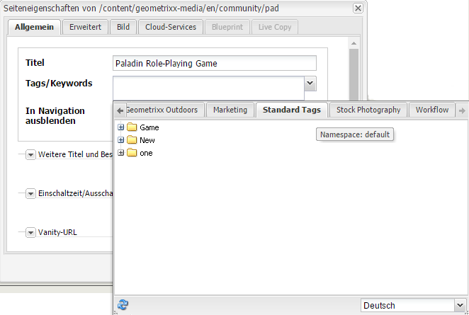
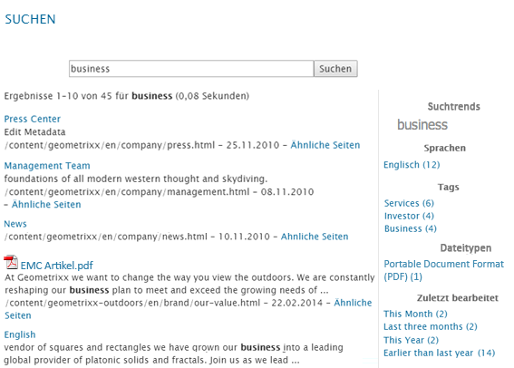

# Verwenden von Tags{#using-tags}

Tags bieten eine schnelle und einfache Methode zur Klassifizierung von Inhalten innerhalb einer Website. Tags können als Keywords oder Beschriftungen betrachtet werden, die einer Seite, einem Asset oder einem anderen Inhalt zugeordnet werden können, um Suchen zu ermöglichen und dadurch Inhalte und verwandte Inhalte zu finden.

* Informationen zum Erstellen und Verwalten von Tags sowie dazu, auf welche Inhalts-Tags angewendet wurden, finden Sie unter [Verwalten von Tags](/help/sites-administering/tags.md) .
* Unter [Tagging für Entwickler](/help/sites-developing/tags.md) finden Sie Informationen über das Tagging-Framework sowie die Einbeziehung und Erweiterung von Tags in benutzerdefinierten Anwendungen.

## Zehn Gründe für das Verwenden von Tags {#ten-reasons-to-use-tagging}

1. Organisieren von Inhalten: Tagging macht das Leben für Autoren leichter, da sie Inhalte mit wenig Aufwand schnell organisieren können.
1. Organisieren von Tags: Während Tags Inhalte organisieren, organisieren hierarchische Taxonomien/Namespaces Tags.
1. Tief organisierte Tags: Durch die Fähigkeit zum Erstellen von Tags und Unter-Tags können ganze Taxonomiesysteme aufgestellt werden, die Begriffe, Unterbegriffe und deren Beziehungen darstellen. Dies ermöglicht die Erstellung einer zweiten (oder dritten) Inhaltshierarchie parallel zur offiziellen Inhaltshierarchie.
1. Kontrolliertes Tagging: Tagging kann durch Anwenden von Berechtigungen auf Tags und/oder Namespaces zum Steuern der Tag-Erstellung und -Anwendung kontrolliert werden.
1. Flexibles Tagging: Tags können viele Namen und Formen annehmen: Tags, Taxonomiebegriffe, Kategorien, Beschriftungen und vieles mehr. Ihr Inhaltsmodell und ihre Verwendung sind flexibel und können an die jeweiligen Bedürfnisse angepasst werden, z. B. bei der Zielgruppendefinition, der Kategorisierung und Bewertung von Inhalten oder bei der Erstellung sekundärer Inhaltshierarchien.
1. Verbessertes Suchen: Die Standardsuchkomponente in AEM enthält erstellte Tags und angewendete Tags, auf die Filter angewendet werden können, um die Ergebnisse auf die relevanten einzugrenzen.
1. SEO-Aktivierung: Als Seiteneigenschaften angewendete Tags werden automatisch in den Meta-Tags einer Seite angezeigt, damit sie für Suchmaschinen sichtbar sind.
1. Einfach und intelligent: Tags können aus einem Wort und durch Berühren einer Schaltfläche ganz einfach erstellt werden. Danach können ein Titel, eine Beschreibung und eine unbegrenzte Anzahl von Beschriftungen hinzugefügt werden, um mehr semantische Informationen für das Tag bereitzustellen.
1. Kern-Konsistenz: Das Tagging-System gehört zu den Kernbestandteilen von AEM und wird von allen AEM-Fähigkeiten für die Kategorisierung von Inhalten verwendet. Darüber hinaus ist die Tagging-API für Entwickler zum Erstellen Tagging-fähiger Anwendungen mit Zugriff auf dieselben Taxonomien verfügbar.
1. Kombiniert Struktur und Flexibilität: AEM ist für das Arbeiten mit strukturierten Informationen aufgrund der Verschachtelung von Seiten und Pfaden ideal. Es ist wegen der integrierten Volltextsuche genauso leistungsfähig, was das Arbeiten mit unstrukturierten Informationen angeht. Tagging kombiniert die Stärken der Struktur und Flexibilität.

Wenn Sie die Inhaltsstruktur für eine Website oder das Metadatenschema für Assets entwerfen, sollten Sie den leichten und zugänglichen Ansatz berücksichtigen, den Tagging bietet.

## Anwenden von Tags   {#applying-tags}

In der Autorenumgebung wenden Autoren möglicherweise Tags an, indem sie auf die Seiteneigenschaften zugreifen und ein oder mehrere Tags im Feld **Tags/Keywords** eingeben.

Um [vordefinierte Tags](/help/sites-administering/tags.md) anzuwenden, verwenden Sie im Fenster **Seiteneigenschaften** das Pulldown-Feld `Tags/Keywords` , um aus der Liste der für die Seite zulässigen Tags auszuwählen. Die Registerkarte **Standard-Tags** ist der Standard-Namespace. Das bedeutet, dass der Taxonomie kein `namespace-string:`-Präfix vorangestellt ist.

### Veröffentlichen von Tags {#publishing-tags}

Wie bei Seiten können die folgenden Aufgaben für Tags und Namespaces durchgeführt werden:

**Aktivieren**

* Einzelne Tags können aktiviert werden.

   Genau wie Seiten müssen neu erstellte Tags zuerst aktiviert werden, bevor sie in einer Veröffentlichungsumgebung verfügbar sind.

>[!NOTE]
>
>Wenn Sie eine Seite aktivieren, wird automatisch ein Dialogfeld geöffnet, in dem Sie nicht aktivierte Tags, die zur Seite gehören, aktivieren können.

**Deaktivieren**

* Deaktivieren Sie die ausgewählten Tags.

## Tag-Clouds {#tag-clouds}

Tag-Clouds zeigen eine Cloud von Tags, entweder für die aktuelle Seite, die gesamte Website oder die beliebtesten Seiten. Tag-Clouds sind ein Mittel, um die Probleme hervorzuheben, die für den Benutzer von Interesse sind (waren). Die Textgröße der einzelnen Tags spiegelt die Häufigkeit der Verwendung wider.

Die [Tag-Cloud](/help/sites-classic-ui-authoring/classic-page-author-edit-mode.md#tag-cloud)-Komponente (allgemeine Komponentengruppe) wird verwendet, um der Seite eine Tag-Cloud hinzuzufügen.

## Suchen nach Tags  {#searching-on-tags}

Sie können sowohl in der Autoren- als auch in der Veröffentlichungsumgebung nach Tags suchen.

### Verwenden der Suchkomponente  {#using-search-component}

Das Hinzufügen einer [Suchkomponente](/help/sites-classic-ui-authoring/classic-page-author-edit-mode.md#search) zu einer Seite bietet eine Suchfunktion, die Tags enthält und sowohl in der Autoren- als auch in der Veröffentlichungsumgebung verwendet werden kann.

