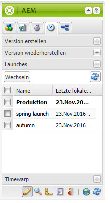
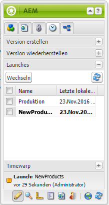

# Bearbeiten von Launches{#editing-launches}

>[!CAUTION]
>
>AEM 6.4 hat das Ende der erweiterten Unterstützung erreicht und diese Dokumentation wird nicht mehr aktualisiert. Weitere Informationen finden Sie in unserer [technische Unterstützung](https://helpx.adobe.com/de/support/programs/eol-matrix.html). Unterstützte Versionen suchen [here](https://experienceleague.adobe.com/docs/?lang=de).

## Bearbeiten von Launch-Seiten {#editing-launch-pages}

Wenn ein Launch für eine Seite (oder eine Reihe von Seiten) erstellt wurde, können Sie den Inhalt in der Launch Copy der Seiten bearbeiten.

1. Öffnen Sie die Seite zur Bearbeitung.
1. Wählen Sie im Sidekick die Registerkarte **Versionierung** aus und erweitern Sie dann die Gruppe **Launches**. Der Titel des Launches, der derzeit bearbeitet wird, verwendet eine fette Schriftart.

   

1. Wählen Sie den Launch aus, an dem Sie arbeiten möchten, und klicken Sie auf **Switch**.
1. Starten Sie die Bearbeitung.

   >[!NOTE]
   >
   >Sie können die Registerkarte **Seite** des Sidekicks verwenden, um Aktionen wie **Untergeordnete Seite erstellen** durchzuführen. 

## Bearbeiten einer Launch-Konfiguration {#editing-a-launch-configuration}

Wenn Sie einen Launch erstellt haben, können Sie den Namen und das Datum des Launches ändern. Sie können auch ein Bild angeben, das mit dem Launch verknüpft werden soll.

1. Öffnen Sie die Verwaltungsseite „Launches“ ([http://localhost:4502/libs/launches/content/admin.html](http://localhost:4502/libs/launches/content/admin.html)). 

1. Wählen Sie den gewünschten Launch aus und klicken Sie auf **Bearbeiten** , um das Dialogfeld zu öffnen:

   * Im **Allgemein** können Sie Folgendes bearbeiten:

      * **Titel**
      * **Live-Datum**: dieses entspricht dem Launch-Datum 
      * **Produktionsbereit**

      Siehe [Launches - die Reihenfolge der Ereignisse](/help/sites-authoring/launches.md#launches-the-order-of-events) für Informationen zum Zweck und zur Interaktion dieser Felder.

   * Im **Bild** -Registerkarte, können Sie eine Bilddatei hochladen.

1. Klicken Sie auf **Speichern**.

## Ermitteln des Launch-Status einer Seite {#discovering-the-launch-status-of-a-page}

Wenn Sie einen Launch einer Seite bearbeiten, werden Informationen zum Launch unten im **Versionierung** Registerkarte des Sidekick:

* Der Name des Launches.
* Die Zeit seit der letzten Änderung.
* Der Benutzer, der die letzte Änderung vorgenommen hat.
* Der Status des Flags **Produktionsbereit** (orange = nicht festgelegt; grün = festgelegt). 

