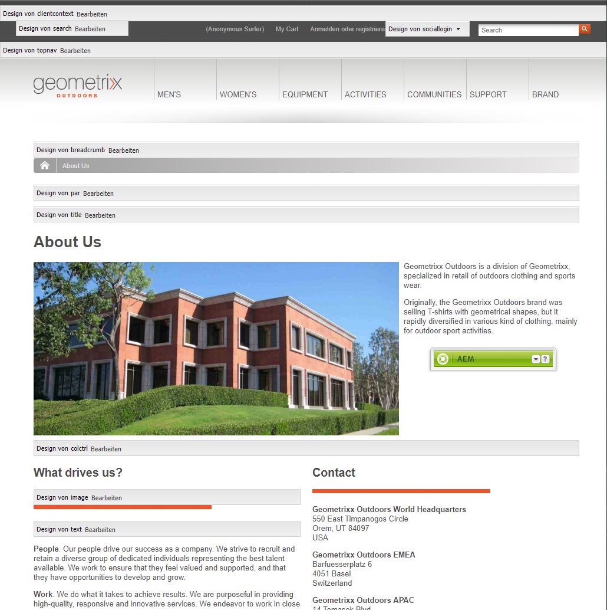
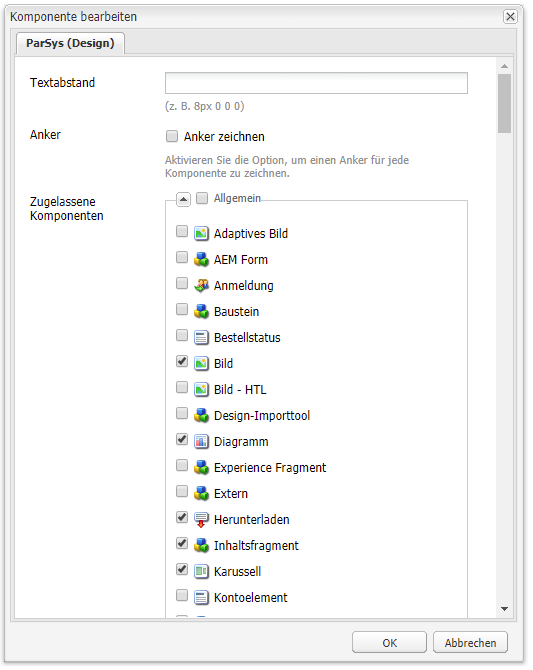
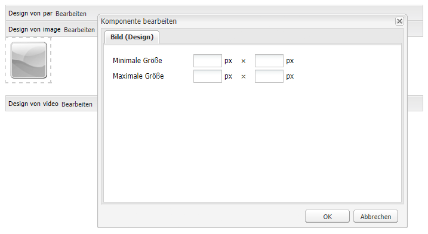

# Konfigurieren von Komponenten im Design-Modus{#configuring-components-in-design-mode}

>[!CAUTION]
>
>AEM 6.4 hat das Ende der erweiterten Unterstützung erreicht und diese Dokumentation wird nicht mehr aktualisiert. Weitere Informationen finden Sie in unserer [technische Unterstützung](https://helpx.adobe.com/de/support/programs/eol-matrix.html). Unterstützte Versionen suchen [here](https://experienceleague.adobe.com/docs/?lang=de).

Wenn AEM Instanz vorkonfiguriert installiert ist, ist im Sidekick sofort eine Auswahl von Komponenten verfügbar.

Darüber hinaus sind auch verschiedene weitere Komponenten verfügbar. Mit dem [Design-Modus](#enabledisablecomponentsusingdesignmode) können Sie diese Komponenten aktivieren/deaktivieren. Wenn Sie den Design-Modus aktivieren und sich auf der Seite befinden, können Sie damit [Aspekte des Komponenten-Designs konfigurieren](#configuringcomponentsusingdesignmode), indem Sie die Attributparameter bearbeiten.

>[!NOTE]
>
>Bei der Bearbeitung dieser Komponenten ist Vorsicht geboten. Die Designeinstellungen sind häufig ein wesentlicher Bestandteil des Designs der gesamten Website. Daher sollten sie nur von einer Person mit den entsprechenden Berechtigungen (und der erforderlichen Erfahrung) geändert werden (meist ein Administrator oder Entwickler). Weitere Informationen finden Sie unter [Entwicklung von Komponenten](/help/sites-developing/components.md).

Dazu müssen die zulässigen Komponenten im Absatzsystem für die Seite hinzugefügt oder entfernt werden. Das Absatzsystem (`parsys`) ist eine zusammengesetzte Komponente, die alle anderen Absatzkomponenten enthält. Das Absatzsystem ermöglicht es Autoren, einer Seite Komponenten unterschiedlicher Typen hinzuzufügen, da sie alle anderen Absatzkomponenten enthält. Jeder Absatztyp wird als eine Komponente dargestellt.

Beispielsweise kann der Inhalt einer Produktseite ein Absatzsystem enthalten, das Folgendes enthält:

* Ein Bild des Produkts (in Form eines Bild- oder Textimage-Absatzes)
* Die Produktbeschreibung (als Textabsatz)
* Eine Tabelle mit technischen Daten (als Tabellenabsatz)
* Formularbenutzer füllen das Formular aus (als Formularbeginn, Formularelement und Formularende-Absatz)

>[!NOTE]
>
>Unter [Entwicklung von Komponenten](/help/sites-developing/components.md#paragraphsystem) und [Richtlinien für die Verwendung von Vorlagen und Komponenten](/help/sites-developing/dev-guidelines-bestpractices.md#guidelines-for-using-templates-and-components) finden Sie weitere Informationen zu `parsys`.

## Komponenten aktivieren/deaktivieren {#enable-disable-components}

Im Designmodus ist der Sidekick minimiert und Sie können die für die Bearbeitung verfügbaren Komponenten konfigurieren:

1. Um in den Designmodus zu wechseln, öffnen Sie eine Seite zur Bearbeitung und verwenden Sie das Sidekick-Symbol:

   

1. Klicken Sie im Absatzsystem (**Design von „par“**) auf **Bearbeiten**.

   

1. Es wird ein Dialogfeld geöffnet, in dem die im Sidekick angezeigten Komponentengruppen zusammen mit den einzelnen darin enthaltenen Komponenten aufgelistet werden.

   Wählen Sie die Komponenten, die im Sidekick verfügbar sein sollen, nach Bedarf aus, um sie hinzuzufügen oder zu entfernen.

   

1. Der Sidekick wird im Designmodus minimiert. Wenn Sie auf den Pfeil klicken, können Sie den Sidekick maximieren und zum Bearbeitungsmodus zurückkehren:

   

## Konfigurieren des Designs einer Komponente {#configuring-the-design-of-a-component}

Im Designmodus können Sie auch Attribute für die einzelnen Komponenten konfigurieren. Jede Komponente verfügt über eigene Parameter. Das folgende Beispiel zeigt die **Bild** component:

1. Um in den Designmodus zu wechseln, öffnen Sie eine Seite zur Bearbeitung und verwenden Sie das Sidekick-Symbol:

   

1. Sie können das Design von Komponenten konfigurieren.

   Beispiel: Wenn Sie in der Bildkomponente (**Design von „image“**) auf **Bearbeiten** klicken, können Sie die komponentenspezifischen Parameter konfigurieren:

   

1. Klicken Sie auf **OK**, um die Änderungen zu speichern.

1. Der Sidekick wird im Designmodus minimiert. Wenn Sie auf den Pfeil klicken, können Sie den Sidekick maximieren und zum Bearbeitungsmodus zurückkehren:

   
