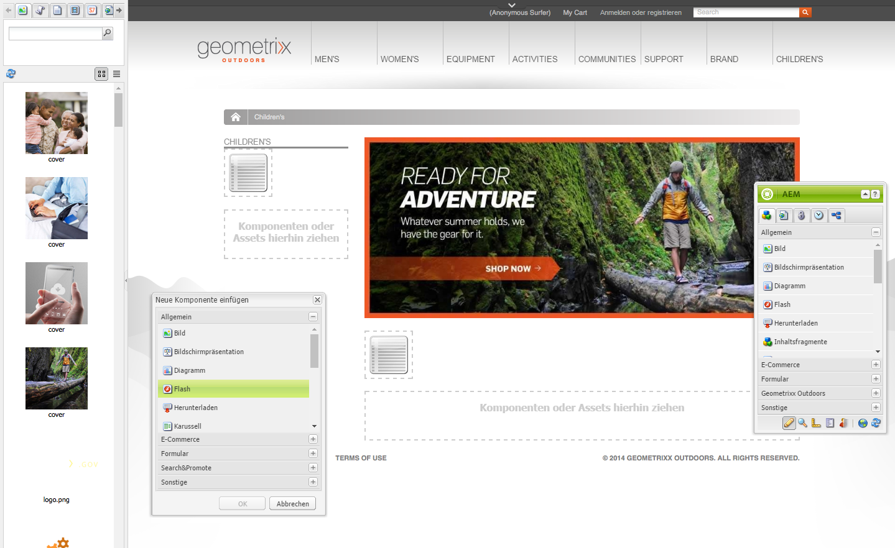
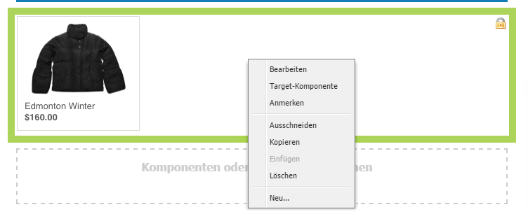
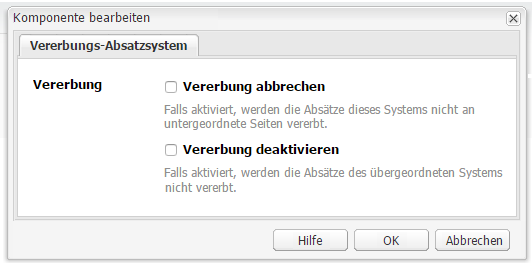

# Bearbeiten des Seiteninhalts{#editing-page-content}

>[!CAUTION]
>
>AEM 6.4 hat das Ende der erweiterten Unterstützung erreicht und diese Dokumentation wird nicht mehr aktualisiert. Weitere Informationen finden Sie in unserer [technische Unterstützung](https://helpx.adobe.com/de/support/programs/eol-matrix.html). Unterstützte Versionen suchen [here](https://experienceleague.adobe.com/docs/?lang=de).

Sobald Ihre Seite erstellt ist (neu oder im Rahmen eines Launch oder einer Live Copy), können Sie den Inhalt bearbeiten und die erforderlichen Aktualisierungen vornehmen.

Der Inhalt wird mithilfe von (dem Inhaltstyp entsprechenden) Komponenten hinzugefügt, die auf die Seite gezogen werden können. Dort können sie dann bearbeitet, verschoben oder gelöscht werden.

>[!NOTE]
>
>Ihr Konto muss [angemessene Zugriffsberechtigungen](/help/sites-administering/security.md) und [Berechtigungen](/help/sites-administering/security.md#permissions) Bearbeiten von Seiten; z. B. Hinzufügen, Bearbeiten oder Löschen von Komponenten, Hinzufügen von Anmerkungen und Entsperren.
>
>Wenn Sie auf Probleme stoßen, empfehlen wir Ihnen, sich an die bzw. den Systemadmin zu wenden.

## Sidekick {#sidekick}

Der Sidekick ist ein wichtiges Tool beim Erstellen von Seiten. Sie ist beim Bearbeiten einer Seite schwebend, sodass sie immer sichtbar ist.

Es stehen verschiedene Registerkarten und Symbole zur Verfügung, darunter:

* Komponenten
* Seite
* Informationen
* Versionierung
* Workflow
* Modi
* Strukturvorlage
* ClientContext
* Websites

Diese bieten Zugriff auf eine Vielzahl von Funktionen, zu denen unter anderem folgende gehören:

* [Auswählen der Komponenten](/help/sites-classic-ui-authoring/classic-page-author-env-tools.md#sidekick)
* [Anzeigen der Verweise](/help/sites-classic-ui-authoring/classic-page-author-env-tools.md#showing-references)
* [Zugriff auf das Auditprotokoll](/help/sites-classic-ui-authoring/classic-page-author-env-tools.md#audit-log)
* [Umschalten zwischen Modi](/help/sites-classic-ui-authoring/classic-page-author-env-tools.md#page-modes)
* [Erstellen](/help/sites-classic-ui-authoring/classic-page-author-work-with-versions.md#creating-a-new-version), [Wiederherstellen](/help/sites-classic-ui-authoring/classic-page-author-work-with-versions.md#restoring-a-page-version-from-sidekick) und [Vergleichen](/help/sites-classic-ui-authoring/classic-page-author-work-with-versions.md#comparing-with-a-previous-version) von Versionen

* [Veröffentlichen einer Seite](/help/sites-classic-ui-authoring/classic-page-author-publish-pages.md#publishing-a-page), [Rückgängigmachen der Veröffentlichung](/help/sites-classic-ui-authoring/classic-page-author-publish-pages.md#unpublishing-a-page)

* [Bearbeiten der Seiteneigenschaften](/help/sites-classic-ui-authoring/classic-page-author-edit-page-properties.md)

* [Strukturvorlagen](/help/sites-authoring/scaffolding.md)

* [ClientContext](/help/sites-administering/client-context.md)

## Einfügen einer Komponente {#inserting-a-component}

### Einfügen einer Komponente {#inserting-a-component-1}

Nachdem Sie die Seite geöffnet haben, können Sie beginnen, Inhalte hinzuzufügen. Fügen Sie dazu Komponenten hinzu (auch Absätze genannt).

So fügen Sie eine neue Komponente ein:

1. Es gibt verschiedene Methoden, den Typ des einzufügenden Absatzes auszuwählen:

   * Doppelklicken Sie auf den Bereich mit der Beschriftung **Ziehen Sie Komponenten oder Assets hierher...** - die **Neue Komponente einfügen** wird geöffnet. Wählen Sie eine Komponente aus und klicken Sie auf **OK**.
   * Ziehen Sie eine Komponente aus der unverankerten Symbolleiste (Sidekick), um einen neuen Absatz einzufügen.
   * Klicken Sie mit der rechten Maustaste auf einen bestehenden Absatz und wählen Sie **Neu...**. Die Symbolleiste „Neue Komponente einfügen“ wird geöffnet. Wählen Sie eine Komponente aus und klicken Sie auf **OK**.

   

1. Sowohl im Sidekick als auch in der Symbolleiste **Neue Komponente einfügen** wird eine Liste der verfügbaren Komponenten (Absatztypen) angezeigt. Diese können in verschiedene Abschnitte unterteilt werden (z. B. &quot;Allgemein&quot;, &quot;Spalten&quot;usw.), die bei Bedarf erweitert werden können.

   Abhängig von Ihrer Produktionsumgebung können diese Optionen unterschiedlich sein. Ausführliche Informationen zu Komponenten finden Sie unter [Standardkomponenten](/help/sites-classic-ui-authoring/classic-page-author-default-components.md).

1. Fügen Sie die gewünschte Komponente auf der Seite ein. Doppelklicken Sie dann auf den Absatz. Daraufhin wird ein Fenster geöffnet, in dem Sie Ihren Absatz konfigurieren und Inhalte hinzufügen können.

### Einfügen einer Komponente mit dem Content Finder {#inserting-a-component-using-the-content-finder}

Sie können eine neue Komponente zur Seite hinzufügen, indem Sie ein Asset aus dem [Content Finder](/help/sites-classic-ui-authoring/classic-page-author-env-tools.md#the-content-finder) ziehen. Dadurch wird automatisch eine neue Komponente des entsprechenden Typs erstellt, die das Asset enthält.

Dies gilt für folgende Asset-Typen (einige sind vom Seiten-/Absatzsystem abhängig):

| Asset-Typ | Resultierender Komponententyp |
|---|---|
| Bild | Bild |
| Dokument | Download |
| Produkt | Produkt |
| Video  | Flash |

>[!NOTE]
>
>Dieses Verhalten kann für Ihre Installation konfiguriert werden. Siehe [Konfigurieren eines Absatzsystems, sodass beim Ziehen eines Assets eine Komponenteninstanz erstellt wird](/help/sites-developing/developing-components.md#configuring-a-paragraph-system-so-that-dragging-an-asset-creates-a-component-instance) für weitere Informationen.

So erstellen Sie eine Komponente, indem Sie einen der obigen Asset-Typen ziehen:

1. Öffnen Sie die Seite im Modus [**Bearbeiten**](/help/sites-classic-ui-authoring/classic-page-author-env-tools.md#page-modes).
1. Öffnen Sie die [Content Finder](/help/sites-classic-ui-authoring/classic-page-author-env-tools.md#the-content-finder).
1. Ziehen Sie das gewünschte Asset an die gewünschte Position. Der [Komponenten-Platzhalter](#componentplaceholder) zeigt an, wo die Komponente platziert wird.

   Eine für den Asset-Typ geeignete Komponente wird am erforderlichen Speicherort erstellt und enthält das ausgewählte Asset.

1. [Bearbeiten](#editmovecopypastedelete) Sie bei Bedarf die Komponente.

## Bearbeiten einer Komponente (Inhalt und Eigenschaften) {#editing-a-component-content-and-properties}

Führen Sie einen der folgenden Schritte aus, um einen vorhandenen Absatz zu bearbeiten:

* **Doppelklicken** den Absatz, um ihn zu öffnen. Es wird dasselbe Fenster angezeigt wie bei der Erstellung des Absatzes mit dem vorhandenen Inhalt. Nehmen Sie Ihre Änderungen vor und klicken Sie auf **OK**.

* **Rechtsklick** Absatz und klicken Sie auf **Bearbeiten**.

* **Klicken** zweimal auf den Absatz klicken (langsamer Doppelklick), um in den Bearbeitungsmodus zu wechseln. Sie können nun den Text direkt auf der Seite bearbeiten, anstatt ein Dialogfenster aufrufen zu müssen. In diesem Modus steht am oberen Rand der Seite eine Werkzeugleiste zur Verfügung. Nehmen Sie einfach Ihre Änderungen vor und sie werden automatisch gespeichert.

## Verschieben einer Komponente {#moving-a-component}

So verschieben Sie einen Absatz:

>[!NOTE]
>
>Sie können eine Komponente auch durch [Ausschneiden und Einfügen](#cut-copy-paste-a-component) verschieben.

1. Wählen Sie den Absatz aus, den Sie verschieben möchten:

   

1. Ziehen Sie den Absatz an die neue Stelle. AEM zeigt durch ein grünes Häkchen an, wohin der Absatz verschoben werden kann. Legen Sie es an der gewünschten Position ab.
1. Der Absatz wird verschoben:

   

## Löschen einer Komponente {#deleting-a-component}

So löschen Sie einen Absatz:

1. Wählen Sie den Absatz aus und **Rechtsklick**:

   

1. Auswählen **Löschen** aus dem Menü. AEM WCM fordert Sie auf, zu bestätigen, dass Sie den Absatz löschen möchten, da diese Aktion nicht rückgängig gemacht werden kann.
1. Klicken Sie auf **OK**.

>[!NOTE]
>
>Wenn Sie in den [Benutzereigenschaften festgelegt haben, dass die globale Bearbeitungssymbolleiste](/help/sites-classic-ui-authoring/author-env-user-props.md) angezeigt werden soll, können Sie die verfügbaren Schaltflächen **Kopieren**, **Ausschneiden**, **Einfügen** und **Löschen** verwenden.\
>Es stehen auch verschiedene [Tastaturbefehle](/help/sites-classic-ui-authoring/classic-page-author-keyboard-shortcuts.md) zur Verfügung.

## Ausschneiden/Kopieren/Einfügen einer Komponente {#cut-copy-paste-a-component}

Wie beim [Löschen einer Komponente](#deleting-a-component) können Sie das Kontextmenü nutzen, um eine Komponente zu kopieren, auszuschneiden und/oder einzufügen.

>[!NOTE]
>
>Wenn Sie in den [Benutzereigenschaften festgelegt haben, dass die globale Bearbeitungssymbolleiste](/help/sites-classic-ui-authoring/author-env-user-props.md) angezeigt werden soll, können Sie die verfügbaren Schaltflächen **Kopieren**, **Ausschneiden**, **Einfügen** und **Löschen** verwenden.
>
>Es stehen auch verschiedene [Tastaturbefehle](/help/sites-classic-ui-authoring/classic-page-author-keyboard-shortcuts.md) zur Verfügung.

>[!NOTE]
>
>Das Ausschneiden, Kopieren und Einfügen von Inhalt wird nur innerhalb derselben Seite unterstützt.

## Vererbte Komponenten {#inherited-components}

Vererbte Komponenten können sich aus diversen Szenarien ergeben, wie:

* [Multi-Site-Management](/help/sites-administering/msm.md); auch in Kombination mit [scaffolding](/help/sites-classic-ui-authoring/classic-feature-scaffolding.md#scaffolding-with-msm-inheritance).

* [Launch](/help/sites-classic-ui-authoring/classic-launches.md) (wenn er auf Live Copy basiert).
* Spezifische Komponenten, z. B. das Vererbungs-Absatzsystem in Geometrixx.

Sie können die Vererbung deaktivieren (und dann wieder aktivieren). Abhängig von der Komponente kann dies über Folgendes verfügbar sein:

1. **Live Copy**

   Wenn eine Komponente Teil einer Live Copy oder eines Launches ist, wird dies durch ein Schlosssymbol angezeigt. Sie können auf das Vorhängeschloss klicken, um die Vererbung abzubrechen.

   * Das Schlosssymbol wird angezeigt, wenn die Komponente ausgewählt wird. Beispiel:

   

   * Das Schloss wird ebenfalls im Dialogfeld von Komponenten angezeigt. Beispiel:

   

1. **Ein geerbtes Absatzsystem**

   Das Konfigurationsdialogfeld. Beispielsweise wie beim geerbten Absatzsystem in Geometrixx:

   

## Hinzufügen von Anmerkungen {#adding-annotations}

[Anmerkungen](/help/sites-classic-ui-authoring/classic-page-author-annotations.md) anderen Autoren die Möglichkeit geben, Feedback zu Ihrem Inhalt zu geben. Dies wird häufig zu Überprüfungs- und Validierungszwecken verwendet.

## Anzeigen einer Seitenvorschau {#previewing-pages}

Es gibt zwei Symbole im unteren Rand des Sidekicks, die für die Vorschau von Seiten wichtig sind:

* Das Stiftsymbol zeigt an, dass Sie sich derzeit im Bearbeitungsmodus befinden, in dem Sie Inhalte hinzufügen, ändern, verschieben oder löschen können.

   

* Mit dem Lupensymbol können Sie den Vorschaumodus auswählen, in dem die Seite so angezeigt wird, wie sie in der Veröffentlichungsumgebung angezeigt wird (manchmal ist auch eine Seitenaktualisierung erforderlich):

   

   Im Vorschaumodus wird der Sidekick minimiert. Klicken Sie auf den Pfeil nach unten, um in den Bearbeitungsmodus zurückzukehren:

   

## Suchen und Ersetzen {#find-replace}

Bei umfangreicheren Bearbeitungen desselben Satzes wird ein **[Suchen und Ersetzen](/help/sites-classic-ui-authoring/author-env-search.md#find-and-replace)** -Menüoption können Sie innerhalb eines Bereichs der Website nach mehreren Instanzen einer Zeichenfolge suchen und diese ersetzen.

## Sperren einer Seite {#locking-a-page}

AEM bietet Ihnen die Möglichkeit, eine Seite zu sperren, sodass niemand außer Ihnen den Inhalt bearbeiten kann. Dies ist nützlich, wenn Sie eine Vielzahl von Bearbeitungen an einer bestimmten Seite vornehmen oder wenn Sie eine Seite für eine kurze Zeit einfrieren müssen.

>[!CAUTION]
>
>Das Sperren einer Seite sollte mit Vorsicht verwendet werden, da die einzige Person, die eine Seite entsperren kann, die Person ist, die sie gesperrt hat (oder ein Konto mit Administratorrechten).

So sperren Sie eine Seite:

1. Im **Websites** Registerkarte die Seite auswählen, die Sie sperren möchten.
1. Doppelklicken Sie auf die Seite, um sie zur Bearbeitung zu öffnen.
1. Im **Seite** Registerkarte des Sidekicks, wählen Sie **Seite sperren**:

   

   Eine Meldung über die Sperrung der Seite für andere Benutzer wird angezeigt. Darüber hinaus wird im rechten Bereich der **Websites** -Konsole AEM, zeigt WCM die Seite als gesperrt an und gibt an, welcher Benutzer die Seite gesperrt hat.

   

## Entsperren einer Seite {#unlocking-a-page}

So entsperren Sie eine Seite:

1. Im **Websites** Registerkarte die Seite auswählen, die Sie entsperren möchten.
1. Doppelklicken Sie auf die Seite, um sie zu öffnen.
1. Im **Seite** Registerkarte des Sidekicks, wählen Sie **Seite entsperren**.

## Rückgängigmachen und Wiederholen von Seitenbearbeitungen {#undoing-and-redoing-page-edits}

Verwenden Sie die folgenden Tastaturbefehle, während der Inhalts-Frame der Seite im Fokus ist:

* Rückgängig: Strg+Z (Windows) bzw. Befehl+Z (Mac)
* Wiederholen: Strg+Y (Windows) bzw. Befehl+Y (Mac)

Wenn Sie das Entfernen, Hinzufügen oder Verschieben von Absätzen rückgängig machen bzw. wiederholen, werden die betroffenen Absätze (standardmäßig) durch Markierungen hervorgehoben.

>[!NOTE]
>
>Siehe [Rückgängigmachen und Wiederholen von Seitenbearbeitungen – Die Theorie](#undoing-and-redoing-page-edits-the-theory); dort erfahren Sie, was beim Rückgängigmachen und Wiederholen von Seitenbearbeitungen möglich ist.

## Rückgängigmachen und Wiederholen von Seitenbearbeitungen - Die Theorie {#undoing-and-redoing-page-edits-the-theory}

>[!NOTE]
>
>Ihre bzw. Ihr Systemadmin kann [verschiedene Aspekte der Funktionen zum Rückgängigmachen/Wiederholen](/help/sites-administering/config-undo.md) den Anforderungen Ihrer Instanz entsprechend konfigurieren.

AEM speichert einen Verlauf der Aktionen, die Sie ausführen, sowie die Reihenfolge der Ausführung. Sie können also mehrere Aktionen in der Reihenfolge rückgängig machen, in der Sie sie ausgeführt haben. Anschließend können Sie die Aktion wiederholen, um sie erneut anzuwenden.

Wenn ein Element auf der Inhaltsseite ausgewählt ist, gilt der Befehl &quot;Rückgängig&quot;und &quot;Wiederholen&quot;für das ausgewählte Element, z. B. eine Textkomponente.

Das Verhalten der Befehle &quot;Rückgängig&quot;und &quot;Wiederholen&quot;ähnelt dem in anderen Softwareprogrammen. Verwenden Sie die Befehle, um den aktuellen Status Ihrer Web-Seite wiederherzustellen, während Sie Entscheidungen über Inhalte treffen. Wenn Sie beispielsweise einen Textabsatz an eine Stelle auf der Seite verschoben haben, können Sie ihn mithilfe des Befehls zum Rückgängigmachen wieder zurück an die ursprüngliche Stelle verschieben. Wenn Sie sich dann erneut dafür entscheiden, den Absatz zu verschieben, verwenden Sie den Befehl zum Wiederholen .

>[!NOTE]
>
>Sie haben folgende Möglichkeiten:
>
>* Aktionen wiederholen, solange Sie seit dem Rückgängigmachen der Aktion keine Seitenbearbeitung vorgenommen haben.
>* maximal 20 Bearbeitungsaktionen rückgängig machen (Standardeinstellung).
>* auch verwenden [Tastaturbefehle](/help/sites-classic-ui-authoring/classic-page-author-keyboard-shortcuts.md) zum Rückgängigmachen und Wiederholen.
>

Sie können die folgenden Arten von Seitenänderungen rückgängig machen und wiederholen:

* Hinzufügen, Bearbeiten, Entfernen und Verschieben von Absätzen
* Bearbeitung im Kontext von Absatzinhalten
* Kopieren, Ausschneiden und Einfügen von Elementen auf einer Seite
* Seitenübergreifendes Kopieren, Ausschneiden und Einfügen von Elementen
* Hinzufügen, Entfernen und Ändern von Dateien und Bildern
* Hinzufügen, Entfernen und Ändern von Anmerkungen und Zeichnungen
* Änderungen an Grundlage
* Hinzufügen und Entfernen von Verweisen
* Ändern von Eigenschaftswerten in Komponentendialogfeldern

Für Formularfelder, die durch Formular-Komponenten erzeugt werden, dürfen beim Erstellen von Seiten keine Werte angegeben werden. Folglich haben die Befehle „Rückgängig“ und „Wiederholen“ keine Auswirkungen auf Änderungen, die Sie an den Werten dieser Komponententypen vornehmen. Sie können beispielsweise die Auswahl eines Werts in einer Dropdown-Liste nicht rückgängig machen.

>[!NOTE]
>
>Spezielle Berechtigungen sind erforderlich, um Änderungen rückgängig zu machen bzw. wiederherzustellen, die an Dateien und Bildern vorgenommen wurden. Außerdem kann das Rückgängigmachen Änderungen an Dateien und Bildern nur einige Stunden garantiert werden. Bei länger zurückliegenden Änderungen ist dies unter Umständen nicht mehr möglich. Der bzw. die zuständige Admin kann Berechtigungen erteilen und die Standarddauer von zehn Stunden ändern.
