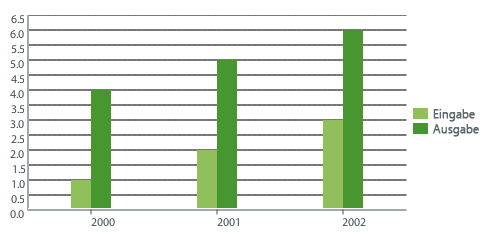
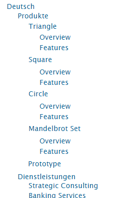
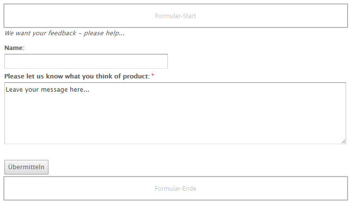
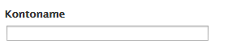
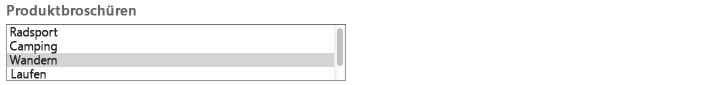
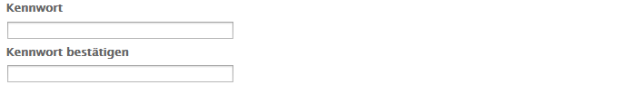

# Komponenten für die Seitenbearbeitung{#components-for-page-authoring}

>[!CAUTION]
>
>AEM 6.4 hat das Ende der erweiterten Unterstützung erreicht und diese Dokumentation wird nicht mehr aktualisiert. Weitere Informationen finden Sie in unserer [technische Unterstützung](https://helpx.adobe.com/de/support/programs/eol-matrix.html). Unterstützte Versionen suchen [here](https://experienceleague.adobe.com/docs/?lang=de).

Die folgenden Komponenten sind für die Bearbeitung von Inhalten für eine Standard-Web-Seite vorgesehen. Sie bilden eine Teilmenge der Komponenten, die standardmäßig für eine Standardinstallation von AEM verfügbar sind.

Einige sind sofort über den Sidekick verfügbar, andere sind auch verfügbar, indem Sie [Designmodus](/help/sites-classic-ui-authoring/classic-page-author-design-mode.md) , um sie zu aktivieren/deaktivieren.

>[!CAUTION]
>
>Dieser Abschnitt behandelt nur Komponenten, die standardmäßig in einer AEM-Standardinstallation verfügbar sind.
>
>Abhängig von Ihrer Instanz verfügen Sie möglicherweise über benutzerdefinierte Komponenten, die explizit für Ihre Anforderungen entwickelt wurden. Diese können sogar denselben Namen haben wie einige der hier behandelten Komponenten.

Die Komponenten stehen beim [Bearbeiten einer Seite](/help/sites-classic-ui-authoring/classic-page-author-edit-content.md) über die Registerkarte **Komponenten** des Sidekicks und die Auswahl **Neue Komponente einfügen** zur Verfügung (wenn Sie im Bereich **Komponenten oder Assets hierhin ziehen** doppelklicken).

Sie können eine Komponente auswählen und sie an die erforderliche Position auf der Seite ziehen und anschließend [Inhalte und Eigenschaften bearbeiten](/help/sites-classic-ui-authoring/classic-page-author-edit-content.md#editing-a-component-content-and-properties).

Komponenten werden nach verschiedenen Kategorien (Komponentengruppen) sortiert, darunter (für die Seitenbearbeitung):

* [Allgemein](#general): Enthält grundlegende Komponenten wie Text, Bilder, Tabellen, Diagramme usw.
* [Spalten](#columns): Enthält Komponenten, die für die Organisation des Inhaltslayouts erforderlich sind.
* [Formular](#formgroup): Umfasst alle Komponenten, die zum Erstellen eines Formulars erforderlich sind.

## Allgemein {#general}

Die allgemeinen Komponenten sind die grundlegenden Komponenten, die Sie zum Erstellen von Inhalten verwenden.

### Kontoelement {#account-item}

Sie können einen Link mit Titel und Beschreibung definieren.


### Adaptives Bild {#adaptive-image}

Die Komponente der Adaptive Image Foundation erzeugt Bilder, die in das Fenster eingepasst werden, in dem die Webseite geöffnet wird. Um die Komponente zu verwenden, geben Sie eine Bildressource entweder im Dateisystem oder im DAM an. Wenn die Webseite geöffnet wird, lädt der Webbrowser eine Kopie des Bildes herunter, dessen Größe so geändert wurde, dass es für das aktuelle Fenster geeignet ist.

Die folgenden Eigenschaften können die Größe des Fensters bestimmen:

* Geräte-Display: Auf Mobilgeräten werden Web-Seiten im Allgemeinen so angezeigt, dass das komplette Display ausgefüllt ist.
* Fenstergröße des Webbrowsers: Benutzer von Laptop- und Desktop-Computern können die Größe von Webbrowserfenstern ändern.

Die Komponente erzeugt zum Beispiel ein kleines Bild, wenn die Webseite auf einem Mobiltelefon geöffnet wird, und ein mittelgroßes Bild, wenn sie auf einem Tablet geöffnet wird. Auf einem Laptop erzeugt die Komponente ein großes Bild, wenn die Seite in einem maximierten Webbrowser geöffnet wird. Wenn die Größe des Webbrowsers an einen Teil des Bildschirms angepasst wird, passt sich die Komponente an, indem ein kleineres Bild bereitgestellt wird, und aktualisiert die Ansicht.

#### Unterstützte Bildformate {#supported-image-formats}

Sie können Bilddateien der folgenden Dateinamenerweiterungen mit der Adaptive Image-Komponente verwenden:

* .jpg
* .jpeg
* .png
* .gif &amp;ast;&amp;ast;

>[!CAUTION]
>
>&amp;ast;&amp;ast; Animierte .gif-Dateien werden in AEM für adaptive Ausgabedarstellungen nicht unterstützt.

#### Bildgrößen und Qualität {#images-sizes-and-quality}

In der folgenden Tabelle wird die Breite des Bildes aufgeführt, die für die jeweilige Anzeigebreite erzeugt wird. Die Höhe des erzeugten Bildes wird so berechnet, dass ein konstantes Seitenverhältnis erhalten bleibt und innerhalb des Bildrandes keine weißen Bereiche auftreten. Das Zuschneiden kann verwendet werden, um Leerzeichen zu vermeiden.

Wenn es sich bei dem Bild um ein JPEG-Bild handelt, kann die Anzeigegröße sich auch auf die JPEG-Qualität auswirken. Folgende JPEG-Qualitäten sind möglich:

* Niedrig (0,42)
* Mittel (0,82)
* Hoch (1.00)

| Viewport-Breitenbereich (Pixel) | Bildbreite (Pixel) | JPEG-Qualität | Zielgerätetyp |
|---|---|---|---|
| Breite &lt;= 319 | 320 | niedrig |  |
| Breite = 320 | 320 | mittel | Mobiltelefon (Hochformat) |
| 320 &lt; Breite &lt; 481 | 480 | mittel | Mobiltelefon (Querformat) |
| 480 &lt; Breite &lt; 769 | 476 | hoch | Tablet (Hochformat) |
| 768 &lt; Breite &lt; 1025 | 620 | hoch | Tablet (Querformat) |
| Breite &lt;= 1025 | full (Originalgröße) | hoch | Desktop |

#### Eigenschaften {#properties}

Das Dialogfeld erlaubt das Bearbeiten der Eigenschaften Ihrer Instanz der adaptiven Bildkomponente, von denen viele mit denen der Bild-Komponente übereinstimmen, auf der sie basieren. Die Eigenschaften werden auf zwei Registerkarten angezeigt:

* **Bild**

   * **Bild**

      Ziehen Sie ein Bild aus dem Content Finder oder klicken Sie, um ein Suchfenster zu öffnen, in dem Sie ein Bild laden können. Nachdem das Bild geladen wurde, können Sie es beschneiden, drehen oder löschen. Verwenden Sie den Regler unter dem Bild (und über den Schaltflächen „OK“ und „Abbrechen“), um das Bild ein- und auszuzoomen.

   * **Zuschneiden**

      Beschneiden eines Bildes. Ziehen Sie den Rahmen, um das Bild zu beschneiden.

   * **Drehen**

      Klicken Sie wiederholt auf Drehen , bis das Bild nach Wunsch gedreht wird.

   * **Entfernen**

      Damit entfernen Sie das aktuelle Bild.

* **Erweitert**

   * **Titel**

      Die Adaptive Image-Komponente verwendet diese Eigenschaft nicht.

   * **Alt-Text**

      Der alternative Text, der für das Bild verwendet werden soll.

   * **Verknüpfung zu**

      Die Adaptive Image-Komponente verwendet diese Eigenschaft nicht.

   * **Beschreibung**

      Die Adaptive Image-Komponente verwendet diese Eigenschaft nicht.

#### Vergrößern der Adaptive Image-Komponente {#extending-the-adaptive-image-component}

Informationen zum Anpassen der Adaptive Image-Komponente finden Sie unter [Grundlegendes zur adaptiven Bildkomponente](/help/sites-developing/responsive.md#using-adaptive-images).

### Karussell {#carousel}

Mit der Karussellkomponente können Sie Bilder anzeigen, die einzelnen Seiten zugeordnet sind:

* einzeln
* für kurze Zeit
* in der von Ihnen angegebenen Reihenfolge
* mit einer von Ihnen festgelegten Zeitverzögerung

Durch klickbare Steuerelemente kann der Benutzer auch bei Bedarf in Echtzeit durch die angezeigten Seiten navigieren. Wenn Sie auf das derzeit sichtbare Seitenbild klicken, gelangen Sie zu dieser Seite. Das heißt, das Karussell dient als Navigationssteuerung.

#### Eigenschaften {#properties-1}

Diese sind auf zwei Registerkarten verfügbar:

* **Karussell**
Hier geben Sie an wie das Karussell arbeitet:

   * Geschwindigkeit

      Die Zeit in Millisekunden vor der nächsten Folie wird angezeigt.
   * Übergangszeit

      Zeit in Millisekunden für den Übergang zwischen zwei Folien.
   * Steuerelemente-Stil

      In einem Pulldown-Menü stehen verschiedene Optionen zur Verfügung. z. B. Vorwärts-/Nächste-Schaltflächen, Rechtsanschläge oben.

* **Liste**
Hier legen Sie fest, wie Seiten in Ihr Karussell eingeschlossen werden:

   * **Liste erstellen mittels**

      Es gibt verschiedene Möglichkeiten, eine Seitenliste zu erstellen: untergeordnete Seiten, feste Liste, Suche oder erweiterte Suche (alle unten beschrieben).

      Beachten Sie, dass auf den Seiten, die Sie in Ihre Liste aufnehmen, unabhängig von der gewählten Methode bereits ein Bild mit der Seite verknüpft sein sollte. Dieses Bild wird im Karussell angezeigt. Wenn unter den Seiteneigenschaften dieser Seite kein Bild für eine bestimmte Seite vorhanden ist, sollten Sie ein Bild mit der Seite verknüpfen, bevor Sie beginnen. Andernfalls wird im Karussell eine leere (oder meist leere) Seite angezeigt. Siehe [Bearbeiten der Seiteneigenschaften](/help/sites-classic-ui-authoring/classic-page-author-edit-page-properties.md).

      Je nach ausgewähltem Element wird ein neues Bedienfeld angezeigt:

      * **Optionen für untergeordnete Seiten**

         * **Übergeordnete Seite**

            Geben Sie den Pfad entweder manuell oder mithilfe der Auswahl an. Lassen Sie das Feld leer, um die aktuelle Seite als übergeordnet zu verwenden.
      * **Optionen für Liste fester Werte**

         * **Seiten**

            Wählen Sie eine Liste mit Seiten aus. Verwendung `+` um weitere Einträge und die Nach-oben-/Nach-unten-Schaltflächen hinzuzufügen, um die Reihenfolge anzupassen.
      * **Optionen für die Suche**

         * **Starten in**

            Geben Sie manuell oder über die Auswahl einen Startpfad ein.

         * **Suchabfrage**
Sie können eine Textsuchabfrage eingeben.
      * **Optionen für die erweiterte Suche**

         * **Querybuilder-Eigenschafts-Notation**

            Geben Sie mit der QueryBuilder-Eigenschaftsnotation eine Suchanfrage ein. Sie können beispielsweise „fulltext=Marketing“ eingeben, um alle Seiten, deren Inhalt das Wort „Marketing“ enthält, in Ihrem Karussell anzuzeigen.

            Unter [„QueryBuilder API“](/help/sites-developing/querybuilder-api.md) finden Sie eine umfassende Übersicht über Abfrageausdrücke sowie weitere Beispiele.
   * **Sortieren nach**

      Auswählen `jcr:title`, `jcr:created`, `cq:lastModified`oder `cq:template` aus dem Dropdown-Menü aus.

   * **Beschränkung**

      Die maximale Anzahl von Elementen, die Sie im Karussell verwenden möchten; ist optional.


>[!NOTE]
>
>Sie können eine benutzerdefinierte Karussellkomponente für Adobe Experience Manager erstellen, die digitale Assets im AEM DAM anzeigt. Weitere Informationen finden Sie unter [Erstellen benutzerdefinierter Karussellkomponenten für Adobe Experience Manager](https://experienceleague.adobe.com/docs/experience-manager-learn/getting-started-wknd-tutorial-develop/overview.html?lang=de&amp;CID=RedirectAEMCommunityKautuk).

### Diagramm {#chart}

Mit der Komponente „Diagramm“ können Sie ein Balken-, Linien- oder Tortendiagramm hinzufügen. AEM erstellt aus den von Ihnen bereitgestellten Daten ein Diagramm. Sie können Daten direkt in die Registerkarte Daten eingeben oder eine Tabelle kopieren und einfügen.

* **Daten**

   * **Diagrammdaten**

      Geben Sie Ihre Diagrammdaten im CSV-Format ein. Das Format &quot;Kommagetrennte Werte&quot;verwendet Kommas (&quot;,&quot;) als Feldtrennzeichen.

* **Erweitert**

   * **Diagrammtyp**

      Wählen Sie aus Tortendiagramm, Liniendiagramm und Balkendiagramm aus.

   * **Alternativtext**

      Alternativer Text, der anstelle des Diagramms angezeigt wird.

   * **Breite**

      Breite des Diagramms in Pixel.

   * **Höhe**

      Höhe des Diagramms in Pixel.

Im Folgenden sehen Sie ein Beispiel für Diagrammdaten und das daraus resultierende Balkendiagramm:

 

>[!NOTE]
>
>Sie können eine benutzerdefinierte Diagrammsteuerung für AEM erstellen, in der Daten aus dem AEM JCR angezeigt werden. Weitere Informationen finden Sie unter [Anzeigen von Adobe Experience Manager-Daten in einem Diagramm](https://helpx.adobe.com/experience-manager/using/displaying-experience-manager-data-chart.html).

### Inhaltsfragment {#content-fragment}

>[!CAUTION]
>
>Die vollständige Funktionalität der Inhaltsfragmentverwaltung ist nur in der Touch-optimierten Benutzeroberfläche verfügbar.
>
>Die Inhaltsfragment-Komponente ist im Sidekick der klassischen Benutzeroberfläche sichtbar, weitere Funktionen sind jedoch nicht verfügbar.

[Inhaltsfragmente](/help/sites-classic-ui-authoring/classic-page-author-content-fragments.md) werden als seitenunabhängige Assets erstellt und verwaltet. Sie können diese Fragmente und ihre Varianten bei der Erstellung Ihrer Inhaltsseiten verwenden.

### Design-Import-Tool {#design-importer}

Dadurch können Sie eine ZIP-Datei mit einem Designpaket hochladen.

### Download {#download}

Über die Download-Komponente wird auf der ausgewählten Webseite ein Link erstellt, über den eine spezifische Datei heruntergeladen werden kann. Sie können ein Asset entweder aus dem Content Finder ziehen oder eine Datei hochladen.

* **Download**

   * **Beschreibung**

      Eine kurze Beschreibung mit dem Downloadlink wird angezeigt.

   * **File**

      Datei zum Download auf der resultierenden Webseite verfügbar. Ziehen Sie ein Asset aus der Inhaltssuche oder klicken Sie auf den Bereich, um die Datei hochzuladen, die zum Herunterladen verfügbar sein soll.

Das folgende Beispiel zeigt die Download-Komponente in Geometrixx:


### Extern {#external}

Die Komponente zur Integration externer Anwendungen (**Extern**) bietet Ihnen die Möglichkeit, externe Anwendungen mit einem iframe in Ihre AEM-Seite zu integrieren.

* **Extern**

   * **Target-Anwendung**

      Geben Sie die URL der zu integrierenden Webanwendung an. Beispiel:

      ```
      https://en.wikipedia.org/wiki/Main_Page
      ```

   * **Parameter weiterleiten**

      Aktivieren Sie das Kontrollkästchen, damit bei Bedarf Parameter an die Anwendung übergeben werden.

   * **Breite und Höhe**

      Definieren Sie die Größe des iframe

Die externe Anwendung wird in das Absatzsystem der AEM-Seite integriert. Beispiel: Wenn Sie als Zielanwendung `https://en.wikipedia.org/wiki/Main_Page` verwenden:


>[!NOTE]
>
>Abhängig von Ihrem Nutzungsszenario sind weitere Optionen für die Integration externer Anwendungen verfügbar, z. B.: die [Integration von Portlets](/help/sites-administering/aem-as-portal.md).

### Flash {#flash}

Mithilfe der Flash-Komponente können Sie einen Flash-Film laden. Sie können ein Flash-Asset aus dem Content Finder auf die Komponente ziehen oder das Dialogfeld verwenden:

* **Flash**

   * **Flash-Movie**

      Die Flash-Film-Datei. Ziehen Sie ein Asset aus dem Content Finder oder klicken Sie, um ein Suchfenster zu öffnen.

   * **Größe**

      Die Abmessungen des Anzeigebereichs für den Film in Pixel.

* **Alternativbild**

   Ein alternatives Bild, das angezeigt werden soll.

* **Erweitert**

   * **Kontextmenü**

      Gibt an, ob das Kontextmenü ein- oder ausgeblendet werden soll.

   * **Fenstermodus**

      Darstellung des Fensters, z B. deckend, transparent oder als klares (einfarbiges) Fenster.

   * **Hintergrundfarbe**

      Eine aus dem Farbdiagramm ausgewählte Hintergrundfarbe.

   * **Minimum-Version**

      Die zum Abspielen des Films erforderliche Mindestversion von Adobe Flash Player. Der Standardwert lautet 9.0.0.

   * **Attribute**

      Alle weiteren erforderlichen Attribute.

### Bild {#image}

Die Bild-Komponente zeigt ein Bild und begleitenden Text gemäß den festgelegten Parametern an.

Sie können ein Bild hochladen und es dann bearbeiten (z. B. zuschneiden, drehen, Link/Titel/Text hinzufügen).

Sie können ein Bild entweder per Drag-and-Drop aus dem [Content Finder](/help/sites-classic-ui-authoring/classic-page-author-env-tools.md#the-content-finder) direkt auf die Komponente oder deren Dialogfeld &quot;Bearbeiten&quot;klicken. Sie können auch in den zentralen Bereich des Dialogfelds &quot;Bearbeiten&quot;doppelklicken, um Ihr lokales Dateisystem zu durchsuchen und ein Bild hochzuladen. Die beiden Registerkarten des Bearbeitungsdialogfelds steuern auch alle Definitionen und Bearbeitungen des Bildes:


>[!NOTE]
>
>Der Upload-Fortschritt kann in Internet Explorer nicht verfolgt werden.
>
>Benutzer von Internet Explorer müssen das Bild hochladen und auf **OK** klicken und anschließend das Bild erneut öffnen, um die hochgeladene Datei in der Vorschau sehen und Änderungen (z. B. Zuschneiden) vornehmen zu können.
>
>Weitere Informationen zu den von AEM verwendeten HTML5-Features finden Sie im Abschnitt [Zertifizierte Plattformen](/help/release-notes/release-notes.md#certifiedplatforms).

Wenn ein Bild geladen wird, können folgende Konfigurationen durchgeführt werden:

* **Zuweisen**

   Wählen Sie „Zuweisen“ aus, um ein Bild zuzuweisen. Sie legen fest, wie die Imagemap (Rechteck, Polygon usw.) erstellt werden soll, und geben an, worauf der Bereich verweisen soll.

* **Zuschneiden**

   Wählen Sie „Zuschneiden“ aus, um ein Bild zuzuschneiden. Verwenden Sie die Maus, um das Bild zuzuschneiden.

* **Drehen**

   Wählen Sie „Drehen“ aus, um ein Bild zu drehen. Wiederholen Sie das Drehen so lange, bis das Bild die gewünschte Ausrichtung hat.

* **Entfernen**

   Damit entfernen Sie das aktuelle Bild.

* **Zoom-Leiste**

   Verwenden Sie den Regler unter dem Bild (und über den Schaltflächen „OK“ und „Abbrechen“), um das Bild ein- und auszuzoomen.

* **Titel**

   Der Titel des Bildes.

* **Alt-Text**

   Ein alternativer Text, der beim Erstellen barrierefreier Inhalte verwendet wird.

* **Verknüpfung zu**

   Erstellt einen Link zu Assets oder anderen Seiten innerhalb Ihrer Website.

* **Beschreibung**

   Eine Beschreibung des Bildes.

* **Größe**

   Legt die Höhe und Breite des Bildes fest.

Das endgültige Bild (mit **Titel** und **Beschreibung**) sieht beispielsweise wie folgt aus:


### Layout-Container {#layout-container}

>[!CAUTION]
>
>Auch wenn die Layout-Container-Komponente in der klassischen Benutzeroberfläche verfügbar ist, steht der vollständige Funktionsumfang nur in der Touch-optimierten Benutzeroberfläche zur Verfügung. Weitere Informationen finden Sie unter [Responsives Layout](/help/sites-classic-ui-authoring/classic-page-author-responsive-layout.md).

### Liste {#list}

Mit der Listenkomponente können Sie Suchkriterien für die Anzeige einer Liste konfigurieren:

* **Liste**

   * **Liste erstellen mittels**

      Hier legen Sie fest, woher die Liste den Inhalt abruft. Es gibt mehrere Methoden:

   * Je nach ausgewähltem Element wird ein neues Bedienfeld angezeigt:

      * **Optionen für untergeordnete Seiten**

         * **Untergeordnete Seite von** (Übergeordnete Seite)

            Geben Sie den Pfad entweder manuell oder mithilfe der Auswahl an. Lassen Sie das Feld leer, um die aktuelle Seite als übergeordnet zu verwenden.
      * **Optionen für Liste fester Werte**

         * **Seiten** - Wählen Sie eine Liste von Seiten aus. Fügen Sie mit + weitere Einträge hinzu und passen Sie mit den Schaltflächen nach oben und unten die Reihenfolge an.
      * **Optionen für die Suche**

         * **Einstieg** - Geben Sie einen Startpfad ein, entweder manuell oder mithilfe des Selektors. Suchabfrage
Sie können eine Textsuchabfrage eingeben.
      * **Optionen für die erweiterte Suche**

         * **Querybuilder-Eigenschafts-Notation** - Sie können eine Suchabfrage mit der Querybuilder-Eigenschafts-Notation eingeben. Sie können beispielsweise &quot;fulltext=Marketing&quot;eingeben, damit alle Seiten mit &quot;Marketing&quot;in ihrem Inhalt im Karussell angezeigt werden. Siehe [QueryBuilder-API](/help/sites-developing/querybuilder-api.md) für eine ausführliche Diskussion der Abfrageausdrücke und weiterer Beispiele.
      * **Tags** - Geben Sie die **Übergeordnete Seite**, **Tags/Keywords** und Ihre erforderlichen Übereinstimmungskriterien.
   * **Anzeigen als**

      Angabe, wie die Elemente aufgeführt werden sollen; umfasst Links, Teaser und Nachrichten.

   * **Sortieren nach**

      Gibt an, ob die Liste sortiert und nach welchen Kriterien sie sortiert sein soll. Sie können Kriterien eingeben oder aus der Dropdown-Liste auswählen.

   * **Beschränkung**

      Legen Sie die maximale Anzahl an Elementen fest, die in der Liste angezeigt werden sollen.

   * **Feed aktivieren**

      Gibt an, ob für die Liste ein RSS-Feed aktiviert werden soll.

   * **Paginieren nach**

      Hier können Sie die Anzahl der Listenelemente festlegen, die gleichzeitig angezeigt werden sollen. Bei einer Liste mit mehr als den angegebenen Elementen wird die Liste durch Paginierung in mehreren Teilen angezeigt.


Das folgende Beispiel zeigt eine **Liste** -Komponente die Art und Weise, wie sie eine Liste von untergeordneten Seiten anzeigen kann (das Design wird durch die benutzerdefinierten CSS-Definitionen eines Site-Designs gesteuert).


### Anmelden {#login}

Stellt die Felder für den Benutzernamen und das Kennwort bereit.


Sie können Folgendes konfigurieren:

* Anmelden

   * Bereichsbeschriftung

      Einleitender Text für die Eingabefelder.

   * Benutzername-Beschriftung

      Text zur Beschriftung des Benutzernamenfelds.

   * Kennwortaufschrift

      Text zur Beschriftung des Kennwortfelds.

   * Beschriftung für Anmelde-Schaltfläche

      Text für die Anmelde-Schaltfläche.

   * Umleiten zu

      Sie können die Seite Ihrer Website angeben, die geöffnet wird, nachdem sich der Benutzer angemeldet hat.

* Bereits angemeldet

   * Schaltflächenbeschriftung fortsetzen

      Text, der angibt, dass der Benutzer bereits angemeldet ist.

### Auftragsstatus {#order-status}

* **Titel**

   * **Titel**

      Geben Sie den Titel an, der angezeigt werden soll.

   * **Verknüpfung**

      
Geben Sie die Seite (das Produkt) an, für das der Auftragsstatus angezeigt werden soll.

   * **Typ/Größe**

      Wählen Sie aus der bereitgestellten Auswahl aus.


### Verweis {#reference}

Mit der Komponente **Verweis** können Sie auf Text in einem anderen Teil einer AEM-basierten Website (innerhalb der aktuellen Instanz) verweisen. Der Inhalt des referenzierten Absatzes wird dann so angezeigt, als wäre er auf der aktuellen Seite. Der Inhalt wird aktualisiert, wenn sich der Quellabsatz ändert (möglicherweise muss die Seite aktualisiert werden).

* **Absatzverweis**

   * **Verweis**

      Geben Sie den Pfad zu der Seite und den Absatz an, auf die bzw. den Sie verweisen möchten (einschließlich Inhalt).

Für den Pfad zu der Seite mit dem Absatz muss das folgende Suffix angegeben werden:

`.../jcr:content/par/<paragraph-ID>`

Beispiel:

`/content/geometrixx-outdoors/en/equipment/biking/cajamara/jcr:content/par/similar-products`

Der Pfad kann nicht nur auf einen bestimmten Absatz verweisen, sondern auch geändert werden, um ein ganzes par-System anzugeben. Dazu können Sie den Pfad mit folgendem Suffix versehen:

`/jcr:content/par`

Beispiel:

`/content/geometrixx-outdoors/en/equipment/biking/cajamara/jcr:content/par`

Nach der Konfiguration wird der Inhalt exakt so angezeigt wie auf der Quellseite. Dass es sich um einen Verweis handelt, sehen Sie erst, wenn Sie die Komponente zur Bearbeitung öffnen:


### Suchen {#search-features}

Die Komponente „Suche“ stellt für Ihre Seite eine Suchfunktion zur Verfügung.

Sie können Folgendes konfigurieren:

* Suchen

   * **Knotentypen**

      Wenn die Suche für den bestimmten Knotentyp zu restriktiv ist, führen Sie sie hier auf, beispielsweise `cq:Page`.

   * **Suchpfad**

      Geben Sie die Stammseite der Verzweigung an, die Sie suchen möchten.

   * **Text auf Such-Schaltfläche**

      Der auf der Suchschaltfläche tatsächlich angezeigte Name.

   * **Text für Statistiken**

      Der über den Suchergebnissen angezeigte Text.

   * **Text für Keine Ergebnisse**

      Wenn keine Ergebnisse vorliegen, wird der hier eingegebene Text angezeigt.

   * **Text für Rechtschreibprüfung**

      Wenn jemand einen ähnlichen Begriff eingibt, wird dieser Text vor dem Begriff angezeigt.

      Wenn Sie beispielsweise „geometrixxe“ eingeben, zeigt das System „Meinten Sie: geometrixx?“ an.

   * **Text für Ähnliche Seiten**

      Der Text, der für ähnliche Seiten neben dem Ergebnis angezeigt wird. Klicken Sie auf diesen Link, um Seiten mit ähnlichen Inhalten anzuzeigen.

   * **Text für Verwandte Suche**

      Der Text, der neben Suchen nach verwandten Begriffen und Themen angezeigt wird.

   * **Text für Such-Trends**

      Der Titel, der über den vom Benutzer eingegebenen Suchbegriffen angezeigt wird.

   * **Beschriftung: Ergebnisseiten**

      Der Text, der am Ende dieser Liste mit Links zu anderen Ergebnisseiten angezeigt wird.

   * **Beschriftung: Vorherige**

      Der Name, der für den Link zu vorherigen Suchseiten angezeigt wird.

   * **Beschriftung: Weiter**

      Der Name, der für den Link zu nachfolgenden Suchseiten angezeigt wird.

Das folgende Beispiel zeigt die Such-Komponente, nachdem im Stammverzeichnis der Standardinstallation das Wort *biking* gesucht wurde. Es zeigt außerdem die Paginierung der Ergebnisse:


Das folgende Beispiel zeigt einen falsch geschriebenen und nicht verfügbaren Suchbegriff:


### Sitemap {#sitemap}

Eine automatische Sitemap-Auflistung, in der (bei Standardeinstellungen) alle Seiten (als aktive Links) in der aktuellen Website aufgeführt werden: Ein Auszug zeigt zum Beispiel:



Sie können bei Bedarf Folgendes konfigurieren:

* **Sitemap**

   * **Stammverzeichnis**
Pfad, von dem aus die Auflistung beginnen soll.

### Bildschirmpräsentation {#slideshow}

Mit dieser Komponente können Sie mehrere Fotos laden, sodass sie als Diashow auf Ihrer Seite angezeigt werden. Sie können Bilder hinzufügen oder entfernen und jedem einen Titel zuweisen. Unter Erweitert können Sie auch die Größe des Anzeigebereichs angeben.

Sie können Folgendes konfigurieren:

* **Folien**

   * **Neue Folie**

      Über die Schaltflächen **Hinzufügen** (und **Entfernen**) können Sie eine Auswahl von Folien festlegen.

   * **Titel**

      Geben Sie gegebenenfalls einen Titel an. Dies wird auf der entsprechenden Folie überlagert.

* **Erweitert**

   * **Größe**

      Geben Sie die Breite und die Höhe in Pixel an.

Die Bildschirmpräsentation-Komponente zeigt dann wiederholt die einzelnen Fotos der Reihe nach für kurze Zeit an und blendet zwischen diesen über:


### Tabelle {#table}

>[!NOTE]
>
>Die **Verzeichnis** -Komponente basiert auf der [Rich-Text-Editor](/help/sites-classic-ui-authoring/classic-page-author-rich-text-editor.md), da **[Text](#text)** -Komponente.
>
>Es wird empfohlen, die **Verzeichnis** -Komponente für Tabellen, auch wenn sie auch mit der **Text** -Komponente.

Die **Verzeichnis** -Komponente ist vorkonfiguriert, damit Sie eine Tabelle erstellen, ausfüllen und formatieren können. Im Dialogfeld können Sie Ihre Tabelle konfigurieren und den Inhalt erstellen, indem Sie entweder:

* von Grund auf
* Indem Sie ein Arbeitsblatt oder eine Tabelle aus einem externen Editor (wie Excel, OpenOffice, Editor usw.) kopieren und einfügen.


Der folgende Screenshot zeigt ein Beispiel für den Einsatz der Tabellenkomponente. Das Design wird durch das Site-spezifische CSS bestimmt:


### Tag-Cloud {#tag-cloud}

Eine Tag-Cloud zeigt eine grafisch dargestellte Auswahl der Tags, die auf Inhalte auf Ihrer Website angewendet werden:


Beim Konfigurieren der Tag-Cloud-Komponente können Sie Folgendes festlegen:

* **Tags für Anzeige**

   Ort, aus dem die anzuzeigenden Tags erfasst werden sollen. Wählen Sie dafür eine Seite, eine Seite mit allen untergeordneten Seiten oder alle Tags aus.

* **Seite**

   Wählen Sie die Seite aus, auf die verwiesen werden soll.

* **Keine Einschränkung bezüglich Tags**

   Ob die angezeigten Tags als Links fungieren sollen.

Weitere Informationen zum Anwenden von Tags finden Sie unter [Verwenden von Tags](/help/sites-classic-ui-authoring/classic-feature-tags.md).

### Text {#text}

>[!NOTE]
>
>Die **Text** -Komponente basiert auf der [Rich-Text-Editor](/help/sites-classic-ui-authoring/classic-page-author-rich-text-editor.md), da **[Verzeichnis](#table)** -Komponente.
>
>Es wird empfohlen, die **Verzeichnis** -Komponente für Tabellen, auch wenn sie auch mit der **Text** -Komponente.

Mit der Komponente Text können Sie einen Textblock mithilfe eines WYSIWYG-Editors eingeben, dessen Funktionen vom [Rich-Text-Editor](/help/sites-classic-ui-authoring/classic-page-author-rich-text-editor.md). Mithilfe von Symbolen können Sie Ihren Text formatieren, einschließlich Schriftmerkmale, Ausrichtung, Links, Listen und Einzügen.


Wenn Sie die **Stile** des **Bearbeiten** -Dialogfeld können Sie auch festlegen:

* **Abstand**
* **Textstil**

Der formatierte Text wird dann auf der Seite angezeigt. das tatsächliche Design hängt von der CSS der Site ab:


Weitere Informationen zur Text-Komponente und den vom Rich-Text-Editor bereitgestellten Funktionen finden Sie auf der Seite zum [Rich-Text-Editor.](/help/sites-classic-ui-authoring/classic-page-author-rich-text-editor.md) 

#### Kontext-Bearbeitung {#inplace-editing}

Zusätzlich zu der Bearbeitung in Dialogfeldern durch den Rich-Text-Editor bietet AEM noch die Möglichkeit einer [Bearbeitung im Kontext](/help/sites-authoring/editing-content.md), bei der Sie den Text so bearbeiten, wie er im Layout der Seite erscheint.

### Text und Bild {#text-image}

Die Komponente Text und Bild fügt einen Textblock und ein Bild hinzu. Sie können auch Text und Bilder separat hinzufügen und bearbeiten. Siehe [Text](#text) und [Bild](#image) Komponenten für Details.

 

Sie können Folgendes konfigurieren:

* **Komponentenstile** (**Stile**)

   Mit dieser Option können Sie das Bild rechts- oder linksbündig ausrichten. Standardmäßig wird das Bild **linksbündig** ausgerichtet.

* **Bildeigenschaften** (**Erweiterte Bildeigenschaften**)

   Dies ermöglicht die Festlegung des Folgenden:

   * **Bild-Asset**

      Laden Sie das gewünschte Bild hoch.

   * **Titel**

      Der Titel des Blocks; angezeigt.

   * **Alt-Text**

      Alternativer Text, der angezeigt wird, wenn das Bild nicht dargestellt werden kann. Wenn Sie das Feld leer lassen, wird der Titel verwendet.

   * **Verknüpfung zu**

      Geben Sie einen Zielpfad an.

   * **Beschreibung**

      Eine Beschreibung des Bildes.

   * **Größe**

      Legt die Höhe und Breite des Bildes fest.

Das folgende Beispiel zeigt eine Text-Bild-Komponente, die das Bild linksbündig anzeigt:


### Titel {#title}

Die Titelkomponente kann Folgendes tun:

* den Namen der aktuellen Seite anzeigen; Dies geschieht, indem das Feld Titel leer gelassen wird.
* einen Text anzeigen, den Sie im Feld Titel angegeben haben.

Sie können Folgendes konfigurieren:

* **Titel**

   Wenn Sie einen anderen Namen als den Seitentitel verwenden möchten, geben Sie ihn hier ein.

* **Verknüpfung**

   Die URI, wenn der Titel als Link fungieren soll.

* **Typ/Größe**

   Wählen Sie aus der Dropdown-Liste die Option „Klein“ oder „Groß“. „Klein“ wird als Bild generiert. Groß wird als Text generiert.

Das folgende Beispiel zeigt eine **Titel** angezeigte Komponente; das Design wird durch das Site-spezifische CSS bestimmt.


### Video  {#video}

Die **Video** -Komponente können Sie ein vordefiniertes, vordefiniertes Videoelement auf einer Seite platzieren.

Siehe auch [Videoprofile konfigurieren](/help/sites-administering/config-video.md#configuringvideoprofiles) zur Verwendung mit HTML5-Elementen.

Nachdem Sie eine Instanz der Komponente auf Ihrer Seite platziert haben, können Sie Folgendes konfigurieren:

* Video 

   * **Video-Asset** - Video-Asset hochladen oder ablegen.
   * **Größe** - Die native Größe des Videos (Breite x Höhe in Pixel) wird in den Feldern neben &quot;Größe&quot;angezeigt (siehe oben). Geben Sie hier manuell Breite und Höhe-Dimensionen ein, wenn Sie die nativen Abmessungen des Videos überschreiben möchten. Klicken **OK** , um den Dialog zu schließen.

>[!NOTE]
>
>Zu den unterstützten Formaten gehören:
>
>* `.mp4`
>* `Ogg`
>* `FLV` (Flash-Video)
>


## Spalten {#columns}

Spalten ermöglichen die Steuerung des Inhaltslayouts in AEM. In einer Standardinstallation werden Komponenten zum Erstellen von zwei und/oder drei Spalten bereitgestellt.

Das folgende Beispiel zeigt die verwendeten Komponenten 2 Spalten und 3 Spalten . Sie können die Platzhalter für neue Komponenten verwenden:


### 2 Spalten {#columns-1}

Eine Spalten-Steuerelement-Komponente, die standardmäßig auf 2 gleiche Spalten eingestellt ist.

### 3 Spalten {#columns-2}

Eine Spalten-Steuerelement-Komponente, die standardmäßig auf 3 gleiche Spalten eingestellt ist.

### Spalten-Steuerung {#column-control}

Mit der Komponente &quot;Spalten-Steuerung&quot;können Benutzer auswählen, wie der Inhalt im Hauptbereich der Web-Seite in mehrere Spalten aufgeteilt werden soll. Benutzer können die Anzahl der erforderlichen Spalten aus einer vordefinierten Liste auswählen und dann Inhalt in jeder der Spalten erstellen, löschen oder verschieben.

* **Spalten-Steuerung**

   * **Spalten-Layout**

      Wählen Sie die Anzahl der Spalten aus, die dargestellt werden sollen. Nach der Erstellung verfügt jede Spalte über einen eigenen Link zum Ziehen von Komponenten oder Assets beim Hinzufügen von Inhalten.

## Formular {#form}

Mit Formular-Komponenten können Sie Formulare erstellen, damit Besucher Eingaben vornehmen können. Forms- und Formularkomponenten können verwendet werden, um Informationen, einschließlich Benutzer-Feedback (z. B. ein Fragebogen zur Kundenzufriedenheit), und Benutzerinformationen (z. B. Benutzerregistrierung) zu erfassen.

>[!NOTE]
>
>Siehe [Hilfe zu AEM Forms](/help/forms/home.md) für Informationen zu AEM Forms.

Forms besteht aus verschiedenen Komponenten:

* **Formular**

   Die Formular-Komponente definiert den Beginn und das Ende eines neuen Formulars auf einer Seite. Andere Komponenten können dann zwischen diesen Elementen eingefügt werden, z. B. Tabellen, Downloads usw.

* **Formularfelder und -elemente**

   Formularfelder und -elemente können Textfelder, Optionsschaltflächen, Bilder usw. umfassen. Der Benutzer führt oft eine Aktion in einem Formularfeld aus, z. B. Eingabe von Text. Weitere Informationen finden Sie unter den einzelnen Formularelementen .

* **Profilkomponenten**

   Profilkomponenten beziehen sich auf Besucherprofile, die für die soziale Zusammenarbeit und andere Bereiche verwendet werden, in denen eine Besucherpersonalisierung erforderlich ist.

Das folgende Beispiel zeigt ein Beispielformular. Es besteht aus der **Formular**-Komponente (Beginn und Ende) und umfasst zwei **Formulartext-Felder** für eine Eingabe sowie ein **allgemeines Textfeld** für einführenden Text und eine **Senden**-Schaltfläche.



>[!NOTE]
>
>Informationen dazu, wie Sie Ihre Formulare weiter entwickeln und anpassen können, finden Sie auf der Seite zum [Entwickeln von Formularen](/help/sites-developing/developing-forms.md). Dies betrifft das Hinzufügen von Aktionen und Beschränkungen, das Vorabladen von Feldern und die Verwendung von Scripts, um z. B. einen Service aufzurufen, der eine Aktion ausführt.

### Gemeinsame Einstellungen für (viele) Formularkomponenten {#settings-common-to-many-form-components}

Obwohl jede Formularkomponente einen anderen Zweck hat, bestehen viele aus ähnlichen Optionen und Parametern.

Wenn Sie eine der Formularkomponenten konfigurieren, stehen die folgenden Registerkarten im Dialogfeld zur Verfügung:

* **Titel und Text**


   Hier müssen Sie grundlegende Informationen angeben, wie Titel des Formulars und begleitenden Text. Gegebenenfalls können Sie auch andere Schlüsselinformationen definieren, z. B. ob das Feld mehrmals ausgewählt werden kann und welche Elemente ausgewählt werden können.

* **Anfangswerte**

   Ermöglicht die Angabe eines Standardwerts.

* **Begrenzungen**

   Hier können Sie angeben, ob ein Feld erforderlich ist, und diese Beschränkungen für dieses Feld platzieren (z. B. ob nur numerische Werte zulässig sind).

* **Stile**

   Gibt die Größe und den Stil der Felder an.

>[!NOTE]
>
>Die angezeigten Felder variieren je nach Komponente erheblich.

Diese Registerkarten bieten die erforderlichen Parameter. Diese können vom jeweiligen Komponententyp abhängen, jedoch Folgendes umfassen:

* **Titel und Text**

   * **Elementname**

      Name des Formularelements. Gibt an, wo im Repository die Daten gespeichert werden.

      Dies ist ein erforderliches Feld und sollte nur die folgenden Zeichen enthalten:

      * alphanumerische Zeichen
      * `_ . / : -`
   * **Titel**

      Der Titel wird mit dem Feld angezeigt. Wenn Sie das Feld leer lassen, wird der Standardtitel angezeigt.

   * **Beschreibung**

      Bietet Ihnen die Möglichkeit, bei Bedarf weitere Informationen für den Benutzer anzugeben. Auf dem Formular wird dies unter dem Feld in einer kleineren Schrift als dem Titel angezeigt.

   * **Einblenden/ausblenden**

      Bestimmt, wann das Feld sichtbar ist.


* **Anfangswerte**

   * **Standardwert**

      Der Wert, der beim Öffnen des Formulars im Feld angezeigt wird; d. h. bevor der Benutzer seine Eingabe gemacht hat.

* **Begrenzungen**

   * **Erforderlich**

      Dies ist abhängig vom Typ der Formularkomponente, bietet jedoch eines oder mehrere Klickfelder, die anzeigen, dass das entsprechende Feld oder bestimmte Teile des Felds erforderlich sind.

   * **Meldung: Erforderlich** - Eine Meldung, die den Benutzer darüber informiert, dass das Feld erforderlich ist. Erforderliche Felder werden außerdem durch ein Sternchen gekennzeichnet.
   * **Einschränkung** - Die für die Auswahl verfügbaren Begrenzungen hängen vom Formularkomponententyp ab.
   * **Beschränkungsmeldung**
Eine Meldung, die Benutzer über die erforderlichen Informationen informiert.

* **Stile**

   * **Größe**

      In Zeilen und Spalten.

   * **Breite**

      In Pixeln.

   * **CSS**

### Formular (Komponente) {#form-component}

Die Formular-Komponente definiert den Beginn und das Ende eines Formulars mithilfe der Elemente **Formular-Start** und **Formular-Ende**. Diese werden immer gepaart, um sicherzustellen, dass das Formular korrekt definiert ist.


Zwischen dem Start und dem Ende eines Formulars können Sie Formular-Komponenten hinzufügen, die die eigentlichen Eingabefelder für die Benutzer definieren.

#### Beginn des Formulars {#start-of-form}

Diese Komponente ist erforderlich, um den Beginn eines neuen Formulars auf einer Seite zu definieren. Sie können Folgendes konfigurieren:

* **Formular**

   * **Dankeseite**
Die Seite, auf die verwiesen wird, um Besuchern für ihre Eingabe zu danken. Wenn das Formular leer gelassen wird, wird es nach der Übermittlung erneut angezeigt.
   * **Workflow starten**
Bestimmt, welcher Workflow ausgelöst wird, sobald ein Formular gesendet wird.

* **Erweitert**

   * **Aktionstyp**

      Für ein Formular ist eine Aktion erforderlich. Die Aktion bestimmt den Vorgang, dessen Ausführung mit den vom Benutzer übermittelten Daten ausgelöst wird (ähnlich wie „action=“ in HTML). Teilweise erfordert dies eine entsprechende **Aktionskonfiguration**.

      Einige Aktionstypen sind in einer Standard-AEM-Installation enthalten:

      * **Kontoabfrage**
      * **Inhalt erstellen**
      * **Lead erstellen**
      * **Konto erstellen und aktualisieren**
      * **E-Mail-Dienst: Abonnenten erstellen und zu Liste hinzufügen**
      * **E-Mail-Dienst: Abwesenheitsnachricht senden**
      * **E-Mail-Dienst: Benutzer von Liste entfernen**
      * **Community bearbeiten**
      * **Ressource(n) bearbeiten**
      * **Im Workflow gesteuerte Ressource(n) bearbeiten**
      * **E-Mail**
      * **Details für platzierten Auftrag**
      * **Profilaktualisierung**
      * **Kennwort zurücksetzen**
      * **Kennwort festlegen**
      * **Inhalt speichern**

         Dies ist der standardmäßige Aktionstyp.

      * **Inhalt mit Uploads speichern**
      * **Bestellung übermitteln**
      * **Abonnenten löschen**
      * **Auftrag aktualisieren**
   * **Formular-ID**

      Mit der Formular-ID wird das Formular eindeutig gekennzeichnet. Verwenden Sie die Formular-ID, wenn sich mehrere Formulare auf einer Seite befinden. Achten Sie darauf, dass die Formulare unterschiedliche IDs haben.

   * **Ladepfad**

      Dies ist der Pfad zu den Knoteneigenschaften, mit denen vordefinierte Werte in die Formularfelder geladen werden.

      Dies ist ein optionales Feld, das den Pfad zu einem Knoten im Repository angibt. Wenn dieser Knoten Eigenschaften hat, die den Feldnamen entsprechen, werden die jeweiligen Felder im Formular vorab mit den Werten dieser Eigenschaften ausgefüllt. Wenn keine Übereinstimmung besteht, steht im Feld der Standardwert.

      Mit **Ladepfad** können Sie das Formular mit Werten in den erforderlichen Feldern vorab laden. Siehe den Beitrag zum [Vorabladen von Formularwerten](/help/sites-developing/developing-forms.md#preloading-form-values).

   * **Client-Validierung**

      Gibt an, ob für dieses Formular eine Client-Überprüfung erforderlich ist (eine Server-Überprüfung findet *immer* statt). Dies kann in Verbindung mit dem **Forms Captcha** -Komponente.

   * **Validierungsressourcentyp**

      Hiermit wird der Ressourcentyp für die Formularvalidierung definiert, wenn Sie das gesamte Formular (anstelle von einzelnen Feldern) überprüfen möchten. Wenn Sie das gesamte Formular überprüfen, führen Sie auch eine der folgenden Aufgaben aus:

      * Ein Skript zur Client-Überprüfung:

         `/apps/<myApp>/form/<myValidation>/formclientvalidation.jsp`

      * Ein Skript zur Überprüfung auf der Server-Seite:

         `/apps/<myApp>/form/<myValidation>/formservervalidation.jsp`
   * **Aktionskonfiguration**

      Die unter **Aktionskonfiguration** verfügbaren Optionen sind vom ausgewählten **Aktionstyp** abhängig:

      * **Kontoabfrage**

         * **Konto erstellen (Seite)**
Die Seite, die beim Erstellen eines neuen Kontos verwendet wird.
      * **Inhalt erstellen**

         * Inhalts-Pfad

            Der Inhaltspfad zu Inhalten, die aus dem Formular ausgegeben werden. Geben Sie einen Pfad ein, der mit einem Schrägstrich (`/`) endet. Der Schrägstrich zeigt an, dass für jeden Formular-Port ein neuer Knoten unter dem angegebenen Verzeichnis erstellt wird. Beispiel:

            `/forms/feedback/`

         * **Typ**

            Wählen Sie den erforderlichen Typ aus.

         * **Formular**

            Geben Sie das Formular an.

         * **Rendern mit**

            Wählen Sie die gewünschte Option aus der Liste aus.

         * **Ressourcentyp**

            Wenn festgelegt, wird dies zu jedem Kommentar als `sling:resourceType` hinzugefügt.

         * **Ansichtselektor**
      * **Lead erstellen**

         * **Lead wird dieser Liste hinzugefügt**

            Geben Sie die gewünschte Lead-Liste an.
      * **Konto erstellen und aktualisieren**

         * **Anfangsgruppe**

            Gruppe, der neue Benutzer zugewiesen werden sollen.

         * **Home**

            Seite, die nach erfolgreicher Anmeldung angezeigt werden soll.

         * **Pfad**

            Der Pfad (relativ), in dem das neue Konto erstellt und gespeichert wird.

         * **Daten anzeigen...**

            Klicken Sie auf diese Schaltfläche, um in der Massenbearbeitung auf die Informationen zu den Formularergebnissen zuzugreifen. Von hier aus können Sie die Informationen in eine `.tsv`-Datei (durch Tabulatoren getrennt) exportieren, die Sie z. B. in einer Excel-Tabelle öffnen können.
      * **E-Mail**

         * **Von**

            Geben Sie die E-Mail-Adresse ein, von der die E-Mail stammen soll.

         * **Mailto**

            Geben Sie die E-Mail-Adresse(n) ein, an die das Formular gesendet werden soll.

         * **CC**

            Geben Sie die CC-E-Mail-Adresse(n) ein.

         * **BCC**

            Geben Sie die BCC-E-Mail-Adresse(n) ein.

         * **Betreff**

            Geben Sie einen Betreff für die E-Mail ein.
      * **Kennwort zurücksetzen**

         * **Kennwort ändern (Seite)**

            Die Seite, die beim Ändern des Kennworts verwendet wird.
      * **Inhalt speichern**

         * **Inhalts-Pfad**

            Der Inhaltspfad zu Inhalten, die aus dem Formular ausgegeben werden. Geben Sie einen Pfad ein, der mit einem Schrägstrich (`/`) endet. Der Schrägstrich zeigt an, dass für jeden Formular-Port ein neuer Knoten unter dem angegebenen Verzeichnis erstellt wird. Beispiel:

            `/forms/feedback/`

         * **Daten anzeigen...**

            Klicken Sie auf diese Schaltfläche, um in der Massenbearbeitung auf die Informationen zu den Formularergebnissen zuzugreifen. Von hier aus können Sie die Informationen in eine TSV-Datei (durch Tabulatoren getrennt) exportieren, die Sie z. B. in einer Excel-Tabelle öffnen können.
      * **Inhalt mit Uploads speichern**

         Dies hat die gleichen Optionen wie **Inhalt speichern**.

      * **Abonnenten löschen**

         * **Lead wird aus dieser Liste gelöscht**

            Geben Sie die gewünschte Lead-Liste an.


#### Ende des Formulars {#end-of-form}

Dies markiert das Ende des Formulars. Sie können Folgendes konfigurieren:

* **Formular-Ende**

   * **Senden-Schaltfläche einblenden**

      Gibt an, ob eine Senden-Schaltfläche angezeigt werden soll oder nicht.

   * **Senden-Name**

      Eine Kennung, wenn Sie mehrere Senden-Schaltflächen in einem Formular verwenden.

   * **Senden-Titel**

      Der Name, der auf der Schaltfläche angezeigt wird, z. B. „Senden“ oder „Übermitteln“.

   * **Zurücksetzen-Schaltfläche einblenden**

      Aktivieren Sie das Kontrollkästchen, um die Schaltfläche Zurücksetzen sichtbar zu machen.

   * **Titel zurücksetzen**

      Der Name, der auf der Schaltfläche &quot;Zurücksetzen&quot;angezeigt wird.

   * **Beschreibung**

      Informationen, die unter der Schaltfläche angezeigt werden.

### Kontoname {#account-name}

Hiermit kann der Benutzer einen Kontonamen eingeben:



### Adresse {#address}

Hiermit können Sie ein Feld für internationale Adressen im folgenden Format hinzufügen:


Die Komponente ist für den unmittelbaren Einsatz konfiguriert, Sie können die Konfiguration jedoch bei Bedarf ändern. Es können z. B. Beschränkungen für die einzelnen Elemente der Adresse hinzugefügt werden. Wenn Sie Felder leer lassen, werden die Standardeinstellungen verwendet.

### Captcha {#captcha}

Bei der Captcha-Komponente muss der Benutzer eine alphanumerische Zeichenfolge eingeben, die am Bildschirm angezeigt wird. Die Zeichenfolge ändert sich bei jeder Aktualisierung.


Sie können verschiedene Parameter für diese Komponente konfigurieren, einschließlich einer Meldung, die angezeigt wird, wenn die Captcha-Zeichenfolge ungültig ist.

### Kontrollkästchen-Gruppe {#checkbox-group}

Mit einem Kontrollkästchen können Sie eine Liste aus einem oder mehreren Kontrollkästchen erstellen, von denen mehrere gleichzeitig aktiviert werden können.


Sie können verschiedene Parameter angeben, darunter einen Titel, eine Beschreibung und einen Elementnamen. Mithilfe der Schaltflächen + und - können Sie Elemente hinzufügen oder entfernen und sie dann mit den Nach-oben- und Nach-unten-Pfeilen positionieren.

>[!NOTE]
>
>Verwenden **Element-Ladepfad** Sie können die Kontrollkästchengruppen-Liste mit Werten vorab laden.
>
>Siehe [Vorabladen von Formularfeldern mit mehreren Werten](/help/sites-developing/developing-forms.md#preloading-form-fields-with-multiple-values).

### Kreditkartendetails {#credit-card-details}

Hiermit können Sie Felder bereitstellen, in die Kreditkartendetails eingegeben werden können. Sie können die Typen der akzeptierten Kreditkarten und die benötigten Informationen konfigurieren (z. B. den Sicherheits-Code).


### Dropdown-Liste {#dropdown-list}

Eine Dropdown-Liste kann konfiguriert werden, um Ihnen eine Reihe von Werten zur Auswahl bereitzustellen:



Sie können einen Titel und Elemente angeben, die in der Liste angezeigt werden sollen. Mithilfe der Schaltflächen + und - können Sie die Listenelemente hinzufügen oder entfernen und sie dann mit den Schaltflächen Nach oben und Nach unten positionieren. Sie können angeben, ob Benutzer mehrere Elemente aus der Liste auswählen dürfen, sowie alle Elemente, die beim ersten Öffnen der Liste automatisch ausgewählt werden sollen (Anfangswerte).

>[!NOTE]
>
>Verwenden **Element-Ladepfad** Sie können die Dropdown-Liste mit Werten vorab laden.
>
>Siehe [Vorabladen von Formularfeldern mit mehreren Werten](/help/sites-developing/developing-forms.md#preloading-form-fields-with-multiple-values).

### Datei-Upload {#file-upload}

Die Komponente „Datei-Upload“ bietet Benutzern die Möglichkeit, eine Datei auszuwählen und hochzuladen.


>[!NOTE]
>
>Sie können eine individuelle Upload-Komponente erstellen, um Dateien in ein Sling Servlet hochzuladen. Weitere Informationen finden Sie unter [Hochladen von Dateien in Adobe Experience Manager](https://helpx.adobe.com/experience-manager/using/uploading-files-aem1.html).

### Ausgeblendetes Feld {#hidden-field}

Mit dieser Komponente können Sie ein verstecktes Feld erstellen. Dieses Feld kann zu unterschiedlichen Zwecken verwendet werden. Wenn Sie z. B. nach dem Senden des Formulars eine Aktion durchführen müssen oder wenn für die Nachverarbeitung ausgeblendete Daten benötigt werden.


>[!NOTE]
>
>Sie können das Formular auch so anpassen, dass bestimmte Formular-Komponenten abhängig vom Wert anderer auf dem Formular befindlichen Felder ein- oder ausgeblendet werden. Das Ändern der Sichtbarkeit eines Formularfelds ist nützlich, wenn das Feld nur unter besonderen Bedingungen erforderlich ist.
>
>Siehe [Ein- und Ausblenden von Formularkomponenten](/help/sites-developing/developing-forms.md#showing-and-hiding-form-components).

### Bild-Schaltfläche {#image-button}

Mit einer Bild-Schaltfläche können Sie eine Schaltfläche mit Ihrem eigenem Bild und Text erstellen:


### Bild-Upload {#image-upload}

Die Bild-Upload-Komponente bietet Benutzern die Möglichkeit, eine Bilddatei auszuwählen und hochzuladen.


### Verknüpfungsfeld {#link-field}

Im Link-Feld können Benutzer eine URL angeben:


Wird am häufigsten für das Kalenderereignisformular verwendet, wo es für das URL-/Link-Feld eines Ereignisses verwendet wird.

### Kennwortfeld {#password-field}

Dieses Feld ermöglicht dem Benutzer die Eingabe seines Kennworts:


### Kennwort zurücksetzen {#password-reset}

Diese Komponente bietet Ihrem Benutzer zwei Felder für:

* die Eingabe eines Kennworts
* wiederholte Eingabe des Kennworts, um zu überprüfen, ob die Eingabe korrekt ist.

Mit den Standardeinstellungen wird die Komponente wie folgt angezeigt:



### Optionsfeldgruppe {#radio-group}

Eine Optionsfeldgruppe stellt Ihnen eine Liste mit einem oder mehreren Optionsfeldern zur Verfügung, von denen jeweils nur eines ausgewählt werden kann.

Sie können den Elementnamen zusammen mit einem Titel und einer Beschreibung angeben. Verwenden Sie die Schaltflächen + und - , um Elemente hinzuzufügen oder zu entfernen, sie mit den Nach-oben- und Nach-unten-Pfeilen zu positionieren und gegebenenfalls einen Standardwert anzugeben:


>[!NOTE]
>
>Mit dem **Element-Ladepfad** können Sie die Optionsfeld-Gruppe vorab mit Werten laden.
>
>Siehe [Vorabladen von Formularfeldern mit mehreren Werten](/help/sites-developing/developing-forms.md#preloading-form-fields-with-multiple-values).

### Senden-Schaltfläche {#submit-button}

Mit dieser Komponente können Sie eine Schaltfläche „Übermitteln“ mit Standardtext erstellen:


Oder Sie können Ihren eigenen Text eingeben:


### Feld „Tags“ {#tags-field}

Über dieses Feld können Sie Tags auswählen:


Sie können verschiedene Parameter angeben, einschließlich der Namespaces, die auf der Registerkarte &quot;Spezialisiert&quot;verwendet werden können:

* **Tag-Feld**

   * **Zugelassene Namespaces**

      * **Geometrixx Outdoors**
      * **Arbeitsablauf**
      * **Forum**
      * **Bildarchiv**
      * **Geometrixx Media**
      * **Standard-Tags**
      * **Marketing**
      * **Asset-Eigenschaften**
   * **Breite in Pixel**
   * **Popup-Größe**


### Textfeld {#text-field}

Das Standardtextfeld kann an die erforderliche Größe angepasst werden und kann den eigenen Lead in der Nachricht enthalten:


### Workflow-Sende-Schaltfläche(n) {#workflow-submit-button-s}

Damit können Sie eine Senden-Schaltfläche für die Verwendung in einem Workflow erstellen.


