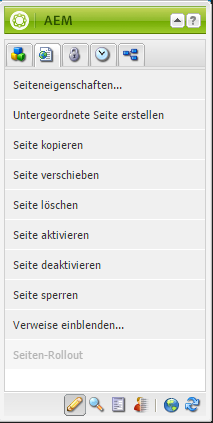

# Bearbeiten: Umgebung und Tools{#authoring-the-environment-and-tools}

Die Autorenumgebung von AEM bietet verschiedene Mechanismen für das Organisieren und Bearbeiten von Inhalten. Die verfügbaren Tools können über verschiedene Konsolen und Seiteneditoren aufgerufen werden.

## Site-Administration {#site-administration}

Die **Websites-Konsole** ermöglicht es Ihnen, Ihre Website zu verwalten und darin zu navigieren. Sie besteht aus zwei Bereichen, durch die Sie die Struktur der Website erweitern und das gewünschte Element bearbeiten können.

## Bearbeiten des Seiteninhalts {#editing-your-page-content}

Es gibt einen separaten Seiteneditor in der klassischen Benutzeroberfläche, der die Inhaltssuche und den Sidekick verwendet:

`http://localhost:4502/cf#/content/geometrixx/en/products/triangle.html`

## Aufrufen der Hilfe {#accessing-help}

Verschiedene **Hilfequellen** können direkt aus AEM aufgerufen werden:

Neben dem Zugriff auf die Hilfe [über die Konsolensymbolleisten](/help/sites-classic-ui-authoring/author-env-basic-handling.md#accessing-help) können Sie auch den Sidekick verwenden (anhand des Symbols „?“), wenn Sie eine Seite bearbeiten:

Sie können auch die Schaltfläche **Hilfe** im Bearbeitungsdialogfeld bestimmter Komponenten verwenden. Hierbei wird kontextsensitive Hilfe angezeigt.

## Sidekick {#sidekick}

Auf der Registerkarte **Komponenten** im Sidekick können Sie die Komponenten durchsuchen, die Sie der aktuellen Seite hinzufügen können. Sie können die gewünschte Gruppe erweitern und anschließend eine Komponente an die gewünschte Position auf der Seite ziehen.

## Der Content Finder {#the-content-finder}

Der Content Finder bietet eine schnelle und einfache Möglichkeit, beim Bearbeiten einer Seite nach Assets und/oder Inhalten im Repository zu suchen.

Sie können die Inhaltssuche verwenden, um eine Reihe von Ressourcen zu ermitteln. Anschließend können Sie ein Element bei Bedarf per Drag-and-Drop auf einen Absatz ihrer Seite ziehen:

* [Bilder](#finding-images)
* [Dokumente](#finding-documents)
* [Filme](#finding-movies)
* [Dynamic Media-Browser](/help/sites-administering/scene7.md#scene7contentbrowser)
* [Seiten](/help/sites-classic-ui-authoring/classic-page-author-env-tools.md#finding-pages)
* [Absätze](#referencing-paragraphs-from-other-pages)
* [Produkte](/help/sites-classic-ui-authoring/classic-page-author-env-tools.md#products)
* Oder um [die Website gemäß der Repository-Struktur zu durchsuchen](#the-content-finder)

Mit allen Optionen können Sie [nach bestimmten Elementen suchen](#the-content-finder).

### Finding Images {#finding-images}

Auf dieser Registerkarte sind alle Bilder aufgelistet, die im Repository gespeichert sind.

Nachdem Sie einen Absatz des Typs „Bild“ auf einer Seite erstellt haben, können Sie ein Element auf den Absatz ziehen und dort ablegen.

### Finding Documents {#finding-documents}

Auf dieser Registerkarte sind alle Dokumente aufgelistet, die im Repository gespeichert sind.

Nachdem Sie einen Absatz des Typs „Download“ auf einer Seite erstellt haben, können Sie ein Element auf den Absatz ziehen und dort ablegen.

### Finding Movies {#finding-movies}

In dieser Registerkarte werden sämtliche Filme im Repository aufgeführt (z. B. Flash-Elemente).

Nachdem Sie einen geeigneten Absatz (z. B. „Flash“) auf einer Seite erstellt haben, können Sie ein Element auf den Absatz ziehen und dort ablegen.

### Produkte {#products}

In dieser Registerkarte werden sämtliche Produkte aufgeführt. Nachdem Sie einen geeigneten Absatz (z. B. „Produkt“) auf einer Seite erstellt haben, können Sie ein Element auf den Absatz ziehen und dort ablegen.

### Suchen nach Seiten {#finding-pages}

Auf dieser Registerkarte werden alle Seiten angezeigt. Doppelklicken Sie auf eine beliebige Seite, um sie zur Bearbeitung zu öffnen.

### Referencing Paragraphs from other Pages {#referencing-paragraphs-from-other-pages}

Auf dieser Registerkarte können Sie nach anderen Seiten suchen. Alle Absätze der betreffenden Seite werden aufgelistet. Anschließend können Sie einen Absatz auf die aktuelle Seite ziehen. Dadurch wird ein Verweis auf den ursprünglichen Absatz erstellt.

### Verwenden der Repository-Gesamtansicht {#using-the-full-repository-view}

Auf dieser Registerkarte sind alle Ressourcen aufgelistet, die im Repository gespeichert sind.

### Suche mithilfe des Inhalt-Browsers {#using-search-with-the-content-browser}

Bei allen Optionen können Sie nach bestimmten Elementen suchen. Alle Tags oder Ressourcen, die die Suchkriterien erfüllen, werden aufgeführt:

Sie können auch Platzhalter für die Suche verwenden. Folgende Platzhalter werden unterstützt:

* `*` - entspricht einer Sequenz mit null oder mehr Zeichen.

* `?` - entspricht einem einzelnen Zeichen.

>[!NOTE]
>
>Es gibt eine Pseudoeigenschaft „name“, die für Platzhalter-Suchen verwendet werden muss.

Wenn z. B. ein Bild mit folgendem Namen verfügbar ist:

`ad-nmvtis.jpg`

wird dies mit dem folgenden Suchmuster gefunden (und ebenso alle anderen Bilder, die dem Muster entsprechen):

* `name:*nmv*`
* `name:AD*` - beim Zeichenabgleich wird *nicht* zwischen Groß- und Kleinschreibung unterschieden.
* `name:ad?nm??is.*` - Sie können eine beliebige Anzahl von Platzhaltern in einer Abfrage verwenden.

>[!NOTE]
>
>Sie können auch die Suche [SQL2](https://helpx.adobe.com/experience-manager/6-4/sites/developing/using/reference-materials/javadoc/org/apache/jackrabbit/commons/query/sql2/package-summary.html) verwenden.

## Anzeigen von Verweisen {#showing-references}

In AEM können Sie die Seiten anzeigen, die mit der derzeit bearbeiteten Seite verknüpft sind.

So zeigen Sie direkte Seitenverweise an:

1. Wählen Sie im Sidekick das Registerkartensymbol **Seite** aus.

   

1. Wählen Sie **Verweise anzeigen...** AEM öffnet das Fenster &quot;Verweise&quot;und zeigt an, welche Seiten auf die ausgewählte Seite verweisen, einschließlich der Pfade.

   

In bestimmten Situationen sind weitere Aktionen im Sidekick verfügbar:

* [Launches](/help/sites-classic-ui-authoring/classic-launches.md)
* [Live Copies](/help/sites-administering/msm.md)

* [Blueprint](/help/sites-administering/msm-best-practices.md)

Auf der Websites-Konsole sind weitere [Seitenbeziehungen](/help/sites-classic-ui-authoring/author-env-basic-handling.md#page-information-on-the-websites-console) zu sehen.

## Auditprotokoll  {#audit-log}

Das **Auditprotokoll** kann über die Registerkarte **Informationen** im Sidekick aufgerufen werden. Dort werden die kürzlich durchgeführten Aktionen für die aktuelle Seite aufgeführt. Beispiel:

## Seiteninformationen {#page-information}

Die Website-Konsole [enthält auch Informationen zum aktuellen Status der Seite](/help/sites-classic-ui-authoring/author-env-basic-handling.md#page-information-on-the-websites-console), z. B. Veröffentlichung, Änderung, gesperrt, Live Copy usw.

## Seitenmodi  {#page-modes}

Beim Bearbeiten einer Seite in der klassischen Benutzeroberfläche können Sie verschiedene Modi über die Symbole unten im Sidekick aufrufen:

Die Reihe von Symbolen am unteren Rand des Sidekick wird verwendet, um den Bearbeitungsmodus für Seiten umzuschalten:

* [Bearbeiten](/help/sites-classic-ui-authoring/classic-page-author-edit-mode.md)

   Dies ist der Standardmodus und ermöglicht die Bearbeitung der Seite durch Hinzufügen oder Entfernen von Komponenten sowie andere Änderungen.

* [Vorschau](/help/sites-classic-ui-authoring/classic-page-author-edit-content.md#previewing-pages)

   In diesem Modus können Sie eine Seite in der finalen Form betrachten, in der sie auf der Website erscheint.

* [Design](/help/sites-classic-ui-authoring/classic-page-author-design-mode.md#main-pars-procedure-0)

   :
In diesem Modus können Sie das Design der Seite bearbeiten, indem Sie die verfügbaren Komponenten konfigurieren.

>[!NOTE]
>
>Es sind weitere Optionen verfügbar:
>
>* [Strukturvorlage](/help/sites-classic-ui-authoring/classic-feature-scaffolding.md)
* [ClientContext](/help/sites-administering/client-context.md)
* Websites - öffnet die Konsole „Websites“.
* Neu laden - aktualisiert die Seite.

## Tastaturbefehle {#keyboard-shortcuts}

Für die Bedienung stehen verschiedene [Tastaturbefehle](/help/sites-classic-ui-authoring/classic-page-author-keyboard-shortcuts.md) zur Verfügung.
