# Rich-Text-Editor{#rich-text-editor}

>[!CAUTION]
>
>AEM 6.4 hat das Ende der erweiterten Unterstützung erreicht und diese Dokumentation wird nicht mehr aktualisiert. Weitere Informationen finden Sie in unserer [technische Unterstützung](https://helpx.adobe.com/de/support/programs/eol-matrix.html). Unterstützte Versionen suchen [here](https://experienceleague.adobe.com/docs/?lang=de).

Der Rich-Text-Editor ist ein grundlegender Baustein für die Eingabe von Textinhalten in AEM. Sie können verschiedene Komponenten erstellen, einschließlich:

* Text
* Text Bild
* Tabelle

## Rich-Text-Editor {#rich-text-editor-2}

Das WYSIWYG-Bearbeitungsdialogfeld bietet eine große Bandbreite an Funktionen:

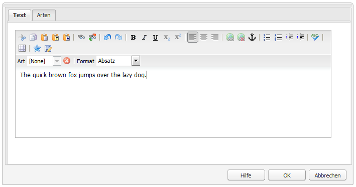

>[!NOTE]
>
>Welche Funktionen verfügbar sind, richtet sich nach dem jeweiligen Projekt. Ihre spezielle Installation kann also Abweichungen aufweisen.

## Bearbeiten im Kontext {#in-place-editing}

Zusätzlich zum Dialogfeldbasierten Rich-Text-Bearbeitungsmodus bietet AEM auch den integrierten Bearbeitungsmodus, der die direkte Bearbeitung des Texts ermöglicht, wie er im Layout der Seite angezeigt wird.

Klicken Sie zweimal auf einen Absatz (langsamer Doppelklick), um in den Bearbeitungsmodus für den Kontext zu wechseln (der Komponentenrahmen ist jetzt orange).

Sie können nun den Text direkt auf der Seite bearbeiten, anstatt ein Dialogfenster aufrufen zu müssen. Nehmen Sie einfach Ihre Änderungen vor und sie werden automatisch gespeichert.

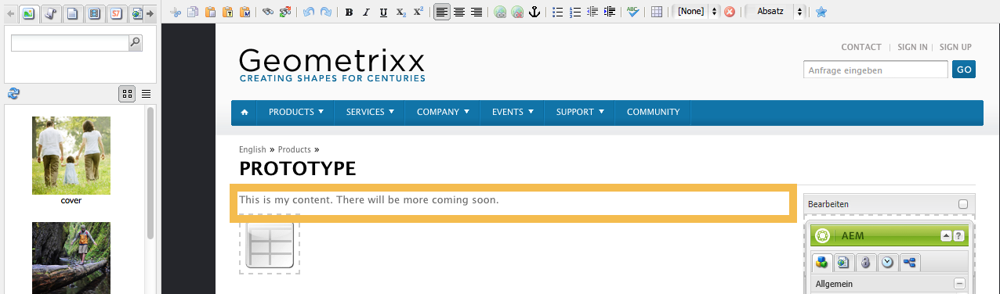

>[!NOTE]
>
>Wenn Sie den Content Finder geöffnet haben, wird oben auf der Registerkarte eine Symbolleiste mit den RTE-Formatierungsoptionen angezeigt (wie oben).
>
>Wenn der Content Finder nicht geöffnet ist, wird die Symbolleiste nicht angezeigt.

Derzeit ist der Modus Bearbeitung im Kontext für Seitenelemente aktiviert, die von der **Text** und **Titel** Komponenten.

>[!NOTE]
>
>Die **Titel**-Komponente wurde konzipiert, um kurzen Text ohne Zeilenumbrüche zu enthalten. Wenn Sie einen Titel im Kontext-Bearbeitungsmodus bearbeiten, wird durch die Eingabe eines Zeilenumbruchs ein neuer **Text** -Komponente unterhalb des Titels.

## Funktionen des Rich-Text-Editors {#features-of-the-rich-text-editor}

Der Rich-Text-Editor bietet verschiedene Funktionen, die [von der Konfiguration](/help/sites-administering/rich-text-editor.md) der einzelnen Komponente abhängen. Die Funktionen sind sowohl für die Touch-optimierte als auch für die klassische Benutzeroberfläche verfügbar.

### Grundlegende Zeichenformate {#basic-character-formats}

Hier können Sie die Formatierung auf ausgewählte (hervorgehobene) Zeichen anwenden. Einige Optionen verfügen auch über Tastenkombinationen:

* Fett (Strg+B)
* Kursiv (Strg+I)
* Unterstreichen (Strg+U)
* Tiefgestellt
* Hochgestellt

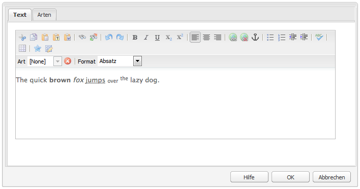

Alle fungieren als Umschalter, sodass bei einer erneuten Auswahl das Format entfernt wird.

### Vordefinierte Stile und Formate {#predefined-styles-and-formats}

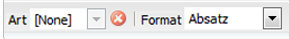

Ihre Installation kann vordefinierte Stile und Formate enthalten. Diese sind mit der Variablen **Stil** und **Format** Dropdown-Listen aus und können auf Text angewendet werden, den Sie ausgewählt haben.

Ein Stil kann auf eine bestimmte Zeichenfolge angewendet werden (ein Stil entspricht CSS):

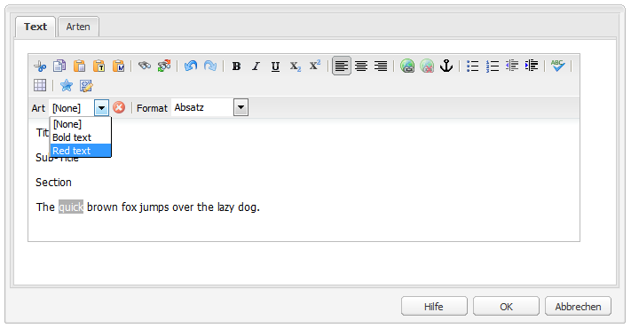

Ein Format hingegen wird auf einen gesamten Textabsatz angewendet (Formate sind HTML-basiert):

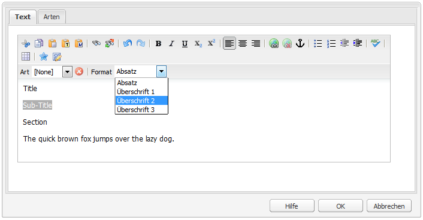

Ein bestimmtes Format kann nur geändert werden (die Standardeinstellung ist **Absatz**).

Ein Stil kann entfernt werden. Platzieren Sie den Cursor in den Text, auf den der Stil angewendet wurde, und klicken Sie auf das Symbol zum Entfernen:

>[!CAUTION]
>
>Wählen Sie keinen Text erneut aus, auf den der Stil angewendet wurde oder das Symbol deaktiviert wird.

### Ausschneiden, Kopieren, Einfügen {#cut-copy-paste}

Die Standardfunktionen von **Ausschneiden** und **Kopieren** verfügbar sind. Verschiedene Aromen von **Einfügen** für unterschiedliche Formate bereitgestellt werden.

* Ausschneiden (**Strg+X**)
* Kopieren (**Strg+C**)
* Einfügen

   Dies ist der standardmäßige Einfügemechanismus (**Strg+V**) für die Komponente; Wenn nativ installiert, ist dies auf &quot;Aus Word einfügen&quot;konfiguriert.

* Als Text einfügen

   Entfernt alle Stile und Formatierungen, um nur den Nur-Text einzufügen.

* Aus Word einfügen

   Dadurch wird der Inhalt als HTML eingefügt (mit einigen erforderlichen Neuformatierungen).

### Rückgängig, Wiederherstellen {#undo-redo}

AEM speichert die jeweils letzten 50 Aktionen in der aktuellen Komponente in chronologischer Reihenfolge. Diese Aktionen können bei Bedarf in strikter Reihenfolge rückgängig gemacht (und dann wiederholt) werden.

>[!CAUTION]
>
>Der Bearbeitungsverlauf wird nur für die aktuelle Bearbeitungssitzung beibehalten. Er wird jedes Mal neu gestartet, wenn Sie die Komponente zur Bearbeitung öffnen.

>[!NOTE]
>
>Fünfzig ist die Standardanzahl der Aufgaben. Dies kann für Ihre Installation anders sein.

### Ausrichtung {#alignment}

Ihr Text kann entweder links, zentriert oder rechts ausgerichtet sein.

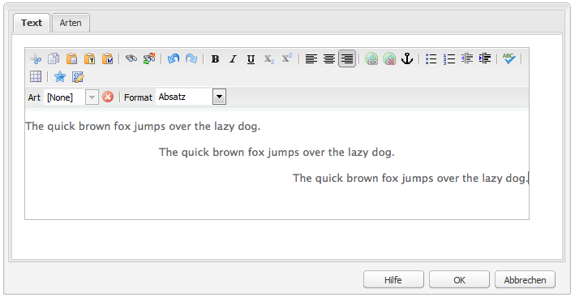

### Einzug {#indentation}

Der Einzug eines Absatzes kann erhöht oder verringert werden. Der ausgewählte Absatz wird eingerückt, jeder neue eingegebene Text behält den aktuellen Einzug bei.

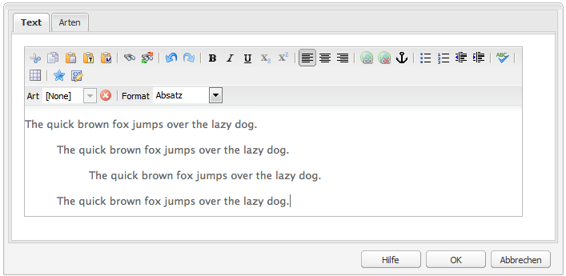

### Listen {#lists}

In Ihrem Text können sowohl Listen mit Aufzählungszeichen als auch nummerierte Listen erstellt werden. Wählen Sie entweder den Listentyp aus und beginnen Sie mit der Eingabe oder markieren Sie den zu konvertierenden Text. In beiden Fällen startet ein Zeilenfeed ein neues Listenelement.

Verschachtelte Listen können durch Einrücken eines oder mehrerer Listenelemente erreicht werden.

Der Stil einer Liste kann geändert werden, indem Sie einfach den Cursor in der Liste platzieren und dann den anderen Stil auswählen. Eine Unterliste kann auch einen anderen Stil haben als die übergeordnete Liste. Dies kann angewendet werden, sobald die Unterliste erstellt wurde (durch Einzug).

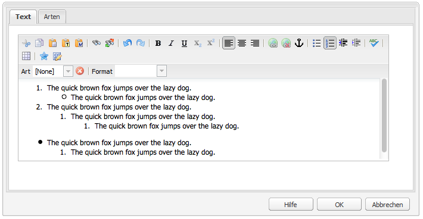

### Links {#links}

Ein Link zu einer URL (entweder innerhalb Ihrer Website oder an einem externen Ort) wird durch Hervorhebung des erforderlichen Texts und anschließendes Klicken auf **Hyperlink** Symbol:

Daraufhin wird ein Dialogfeld angezeigt, in dem Sie die Ziel-URL angeben können, außerdem ob sie in einem neuen Fenster geöffnet werden soll.

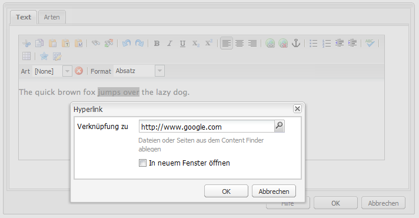

Sie haben folgende Möglichkeiten:

* Direktes Eingeben eines URI
* Verwenden Sie die Sitemap, um eine Seite innerhalb Ihrer Website auszuwählen.
* Geben Sie den URI ein und hängen Sie dann den Ziel-Anker an. z. B. `www.TargetUri.org#AnchorName`
* nur einen Anker eingeben (um auf &quot;die aktuelle Seite&quot;zu verweisen); z. B. `#anchor`
* Suchen nach einer Seite im Content Finder, ziehen Sie das Seitensymbol per Drag-and-Drop in das Dialogfeld &quot;Hyperlink&quot;

>[!NOTE]
>
>Der URI kann jedes der Protokolle vorangestellt werden, die für die jeweilige Installation konfiguriert sind. Bei einer Standardinstallation sind dies `https://`, `ftp://` und `mailto:`. Protokolle, die nicht für Ihre Installation konfiguriert sind, werden zurückgewiesen und als ungültig markiert.

Um den Hyperlink zu entfernen, klicken Sie auf eine beliebige Stelle innerhalb des Link-Texts und klicken Sie auf das Symbol **Verknüpfung aufheben**:

### Anker {#anchors}

Ein Anker kann an einer beliebigen Stelle innerhalb des Textes erstellt werden, indem Sie entweder den Cursor platzieren oder Text auswählen. Klicken Sie dann auf die **Anker** -Symbol, um das Dialogfeld zu öffnen.

Geben Sie den Namen des Ankers ein und klicken Sie auf **OK** speichern.

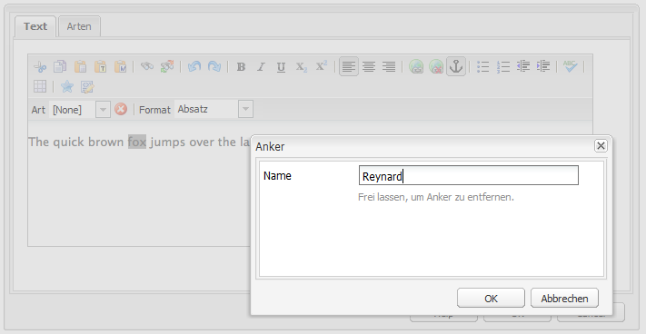

Der Anker wird beim Bearbeiten der Komponente angezeigt und kann nun als Sprungziel für Links verwendet werden.

### Suchen und Ersetzen {#find-and-replace}

AEM bietet sowohl eine **Suchen** und **Ersetzen** (Suchen und Ersetzen) verwenden.

Bei beiden Funktionen ermöglicht die Schaltfläche **Weitersuchen** die Suche nach dem angegebenen Text innerhalb der geöffneten Komponente. Sie können auch angeben, ob eine Übereinstimmung mit der Groß-/Kleinschreibung (oben/unten) erforderlich ist.

Die Suche beginnt immer an der aktuellen Cursorposition im Text. Wenn das Ende der Komponente erreicht ist, werden Sie in einer Meldung darüber informiert, dass der nächste Suchvorgang von oben gestartet wird.

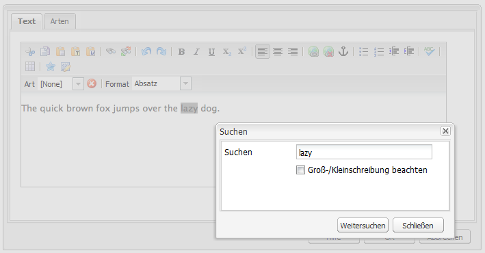

Mit der Option **Ersetzen** können Sie **Suchen** und dann **Ersetzen** auf eine einzelne Instanz des angegebenen Texts oder **Alles ersetzen** auf alle Instanzen des angegebenen Texts innerhalb der aktuellen Komponente anwenden.

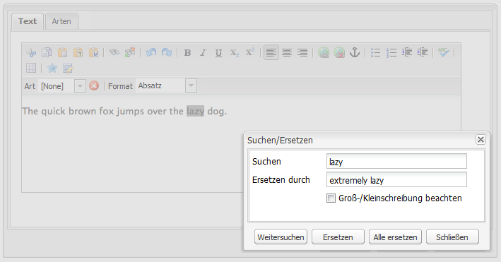

### Bilder {#images}

Bilder können aus der Inhaltssuche gezogen werden, um sie zum Text hinzuzufügen.

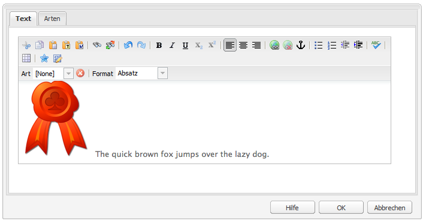

>[!NOTE]
>
>AEM bietet auch spezielle Komponenten für eine detailliertere Bildkonfiguration. Beispielsweise stehen Ihnen die Komponenten **Bild** und **Textbild** zur Verfügung.

### Rechtschreibprüfung {#spelling-checker}

Die Rechtschreibprüfung überprüft den gesamten Text innerhalb der aktuellen Komponente.

Alle falschen Schreibweisen werden hervorgehoben:

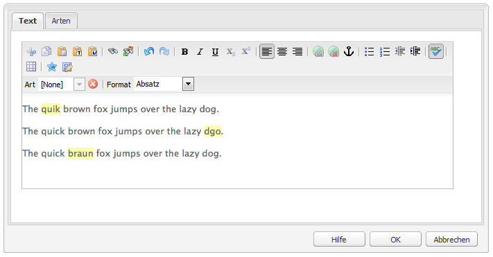

>[!NOTE]
>
>Die Rechtschreibprüfung erfolgt in der Sprache der Website. Dazu wird entweder die Spracheigenschaft der Unterstruktur übernommen oder die Sprache aus der URL extrahiert. Beispielsweise erfolgt die Prüfung für den Zweig `en` in Englisch und für den Zweig `de` in Deutsch.

### Tabellen {#tables}

Tabellen sind sowohl verfügbar als auch:

* Als **Verzeichnis** component

   

* Innerhalb der Komponente **Text**

   

   >[!NOTE]
   >
   >Obwohl im RTE keine Tabellen verfügbar sind, empfiehlt es sich, beim Erstellen von Tabellen die Komponente **Tabelle** zu verwenden.

Sowohl in der Komponente **Text** als auch in der Komponente **Tabelle** sind die Tabellenoptionen über das Kontextmenü verfügbar, das in der Regel durch Klicken mit der rechten Maustaste auf die Tabelle aufgerufen wird. Beispiel:

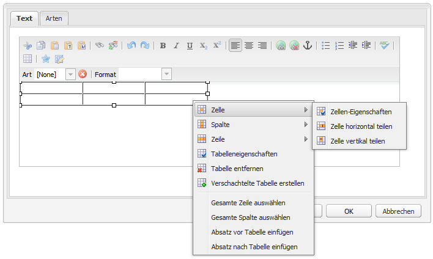

>[!NOTE]
>
>Im **Verzeichnis** -Komponente ist eine spezielle Symbolleiste verfügbar, die verschiedene standardmäßige Rich-Text-Editor-Funktionen sowie eine Untergruppe tabellenspezifischer Funktionen umfasst.

Die tabellenspezifischen Funktionen sind:

<table> 
 <tbody> 
  <tr> 
   <td><a href="#table-properties">Tabelleneigenschaften</a>  </td> 
  </tr> 
  <tr> 
   <td><a href="#cell-properties">Zelleneigenschaften  </a></td> 
  </tr> 
  <tr> 
   <td><a href="#add-or-delete-rows">Zeilen hinzufügen oder löschen  </a></td> 
  </tr> 
  <tr> 
   <td><a href="#add-or-delete-columns">Spalten hinzufügen oder löschen  </a></td> 
  </tr> 
  <tr> 
   <td><a href="#selecting-entire-rows-or-columns">Ganze Zeilen oder Spalten auswählen  </a></td> 
  </tr> 
  <tr> 
   <td><a href="#merge-cells">Zellen verbinden  </a></td> 
  </tr> 
  <tr> 
   <td><a href="#split-cells">Zellen teilen  </a></td> 
  </tr> 
  <tr> 
   <td><a href="#creating-nested-tables">Verschachtelte Tabellen</a></td> 
  </tr> 
  <tr> 
   <td><a href="#remove-table">Tabelle entfernen</a> </td> 
  </tr> 
 </tbody> 
</table>

#### Tabelleneigenschaften {#table-properties}

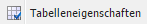

Sie können die grundlegenden Eigenschaften der Tabelle angeben und dann auf **OK** klicken, um die Angaben zu speichern:

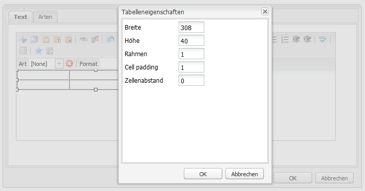

* **Breite**

   Die Gesamtbreite der Tabelle.

* **Höhe**

   Die Gesamthöhe der Tabelle.

* **Rahmen**

   Die Größe des Tabellenrahmens.

* **Textabstand**

   Dadurch wird der Leerraum zwischen dem Zelleninhalt und den Rändern definiert.

* **Zellenabstand**

   Dies definiert den Abstand zwischen den Zellen.

>[!NOTE]
>
>**Breite**, **Höhe** und bestimmte Zelleneigenschaften können definiert werden in:
>
>* Pixel
>* Prozentsätze

>[!CAUTION]
>
>Adobe empfiehlt dringend, eine **Breite** für Ihren Tisch.

#### Zelleneigenschaften {#cell-properties}

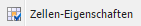

Die Eigenschaften einer Zelle bzw. einer Reihe von Zellen können konfiguriert werden:

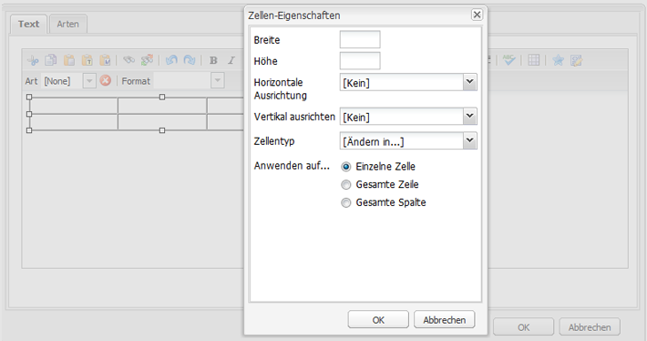

* **Breite**
* **Höhe**
* **Horizontale Ausrichtung**: Links, Mitte oder rechts
* **Vertikale Ausrichtung**: Oben, Mitte, unten oder Grundlinie
* **Zellentyp**: Daten oder Kopfzeile
* **Anwenden auf:**
   * Einzelne Zelle
   * Gesamte Zeile
   * Gesamte Spalte

#### Zeilen hinzufügen oder löschen {#add-or-delete-rows}

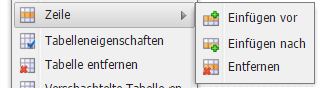

Zeilen können entweder über oder unter der aktuellen Zeile hinzugefügt werden.

Die aktuelle Zeile kann ebenfalls gelöscht werden.

#### Hinzufügen oder Löschen von Spalten {#add-or-delete-columns}

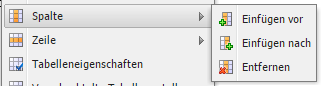

Spalten können entweder links oder rechts von der aktuellen Spalte hinzugefügt werden.

Die aktuelle Spalte kann ebenfalls gelöscht werden.

#### Auswählen ganzer Zeilen oder Spalten {#selecting-entire-rows-or-columns}

Dadurch wird die gesamte Zeile bzw. Spalte ausgewählt. Anschließend sind spezifische Aktionen (z. B. Zusammenführen) verfügbar.

#### Zusammenführen von Zellen {#merge-cells}

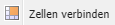 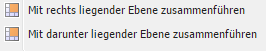

* Wenn Sie eine Gruppe von Zellen ausgewählt haben, können Sie diese zu einer Gruppe zusammenführen.
* Wenn Sie nur eine Zelle ausgewählt haben, können Sie sie mit der Zelle rechts oder darunter zusammenführen.

#### Teilen von Zellen {#split-cells}

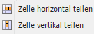

Wählen Sie eine einzelne Zelle aus, um sie zu teilen:

* Wenn Sie eine Zelle horizontal teilen, wird eine neue Zelle rechts neben der aktuellen Zelle in der aktuellen Spalte generiert.
* Wenn Sie eine Zelle vertikal aufteilen, wird eine neue Zelle unter der aktuellen Zelle, jedoch innerhalb der aktuellen Zeile generiert.

#### Erstellen verschachtelter Tabellen {#creating-nested-tables}

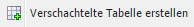

Durch Erstellen einer verschachtelten Tabelle wird eine neue, eigenständige Tabelle innerhalb der aktuellen Zelle erstellt.

>[!NOTE]
>
>Bestimmte zusätzliche Verhaltensweisen sind vom Browser abhängig:
>
>* Windows IE: Verwenden Sie Strg+primäre Maustaste (normalerweise linke Maustaste), um mehrere Zellen auszuwählen.
>* Firefox: Ziehen Sie die Maus, um einen Zellenbereich auszuwählen.
>

#### Tabelle entfernen {#remove-table}

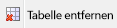

Dadurch wird die Tabelle aus dem **Text** -Komponente.

### Sonderzeichen {#special-characters}

Sonderzeichen können Ihrem Rich-Text-Editor zur Verfügung gestellt werden. Diese können je nach Installation variieren.

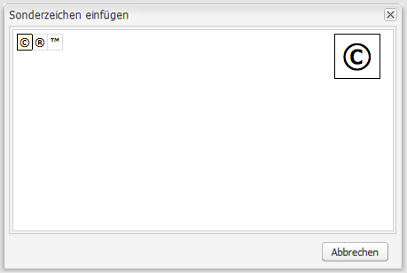

Verwenden Sie den Mauszeiger, um eine vergrößerte Version des Zeichens anzuzeigen, und klicken Sie dann auf , um es an der aktuellen Position in Ihrem Text einzuschließen.

### Quellbearbeitungsmodus {#source-editing-mode}

Im Quellbearbeitungsmodus können Sie die zugrunde liegende HTML der Komponente anzeigen und bearbeiten.

Der Text:

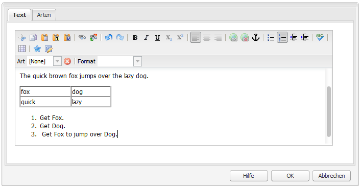

Im Quellmodus hat dieser Text folgende Gestalt (oft ist der HTML-Quelltext wesentlich länger und Sie müssen einen Bildlauf durchführen):

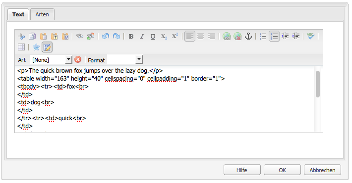

>[!CAUTION]
>
>Beim Verlassen des Quellmodus führt AEM bestimmte Prüfungen durch (z. B. ob der Text ordnungsgemäß in Blöcken enthalten bzw. verschachtelt ist). Dies kann zu Änderungen an Ihren Bearbeitungen führen.
