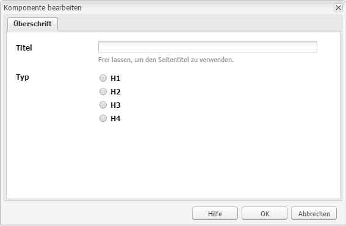
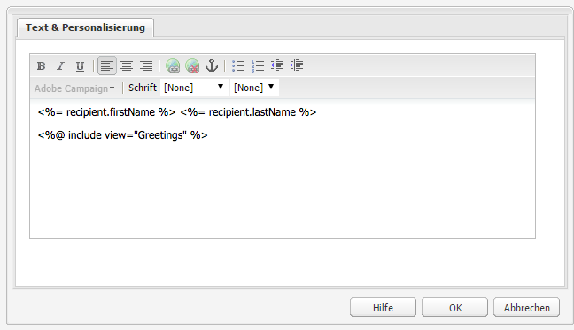
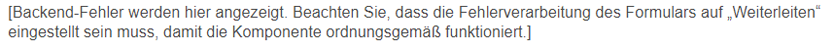
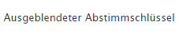
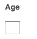
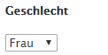

# Adobe Campaign-Komponenten{#adobe-campaign-components}

>[!CAUTION]
>
>AEM 6.4 hat das Ende der erweiterten Unterstützung erreicht und diese Dokumentation wird nicht mehr aktualisiert. Weitere Informationen finden Sie in unserer [technische Unterstützung](https://helpx.adobe.com/de/support/programs/eol-matrix.html). Unterstützte Versionen suchen [here](https://experienceleague.adobe.com/docs/?lang=de).

Wenn Sie eine Integration mit Adobe Campaign durchführen, stehen Ihnen Komponenten für die Arbeit mit Newslettern und Formularen zur Verfügung. Beide werden in diesem Dokument beschrieben.

## Adobe Campaign-Newsletter-Komponenten {#adobe-campaign-newsletter-components}

Folgen Sie in den Campaign-Komponenten den Best Practices, die Sie unter [Best Practices für E-Mail-Vorlagen](/help/sites-administering/best-practices-for-email-templates.md) finden und die auf der Adobe-Markup-Sprache [HTL](https://helpx.adobe.com/de/experience-manager/htl/using/overview.html) basieren.

Wenn Sie eine E-Mail oder einen Newsletter öffnen, der oder die für die Integration mit Adobe Campaign konfiguriert wurde, werden Ihnen im Abschnitt **Adobe Campaign-Newsletter** folgende Optionen angezeigt:

* Überschrift (Kampagne)
* Bild (Kampagne)
* Link (Kampagne)
* Scene7-Bildvorlage (Kampagne)
* Zielgerichteter Verweis (Campaign)
* Text und Bild (Kampagne).
* Text und Personalisierung (Kampagne)

Eine Beschreibung dieser Komponenten finden Sie im folgenden Abschnitt.

### Überschrift (Kampagne) {#heading-campaign}

Die Überschriftenkomponente kann entweder:

* Den Namen der aktuellen Seite anzeigen, indem Sie die **Titel** Feld leer.
* Anzeigen von Text, den Sie im **Titel** -Feld.

Sie bearbeiten die **Überschrift (Kampagne)** direkt. Frei lassen, um den Seitentitel zu verwenden.

Sie können Folgendes konfigurieren:

* **Titel**
Wenn Sie einen anderen Namen als den Seitentitel verwenden möchten, geben Sie ihn hier ein.

* **Überschriftenebene (1, 2, 3, 4)**
Die Überschriftenebene basierend auf der HTML-Überschriftgröße (1–4).

Im folgenden Beispiel sehen Sie, wie die Komponente „Überschrift (Kampagne)“ dargestellt wird.

### Bild (Kampagne) {#image-campaign}

Die image-Komponente (Kampagne) zeigt ein Bild und begleitenden Text gemäß den angegebenen Parametern an.

Sie können ein Bild hochladen und es dann bearbeiten (z. B. zuschneiden, drehen, Link/Titel/Text hinzufügen).

Sie können ein Bild hochladen und dieses anschließend bearbeiten und manipulieren (beispielsweise zuschneiden, drehen oder Links/Titel/Text hinzufügen). Sie können ein Bild entweder per Drag-and-Drop aus dem [Content Finder](/help/sites-authoring/author-environment-tools.md#thecontentfinderclassicui) direkt auf die Komponente oder deren Dialogfeld &quot;Bearbeiten&quot;klicken. Sie können auch in den zentralen Bereich des Dialogfelds &quot;Bearbeiten&quot;doppelklicken, um Ihr lokales Dateisystem zu durchsuchen und ein Bild hochzuladen. Die beiden Registerkarten des Bearbeitungsdialogfelds steuern auch alle Definitionen und Bearbeitungen des Bildes:

Wenn ein Bild geladen wird, können folgende Konfigurationen durchgeführt werden:

* **Zuweisen**
Wählen Sie „Zuweisen“ aus, um ein Bild zuzuweisen. Sie legen fest, wie die Imagemap (Rechteck, Polygon usw.) erstellt werden soll, und geben an, worauf der Bereich verweisen soll.

* **Zuschneiden**
Wählen Sie „Zuschneiden“ aus, um ein Bild zuzuschneiden. Verwenden Sie die Maus, um das Bild zuzuschneiden.

* **Drehen**
Wählen Sie „Drehen“ aus, um ein Bild zu drehen. Wiederholen Sie das Drehen so lange, bis das Bild die gewünschte Ausrichtung hat.

* **Entfernen**
Damit entfernen Sie das aktuelle Bild.

* Zoomleiste (nur klassisch)

   Verwenden Sie den Regler unter dem Bild (und über den Schaltflächen „OK“ und „Abbrechen“), um das Bild ein- und auszuzoomen.

* **Titel**

   Der Titel des Bildes.

* **Alt-Text**

   Ein alternativer Text, der beim Erstellen barrierefreier Inhalte verwendet wird.

* **Verknüpfung zu**

   Erstellt einen Link zu Assets oder anderen Seiten innerhalb Ihrer Website.

* **Beschreibung**

   Eine Beschreibung des Bildes.

* **Größe**

   Legt die Höhe und Breite des Bildes fest.

>[!NOTE]
>
>Sie müssen im Feld **ALT-Text** der Registerkarte **Erweitert** Informationen eingeben, da das Bild sonst nicht gespeichert werden kann und die folgende Fehlermeldung ausgegeben wird:
>
>`Validation failed. Verify the values of the marked fields.`

Im folgenden Beispiel sehen Sie, wie die Komponente „Bild (Kampagne)“ dargestellt wird.

### Link (Kampagne) {#link-campaign}

Mit der Komponente Link (Kampagne) können Sie einen Link zu Ihrem Newsletter hinzufügen. Diese Komponente ist nur in der klassischen Benutzeroberfläche verfügbar. Sie können jedoch eine Komponente in der Touch-optimierten Benutzeroberfläche hinzufügen und sie im Kompatibilitätsmodus öffnen.

Folgendes können Sie in den Registerkarten **Anzeige**, **URL-Info** oder **Erweitert** konfigurieren:

* **Verknüpfungsbeschriftung**
Die Beschriftung des Links. Dies ist der Text, der den Benutzern angezeigt wird.

* **Link-QuickInfo**
Mit dieser Option werden weitere Informationen zur Verwendung des Links hinzugefügt.

* **LinkType**
Wählen Sie in der Dropdown-Liste zwischen 
**Benutzerdefinierte URL** und **Adaptives Dokument**. Dieses Feld ist obligatorisch. Wenn Sie &quot;Benutzerdefinierte URL&quot;auswählen, können Sie die Link-URL angeben. Wenn Sie Adaptives Dokument auswählen, können Sie den Dokumentpfad angeben.

* **Zusätzlicher URL-Parameter**
Fügen Sie weitere URL-Parameter hinzu. Klicken Sie auf „Element hinzufügen“, um mehrere Elemente hinzuzufügen.

>[!NOTE]
>
>Sie müssen im Feld **Verknüpfungstyp** auf der Registerkarte **URL-Info** Daten eingeben, da die Komponente sonst nicht gespeichert werden kann und folgende Fehlermeldung ausgegeben wird:
>
>`Validation failed. Verify the values of the marked fields.`

Im folgenden Beispiel sehen Sie, wie die Komponente „Link (Kampagne)“ dargestellt wird.

### Zielgerichteter Verweis (Campaign) {#targeted-reference-campaign}

Mit der Komponente Zielgerichteter Verweis (Kampagne) können Sie einen Verweis auf einen zielgerichteten Absatz erstellen.

In dieser Komponente navigieren Sie zum zielgerichteten Absatz, um ihn auszuwählen.

Klicken Sie auf das Dropdown-Menü, um zu dem Absatz zu navigieren, auf den Sie verweisen möchten. Klicken Sie abschließend auf **OK**.

### Text und Bild (Kampagne). {#text-image-campaign}

Die Komponente Text und Bild (Kampagne) fügt einen Textblock und ein Bild hinzu.

Wie bei den Komponenten „Text und Personalisierung (Kampagne)“ und „Bild (Kampagne)“ können Sie Folgendes konfigurieren:

* **Text**
Geben Sie einen Text ein. Verwenden Sie die Symbolleiste, um die Formatierung zu ändern, Listen zu erstellen und Links hinzuzufügen.

* **Bild**
Ziehen Sie ein Bild aus dem Content Finder oder klicken Sie, um zu einem Bild zu navigieren. Schneiden Sie es gegebenenfalls zu oder drehen Sie es.

* **Bildeigenschaften** (**Erweiterte Bildeigenschaften**)

   Dies ermöglicht die Festlegung des Folgenden:

   * **Titel**

      Der Titel des Blocks; angezeigt.

   * **Alt-Text**

      Alternativer Text, der angezeigt wird, wenn das Bild nicht dargestellt werden kann.

   * **Verknüpfung zu**

      Erstellt einen Link zu Assets oder anderen Seiten innerhalb Ihrer Website.

   * **Beschreibung**

      Eine Beschreibung des Bildes.

   * **Größe**

      Legt die Höhe und Breite des Bildes fest.

>[!NOTE]
>
>Das Feld **ALT-Text** auf der Registerkarte **Erweitert** muss ausgefüllt werden, da die Komponente anderenfalls nicht gespeichert werden kann und folgende Fehlermeldung ausgegeben wird:
>
>`Validation failed. Verify the values of the marked fields.`

Im folgenden Beispiel sehen Sie, wie die Komponente „Text und Bild (Kampagne)“ dargestellt wird.

### Text und Personalisierung (Kampagne) {#text-personalization-campaign}

Mit der Komponente „Text-und-Personalisierung (Kampagne)“ können Sie über einen WYSIWYG-Editor, dessen Funktionen der [Rich-Text-Editor](/help/sites-authoring/rich-text-editor.md) bereitstellt, einen Textblock eingeben. Darüber hinaus können Sie mit dieser Komponente die Kontextfelder und Personalisierungsblöcke verwenden, die in Adobe Campaign verfügbar sind. Siehe auch [Einfügen von Personalisierung](/help/sites-classic-ui-authoring/classic-personalization-ac-campaign.md#inserting-personalization).

Über mehrere Symbole können Sie den Text formatieren, darunter Schriftmerkmale, Ausrichtung, Links, Listen und Einzug.

Fügen Sie Text wie gewohnt im Rich-Text-Editor hinzu. Fügen Sie Personalisierung hinzu, indem Sie das Dropdown-Menü Adobe Campaign auswählen und die entsprechenden Felder auswählen.

Sie fügen die Text- und Kontextfelder oder Gestaltungsbausteine hinzu, um den Inhalt zu erstellen. Wählen Sie anschließend ClientContext aus, um die Daten in den Persona-Profilen zu testen. Nachdem Sie eine Persona ausgewählt haben, werden die Personalisierungsfelder automatisch durch Daten aus dem ausgewählten Profil ersetzt.

>[!NOTE]
>
>Nur die Felder, die im Schema **nms:seedMember** oder einer seiner Erweiterungen festgelegt wurden, werden berücksichtigt. Die Attribute der mit **nms:seedMember** verknüpften Tabellen stehen nicht zur Verfügung.

## Adobe Campaign-Formular-Komponenten {#adobe-campaign-form-components}

Sie verwenden Adobe Campaign-Komponenten, um ein Formular zu erstellen, das Benutzer ausfüllen, um entweder einen Newsletter zu abonnieren, sich von einem Newsletter abzumelden oder ihre Benutzerprofile zu aktualisieren.

Jedes Komponentenfeld kann mit einem Adobe Campaign-Datenbankfeld verknüpft werden. Die verfügbaren Felder unterscheiden sich je nach Datentyp, den sie enthalten, wie im Abschnitt beschrieben [Komponenten und Datentyp](#components-and-data-type). Wenn Sie Ihr Empfängerschema in Adobe Campaign erweitern, stehen die neuen Felder in den Komponenten zur Verfügung, deren Datentypen übereinstimmen.

Wenn Sie ein Formular öffnen, das für die Integration mit Adobe Campaign konfiguriert wurde, werden Ihnen im Abschnitt **Adobe Campaign** folgende Komponenten angezeigt:

* Kontrollkästchen (Kampagne)
* „Datumsfeld (Kampagne)“ und „Datumsfeld/HTML 5 (Kampagne)“
* Verschlüsselter Primärschlüssel (Kampagne)
* Fehleranzeige (Kampagne)
* Ausgeblendeter Abstimmschlüssel (Kampagne)
* Numerisches Feld (Kampagne)
* Optionsfeld (Kampagne)
* Abonnement-Checkliste (Kampagne)
* Textfeld (Kampagne)

In diesem Abschnitt werden die einzelnen Komponenten detailliert beschrieben.

### Komponenten und Datentyp {#components-and-data-type}

In der folgenden Tabelle werden die Komponenten beschrieben, die zum Anzeigen und Ändern von Adobe Campaign-Profildaten verfügbar sind. Jede Komponente kann einem Adobe Campaign-Profilfeld zugeordnet werden, um den zugehörigen Wert anzuzeigen und das Feld beim Senden des Formulars zu aktualisieren. Die verschiedenen Komponenten können nur Feldern eines entsprechenden Datentyps zugeordnet werden.

<table> 
 <tbody> 
  <tr> 
   <td>
<strong>Komponente</strong>
 </td> 
   <td>
<strong>Datentyp des Adobe Campaign-Felds</strong>
 </td> 
   <td>
<strong>Beispielfeld</strong>
 </td> 
  </tr> 
  <tr> 
   <td>
Kontrollkästchen (Kampagne)
 </td> 
   <td>
Boolean (Boolesch)
 </td> 
   <td>
No longer contact (by any channel)
 </td> 
  </tr> 
  <tr> 
   <td>
Datumsfeld (Kampagne)
 
Datumsfeld/HTML 5 (Kampagne)
 </td> 
   <td>
Datum
 </td> 
   <td>
Geburtsdatum
 </td> 
  </tr> 
  <tr> 
   <td>
Numerisches Feld (Kampagne)
 </td> 
   <td>
numerisch (byte, short, long, double)
 </td> 
   <td>
Alter
 </td> 
  </tr> 
  <tr> 
   <td>
Optionsfeld (Kampagne)
 </td> 
   <td>
Byte mit zugehörigen Werten
 </td> 
   <td>
Geschlecht
 </td> 
  </tr> 
  <tr> 
   <td>
Textfeld (Kampagne)
 </td> 
   <td>
Zeichenfolge
 </td> 
   <td>
E-Mail
 </td> 
  </tr> 
 </tbody> 
</table>

### Für die meisten Komponenten übliche Einstellungen {#settings-common-to-most-components}

Die Adobe Campaign-Komponenten verfügen über Einstellungen, die in allen Komponenten verwendet werden (mit Ausnahme der Komponenten &quot;Verschlüsselter Primärer Schlüssel&quot;und &quot;Ausgeblendeter Abstimmschlüssel&quot;).

In den meisten Komponenten können Sie Folgendes konfigurieren:

#### Titel und Text {#title-and-text}

* **Titel**

   Wenn Sie einen anderen Namen als den Elementnamen verwenden möchten, geben Sie ihn hier ein.

* **Titel ausblenden**

   Aktivieren Sie dieses Kontrollkästchen, wenn der Titel nicht sichtbar sein soll.

* **Beschreibung**

   Fügen Sie dem Feld eine Beschreibung hinzu, um weitere Informationen für Benutzer bereitzustellen.

* **Nur Wert anzeigen**

   Zeigt nur den Wert an, wenn einer vorhanden ist

#### Adobe Campaign {#adobe-campaign}

Sie können Folgendes konfigurieren:

* **Zuordnung**

   Wählen Sie gegebenenfalls ein Adobe Campaign-Personalisierungsfeld aus.

* **Abstimmschlüssel**

   Aktivieren Sie dieses Kontrollkästchen, wenn dieses Feld Teil des Abstimmschlüssels ist.

#### Beschränkungen {#constraints}

* **Erforderlich**

   Aktivieren Sie dieses Kontrollkästchen, um diese Komponente erforderlich zu machen. Das heißt, Benutzer müssen einen Wert eingeben.

* **Meldung: Erforderlich**

   Fügen Sie optional eine Meldung hinzu, dass das Feld erforderlich ist.

#### Stile {#styling}

* **CSS**

   Geben Sie die CSS-Klassen ein, die Sie für diese Komponente verwenden möchten.

### Kontrollkästchen (Kampagne) {#checkbox-campaign}

Mit der Komponente &quot;Kontrollkästchen (Kampagne)&quot;kann der Benutzer Adobe Campaign-Profilfelder ändern, die vom booleschen Datentyp sind. Beispielsweise könnte eine Komponente vom Typ Kontrollkästchen (Kampagne) vorhanden sein, mit der der Empfänger angeben kann, dass er über keinen Kanal kontaktiert werden möchte.

Sie können [Konfigurieren von Einstellungen, die für die meisten Adobe Campaign-Komponenten gelten](#settings-common-to-most-components) in der Komponente &quot;Kontrollkästchen (Kampagne)&quot;.

Das folgende Beispiel zeigt, wie eine Checkbox-Komponente (Kampagne) angezeigt wird.

### „Datumsfeld (Kampagne)“ und „Datumsfeld/HTML 5 (Kampagne)“ {#date-field-campaign-and-date-field-html-campaign}

Verwenden Sie das Datumsfeld, um Empfängern ein Datum zu ermöglichen. Sie können beispielsweise von den Empfängern verlangen, ihr Geburtsdatum anzugeben. Das Datumsformat entspricht dem Format, das in Ihrer Adobe Campaign-Instanz verwendet wird.

Neben den [von den meisten Adobe Campaign-Komponenten genutzten Einstellungen](#settings-common-to-most-components) können Sie auch Folgendes konfigurieren:

* **Einschränkungen - Einschränkungen** Dropdown

   Sie können auswählen: **Keines** oder **Datum** - um die Beschränkung eines Datums oder keine Beschränkung hinzuzufügen. Wählen Sie „Datum“ aus, müssen Benutzer ihre Angaben im Datumsformat machen.

* **Beschränkungsmeldung**

   Darüber hinaus können Sie eine Beschränkungsmeldung hinzufügen, damit Benutzer wissen, wie sie ihre Antworten richtig formatieren können.

* **Stil - Breite**

   Passen Sie die Breite des Felds an, indem Sie auf die **+** und **-** oder eine Zahl eingeben.

Im folgenden Beispiel sehen Sie, wie die Komponente „Datumsfeld (Kampagne)“ mit angepasster Breite angezeigt wird.

### Verschlüsselter Primärschlüssel (Kampagne) {#encrypted-primary-key-campaign}

Diese Komponente definiert den Namen des URL-Parameters, der die Kennung eines Adobe Campaign-Profils enthält (**Hauptressourcenkennung** oder **Verschlüsselter Primärschlüssel** in Adobe Campaign Standard bzw. 6.1).

Jedes Formular, in dem Adobe Campaign-Profildaten angezeigt und geändert werden **must** enthalten eine Komponente mit verschlüsseltem Primären Schlüssel .

Sie können Folgendes in der Komponente Verschlüsselter Primärer Schlüssel (Kampagne) konfigurieren:

* **Titel und Text - Elementname**

   Die Standardeinstellung ist encryptedPK. Sie müssen den Elementnamen nur ändern, wenn er mit dem Namen eines anderen Elements im Formular in Konflikt steht. Zwei Formularfelder dürfen nicht denselben Elementnamen haben.

* **Adobe Campaign - URL-Parameter**

   Fügen Sie den URL-Parameter für das EPK hinzu. Sie können beispielsweise den Wert **epk**.

Das folgende Beispiel zeigt die Anzeige der Komponente &quot;Verschlüsselter Primärer Schlüssel (Kampagne)&quot;.

### Fehleranzeige (Kampagne) {#error-display-campaign}

Mit dieser Komponente können Sie Backend-Fehler anzeigen. Die Fehlerbehandlung des Formulars muss auf &quot;Weiterleiten&quot;eingestellt sein, damit die Komponente ordnungsgemäß funktioniert.

Das folgende Beispiel zeigt, wie die Komponente Fehleranzeige (Kampagne) angezeigt wird.

### Ausgeblendeter Abstimmschlüssel (Kampagne) {#hidden-reconciliation-key-campaign}

Mit der Komponente „Ausgeblendeter Abstimmschlüssel (Kampagne)“ können Sie einem Formular ausgeblendete Felder als Teil des Abstimmschlüssels hinzuzufügen.

In der Komponente „Ausgeblendeter Abstimmschlüssel (Kampagne)“ können Sie Folgendes konfigurieren:

* **Titel und Text - Elementname**

   Die Standardeinstellung ist alignKey. Sie müssen den Elementnamen nur ändern, wenn er mit dem Namen eines anderen Elements im Formular in Konflikt steht. Zwei Formularfelder dürfen nicht denselben Elementnamen haben.
* **Adobe Campaign – Zuordnung** Zuordnung zu einem Personalisierungsfeld von Adobe Campaign.

Im folgenden Beispiel sehen Sie, wie die Komponente „Ausgeblendeter Abstimmschlüssel (Kampagne)“ dargestellt wird.

### Numerisches Feld (Kampagne) {#numeric-field-campaign}

Verwenden Sie das numerische Feld, um Empfängern die Eingabe von Zahlen zu ermöglichen, z. B. ihres Alters.

Neben den [von den meisten Adobe Campaign-Komponenten genutzten Einstellungen](#settings-common-to-most-components) können Sie auch Folgendes konfigurieren:

* **Einschränkungen - Einschränkungen** Dropdown

   Sie können auswählen: **Keines** oder **Numerisch** - um die Beschränkung einer Zahl oder keiner Einschränkung hinzuzufügen. Wählen Sie die numerische Beschränkung, können Benutzer ausschließlich Zahlen in das Feld eingeben.

* **Beschränkungsmeldung**

   Darüber hinaus können Sie eine Beschränkungsmeldung hinzufügen, damit Benutzer wissen, wie sie ihre Antworten richtig formatieren können.
* **Stil - Breite**
Passen Sie die Breite des Felds an, indem Sie auf die 
**+** und **-** oder eine Zahl eingeben.

Im folgenden Beispiel sehen Sie, wie die Komponente „Numerisches Feld (Kampagne)“ mit konfigurierter Breite angezeigt wird.

### Optionsfeld (Kampagne) {#option-field-campaign}

In dieser Dropdownliste können Sie eine Option auswählen. beispielsweise das Geschlecht oder den Status eines Empfängers.

Sie können [Konfigurieren von Einstellungen, die für die meisten Adobe Campaign-Komponenten gelten](#settings-common-to-most-components) in der Komponente &quot;Optionsfeld (Kampagne)&quot;. Um die Dropdown-Liste zu füllen, wählen Sie das entsprechende Feld in den Adobe Campaign-Personalisierungsfeldern aus, indem Sie auf das Adobe Campaign-Symbol klicken oder tippen und zum entsprechenden Feld navigieren.

Im folgenden Beispiel sehen Sie, wie die Komponente „Optionsfeld (Kampagne)“ dargestellt wird.

### Abonnement-Checkliste (Kampagne) {#subscriptions-checklist-campaign}

Mithilfe der Komponente **Abonnement-Checkliste (Kampagne)** können Sie die mit einem Adobe Campaign-Profil verknüpften Abonnements bearbeiten.

Wird die Komponente einem Formular hinzugefügt, werden alle verfügbaren Abonnements als Kontrollkästchen angezeigt, aus denen die Benutzer das gewünschte auswählen können. Wenn Benutzer das Formular senden, sorgt diese Komponente für ein Abonnement oder die Beendigung eines Abonnements der vom Benutzer ausgewählten Services. Dies hängt vom Formularaktionstyp ab (**Adobe Campaign: Services abonnieren** oder **Adobe Campaign: Abonnement von Services beenden**).

>[!NOTE]
>
>Von der Komponente wird nicht geprüft, welche Services der Benutzer bereits abonniert oder abbestellt hat und welche nicht.

Sie können [Konfigurieren von Einstellungen, die für die meisten Adobe Campaign-Komponenten gelten](#settings-common-to-most-components) in der Komponente Abonnement-Checkliste (Kampagne) . (Für diese Komponente sind keine Adobe Campaign-Konfigurationen verfügbar.)

Das folgende Beispiel zeigt, wie die Komponente Abonnement-Checkliste (Kampagne) angezeigt wird.

### Textfeld (Kampagne) {#text-field-campaign}

Die Komponente &quot;Textfeld (Kampagne)&quot;, mit der Sie Daten vom Typ Zeichenfolge eingeben können, z. B. Vorname, Nachname, Adresse, E-Mail-Adresse usw.

Neben den [von den meisten Adobe Campaign-Komponenten genutzten Einstellungen](#settings-common-to-most-components) können Sie auch Folgendes konfigurieren:

* **Einschränkungen - Einschränkungen** Dropdown

   Sie können auswählen: **None, E-Mail,** oder **Name (keine Umlaute)** - um die Beschränkung einer E-Mail-Adresse, eines Namens oder einer Einschränkung hinzuzufügen. Entscheiden Sie sich für „E-Mail“, können Benutzer ausschließlich E-Mail-Adressen in das Feld eingeben. Entscheiden Sie sich für „Name“, muss ein Name eingegeben werden (hierbei sind jedoch keine Umlaute gestattet).

* **Beschränkungsmeldung**

   Darüber hinaus können Sie eine Beschränkungsmeldung hinzufügen, damit Benutzer wissen, wie sie ihre Antworten richtig formatieren können.

* **Stil - Breite**

   Passen Sie die Breite des Felds an, indem Sie auf die **+** und **-** oder eine Zahl eingeben.

Im folgenden Beispiel sehen Sie, wie die Komponente „Textfeld (Kampagne)“ dargestellt wird.

