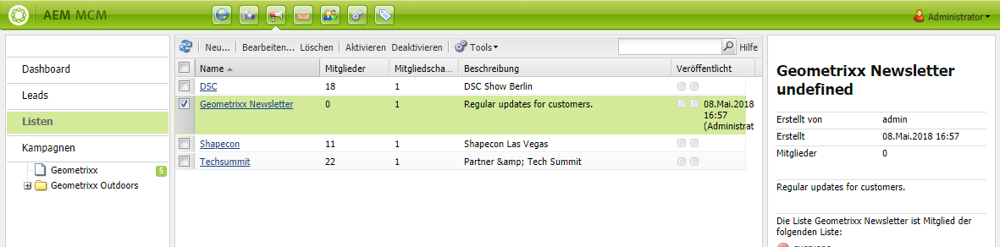
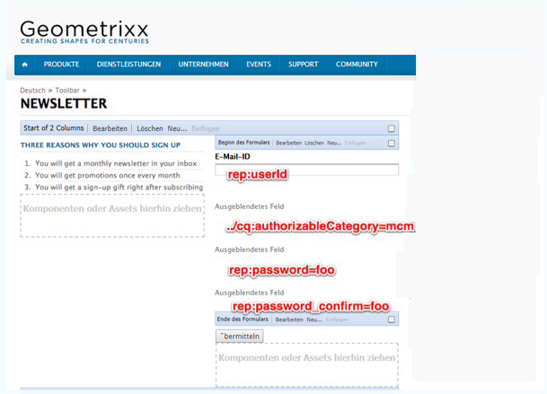
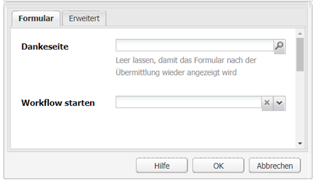
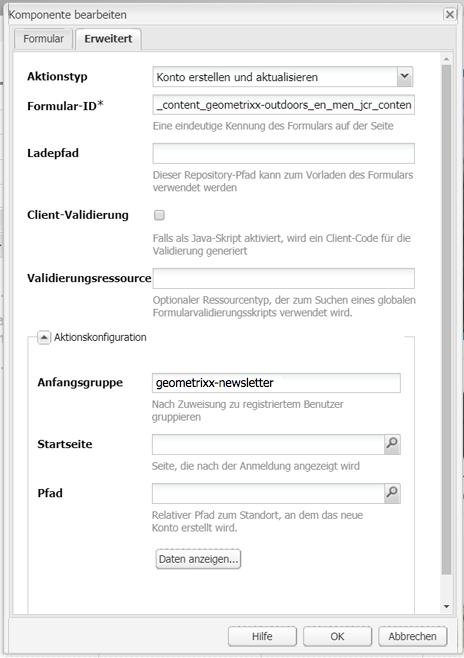
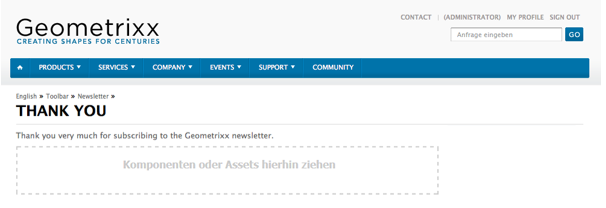
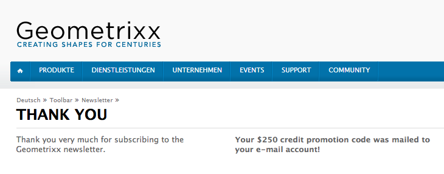

# Erstellen einer effektiven Landingpage für Newsletter{#creating-an-effective-newsletter-landing-page}

>[!CAUTION]
>
>AEM 6.4 hat das Ende der erweiterten Unterstützung erreicht und diese Dokumentation wird nicht mehr aktualisiert. Weitere Informationen finden Sie in unserer [technische Unterstützung](https://helpx.adobe.com/de/support/programs/eol-matrix.html). Unterstützte Versionen suchen [here](https://experienceleague.adobe.com/docs/?lang=de).

Eine effektive Startseite für Ihren Newsletter hilft Ihnen dabei, so viele Personen wie möglich dazu zu animieren, sich für Ihren Newsletter (oder eine andere E-Mail-Marketing-Kampagne) zu registrieren. Sie können die Informationen verwenden, die Sie aus Ihren Newsletter-Anmeldungen erfassen, um Leads zu erhalten.

Gehen Sie wie folgt vor, um eine effektive Newsletter-Landingpage zu erstellen:

1. Erstellen Sie eine Liste für den Newsletter, damit sich Benutzer für den Newsletter anmelden können.
1. Erstellen Sie das Registrierungsformular. Fügen Sie in diesem Fall einen Workflow-Schritt hinzu, der automatisch die Person, die sich für den Newsletter anmeldet, zu Ihrer Lead-Liste hinzufügt.
1. Erstellen Sie eine Bestätigungsseite, auf der die Benutzer für die Anmeldung gedankt und ihnen möglicherweise eine Promotion bereitgestellt wird.
1. Fügen Sie Teaser hinzu.

>[!NOTE]
>
>Adobe plant nicht, diese Funktionen (Lead- und Listenverwaltung) weiter auszubauen.\
>Die Empfehlung lautet, [Adobe Campaign und die AEM-Integration](/help/sites-administering/campaign.md) zu nutzen.

## Erstellen einer Liste für den Newsletter {#creating-a-list-for-the-newsletter}

Erstellen Sie in MCM eine Liste, z. B. **Geometrixx Newsletter**, für den Newsletter, den die Benutzer abonnieren sollten. Das Erstellen von Listen wird unter [Erstellen von Listen](/help/sites-classic-ui-authoring/classic-personalization-campaigns.md#creatingnewlists) beschrieben.

Nachfolgend sehen Sie ein Beispiel für eine Liste:

## Erstellen eines Anmeldeformulars {#create-a-sign-up-form}

Erstellen Sie ein Registrierungsformular für den Newsletter, über das Benutzer Tags abonnieren können. Die Beispiel-Geometrixx-Website bietet eine Newsletter-Seite in der Geometrixx-Symbolleiste, auf der Sie Ihr Formular erstellen können.

Informationen zum Erstellen eines eigenen Newsletter-Formulars finden Sie unter Informationen zum Erstellen von Formularen in der [Forms-Dokumentation](/help/sites-authoring/default-components.md#form). Der Newsletter verwendet die Tags aus der Tag-Bibliothek. Informationen zum Hinzufügen zusätzlicher Tags finden Sie unter [Tag-Verwaltung](/help/sites-authoring/tags.md#tagadministration).

Die ausgeblendeten Felder in dem folgenden Beispiel enthalten die minimal erforderlichen Informationen (E-Mail); zusätzlich hierzu können Sie später weitere Felder hinzufügen, was jedoch Auswirkungen auf die Konversionsrate hat.

Das folgende Beispiel ist ein Formular, das unter http://localhost:4502/cf#/content/geometrixx/en/toolbar/newsletter.html erstellt wurde.

1. Erstellen Sie das Formular.

   

1. Klicken Sie in der Formularkomponente auf **Bearbeiten**, um das Formular so zu konfigurieren, dass der Besucher auf eine Dankeseite (siehe [Erstellen von Dankeseiten](#creating-a-thank-you-page)) geleitet wird.

   

1. Legen Sie die Formularaktion (die Aktion, die ausgeführt wird, wenn Sie das Formular übermitteln) fest und konfigurieren Sie die Gruppe so, dass registrierte Benutzer der zuvor erstellten Liste (z. B. geometrixx-newsletter) zugewiesen werden.

   

## Erstellen einer Dankeseite {#creating-a-thank-you-page}

Wenn Benutzer auf **Jetzt abonnieren** klicken, soll automatisch eine Dankeseite geöffnet werden. Erstellen Sie die Dankeseite auf der Seite des Geometrixx-Newsletters. Bearbeiten Sie nach der Erstellung des Newsletter-Formulars die Formular-Komponente und fügen Sie den Pfad zur Dankeseite hinzu.

Nach dem Übermitteln der Anforderung wird der Benutzer zu einer **Danke**-Seite geleitet. Danach erhält er eine E-Mail. Diese Dankeseite wurde unter /content/geometrixx/en/toolbar/newsletter/thank_you erstellt.

## Hinzufügen von Teasern {#adding-teasers}

Fügen Sie [Teaser](/help/sites-classic-ui-authoring/classic-personalization-campaigns.md#teasers) hinzu, um bestimmte Zielgruppen anzusprechen. Beispielsweise können Sie der Dankeseite und der Newsletter-Anmeldeseite Teaser hinzufügen.

So fügen Sie Teaser hinzu, um eine effektive Newsletter-Landingpage zu erstellen:

1. Erstellen Sie einen Teaser-Absatz für ein Registrierungsgeschenk. Auswählen **Erste** als Strategie verwenden und Text einschließen, der ihnen mitteilt, welches Geschenk sie erhalten.

   

1. Erstellen Sie einen Teaser-Absatz für die Dankeseite. Auswählen **Erste** als Strategie verwenden und Text einschließen, der anzeigt, dass das Geschenk unterwegs ist.

   

1. Erstellen Sie eine Kampagne mit zwei Teasern; kennzeichnen Sie einen Teaser als „geschäftlich“ und belassen Sie den anderen ohne Kennzeichnung.

## Übermitteln von Inhalten an Abonnenten {#pushing-content-to-subscribers}

Übernehmen Sie alle Änderungen an Seiten über die Newsletter-Funktion in MCM. Anschließend senden Sie aktualisierte Inhalte an Abonnenten.

Siehe [Newsletter senden](/help/sites-classic-ui-authoring/classic-personalization-campaigns.md#newsletters).
