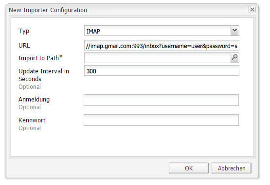

# Nachverfolgen nicht zugestellter E-Mails{#tracking-bounced-emails}

>[!CAUTION]
>
>AEM 6.4 hat das Ende der erweiterten Unterstützung erreicht und diese Dokumentation wird nicht mehr aktualisiert. Weitere Informationen finden Sie in unserer [technische Unterstützung](https://helpx.adobe.com/de/support/programs/eol-matrix.html). Unterstützte Versionen suchen [here](https://experienceleague.adobe.com/docs/?lang=de).

>[!NOTE]
>
>Adobe plant nicht, die Verfolgung von über den AEM-SMTP-Dienst gesendeten offenen/zurückgesendeten E-Mails weiter auszubauen.
>
>Die Empfehlung lautet, [Adobe Campaign und die AEM-Integration zu nutzen](/help/sites-administering/campaign.md).

Wenn Sie einen Newsletter an viele Benutzer senden, enthält die Liste in der Regel einige ungültige E-Mail-Adressen. Newsletter, die an diese Adressen gesendet werden, können nicht zugestellt werden. AEM kann diese Bounces verwalten und den Versand von Newslettern an diese Adressen einstellen, nachdem der konfigurierte Bounce-Zähler überschritten wurde. Der Standardwert für fehlgeschlagene Zustellversuche beträgt 3, er kann jedoch angepasst werden.

Wenn Sie AEM so einrichten möchten, dass nicht zugestellte E-Mails nachverfolgt werden, müssen Sie festlegen, dass AEM vorhandene Postfächer abfragt, an die E-Mails nicht zugestellt werden können (im Allgemeinen handelt es sich dabei um die E-Mail-Adresse, die Sie für den Versand des Newsletters angegeben haben). AEM fragt diesen Posteingang ab und importiert alle E-Mails in das in den Abrufeinstellungen festgelegte Verzeichnis. Anschließend wird ein Workflow ausgelöst, der innerhalb der Benutzer nach den nicht zugestellten E-Mail-Adressen sucht und den Wert der Eigenschaft &quot;bounceCounter&quot;des Benutzers entsprechend aktualisiert. Nachdem die konfigurierte maximale Anzahl von Bounces überschritten wurde, wird der Benutzer aus der Newsletter-Liste entfernt.

## Konfigurieren des Feed-Importtools {#configuring-the-feed-importer}

Mit dem Feed Importer können Sie wiederholt Inhalte aus externen Quellen in Ihr Repository importieren. Mit dieser Konfiguration des Feed-Importtools überprüft AEM das Postfach des Absenders auf Bounce-E-Mails.

So konfigurieren Sie das Feed-Importtool zum Verfolgen nicht zugestellter E-Mails:

1. In **Instrumente**, wählen Sie den Feed-Importtool aus.

1. Klicken **Hinzufügen** , um eine neue Konfiguration zu erstellen.

   

1. Fügen Sie eine neue Konfiguration hinzu, indem Sie den Typ wählen und Informationen zur Abruf-URL angeben, um so den Host und den Port zu konfigurieren. Außerdem müssen Sie der URL-Abfrage einige Mail- und Protokoll-spezifische Parameter hinzufügen. Stellen Sie die Konfiguration so ein, dass mindestens einmal täglich eine Abfrage durchgeführt wird.

   Alle Konfigurationen benötigen Informationen über Folgendes in der Abruf-URL:

   `username`: Der Benutzername für die Verbindung

   `password`: Das Kennwort für die Verbindung

   Darüber hinaus können Sie je nach Protokoll bestimmte Einstellungen konfigurieren.

   **Eigenschaften der POP3-Konfiguration:**

   `pop3.leave.on.server`: Legt fest, ob Nachrichten auf dem Server bleiben. Wählen Sie „true“, wenn Nachrichten auf dem Server bleiben sollen, bzw. „false“, wenn dies nicht der Fall sein soll. Standardwert ist „true“.

   **POP3-Beispiele:**

   | pop3s://pop.gmail.com:995/INBOX?username=user&amp;password=secret | Verwenden von pop3 über SSL zur Verbindung mit GMail an Port 995 mit Benutzer/geheim, sodass Nachrichten standardmäßig auf dem Server bleiben |
   |---|---|
   | pop3s://pop.gmail.com:995/INBOX?username=user&amp;password=secret&amp;pop3.leave.on.server=false | pop3s://pop.gmail.com:995/INBOX?username=user&amp;password=secret&amp;pop3.leave.on.server=false |

   **Eigenschaften der IMAP-Konfiguration:**

   Ermöglicht das Festlegen von Flags, nach denen gesucht werden soll.

   `imap.flag.SEEN`: Wählen Sie „false“ für eine neue/nicht gelesene Nachricht und „true“ für bereits gelesene Nachrichten aus.

   Die komplette Liste der Kennzeichnungen finden Sie unter [https://java.sun.com/products/javamail/javadocs/javax/mail/Flags.Flag.html](https://java.sun.com/products/javamail/javadocs/javax/mail/Flags.Flag.html).

   **IMAP-Beispiele:**

   | imaps://imap.gmail.com:993/inbox?username=user&amp;password=secret | Verwendung von IMAP über SSL, um an Port 993 eine Verbindung zu GMail mit dem Konto user/secret herzustellen. Standardmäßig werden neue Nachrichten abgerufen. |
   |---|---|
   | imaps://imap.gmail.com:993/inbox?username=user&amp;password=secret&amp;imap.flag.SEEN=true | Verwendung von IMAP über SSL zur Verbindung mit GMail 993 mit dem Benutzer/Geheimnis, nur Anzeige der Nachricht. |
   | imaps://imap.gmail.com:993/inbox?username=user&amp;password=secret&amp;imap.flag.SEEN=true&amp;imap.flag.SEEN=false | Verwendung von IMAP über SSL zur Verbindung mit GMail 993 mit Benutzer/Geheimnis, bereits gelesene ODER neue Nachrichten. |

1. Speichern Sie die Konfiguration.

## Konfigurieren der Komponente des Newsletter-Dienstes {#configuring-the-newsletter-service-component}

Nach der Konfiguration des Feed-Importtools müssen Sie die Absenderadresse und den Bounce-Zähler konfigurieren.

So konfigurieren Sie den Newsletter-Dienst:

1. Navigieren Sie in der OSGi-Konsole unter `<host>:<port>/system/console/configMgr` zu **MCM-Newsletter**.

1. Konfigurieren Sie den Dienst und speichern Sie anschließend die Änderungen.

   

   Die folgenden Konfigurationen können festgelegt werden, um das Verhalten anzupassen:

   | Bounce-Zählermaximum (max.bounce.count) | Bestimmt, nach wie vielen erfolglosen Zustellversuchen ein Benutzer beim Versand eines Newsletters nicht mehr berücksichtigt wird. Wenn Sie diesen Wert auf 0 setzen, wird die Bounce-Prüfung vollständig deaktiviert. |
   |---|---|
   | Aktivitäts-No-Cache (sent.activity.nocache) | Definiert die Cache-Einstellung, die für die Aktivität &quot;Newsletter gesendet&quot;verwendet werden soll |

   Nach dem Speichern führt der MCM-Dienst für den Newsletter Folgendes aus:

   * Schreibt eine Aktivität in den verborgenen Stream der Benutzer nach erfolgreichem Versand eines Newsletters.
   * Schreibt eine Aktivität, wenn ein Bounce erkannt wird und sich der Bounce-Zähler der Benutzer ändert.
